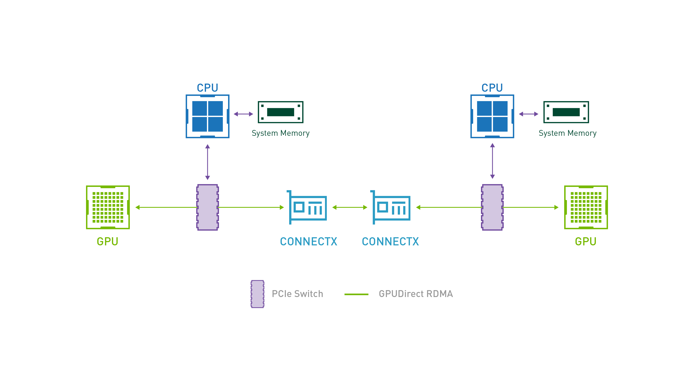
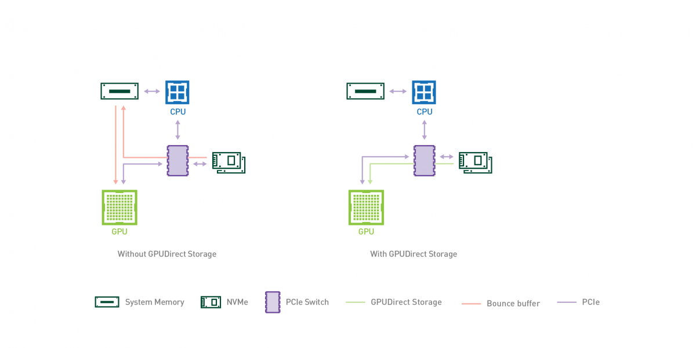

# NVIDIA GPUDirect RDMA 与 Storage 技术详解

## 1. 引言

在现代高性能计算 (HPC) 和人工智能 (AI) 领域，随着数据量的爆炸式增长和模型复杂度的提升，数据传输的效率成为了系统性能的关键瓶颈。传统的计算机架构中，GPU 与其他设备（如网卡、存储设备）之间的数据交互往往需要 CPU 作为中转站，这不仅增加了延迟，还占用了宝贵的 CPU 资源。

为了解决这一问题，NVIDIA 推出了 **GPUDirect** 系列技术。这是一组旨在加速 GPU 与其他设备（如网络接口卡 NIC、存储设备、其他 GPU）之间数据通信的技术集合。本文将重点介绍其中两个关键技术：**GPUDirect RDMA** 和 **GPUDirect Storage (GDS)**。

## 2. GPUDirect RDMA 技术

> 官方文档参考：[GPUDirect RDMA Documentation](https://docs.nvidia.com/cuda/gpudirect-rdma/index.html)

GPUDirect RDMA (Remote Direct Memory Access) 是一项允许第三方 PCIe 设备（如网络接口卡 NIC、存储适配器等）直接访问 NVIDIA GPU 显存的技术。这项技术最早在 Kepler 架构 GPU 和 CUDA 5.0 中引入，旨在消除 GPU 与第三方设备通信时 CPU 的介入和不必要的系统内存拷贝。

整体架构：



### 2.1 技术背景与痛点

在未启用 GPUDirect RDMA 的传统架构中，当 GPU 需要通过网络发送数据时，数据流必须经历“GPU 显存 -> 系统内存 (CPU 参与) -> 网卡”的路径：

1. **数据拷贝**：数据从源 GPU 显存拷贝到源主机的系统内存 (CPU 内存)。
2. **网络传输**：CPU 参与控制，网卡 (NIC) 从系统内存读取数据并通过网络发送。
3. **接收与拷贝**：目标主机网卡将数据写入系统内存，再由 CPU 拷贝到目标 GPU 显存。

这带来了显著的性能瓶颈：

- **高延迟**：数据在 PCIe 总线上往返，且需要 CPU 处理中断和上下文切换。
- **带宽瓶颈**：数据流经系统内存，受限于 CPU 内存带宽。
- **CPU 负载**：CPU 必须参与数据的搬运（Memory Copy）和缓冲区管理，无法专注于计算任务。

### 2.2 工作原理详解

GPUDirect RDMA 利用了标准 PCIe 总线的功能，使第三方设备能够通过 **PCI BAR (Base Address Register)** 直接对 GPU 显存进行读写操作。

#### 2.2.1 核心机制

当两个 PCIe 设备（例如 GPU 和 NIC）共享同一个上游 Root Complex 时，它们可以通过物理地址直接通信。

- **PCI BARs 映射**：GPU 将其显存的一定区域通过 BARs 暴露在物理地址空间中。
- **P2P Direct Access**：NIC 可以像访问系统内存一样，直接向这些 GPU BAR 地址发起 PCIe Read/Write 事务。

!`host view` ⚠️ (原文链接)

#### 2.2.2 驱动层交互 (Kernel & Userspace)

GPUDirect RDMA 的实现依赖于 NVIDIA Kernel Driver 和用户态 CUDA 库 (Userspace CUDA Library) 的协同工作：

1. **地址区分**：用户态 CUDA 库提供 API 帮助通信库（如 MPI, NCCL）区分指针是指向 CPU 内存还是 GPU 显存。
2. **Pinning GPU Memory (页面锁定)**：

   - 对于 CPU 内存，Linux 内核使用 `get_user_pages()` 进行 Pinning。
   - 对于 GPU 显存，NVIDIA Kernel Driver 提供了专用的内核 API 来锁定 GPU 页面，并将其物理地址列表返回给 NIC 驱动。
   - NIC 驱动使用这些物理地址编程 DMA 引擎，从而建立直接的数据传输通道。

### 2.3 性能优势

GPUDirect RDMA 通过在 GPU 和第三方设备之间建立直接的数据传输通道，消除了不必要的系统内存拷贝和 CPU 介入，从而实现了极致的通信性能。

- **Zero-Copy (零拷贝)**：完全消除了 GPU 显存到系统内存的缓冲拷贝。
- **降低延迟**：数据直接在设备间传输，端到端延迟通常可降低至原来的 1/10 甚至更低。
- **完全卸载**：CPU 仅需负责建立连接和控制流，数据路径完全旁路 CPU。

### 2.4 开发者视角：代码与 API

虽然上层应用通常使用 CUDA-aware MPI 或 NCCL 来隐式使用 GPUDirect RDMA，但在底层驱动开发中，涉及以下关键步骤：

```c
// 伪代码示例：展示 NIC 驱动如何注册 GPU 显存以进行 RDMA
// 实际上，这通常由 InfiniBand Verbs (libibverbs) 库在用户态封装

// 1. 用户态分配 GPU 内存
void* d_buffer;
cudaMalloc(&d_buffer, size);

// 2. 注册内存区域 (Memory Region Registration)
// 此时，libibverbs 会检测指针类型。如果是 GPU 指针，
// 它会调用 NVIDIA 内核驱动提供的 nvidia_p2p_get_pages 等接口
// 来获取 GPU 页面的物理地址，并将其写入 NIC 的页表 (MTT/MKEY)。

struct ibv_mr *mr = ibv_reg_mr(pd, d_buffer, size,
                               IBV_ACCESS_LOCAL_WRITE |
                               IBV_ACCESS_REMOTE_WRITE |
                               IBV_ACCESS_REMOTE_READ);

if (!mr) {
    // 注册失败，可能因硬件不支持或未加载 nvidia-peermem 模块
    fprintf(stderr, "GPUDirect RDMA registration failed\n");
}

// 3. 执行 RDMA 操作 (Send/Recv/Write/Read)
// NIC 硬件 DMA 引擎直接通过 PCIe 总线访问 d_buffer 的物理地址
ibv_post_send(qp, &wr, &bad_wr);
```

**注意**：要启用此功能，系统通常需要加载 `nvidia-peermem` (或旧版的 `nv_peer_mem`) 内核模块，该模块充当 NVIDIA 驱动与 InfiniBand 核心驱动之间的桥梁。

---

## 3. GPUDirect Storage (GDS) 技术

> 官方文档参考：[GPUDirect Storage Documentation](https://docs.nvidia.com/gpudirect-storage/)

随着 AI、HPC 以及数据分析领域的数据集规模持续增长，数据加载所消耗的时间开始对应用整体性能产生显著影响。高速 GPU 往往受限于缓慢的 I/O，尤其是在将数据从存储系统加载到 GPU 显存以进行计算处理的过程中。

GPUDirect Storage (GDS) 旨在建立一条在本地或远程存储（如 NVMe 或 NVMe over Fabrics, NVMe-oF）与 GPU 内存之间的直接数据通路。该技术避免了通过 CPU 内存中的中转缓冲区（Bounce Buffer）进行额外的数据拷贝，使位于网卡或存储设备附近的直接内存访问（DMA）引擎能够沿着一条直达路径将数据直接传入或传出 GPU 内存，全程无需给 CPU 带来额外负担。

整体架构：



### 3.1 技术背景与痛点

在传统的存储 I/O 路径中，将数据从磁盘读取到 GPU 显存是一个多阶段、低效率的过程：

1. **内核态缓冲**：存储设备（如 NVMe SSD）通过 DMA 将数据写入操作系统内核空间的 Page Cache。
2. **用户态拷贝**：CPU 将数据从内核空间拷贝到用户空间的应用程序缓冲区 (CPU 内存)。
3. **H2D 拷贝**：CPU 再次将数据从用户空间缓冲区拷贝到 GPU 显存 (Host-to-Device)。

这种被称为“Bounce Buffer”效应的机制存在三大问题：

- **CPU 瓶颈**：CPU 必须参与每一次内存拷贝，随着 NVMe 速度提升，CPU 逐渐成为瓶颈。
- **延迟增加**：多次内存拷贝和上下文切换显著增加了端到端延迟。
- **PCIe 带宽浪费**：数据在 PCIe 总线上来回传输（SSD -> CPU -> GPU），实际上占用了两倍的 PCIe 带宽。

### 3.2 工作原理与软件架构

GPUDirect Storage 不仅是一项硬件技术，更依赖于一套深度的软硬件协同栈，引入了全新的文件系统直通机制。

#### 3.2.1 软件架构与依赖

GDS 的实现依赖于以下核心软件组件：

- **cuFile API (libcufile)**：用户态核心库。它提供了类似于 POSIX (`read`/`write`) 的 API，但专门针对 GPU 显存指针进行了重载。它负责拦截 I/O 请求，进行参数检查，并智能选择最佳的传输路径（GDS 路径或兼容回退路径）。
- **nvidia-fs.ko (cufile.ko)**：这是 GDS 的核心内核模块。由于标准的 Linux 内核 VFS（虚拟文件系统）和块设备层无法直接处理 GPU 显存地址，`nvidia-fs` 必须介入。它负责：
  - 与文件系统（如 ext4, xfs）交互以获取文件元数据和物理块布局。
  - 调用 NVIDIA GPU 驱动接口锁定 GPU 显存页面。
  - 将 I/O 请求转换为下层驱动可理解的格式。
- **存储驱动适配**：
  - **传统模式 (Legacy / MOFED)**：标准的 NVMe 驱动通常期望 DMA 目标是系统内存。为了支持 P2P DMA，旧版本的 GDS 往往需要经过补丁修改的 NVMe 驱动（通常由 MOFED 提供）或特定的内核补丁。在这种模式下，`nvidia-fs` 通过特定的回调接口与块设备层交互，甚至可能传递特殊的“伪地址”或句柄，以便驱动能识别并正确建立指向 GPU 显存的 DMA 映射。
  - **原生 P2PDMA 模式 (Modern / Upstream)**：随着 Linux 内核的发展（Kernel >= 6.2），上游内核引入了标准的 **PCI P2PDMA** 基础设施。从 CUDA 12.8 开始，GDS 可以利用这一标准机制，无需修改 NVMe 驱动即可实现 P2P 传输。这显著降低了部署门槛，消除了对定制内核或驱动的依赖。

#### 3.2.2 核心流程：地址转换与 DMA

GDS 的 I/O 流程并非简单的“把 GPU 地址给硬盘”，而是一个复杂的地址转换与编排过程。由于 PCIe 设备间无法直接通过 GPU 虚拟地址通信，且操作系统内核主要管理 CPU 物理内存，因此需要经过多层转换：

1. **用户态请求**：应用程序调用 `cuFileRead`，传入 GPU 虚拟地址（Device Virtual Address, DVA）。
2. **内核态捕获**：`libcufile` 将请求传递给内核模块 `nvidia-fs`。
3. **地址转换与锁定 (Pinning)**：
   - `nvidia-fs` 无法直接将 GPU DVA 传递给 NVMe 驱动。它首先需要调用 NVIDIA GPU 驱动 API，将 GPU 虚拟地址锁定，并获取对应的 **GPU 物理地址 (GPU Physical Address)** 或 **PCIe 总线地址 (Bus Address)**。
   - **Legacy 模式实现细节**：为了适配现有的内核块设备接口，`nvidia-fs` 可能会构建包含特殊标记（如“伪 CPU 地址”）的 BIO（Block I/O）结构体。当底层的 NVMe 驱动（需支持 GDS）识别到这些特殊标记时，会通过回调 `nvidia-fs` 提供的接口，将这些伪地址替换为真实的 GPU BAR 物理地址，从而构建正确的 DMA 描述符（PRP/SGL）。
4. **DMA 描述符构建**：
   - 最终，DMA 引擎的目标地址被填入了 GPU 的 BAR 空间物理地址，而非 CPU 内存地址。
5. **P2P 直接传输**：NVMe 控制器启动 DMA，数据通过 PCIe 总线直接写入 GPU 显存，完全绕过 CPU 内存和 CPU 缓存。

#### 3.2.3 路径选择与回退

如果硬件或系统配置不支持 P2P（例如设备不在同一个 PCIe Root Complex 下，或缺少必要的 ACS 支持），`libcufile` 会自动检测并回退到兼容模式（System Memory Bounce Buffer），但仍会尝试优化路径。

### 3.3 核心优势

GDS 通过构建存储到 GPU 的直通高速公路，打破了传统 I/O 的带宽和延迟瓶颈，并彻底解放了 CPU 算力。

- **带宽倍增**：直接利用 PCIe P2P 特性，吞吐量可接近存储设备或 PCIe 总线的物理极限。根据官方数据，GDS 带宽可达传统 I/O 的 2-8 倍。
- **延迟最小化**：消除了中间的内存拷贝步骤，I/O 延迟显著降低。
- **CPU 卸载 (CPU Offloading)**：CPU 仅需处理控制流，不再参与繁重的数据搬运，从而释放 CPU 算力用于预处理或其他逻辑。

### 3.4 性能对比数据参考

下表从数据路径、资源消耗等维度，直观展示了 GDS 相比传统 I/O 模式的代际性能提升。

| 指标             | 传统 IO (Buffered IO)                          | 传统 Direct IO (O_DIRECT)     | GPUDirect Storage (GDS) |
| :--------------- | :--------------------------------------------- | :---------------------------- | :---------------------- |
| **数据路径**     | Storage -> Kernel Buffer -> User Buffer -> GPU | Storage -> User Buffer -> GPU | Storage -> GPU          |
| **内存拷贝次数** | 2 次 (Kernel->User, User->GPU)                 | 1 次 (User->GPU)              | 0 次                    |
| **CPU 参与度**   | 高 (数据搬运 & 控制)                           | 中 (单次搬运 & 控制)          | 低 (仅控制)             |
| **带宽利用率**   | 受限于 CPU 内存带宽和拷贝速度                  | 受限于 CPU 内存带宽和拷贝速度 | 接近 PCIe/NVMe 极限     |
| **延迟**         | 高                                             | 中                            | 低                      |

### 3.5 代码示例 (cuFile API)

使用 GDS 需要包含 `<cufile.h>` 头文件，并链接 `libcufile.so`。以下是一个简化的 GDS 读取流程：

```cpp
#include <fcntl.h>
#include <unistd.h>
#include <cuda_runtime.h>
#include "cufile.h"

int main() {
    const char* filename = "test_data.bin";
    size_t size = 1024 * 1024 * 1024; // 1GB
    void* d_buffer;

    // 1. 初始化 cuFile 驱动
    // 这会加载必要的 GDS 驱动并检查硬件兼容性
    cuFileDriverOpen();

    // 2. 分配 GPU 显存
    cudaMalloc(&d_buffer, size);

    // 3. 打开文件
    // 必须使用 O_DIRECT 标志，这是 GDS 的前提条件，以绕过操作系统 Page Cache
    int fd = open(filename, O_RDONLY | O_DIRECT);

    // 4. 注册 cuFile 句柄
    // 这一步将文件描述符与 GDS 上下文绑定
    CUfileDescr_t cf_descr;
    memset(&cf_descr, 0, sizeof(CUfileDescr_t));
    cf_descr.handle.fd = fd;
    cf_descr.type = CU_FILE_HANDLE_TYPE_OPAQUE_FD;

    CUfileHandle_t cf_handle;
    cuFileHandleRegister(&cf_handle, &cf_descr);

    // 5. 直接读取数据到 GPU 显存 (GDS Read)
    // 此时数据直接从 NVMe 流向 GPU，不经过 CPU 内存
    // 参数：handle, devPtr, size, file_offset, devPtr_offset
    cuFileRead(cf_handle, d_buffer, size, 0, 0);

    // ... 进行 GPU 计算 ...

    // 6. 清理资源
    cuFileHandleDeregister(cf_handle);
    close(fd);
    cudaFree(d_buffer);
    cuFileDriverClose();

    return 0;
}
```

## 4. GPUDirect 生态系统支持

GPUDirect 技术（涵盖 RDMA 和 Storage）已经建立了庞大的软硬件生态系统，从底层的网卡和存储设备，到中间件通信库，再到上层的 AI 框架，均有广泛支持。

### 4.1 GPUDirect RDMA 生态

GPUDirect RDMA 是构建高性能分布式 GPU 集群的基石，主要支持来自于高性能网络厂商和并行计算库。

- **网络硬件 (NICs)**：
  - **NVIDIA Mellanox ConnectX 系列**：ConnectX-5/6/7 等 InfiniBand 和 Ethernet 网卡对 GPUDirect RDMA 有着最完善的原生支持。
  - **AWS EFA (Elastic Fabric Adapter)**：在 AWS 云环境中支持 GPUDirect RDMA，加速云上 HPC 和 AI 负载。
  - **Broadcom / Chelsio**：部分高性能网卡也提供驱动级支持。
- **通信库 (Communication Libraries)**：
  - **NVIDIA NCCL**：深度学习事实上的标准通信库，利用 GPUDirect RDMA 实现高效的 AllReduce, AllGather 等集合通信操作。
  - **MPI (Message Passing Interface)**：主流 MPI 实现（如 **OpenMPI**, **MVAPICH2**）均支持 CUDA-aware MPI，底层自动调用 GPUDirect RDMA。
  - **NVSHMEM**：提供基于 OpenSHMEM 标准的单边通信 (One-Sided Communication) 能力，利用 RDMA 实现 GPU 全局地址空间访问。
  - **UCX (Unified Communication X)**：作为底层通信框架，为 MPI 和 PGAS 语言提供 GPUDirect RDMA 加速支持。

### 4.2 GPUDirect Storage (GDS) 生态

GDS 聚焦于存储 I/O 加速，得到了存储业界和文件系统厂商的广泛集成。

#### 4.2.1 支持的文件系统 (File Systems)

- **本地文件系统**：
  - **ext4**：Linux 标准文件系统，GDS 驱动 (`nvidia-fs`) 对其有原生支持（需在 ordered mode 下）。
  - **xfs**：高性能日志文件系统，同样被 `nvidia-fs` 原生支持。
- **并行/分布式文件系统**：
  - **DDN EXAScaler (Lustre)**：基于 Lustre 的高性能文件系统，广泛用于超算中心。
  - **IBM Spectrum Scale (GPFS)**：企业级并行文件系统，支持 GDS 以加速 AI 工作负载。
  - **WekaFS**：专为 AI 和 HPC 设计的高性能文件系统，提供极低的延迟。
  - **VAST Data NFS**：通过 NFS over RDMA 支持 GDS。
  - **BeeGFS**：轻量级并行文件系统，支持通过 RDMA 直接写入 GPU。
  - **Amazon FSx for Lustre**：AWS 上的托管 Lustre 服务，支持在 EC2 实例上使用 GDS。

#### 4.2.2 存储解决方案合作伙伴

多家存储硬件厂商已在其产品中集成了对 GDS 的支持：

- **NetApp ONTAP**：提供基于 AI 优化的全闪存存储阵列。
- **Dell EMC Isilon / PowerScale**：横向扩展 NAS 存储。
- **Pure Storage FlashBlade**：专为非结构化数据设计的高性能全闪存。
- **Hitachi Vantara** / **Micron** / **Excelero** 等。

### 4.3 上层 AI 框架集成

为了让开发者无感使用底层加速技术，主流 AI 框架和数据加载库都进行了深度集成：

- **NVIDIA DALI (Data Loading Library)**：深度学习数据加载库，原生支持 GDS，可显著加速图像/视频数据的预处理流水线，解决 GPU 饥饿问题。
- **PyTorch**：通过插件或与 DALI 集成支持 GDS；其分布式训练模块（DistributedDataParallel）底层依赖 NCCL 使用 GPUDirect RDMA。
- **RAPIDS cuDF**：GPU 数据帧库，支持使用 GDS 加速大规模 Parquet/CSV/ORC 数据的读取（实验性）。
- **TensorFlow**：通过集成 NCCL 和相关 I/O 插件获得加速能力。

> **注意**：具体的支持版本和配置要求（如内核版本、OFED 版本）请务必参考各厂商的官方文档以及 [NVIDIA GDS Support Matrix](https://docs.nvidia.com/gpudirect-storage/release-notes/index.html#support-matrix)。

---

## 5. 总结

GPUDirect 系列技术（RDMA 与 Storage）是 NVIDIA 针对现代高性能计算和 AI 负载中“数据搬运瓶颈”提出的核心解决方案。它们共同的目标是消除 CPU 在数据路径中的介入，实现设备间的**直接内存访问 (DMA)**。

1. **核心价值**：

   - **GPUDirect RDMA**：打破了**计算节点间**的通信壁垒。它允许 GPU 直接通过网卡与其他节点的 GPU 交换数据，消除了 PCIe 总线上的冗余拷贝。这对于**分布式训练（Model/Data Parallelism）**至关重要，能够显著提升多机多卡环境下的扩展效率。
   - **GPUDirect Storage (GDS)**：打破了**计算与存储间**的 I/O 壁垒。它允许 GPU 直接从 NVMe 存储设备读取数据，绕过 CPU 内存和 Page Cache。这对于**大数据集训练、推理和实时数据分析**至关重要，解决了 GPU 因等待数据而空转的问题（GPU Starvation）。

2. **协同效应**：
   在构建如 NVIDIA DGX SuperPOD 这样的大规模 AI 集群时，这两项技术通常是**互补且共存**的。GDS 负责将海量数据高速“喂”入 GPU，而 GPUDirect RDMA 负责在 GPU 集群内部高速同步梯度和模型参数。

3. **架构演进**：
   GPUDirect 技术的普及标志着计算架构从“以 CPU 为中心”向“以数据为中心”的转变。在这种新架构下，CPU 退居为控制平面的指挥者，而繁重的数据流动则在 GPU、网卡和存储设备之间通过 PCIe/NVLink 高速通道直接完成，从而释放了系统的全部潜能。
