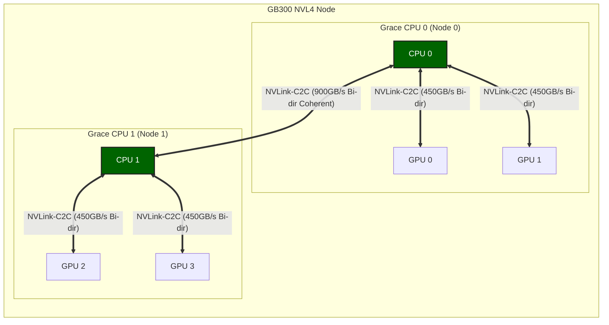
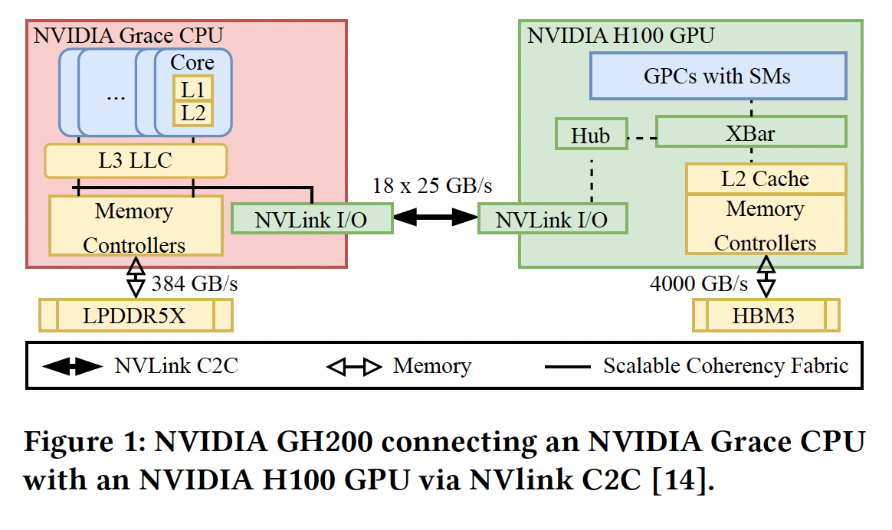

# NVIDIA GB300 NVL72 架构解析与性能测试报告

本文基于 `nvbandwidth` 实测数据、NVIDIA 官方技术文档及 Grace Blackwell 架构规范，整理了 **NVIDIA GB300 NVL72** 计算平台的物理拓扑与互连性能参数。

---

## 1. 系统规格

**NVIDIA GB300 NVL72** 是基于 Grace Blackwell 架构的机架级计算系统，通过 NVLink-C2C 技术将 **36 颗 Grace CPU** 和 **72 颗 Blackwell Ultra GPU (B300)** 连接为统一计算域 [1,4]。

### 1.1 Blackwell GPU 架构特性

Blackwell 架构 GPU 采用**双芯片 (Dual-Die) 封装设计**，集成 2080 亿晶体管，采用定制的 TSMC 4NP 工艺制造。两个计算核心 (Die) 之间通过带宽高达 **10 TB/s** 的片间互连 (NV-HBI) 连接，确保了在单一 GPU 封装内实现无缝的统一内存访问和计算调度 [5,10]。这与 CPU-GPU 间的 900 GB/s NVLink-C2C 共同构成了多层级的高速互连体系。

根据 NVIDIA 官方技术博客 [10] 披露的 Blackwell Ultra (B300) 核心架构细节：

- **统一计算域**: 包含 160 个流多处理器 (SMs)，提供 640 个第五代 Tensor Cores。
- **Tensor Memory (TMEM)**: 每个 SM 配备 256 KB 的 TMEM，用于中间结果的 warp 级同步存储，减少片外显存访问。
- **NVFP4 精度**: 引入全新的 4-bit 浮点格式，通过两级缩放（block-level + tensor-level）实现接近 FP8 的精度，同时将显存占用降低约 1.8 倍。

### 1.2 核心参数对比 (GB300 vs GB200)

该系统配备 **GB300 (Blackwell Ultra)** 组件，相较于 GB200 (Blackwell) 具有以下规格差异 [3]：

| 特性                  | GB200 (Blackwell)   | **GB300 (Blackwell Ultra)** | 差异说明   |
| :-------------------- | :------------------ | :-------------------------- | :--------- |
| **GPU 型号**          | B200                | **B300**                    | Ultra 版本 |
| **显存容量 (每 GPU)** | 192 GB HBM3e        | **288 GB HBM3e**            | 增加 50%   |
| **FP4 算力 (每 GPU)** | 9 PFLOPS            | **15 PFLOPS**               | 增加 66%   |
| **网络带宽 (每 GPU)** | 400 Gb/s (CX-7)     | **800 Gb/s (CX-8)**         | 增加 100%  |
| **CPU-GPU 互连**      | 900 GB/s NVLink-C2C | **900 GB/s NVLink-C2C**     | 规格一致   |

---

## 2. 物理拓扑架构

根据 NVIDIA 官方发布的 **GB200 NVL4** 架构资料（GB300 NVL4 为其升级版），该系统在一个计算节点内集成了 **2 颗 Grace CPU** 和 **4 颗 Blackwell GPU** [4]。其核心互连逻辑如下：

### 2.1 统一超级芯片架构

GB300 NVL4 将两组 Grace Blackwell Superchip 通过高速互连技术整合在同一主板上，形成一个统一的 NUMA 系统。

### 2.2 CPU-CPU 互连：NVLink-C2C

- **连接方式**: 两颗 Grace CPU 之间通过 **NVLink-C2C (Chip-to-Chip)** 技术直接互连，而非传统的 PCIe 或 QPI/UPI 总线。
- **互连带宽**: 提供高达 **900 GB/s** 的双向聚合带宽（是传统 x86 服务器 CPU 互连带宽的 10 倍以上）[2]。
- **特性**: 支持完全的**缓存一致性 (Cache Coherency)**，使得两颗 CPU 的内存空间（LPDDR5X）对操作系统和应用程序呈现为统一的、低延迟的内存池。

### 2.3 完整拓扑图

基于 NVL4 架构的 4 GPU 系统连接拓扑如下：

- **CPU-CPU 互连**: 两颗 Grace CPU (绿色节点) 之间通过 NVLink-C2C 直接连接，提供 **900 GB/s** 的双向带宽，确保了跨 CPU 的缓存一致性 [6,7]。
- **CPU-GPU 互连**: 每个 Grace CPU 通过两条独立的 NVLink-C2C 链路分别连接两颗 Blackwell GPU。单条链路提供 **450 GB/s** 的双向带宽（单向理论值为 225 GB/s）[4,9]。
- **系统总带宽分析**:
  - **CPU <-> GPU 实测带宽**: 4 \* 210 GB/s (单向)，接近 225 GB/s 的理论极限，表明链路利用率极高。
  - **CPU <-> CPU 理论带宽**: 900 GB/s (双向)，为跨 NUMA 节点的内存访问提供了充足的带宽储备。
    这种全链路高速互连架构确保了在进行跨 NUMA 节点的内存访问（例如 CPU 0 访问 GPU 3 的数据）时，依然能保持极高的吞吐量，不会成为性能瓶颈。

### 2.4 CPU 内部架构：Scalable Coherency Fabric (SCF)

除了外部的 C2C 互连，Grace CPU 内部采用了 **NVIDIA Scalable Coherency Fabric (SCF)** 网状架构 [6]。

- **核心与缓存规格**:
  - **核心**: 72 个 ARM Neoverse V2 核心（架构详情见 2.5 节）。
  - **缓存**: 每个核心拥有 **64 KB L1 Cache** 和 **1 MB L2 Cache**；所有核心共享 **114 MB L3 Cache** (LLC) [7]。
- **功能**: SCF 提供超过 **3.2 TB/s** 的片内对分带宽，负责在核心、缓存、NVLink-C2C 接口、内存和系统 I/O 之间进行高速数据路由。
- **作用**: 它确保了从 CPU 核心到 NVLink-C2C 接口的数据流不会成为内部瓶颈，从而能够跑满外部 900 GB/s 的物理链路。

### 2.5 Grace CPU 核心架构

根据 NVIDIA 官方白皮书 [8]，Grace CPU 采用了 **Arm Neoverse V2** 核心，这是 Arm 专为数据中心设计的高性能核心，基于 Armv9.0-A 架构。

- **指令集架构 (ISA)**:
  - 支持 **Armv9.0-A**，向下兼容 Armv8.0 至 Armv8.5 的所有二进制文件（如 Ampere Altra 和 AWS Graviton2/3）。
  - **SIMD 矢量化**: 实现了 **4x128-bit** 的 SIMD 矢量指令集配置，支持 **SVE2 (Scalable Vector Extension 2)** 和 **NEON**。
    - **SVE2**: 相比 NEON 支持更多数据类型（如 FP16）、更强大的指令（如 gather/scatter）以及变长矢量支持，特别优化了机器学习、基因组学和密码学等 HPC 负载。
- **原子操作 (Atomic Operations)**:
  - 支持 **LSE (Large System Extension)**，提供低开销的原子指令（如 `CAS`, `LD<OP>`, `ST<OP>`, `SWP`）。
  - **性能提升**: 相比传统的 load/store exclusive 序列，LSE 原子指令在 CPU 间通信、锁和互斥量操作上的吞吐量可提升一个数量级，这对于 NVLink-C2C 连接的双 CPU 高频协同至关重要。
- **内存子系统**:
  - 采用 **LPDDR5X** 内存，支持 **Error Correction Code (ECC)**，在提供高带宽的同时大幅降低了功耗（相比 DDR5 带宽提升 53%，每 GB 功耗降低 87%）。
  - 这种设计平衡了带宽、能效和成本，特别适合大规模 AI 和 HPC 工作负载。

### 2.6 CPU-GPU 互连细节与数据流

虽然 GB300 属于 Blackwell 架构，但其 CPU 部分（Grace CPU）与前代 GH200 (Grace Hopper) 架构保持一致。参考 ACM 关于 GH200 架构的分析研究 [7]，我们可以深入理解 CPU 与 GPU 之间 NVLink-C2C 的互连机制，该机制在 GB300 中同样适用。其内部数据流路径如下：

_图 1: NVIDIA GH200 架构中 Grace CPU 与 H100 GPU 通过 NVLink C2C 的互连示意图（来源：ACM [7]）_

- **Grace CPU 侧数据流**:
  - 数据从 **CPU Cores (L1/L2)** 汇聚至 **L3 LLC (114 MB)**。
  - 通过 **Scalable Coherency Fabric (SCF)** 网状互连架构，连接至 **Memory Controllers** (访问 LPDDR5X) 和 **NVLink I/O** 接口。
  - 这种设计确保了 CPU 核心、内存和 GPU 链路之间的高带宽低延迟通信。

- **GPU 侧数据流 (以 GH200 为例推演)**:
  - GPU 的 **SMs (Streaming Multiprocessors)** 通过 **XBar (Crossbar)** 和 **L2 Cache** 进行数据交换。
  - **Hub** 单元负责协调内部流量，连接至 **NVLink I/O**。
  - 显存控制器直接连接 **HBM3e** 高带宽内存。
  - _注：GB300 (Blackwell Ultra) 的 GPU 内部架构可能在 SMs 和 XBar 上有进一步优化，但整体通过 Hub 连接 NVLink-C2C 的逻辑保持不变。_

- **NVLink-C2C 链路特性**:
  - 物理链路通过 **18 x 25 GB/s** 的通道组成，单向理论带宽达到 225 GB/s (双向 450 GB/s)，与前文实测数据吻合。
  - 该链路支持 **硬件级缓存一致性**，允许 GPU 直接以高带宽访问 CPU 的 LPDDR5X 内存，实际上将 CPU 内存作为 GPU 的"扩展显存"使用，这对于处理超过 GPU 显存容量的大模型推理至关重要。

---

## 3. 带宽性能实测数据

使用 `nvbandwidth` 工具对系统进行的带宽测试结果如下。

### 3.1 Host to Device (H2D) 测试数据

| 测试项目                 | 单链路实测带宽 (GB/s) | 并发总带宽 (4 GPUs) (GB/s) |
| :----------------------- | :-------------------- | :------------------------- |
| **Host -> Device (H2D)** | **~210.7**            | **~842.7**                 |
| **Device -> Host (D2H)** | **~193.2**            | **~772.8**                 |
| **Bidirectional (双向)** | **~167.1**            | **~668.5**                 |

### 3.2 数据分析

1. **独立带宽通道**:
   - 测试数据显示，所有 4 张 GPU 在并发测试中均达到了 **~210 GB/s** 的单卡带宽。
   - 该结果验证了 CPU 与每颗 GPU 之间存在独立的物理传输通道，各通道带宽互不共享。
2. **传输效率**:
   - 单向物理理论带宽极限约为 225 GB/s (450 GB/s 双向 / 2)。
   - 实测值 210 GB/s 约为理论极限的 **93%**。
3. **与 PCIe Gen5 对比**:
   - GB300 (NVLink-C2C): 单卡 ~210 GB/s
   - PCIe Gen5 x16: 单卡 ~56 GB/s

---

## 4. 技术参数释疑

官方文档中提到的 **900 GB/s** 带宽指标指的是 **单个 Superchip (1 CPU + 2 GPU)** 内部的总互连带宽容量：

- CPU 连接 GPU 0: 450 GB/s (双向)
- CPU 连接 GPU 1: 450 GB/s (双向)
- **合计**: **900 GB/s**

在实际应用中，CPU 内存 (LPDDR5X) 可通过上述链路被两颗 GPU 同时访问。

---

## 5. 参考资料

1. **NVIDIA GB300 NVL72 产品页面**
   - [https://www.nvidia.com/en-us/data-center/gb300-nvl72/](https://www.nvidia.com/en-us/data-center/gb300-nvl72/)
2. **NVLink-C2C 互连技术说明**
   - [https://www.nvidia.com/en-us/data-center/nvlink-c2c/](https://www.nvidia.com/en-us/data-center/nvlink-c2c/)
3. **Azure ND GB300 v6 虚拟机规格**
   - [https://learn.microsoft.com/en-us/azure/virtual-machines/sizes/gpu-accelerated/nd-gb300-v6-series](https://learn.microsoft.com/en-us/azure/virtual-machines/sizes/gpu-accelerated/nd-gb300-v6-series)
4. **Grace Blackwell 架构分析 (Developer Blog)**
   - [https://developer.nvidia.com/blog/nvidia-gb200-nvl72-delivers-trillion-parameter-llm-training-and-real-time-inference/](https://developer.nvidia.com/blog/nvidia-gb200-nvl72-delivers-trillion-parameter-llm-training-and-real-time-inference/)
5. **NVIDIA Blackwell Architecture Overview**
   - [https://www.nvidia.com/en-us/data-center/technologies/blackwell-architecture/](https://www.nvidia.com/en-us/data-center/technologies/blackwell-architecture/)
6. **NVIDIA Grace CPU Architecture In-Depth**
   - [https://developer.nvidia.com/blog/nvidia-grace-cpu-superchip-architecture-in-depth/](https://developer.nvidia.com/blog/nvidia-grace-cpu-superchip-architecture-in-depth/)
7. **Towards Memory Disaggregation via NVLink C2C: Benchmarking CPU-Requested GPU Memory Access**
   - [https://dl.acm.org/doi/full/10.1145/3723851.3723853](https://dl.acm.org/doi/full/10.1145/3723851.3723853)
8. **NVIDIA Grace CPU Superchip Whitepaper**
   - [https://resources.nvidia.com/en-us-grace-cpu/nvidia-grace-cpu-superchip](https://resources.nvidia.com/en-us-grace-cpu/nvidia-grace-cpu-superchip)
9. **NVIDIA GB300 NVL72: GPU Architecture & Performance Analysis**
   - [https://verda.com/blog/gb300-nvl72-architecture](https://verda.com/blog/gb300-nvl72-architecture)
10. **Inside NVIDIA Blackwell Ultra: The Chip Powering the AI Factory Era**
    - [https://developer.nvidia.com/blog/inside-nvidia-blackwell-ultra-the-chip-powering-the-ai-factory-era/](https://developer.nvidia.com/blog/inside-nvidia-blackwell-ultra-the-chip-powering-the-ai-factory-era/)
