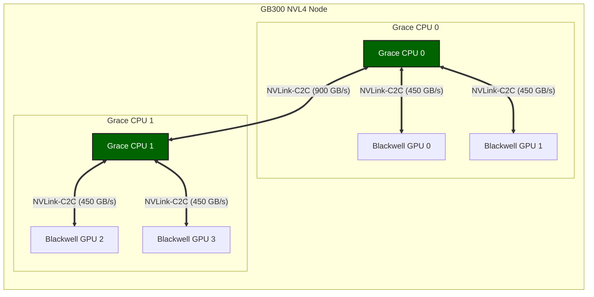

# NVLink-C2C 技术详解：构建 AI Superchip 的关键互连技术

随着 AI 与高性能计算（HPC）的迅速发展，计算系统的瓶颈逐渐从算力转移到数据移动（Data Movement）。GPU 的计算能力在过去十年中增长了数十倍，但 CPU 与 GPU 之间的数据交换仍主要依赖 PCIe，总线带宽与延迟逐渐成为系统性能的限制因素。

为了解决这一问题，NVIDIA 提出了 NVLink-C2C（Chip-to-Chip）互连技术，用于在 CPU 与 GPU、CPU 与 CPU、以及多芯片系统中实现高带宽、低延迟的一致性互连。该技术已经成为 NVIDIA Grace Hopper、Grace Blackwell 等 AI Superchip 架构的核心基础设施。

本文将系统介绍 NVLink-C2C 的技术背景、体系结构、核心参数以及在 GB300 等最新架构中的应用。文中关键数据均引用自 NVIDIA 官网页面、官方技术博客与官方发布材料。

## 1. 背景与技术演进

本节从传统 CPU 与 GPU 互连的带宽瓶颈出发，回顾 NVLink 技术从 GPU 间互连到芯片级互连的演进历程。

### 1.1 AI 时代的互连瓶颈

在传统服务器架构中，CPU 与 GPU 的连接通常依赖于 PCIe 总线，这种架构在面对大规模 AI 负载时逐渐显露出局限性。

```text
// 传统 CPU 与 GPU 通过 PCIe 互连示意图
CPU <--- PCIe ---> GPU
```

PCIe 的特点是：

- **总线属性**：通用 I/O 总线。
- **扩展目标**：面向设备扩展。
- **时延特征**：延迟较高。
- **带宽特征**：带宽有限。

即使在 PCIe Gen5 x16 配置下，CPU 与 GPU 互连带宽仍显著低于现代 GPU 的本地内存带宽与计算吞吐能力。NVIDIA 官方技术博客也将 NVLink-C2C 的 900 GB/s（双向）描述为相对 x16 PCIe Gen5 的约 7 倍带宽 [2]。这意味着在许多 AI/HPC 负载中，CPU 与 GPU 互连会成为系统瓶颈。为了突破这一限制，NVIDIA 逐步发展出 NVLink 互连技术。

### 1.2 NVLink 技术演进

NVLink 是 NVIDIA 为 GPU 设计的高带宽互连技术，旨在解决传统互连方式的带宽限制问题。其演进大致经历了三个阶段：

| 技术           | 作用              | 说明                                                |
| :------------- | :---------------- | :-------------------------------------------------- |
| **NVLink**     | GPU ↔ GPU 互连    | 用于 GPU 间的高速互连，支持显存池化                 |
| **NVSwitch**   | GPU 集群互连      | 构建大规模 GPU 网络（如 NVL72），实现全互连         |
| **NVLink-C2C** | Chip-to-Chip 互连 | 封装级互连，连接异构芯片（CPU 与 GPU、GPU 与 ASIC） |

NVLink 最初用于 GPU ↔ GPU，例如：

```text
// NVLink 早期的 GPU 互连示意图
GPU --- NVLink --- GPU
```

随后 NVIDIA 推出了 NVSwitch，用于构建大规模 GPU 网络。而 NVLink-C2C 则进一步将 NVLink 技术扩展到**芯片级互连**（die-to-die interconnect），即在单一封装内或近封装距离下连接不同的处理器裸片（如 CPU die 与 GPU die），实现比传统板级互连更高的带宽与更低延迟。

---

## 2. NVLink-C2C 技术详解

本节从技术概述、核心指标、架构协议与统一内存四个方面，深入解析 NVLink-C2C 的设计与实现。

### 2.1 技术概述

NVLink-C2C（Chip-to-Chip）是一种封装级高速互连技术，用于连接同一系统中的多个处理器芯片，例如 CPU 与 GPU、CPU 与 CPU 或 GPU 与 ASIC。它的核心目标是在多个处理器之间实现高带宽、低延迟和内存一致性。

与传统 PCIe 不同，NVLink-C2C 是**计算互连**（compute interconnect）。根据 NVIDIA 官方技术博客，NVLink-C2C 在 Grace Hopper 中提供 900 GB/s（双向）带宽，约为 x16 PCIe Gen5 的 7 倍带宽 [2]。

### 2.2 核心技术指标

根据 NVIDIA 官方技术博客、官网技术页面与官方发布材料，NVLink-C2C 的关键指标如下：

| 指标                               | 参数                                     | 说明                                                     |
| :--------------------------------- | :--------------------------------------- | :------------------------------------------------------- |
| **双向带宽**                       | **900 GB/s**                             | 官方技术博客披露 GH200 中为 900 GB/s（450 GB/s/方向）[2] |
| **能效（链路）**                   | **1.3 pJ/bit**                           | 官方技术博客披露 NVLink-C2C 链路能耗指标 [2]             |
| **能效/面积效率（最新官网口径）**  | **6x / 3.5x**                            | 相比 NVIDIA 芯片上的 PCIe Gen6 PHY [1]                   |
| **能效/面积效率（2022 发布口径）** | **25x / 90x**                            | 相比 NVIDIA 芯片上的 PCIe Gen5（来自官方发布材料）[5]    |
| **物理层**                         | **40 Gbps/pin**                          | 官方发布材料披露单端信号速率 [5]                         |
| **协议支持**                       | **AMBA CHI / CXL**                       | 官方产品页明确支持 Arm AMBA CHI 或 CXL [1]               |
| **封装与集成形态**                 | **PCB / MCM / Interposer / Wafer-level** | 官方页面明确支持多种集成方式 [1, 5]                      |

### 2.3 核心架构与协议

NVLink-C2C 的核心思想是通过高速 SerDes 实现 die-to-die coherent interconnect。它不仅仅是物理层连接，更包含了完整的缓存一致性协议栈。

#### 2.3.1 物理互连架构

典型系统架构如下（以 Grace Hopper 为例）：

```text
// NVLink-C2C 连接 Grace CPU 与 Hopper GPU 的架构示意图
             NVLink-C2C (900 GB/s)
      ┌─────────────────────────────┐
      │                             │
      ▼                             ▼

+-------------+               +-------------+
|  Grace CPU  |===============|  Hopper GPU |
| (72 Cores)  |               |  (H100/H200)|
|             |               |             |
|   LPDDR5X   |               |    HBM3     |
|   Memory    |               |   Memory    |
+-------------+               +-------------+

        Unified Memory Address Space
```

该架构具有几个关键特性：

1. **高带宽**：900 GB/s 的带宽消除了 CPU 和 GPU 之间的数据传输瓶颈。
2. **低延迟**：芯片级互连大幅降低了通信延迟。
3. **硬件一致性**：支持硬件级 Cache Coherency。
4. **统一地址空间**：允许 CPU 和 GPU 直接访问对方内存。

#### 2.3.2 协议层：AMBA CHI 与 CXL

NVLink-C2C 支持 Arm 的 **AMBA CHI (Coherent Hub Interface)** 协议，并支持 **CXL** 互操作能力 [1, 5]。这意味着：

- Grace CPU（基于 Arm Neoverse V2）可以直接通过 NVLink-C2C 与 GPU 进行缓存一致性通信。
- GPU 可以直接读取 CPU 的 L3 Cache 或 LPDDR5X 内存，而无需经过传统的 PCIe Root Complex。

此外，官方发布材料还强调 NVLink-C2C 面向低延迟、高带宽与高能效场景进行了专门优化 [5]。

### 2.4 统一内存架构

NVLink-C2C 的一个关键能力是内存一致性（Memory Coherency），即 CPU 与 GPU 共享统一地址空间。

```text
// 统一地址空间架构示意图
          Unified Address Space

          ┌───────────────────┐
          │   System Memory   │
          └───────────────────┘
                 ▲
                 │
     ┌───────────┴───────────┐
     │                       │

+-------------+       +-------------+
|  Grace CPU  |       |  Hopper GPU |
|   LPDDR5X   |       |    HBM3     |
|   Memory    |       |   Memory    |
+-------------+       +-------------+
        │                   │
        └──── NVLink-C2C ───┘
```

在该架构中，CPU 内存、GPU HBM 和系统页表都处于统一地址空间。这意味着：

- **零拷贝 (Zero-Copy)**：GPU 可以直接访问 CPU 内存，不需要显式数据复制（如 `cudaMemcpy`）。
- **原子操作 (Atomics)**：支持系统级原子操作，GPU kernel 可以直接更新 CPU 数据，CPU 也可以直接更新 GPU 数据。
- **大内存支持**：GPU 可以利用 CPU 的大容量 LPDDR5X 内存（Grace Hopper 单 Superchip 最高 512 GB LPDDR5X）来存放超大模型参数或 KV Cache，突破 HBM 容量限制 [2]。

---

## 3. NVLink-C2C 在 AI Superchip 中的应用

NVLink-C2C 是 NVIDIA 构建 "Superchip" 的基石，已在 Grace Hopper、GB200、GB300 等产品中落地 [1, 3, 4]。

### 3.1 Grace Hopper Superchip (GH200)

GH200 将一颗 Grace CPU 和一颗 Hopper GPU 封装在一起 [2]。不同产品 SKU 与系统配置下的 LPDDR5X 容量存在差异，需结合具体平台规格解读 [2, 6]。


- **互连带宽**：900 GB/s（双向，450 GB/s/方向）[2]。
- **内存容量**：96 GB HBM3 + 最多 512 GB LPDDR5X，单 Superchip 可寻址内存最多 608 GB [2]。
- **应用场景**：推荐系统、大模型推理、图计算。

### 3.2 Grace Blackwell Superchip (GB200/GB300)

在最新的 Blackwell 架构中，NVLink-C2C 的应用进一步扩大。以 **GB300 NVL72** 为例，其基础构建模块为 **GB300 NVL4 Node**，包含 2 颗 Grace CPU 与 4 颗 Blackwell Ultra GPU。官方给出的整机规格为 72 颗 Blackwell Ultra GPU 与 36 颗 Grace CPU；在 NVL72 域内提供 130 TB/s 的 NVLink 带宽 [3]。Blackwell 官方技术页也明确指出 Grace CPU 与 Blackwell GPU 之间存在 900 GB/s 的高速链路 [4]。

GB300 NVL4 Node 的拓扑示意如下：



- **拓扑结构**：以 GB300 NVL4 为基本单元，两颗 Grace CPU 通过 NVLink-C2C 互连，每颗 CPU 分别连接两颗 Blackwell GPU [3, 4]。
- **链路能力**：
  - **CPU 与 GPU**：单条链路提供 450 GB/s（双向），每颗 CPU 总计 900 GB/s [4]。
  - **CPU 与 CPU**：两颗 Grace CPU 之间提供 900 GB/s（双向）的一致性互连。
- **整机规模**：在 NVL72 规模下，官方 NVLink 域带宽为 130 TB/s [3]。
- **实测数据**：通过 `nvbandwidth` 测试，单卡 H2D 带宽实测约 **210 GB/s**，达到理论极限 225 GB/s 的 **93%**，远超 PCIe Gen5 x16 的 56 GB/s。详细测试报告参见 `GB300 架构解析与性能测试` ⚠️ (原文链接)。

### 3.3 Quad GH200 实测补充（Alps）

来自 ETH Zurich 与 CSCS 的 GH200 实测研究进一步补充了工程侧细节：研究对象为 Quad GH200 节点（4 个 GH200 全互连），强调该类紧耦合异构系统中的“数据放置”是性能关键变量 [6]。

- **链路实现**：论文给出 NVLink-C2C 的实现口径为每数据信号 40 Gbps，GH200 中 CPU 与 GPU 各集成 10 条链路，合计 450 GB/s/方向 [6]。
- **节点配置**：该研究平台的每个 GH200 配置为 96 GB HBM3 + 128 GB LPDDR5（论文注明早期阶段可用 LPDDR5 容量为 120 GB）[6]。
- **性能结论**：当访问路径跨越 C2C 与 NVLink 多级互连时，实际吞吐通常显著低于局部访问上限；本地性与内存放置策略会直接影响带宽与延迟表现 [6]。
- **应用启示**：在 LLM 推理与集合通信场景中，“同 Superchip 本地性”常比“仅区分 DDR/HBM 类型”更关键，需优先规划数据布局 [6]。

---

## 4. AI 系统价值与生态

NVLink-C2C 对 AI 基础设施的意义主要体现在超大模型支持、编程模型简化与开放生态三个方面。

### 4.1 超大模型支持与 KV Cache 卸载

传统 GPU 内存有限（如 H100 80 GB），但 LLM 推理（尤其是长 Context）需要巨大的显存。通过 NVLink-C2C，GPU 可以直接访问 CPU 的 LPDDR5X 内存；官方将这一能力称为 Extended GPU Memory，并强调可用于显存超分配场景 [2]。

- **KV Cache Offloading**：将不常用的 KV Cache 存放在 CPU 内存中，GPU 需要时可通过 NVLink-C2C 高带宽链路快速读取 [2, 4]。
- **参数卸载**：在训练或推理超大模型时，可以将部分参数层卸载到 CPU 内存。

### 4.2 减少数据复制与编程简化

传统架构中，从 CPU 内存到 GPU 内存的数据传输需要使用 `cudaMemcpy`，且带宽受限于 PCIe。
而 NVLink-C2C 允许：

- **隐式数据移动**：在 ATS 与硬件一致性支持下，CPU 与 GPU 可共享地址翻译与一致性语义，减少显式迁移负担 [2]。
- **细粒度访问**：GPU 可以高效地访问 CPU 内存中的零散数据结构（如 Graph 节点），而无需打包传输。

同时，来自 Quad GH200 的实测结果也表明：虽然统一地址空间显著降低了编程复杂度，但性能仍然强依赖数据局部性与页放置策略；“可访问”并不等同于“高性能访问” [6]。

### 4.3 开放生态：NVLink Fusion

NVIDIA 正在通过 **NVLink Fusion** 计划开放 NVLink-C2C 技术，官方产品页明确说明该能力可用于半定制系统设计 [1]。

- **Chiplet 集成**：支持将 NVIDIA 处理器与定制硅片进行高带宽一致性互连 [1, 5]。
- **混合计算**：客户可以将自己的专用加速器与 NVIDIA 的 GPU 或 CPU 通过 NVLink-C2C 封装在一起，构建定制化的 AI Superchip。

---

## 5. 技术对比

本节从两个维度对 NVLink-C2C 进行横向比较：一是与 PCIe、CXL 等通用互连的差异，二是与同属 NVLink 体系的 GPU 间互连的区别。

### 5.1 与 PCIe / CXL 的对比

NVLink-C2C 常被拿来与 PCIe 和 CXL 比较，它们在设计目标和性能指标上有着显著差异。

| 特性                       | PCIe Gen5 x16               | CXL                    | NVLink-C2C                                                                    |
| :------------------------- | :-------------------------- | :--------------------- | :---------------------------------------------------------------------------- |
| **主要用途**               | 通用设备互连（NIC、SSD 等） | 内存扩展与一致性互连   | 高性能 CPU 与 GPU / Chiplet 互连                                              |
| **带宽口径（官方已披露）** | 常见为 x16 形态             | 行业标准一致性互连协议 | GH200 中 900 GB/s（双向）[2]                                                  |
| **能效/面积效率口径**      | 基准                        | 基准                   | 相比 PCIe Gen6 PHY：6x / 3.5x [1]；2022 发布口径相对 PCIe Gen5：25x / 90x [5] |
| **一致性与原子操作**       | 需额外机制                  | 支持一致性语义         | 官方明确支持硬件一致性与原子操作 [2]                                          |
| **互操作协议**             | PCIe 协议族                 | CXL 协议族             | 支持 AMBA CHI 或 CXL [1]                                                      |
| **物理集成形态**           | 板级为主                    | 板级/机架级扩展        | 支持 PCB、MCM、硅中介层、晶圆级连接 [1]                                       |

NVLink-C2C 的优势在于高带宽、低延迟与高能效，适合封装内或近封装互连；PCIe/CXL 更适合板级与系统级扩展。三者并非互斥，而是分层协同 [1, 2, 5]。

### 5.2 NVLink 与 NVLink-C2C 对比

NVLink 与 NVLink-C2C 同属 NVIDIA 高速互连体系，但二者服务的系统层级不同：NVLink 主要解决 GPU 与 GPU 规模化互连，NVLink-C2C 主要解决封装内或近封装的 CPU 与 GPU / Chiplet 一致性互连。

| 维度             | NVLink                                                    | NVLink-C2C                                     |
| :--------------- | :-------------------------------------------------------- | :--------------------------------------------- |
| **典型连接对象** | GPU ↔ GPU（含 NVSwitch 规模化互连）[4, 7]                 | CPU 与 GPU、CPU 与 CPU、GPU 与 ASIC [1, 2]     |
| **系统层级**     | 板级/机架内 scale-up 主干 [4, 7]                          | 封装级或近封装 chip-to-chip 互连 [1, 5]        |
| **核心目标**     | 提升多 GPU 间带宽与集体通信效率 [4, 7]                    | 提供高带宽、低延迟、缓存一致性访问 [1, 2]      |
| **一致性语义**   | 以 GPU 互连与内存访问扩展为主 [2, 7]                      | 明确强调硬件一致性、原子操作与 ATS 协同 [2, 6] |
| **带宽口径示例** | Hopper NVLink 4.0 体系常见 900 GB/s（GPU 侧总口径）[2, 7] | GH200 CPU 与 GPU 互连 900 GB/s（双向）[2, 6]   |
| **工程关注点**   | 拓扑扩展、NVSwitch 域内通信与并行效率 [4, 7]              | 数据放置、本地性、跨 C2C 访问路径代价 [6]      |

从架构演进看，NVLink 历代版本持续提升每代 GPU 的互连总带宽；而 NVLink-C2C 将“带宽 + 一致性”下沉到 Superchip 内部，二者在 AI 基础设施中通常协同出现：前者负责 GPU 域扩展，后者负责异构芯片紧耦合 [2, 4, 7]。

---

## 6. 总结

NVLink-C2C 是 NVIDIA 为 AI 时代设计的一种芯片级高速互连技术，深刻改变了异构计算系统的设计范式。

其核心价值在于：

1. **打破内存墙**：通过 900 GB/s 的带宽和统一内存架构，消除了 CPU 和 GPU 之间的物理隔阂。
2. **赋能 Superchip**：使得 Grace Hopper/Blackwell 这样的超级芯片成为可能，重新定义了数据中心的计算单元。
3. **推动 Chiplet 生态**：提供了高性能的 Die-to-Die 互连标准，为未来的定制化硅片集成铺平了道路。

在未来 AI 基础设施中，类似 NVLink-C2C 的 chip-to-chip coherent interconnect 将成为连接算力与数据的核心血管。

---

## 7. 参考资料

[1] NVIDIA, "NVLink-C2C," _NVIDIA Data Center_, n.d. [Online]. Available: https://www.nvidia.com/en-us/data-center/nvlink-c2c/

[2] NVIDIA, "NVIDIA Grace Hopper Superchip Architecture In-Depth," _NVIDIA Developer Blog_, 2022. [Online]. Available: https://developer.nvidia.com/blog/nvidia-grace-hopper-superchip-architecture-in-depth/

[3] NVIDIA, "NVIDIA GB300 NVL72," _NVIDIA Data Center_, 2025. [Online]. Available: https://www.nvidia.com/en-us/data-center/gb300-nvl72/

[4] NVIDIA, "NVIDIA Blackwell Architecture," _NVIDIA Data Center Technologies_, 2024. [Online]. Available: https://www.nvidia.com/en-us/data-center/technologies/blackwell-architecture/

[5] NVIDIA, "NVIDIA Opens NVLink for Custom Silicon Integration," _NVIDIA Newsroom_, 2022. [Online]. Available: https://nvidianews.nvidia.com/news/nvidia-opens-nvlink-for-custom-silicon-integration

[6] M. Khalilov, M. Chrapek, G. Chukkapalli, T. Schulthess, and T. Hoefler, "Understanding Data Movement in Tightly Coupled Heterogeneous Systems: A Case Study with the Grace Hopper Superchip," _arXiv_, 2024. [Online]. Available: https://arxiv.org/html/2408.11556v2

[7] Wikipedia contributors, "NVLink," _Wikipedia_, n.d. [Online]. Available: https://en.wikipedia.org/wiki/NVLink
