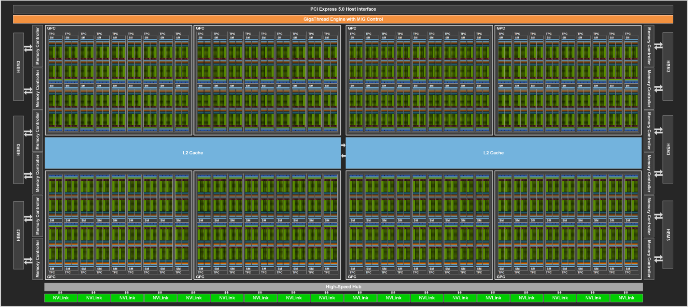
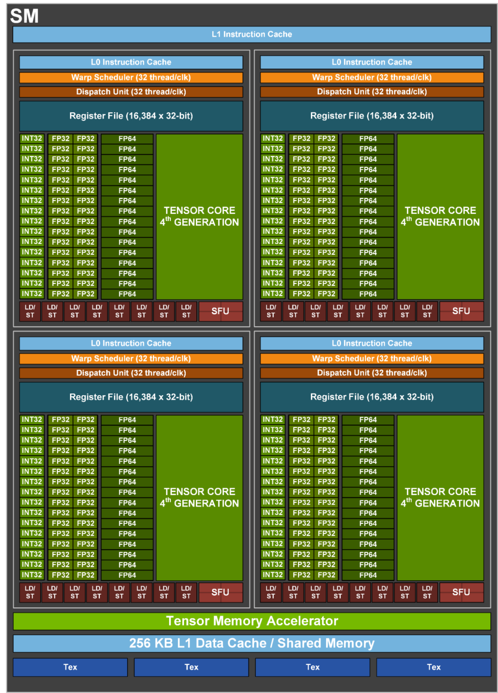
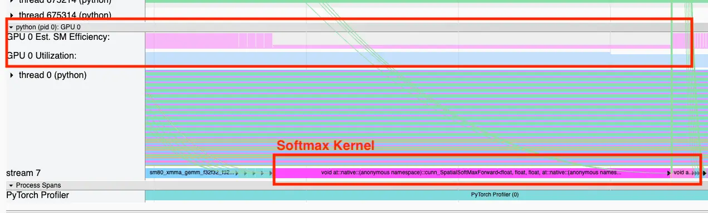
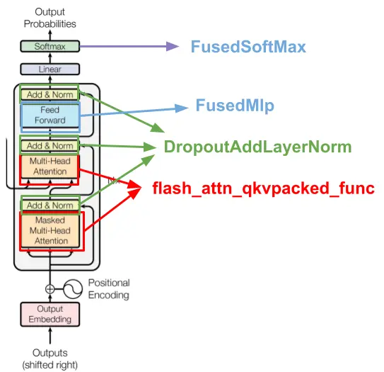

# GPU 利用率是一个误导性指标

> 原文: `https://www.trainy.ai/blog/gpu-utilization-misleading`

机器学习团队最常用于评估 `GPU` 使用情况的指标是 **`GPU` 利用率**，通常通过在终端运行 `nvidia-smi` 命令获取。许多集成可观测性工具也将 `GPU` 利用率作为其主要性能监测指标。令人惊讶的是，我们发现这并非总是衡量 `GPU` 性能的最佳指标。事实上，仅通过内存读写操作（不进行任何计算）就能获得 `100%` 的 `GPU` 利用率！本文旨在揭示这一发现的过程，并分享我们在此过程中获得的其他洞见。

在 [Trainy](https://trainy.ai/)，我们专注于 `GPU` 集群管理基础设施的研发，因此长期深耕该领域。去年我们与某基础模型公司合作，致力于扩展其大语言模型（`LLM`）训练规模并提升效率。我们遵循了几乎所有 `PyTorch` 性能调优指南都会提及的基础步骤，具体包括：

- 通过调整数据加载器默认参数（`num_workers`、`batch_size`、`pin_memory`、`prefetch_factor` 等）使 `GPU` 达到饱和状态；
- 使用混合精度训练（`fp16`, `bf16`）以最大化张量核心利用率；
- 使用 `apex`/`deepspeed` 提供的融合优化器（如 `FusedAdam`、`FusedAdamW` 等）；
- 使用专为训练设计的实例/网络架构（`H100SXM`、`A100SXM`）。同时尽可能使用更新代的实例：`H100` > `A100` > `V100`。

这些简单调整使我们实现了 `100% GPU` 利用率和显著提升的功耗，这很棒！为了验证是否还有优化空间，我们计算了训练任务的 `MFU` 指标。

> **简要回顾**：如 [Google 的 PaLM 论文](https://arxiv.org/pdf/2204.02311) 所述，`MFUs`（模型浮点运算利用率）是理解 `GPU` 性能的最佳指标之一。其定义为“观察到的吞吐量（每秒处理 token 数）与系统在峰值 FLOPs 状态下理论最大吞吐量的比值”。简而言之，它反映了当前工作负载的每秒浮点运算量占 `GPU` 理论最大能力的百分比。该指标的主要局限在于，相较于 `GPU` 利用率等指标，其数值依赖于具体参数和框架实现。

令人遗憾的是，该模型训练仅达到约 `20%` 的 `MFU`（模型浮点利用率）。作为参考，目前大多数 `LLM` 训练的 `MFU` 水平在 35%-45% 之间 。这就引出了核心问题：在 `GPU` 利用率显示 `100%` 的情况下，为何我们仅使用了 `GPU` 理论最大计算能力的 `20%`？

要解答这个问题，我们需要更深入地理解 `GPU` 利用率指标的实际监测对象。

## `GPU` 利用率的本质是什么？

在 [Nvidia 官方文档](https://developer.nvidia.com/management-library-nvml) 中，`GPU` 利用率被模糊地定义为“当前利用率指标同时反映 `GPU` 计算资源和内存接口的使用率”，这种表述具有显著的语义不确定性。

（令人意外的是）[`Datadog` 的 `NVML` 文档](https://docs.datadoghq.com/integrations/nvml/#metrics) 提供了更明确的定义：“**过去采样周期内，`GPU` 执行一个或多个内核运算的时间占比**”。要理解这个指标的误导性，我们需要简要回顾 `GPU` 的工作原理。

`GPU` 具有[核心和多处理管理器](https://cvw.cornell.edu/gpu-architecture/gpu-characteristics/kernel_sm) 。在英伟达 `GPU` 中这些多处理管理器被称为流式多处理器（`SM`），而 `AMD` 硬件上则称为计算单元（`CU`）。下图展示了包含 `144` 个流式多处理器（`SM`）的 `GH100 GPU` 架构示意图。

这些多处理管理器可视为一组工人（即核心）的工头。当启动 `CUDA` 内核时，工作会通过一个或多个流式多处理器（`SM`）在 `CUDA` 核心上执行。如下图所示，`GH100` 芯片中的单个流式多处理器（`SM`）包含大量 `CUDA` 核心。

**这意味着 `GPU` 利用率这个指标仅测量内核在给定时间内是否正在执行。** 它无法反映内核是否使用了所有可用核心，或是否将工作负载并行化至 `GPU` 的最大处理能力。在最极端的情况下，仅通过内存读写操作（执行 `0` 次浮点运算）即可获得 `100%` 的 `GPU` 利用率。

现在我们需要澄清的是：这种情况仅对缺乏系统背景知识的人群（如许多机器学习工程师）具有误导性。正如 [此处](https://arthurchiao.art/blog/understanding-gpu-performance/#24-the-use-methodology) 所述，在 ["USE 方法论"](https://www.brendangregg.com/usemethod.html) 框架下，`GPU` 利用率的定义确实具有特定意义。

但回到当前问题，这个定义确实解释了我们在 `GPU` 利用率与 `MFU` 之间观察到的差距！显然还有潜在性能未被充分挖掘，我们只需找到它。

## 深入挖掘

下一步寻找更多性能提升的方向自然是分析模型的训练循环。我们使用 `PyTorch` 分析器仔细查看了训练循环以获取更深入的理解。

如下图所示，`Softmax` 内核显示出高 `GPU` 利用率，但名为流多处理器效率的指标却较低。这立即引起了我们的警觉，因为原生 `softmax` 是大型语言模型中众所周知的瓶颈，为此业界开发了诸如 FlashAttention 的 [内核融合技术](https://triton-lang.org/main/getting-started/tutorials/02-fused-softmax.html#motivations) 来解决其内存受限的特性。基于这些信息，流多处理器效率指标可能正揭示着我们模型执行过程中的低效环节。

## 但流多处理器效率究竟代表什么？

流多处理器效率（亦称 `SM` 活动度）是英伟达 `GPU` 上的一个度量指标，用于描述特定时间间隔内活跃流多处理器（`SM`）的百分比。如前所述，流多处理器可视为 `CUDA` 核心集群的调度中枢。以 [英伟达 H100 GPU](https://developer.nvidia.com/blog/nvidia-hopper-architecture-in-depth/) 为例，其拥有 `132` 个流多处理器，每个 `SM` 包含大量 `CUDA` 核心。通过测量流多处理器效率，我们可以判断 `CUDA` 内核是否有效利用了流多处理器资源。若某个 `CUDA` 内核持续运行 `10` 秒但仅使用 `1` 个流多处理器，在 `H100` 上该操作会显示 `100%` 利用率，但流多处理器效率仅为 `1/132=0.7%`。

非常棒，这正是我们需要的解决方案！通过逐层监测流多处理器效率，我们可以明确优化过程中最容易实现的性能增益点。

## 进行优化

既然我们可以轻松识别哪些内核在 `GPU` 上未充分运行，就可以着手优化这些层。由于这是一个 `Transformer` 堆栈，主要优化收益将来自对 `Transformer` 块定义中的层进行融合。下图总结了我们的优化内容。

所谓融合，是指我们不使用 `PyTorch` 原生定义的层集合，而是将其替换为用 `CUDA` 或 `Triton` 实现的 `GPU` 内核——该内核将所有层合并为一个。这种加速源于：对于某些层（如 [Softmax](https://triton-lang.org/main/getting-started/tutorials/02-fused-softmax.html) ），相比执行数学运算的时间，减少内核读写 `GPU` 内存的时间更为关键。Flash Attention 就是这种融合内核的典型示例。其他需要融合的内核包括 MLP 和 dropout layer norm residual add 操作。

这些内核是我们自己编写的吗？并非如此。其中大部分已通过 `Flash Attention` 等库实现为 `nn.Modules` 层，因此您无需担心从零开始使用内核实现 `torch.autograd.function`。此外，这些实现通常已进行硬件级优化，不仅运行速度更快，还能减少内存占用。

最大的挑战在于确定代码中需要替换具体网络层的位置。虽然 `torch.compile` 试图自动完成这项工作，但截至本文撰写时，该工具 [与 FSDP 等新型分布式策略兼容性不佳](https://dev-discuss.pytorch.org/t/torch-compile-fsdp-dec-8th/1718) ，且由于计算图中断问题，实践中未能兑现预期的加速效果。展望未来，我们期待 `torch` 编译器能自动完成这些优化，但目前仍需手动集成融合实现方案。

在成果方面，我们为该客户实现了训练速度 `4` 倍的提升，模型浮点利用率（`MFU`）从最初的 `20%` 提升至 `38%`。大部分优化来源于融合内核技术的应用，以及根据其模型规模和可用的 `3.2 Tbps Infiniband` 网络带宽，确定的最优模型并行层级配置。

## 结论

我们强烈建议各 AI 团队在监控 `GPU` 集群时，除 `GPU` 利用率外还应关注流多处理器效率（`SM Efficiency`）。该指标能更真实反映 `GPU` 的性能压榨程度，而 `GPU` 利用率仅能体现设备是否处于空闲状态。当然，计算模型浮点利用率（`MFUs`）也很有价值，但这并非一个可实时逐层监控的指标。值得注意的是，[英伟达 DCGM](https://docs.nvidia.com/datacenter/dcgm/latest/user-guide/feature-overview.html#profiling-metrics) （数据中心 GPU 管理器）默认就提供流多处理器活动的监控数据。

除此之外，还存在更细粒度的指标，例如流多处理器占用率（在 `PyTorch` 分析器中称为“实际占用率”），这些指标能反映每个流多处理器实际执行的工作量。然而，理解这些指标并不像单纯追求流多处理器效率最大化那么直观。如果您希望深入了解，我建议您查阅以下资源：[PyTorch 分析器博客](https://pytorch.org/blog/pytorch-profiler-1.9-released/#gpu-metric-on-timeline) 、[DCGM 文档](https://docs.nvidia.com/datacenter/dcgm/latest/user-guide/feature-overview.html#profiling-metrics) 、[Nsight 内核性能分析指南](https://docs.nvidia.com/nsight-compute/ProfilingGuide/index.html) 以及 [Nsight 文档](https://docs.nvidia.com/gameworks/content/developertools/desktop/analysis/report/cudaexperiments/kernellevel/achievedoccupancy.htm) 。

---

### MFU vs SM Efficiency vs GPU Utilization 对比表

| **指标名称**                                            | **关注层级** | **表示意义**                                 | **典型使用场景**          | **优点**               | **局限性**                         | **计算公式（含说明）**                                                                                                                                                    | **举例解释**                                                                       |
| ------------------------------------------------------- | ------------ | -------------------------------------------- | ------------------------- | ---------------------- | ---------------------------------- | ------------------------------------------------------------------------------------------------------------------------------------------------------------------------- | ---------------------------------------------------------------------------------- |
| `MFU` (`Model Flops Utilization`)                       | 模型级       | 模型实际执行的 `FLOPs` 占理论 `FLOPs` 的比例 | 深度学习训练、推理        | 准确反映模型计算利用率 | 不适用于非模型任务，需已知模型结构 | `MFU` = 实际执行的 `FLOPs` / 理论最大 `FLOPs` （需通过 `profiler` 获取模型实际 `FLOPs`）                                                                               | 理论 `FLOPs` 为 `1000 GFLOPs`，实际执行了 `900 GFLOPs`，则 `MFU = 0.9`             |
| `SM Efficiency` (`Streaming Multiprocessor Efficiency`) | GPU 内核级   | `SM` 上有活跃 `warp` 的周期占总周期比例      | `CUDA kernel` 优化        | 可反映线程调度活跃性   | 活跃 `warp` 不代表充分利用核心     | `SM Efficiency` = 有 `warp` 活跃的周期数 / `SM` 总周期数                                                                                                                  | `SM` 在 `100` 个周期中有 `40` 个周期有活跃 `warp`，则 `SM Efficiency` = `40%`      |
| `GPU Util` (`GPU Utilization`)                          | 整体硬件级   | `GPU` 在某时间段内是否“忙碌”（无论执行类型） | 粗略判断 GPU 是否在被使用 | 简单直观，易于采集     | 可能误判内存读写或轻负载为满载     | `GPU Util = 忙碌时间 / 总采样时间` **说明：** 1) **忙碌**定义为有任意内核在运行 2) 不考虑是否占满 `CUDA` 核心 3) 哪怕只是执行内存 `copy`，也可能显示为 `100%` | `GPU` 执行内存 `copy` 操作时，即使 `CUDA` 核心空闲，`GPU Util` 也可能显示为 `100%` |

### 补充说明：GPU Utilization 的误区

- **`GPU Utilization` ≠ 实际计算能力利用率**。
- 只要有任何内核在运行（包括仅做 `memory copy`），就会视为“忙碌”；
- **即使 CUDA 核心空闲，`GPU Utilization` 也可能是 100%**；
- 若要精确评估 `GPU` 的计算利用情况，建议结合 **`MFU`** 或 **`SM Efficiency`**；
- 通过结合 `MFU` 和 `SM Efficiency`，可以更全面地评估 GPU 的计算效率，而不仅仅是依赖 `GPU Utilization` 这一粗略指标。
