# LLM 嵌入技术详解：图文指南

> **原文题目**：**LLM Embeddings Explained：A Visual and Intuitive Guide**  
> **原文地址**：`https://huggingface.co/spaces/hesamation/primer-llm-embedding`  
> **作者**：**Hesam Sheikh Hassani**  
> 所属机构：博洛尼亚大学
> 发布日期：2025年3月28日  
> 阅读时间：`12-15`分钟  
> 如需参与文章贡献、指出错误或提出改进建议，请访问[社区](https://huggingface.co/spaces/hesamation/primer-llm-embedding/discussions)。

50 个随机词的嵌入图谱及其在嵌入空间`deepseek-ai/DeepSeek-R1-Distill-Qwen-1.5B`中的最近邻词元（_原图可以交互访问_）。

**嵌入**（`Embeddings`）是大语言模型的语义支柱，是将原始文本转化为模型可理解的数字向量的关键入口。当你要求大语言模型协助调试代码时，你的文字和词元会被转换为高维向量空间，从而将语义关系转化为数学关系。

本文深入探讨嵌入的基础原理。我们将解析嵌入的本质特征，追溯其从传统统计方法到现代技术的演进历程，考察实际应用中的具体实现方式，介绍若干核心嵌入技术，并展示大语言模型 `DeepSeek-R1-Distill-Qwen-1.5B` 的嵌入向量在图示化呈现中的形态特征。

本文包含交互式可视化与可运行的代码示例，行文避免冗余表述，聚焦核心概念以实现快速阅读直达要点。完整代码可在作者的 `LLM Mechanics GitHub`仓库中获取。

## 什么是嵌入技术？

处理自然语言任务需要将每个词进行数值化表示。大多数嵌入方法的核心都是将**词**或**词元**转化为**向量**。不同嵌入技术的关键区别在于它们实现这种**「词→向量」**转换的方法论。

嵌入技术不仅适用于文本，还可应用于**图像**、**音频**甚至**图数据（`Graph data`）**。广义而言，嵌入是将**[任何类型]**数据转化为向量的过程。当然，不同模态的嵌入方法具有显著差异。本文讨论的**「嵌入表示」**特指**文本嵌入**。

您可能在大语言模型语境中接触过嵌入概念，但该技术实际拥有更悠久的历史。以下是各类嵌入技术的演进脉络：

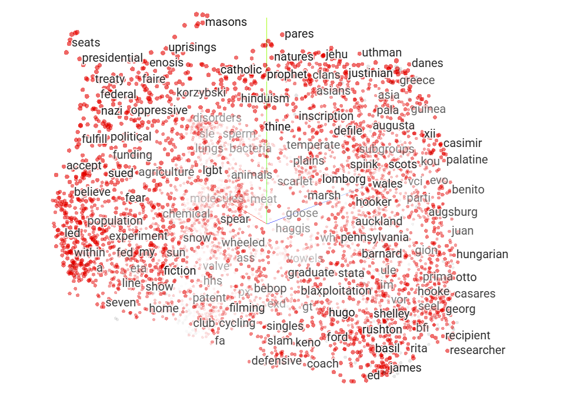

**图1**：不同词嵌入技术概述。

> 原图可以交互访问

在阅读嵌入相关文献时，您可能会遇到**静态嵌入**与**动态（或上下文相关）嵌入**的区分。需要特别注意**词元嵌入**——即在大语言模型输入端固定分配给输入词元的向量——与模型深层产生的上下文表示之间的区别。虽然两者在技术上都是嵌入表示，但词元嵌入是静态的，而中间隐藏状态在通过各网络层时会动态演变，最终捕获输入文本的完整上下文。值得注意的是，在某些文献中这些上下文相关输出也被称为「**嵌入**」，这可能造成概念混淆。

> 在某些文献中，**隐藏状态**形式的向量嵌入也被称为「**嵌入**」，这种表述可能引发理解歧义。

## 优秀的嵌入技术应具备哪些特征？

对于大语言模型而言，嵌入可视为其**语言词典**。更优质的嵌入表示能让模型更好地理解人类语言并与我们交流。但怎样的嵌入技术才算优秀？换言之，理想的嵌入应满足哪些条件？以下列举嵌入技术的两大核心特性：

### 语义表示

某些类型的嵌入表示能够捕捉词语之间的**语义关系**。这意味着具有相近含义或关联的词语在向量空间中的距离，会比语义关联较弱的词语更近。例如，"猫"和"狗"的向量相似度必定高于"狗"和"草莓"的**向量相似度**。

### 维度选择

嵌入向量的维度应该设定为`15`、`50`还是`300`？关键在于找到平衡点：**低维向量**（较小维度）在内存存储和计算处理方面更具效率，而**高维向量**（更大维度）虽然能捕捉复杂语义关系，却容易导致**过拟合**。作为参考，`GPT-2`系列模型的嵌入维度至少为`768`。

> 例如，`DeepSeek-V3`和`R1`模型的嵌入维度达到`7168`。

## 传统嵌入技术

几乎所有的嵌入技术都需要依赖大规模文本语料库来提取词语间的关系。早期的嵌入方法主要基于文本中词语**出现频率**或**共现频率**的**统计方法**，其核心假设是：**若两个词语经常共同出现，则它们必然存在更紧密的语义关联**。这类方法计算复杂度相对较低，典型代表方法包括：

### TF-IDF（词频-逆文档频率）

`TF-IDF`的核心思想是通过考量两个要素来计算词语在文档中的重要性[1]：

1. **词频统计**（`TF`）：衡量特定词语在文档中的**出现频率**。`TF`值越高，表明该词语对文档越重要。
2. **逆文档频率**（`IDF`）：评估词语在文档集合中的**稀缺程度**。该指标基于一个假设：在多个文档中普遍存在的词语，其重要性低于仅存在于少量文档中的独特词语。

`TF-IDF`计算公式包含两个组成部分。首先，词频（`TF`）的计算公式为：

$$
tf(t, d) = \frac{\text{该词在文档} \ d \ \text{中的出现次数}}{\text{文档} \ d \ \text{中的总词数}}
$$

例如，若某文档包含 `100` 个单词且"`cat`"出现`5`次，则"`cat`"的词频为$ 5/100=0.05 $。这为我们提供了该词在文档中普遍程度的简单数值化表征。

接着计算逆文档频率（`IDF`）：

$$
idf(t) = \log\left(\frac{\text{文档总数}}{\text{包含术语 } t \text{ 的文档数}}\right)
$$

该组件会对出现于较少文档中的词语赋予更高权重。常见词汇（如"的"、"一个"、"是"）因广泛存在于多数文档中将获得较低的逆文档频率值，而具有信息量的生僻词则会获得较高的逆文档频率值。

最终通过将两个组成部分相乘得到`TF-IDF`分数：

$t f i d f(t,d)=t f(t,d)\times i d f(t)$ 我们通过具体示例来理解：

假设我们有一个包含`10`篇文档的语料库，其中"猫"这个词仅出现在`2`篇文档中。则"猫"的逆文档频率计算为：

$$
idf(\text{''cat''}) = \log \left( \frac{10}{2} \right) = \log(5) \approx 1.61
$$

若某文档中'cat'出现5次（总词数100），其词频统计（TF）值为 0.05。则该文档中'cat'的最终词频-逆文档频率（TF-IDF）得分为：

$
t f i d f(^{\prime\prime}{\mathrm{cat}}^{\prime\prime})=0.05\times1.61\approx0.08
$

该得分反映'`cat`'在当前文档相对于整个语料库的重要性。得分越高，说明该词不仅在本文档高频出现，同时在所有文档中相对罕见，这使其更可能成为表征文档内容的关键特征。

我们以`TinyShakespeare`数据集演示`TF-IDF`应用。为模拟多文档场景，将原始文本分割为十个文本块。

基于`TinyShakespeare`的`TF-IDF`示例：

```python
# load the dataset
with open("tinyshakespeare.txt", "r") as file:
    corpus = file.read()

print(f"Text corpus includes {len(corpus.split())} words.")

# to simulate multiple documents, we chunk up the corpus into 10 pieces
N = len(corpus) // 10
documents = [corpus[i:i+N] for i in range(0, len(corpus), N)]

documents = documents[:-1] #last document is residue
# now we have N documents from the corpus
# Text corpus includes 202651 words.

from sklearn.feature_extraction.text import TfidfVectorizer

vectorizer = TfidfVectorizer()
embeddings = vectorizer.fit_transform(documents)
words = vectorizer.get_feature_names_out()

print(f"Word count: {len(words)} e.g.: {words[:10]}")
print(f"Embedding shape: {embeddings.shape}")
### OUTPUT ###
# Word count: 11446 e.g.: ['abandon' 'abase' 'abate' 'abated' 'abbey' 'abbot' 'abed' 'abel' 'abet' 'abhor']
# Embedding shape: (10, 11446)
```

> tf-idf.py: `https://gist.github.com/hesamsheikh/951ba078734a66d19a6c963edfd8bc3c/raw/b9ebb3d2c518903b87d62c7e9e42cf842c25ca8b/tf-idf.py`

由此生成`10`维嵌入表示（每个文档对应一维）。为直观理解`TF-IDF`嵌入特性，我们使用主成分分析（`PCA`）将`10`维空间映射至`2`维空间进行可视化呈现。

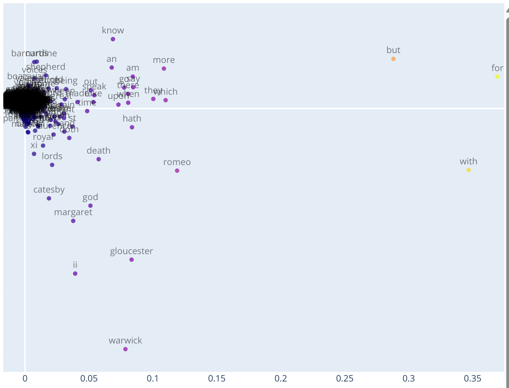

**图2**：`TF-IDF`示例展示经过降维处理后词嵌入在二维空间中的可视化分布

该嵌入空间有两个显著特征值得注意：

1. 绝大多数词语都集中在特定区域。这表明在此方法中，大多数词语的嵌入表示具有相似性。这暗示此类嵌入缺乏表达能力和独特性。
2. 嵌入之间缺乏语义关联。词语间的距离与其实际含义毫无关联。

由于`TF-IDF`基于词语在文档中的出现频率，语义相近的词汇（如数字）在向量空间中并不存在关联。这种简洁性使得`TF-IDF`及类似统计方法在信息检索、关键词提取和基础文本分析等应用中仍具实用价值。相关方法可参阅文献[2]。

### 词向量模型

最初由文献[3]提出的词向量模型(`word2vec`)，是比`TF-IDF`更现代的技术。顾名思义，该网络旨在将词语转化为嵌入向量。其通过定义辅助目标函数来优化网络参数，例如在`CBOW`（连续词袋）模型中，网络训练目标是基于上下文词汇预测缺失词。核心思想是通过上下文词汇推断目标词的嵌入表示。`word2vec`架构简洁：**一个用于提取嵌入的隐藏层，以及一个预测词汇表中所有词语概率的输出层**。表面上看，网络被训练用于根据上下文预测正确缺失词，但实质上这是为了训练隐藏层并获取最优词嵌入。网络训练完成后，输出层可被弃用，因为获取高质量嵌入才是模型的真正目标。

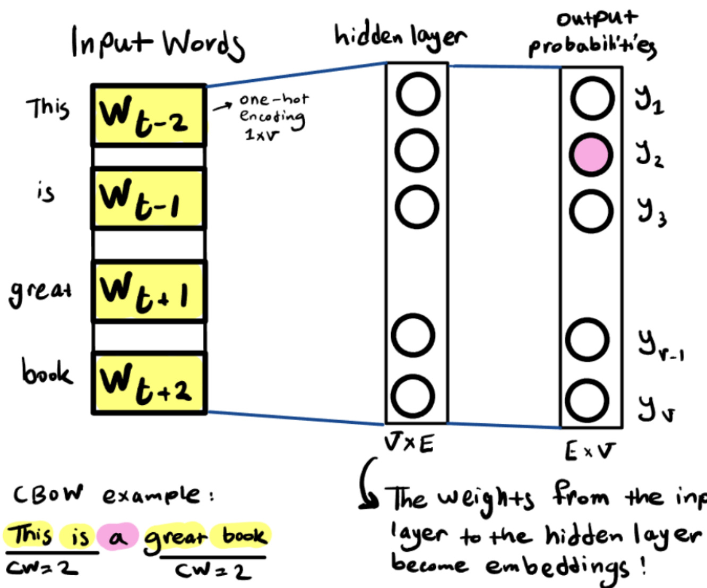

**图3**：词向量模型架构示意图：展示输入层、隐藏层（嵌入表示）和输出层

除了**连续词袋模型**（CBOW），另一个变体是`Skipgram`模型，其工作机制完全相反：给定特定输入词，模型旨在预测其邻近词汇。

以下是`CBOW`词向量模型逐步工作原理：

1. 选择上下文窗口（例如上图中大小为2的窗口）
2. 选取目标词前后各两个词作为输入
3. 将这四个上下文词编码为独热向量
4. 将编码后的向量输入隐藏层，该层使用线性激活函数保持输入不变
5. 聚合隐藏层输出（例如使用`lambda`均值函数）
6. 将聚合结果输入最终层，通过`Softmax`函数预测各候选词的概率分布
7. 选取概率最高的词元作为网络最终输出

**隐藏层**是存储嵌入表示的核心结构。其**矩阵维度**为**词表大小** × **嵌入维度**，当我们输入某个词的**独热向量**（即仅有一个元素为`1`其余全`0`的向量）时，该向量中1对应的位置会触发该词的嵌入表示传递至后续层级。您可以在参考文献[4]中看到一个简洁巧妙的词向量模型实现示例。

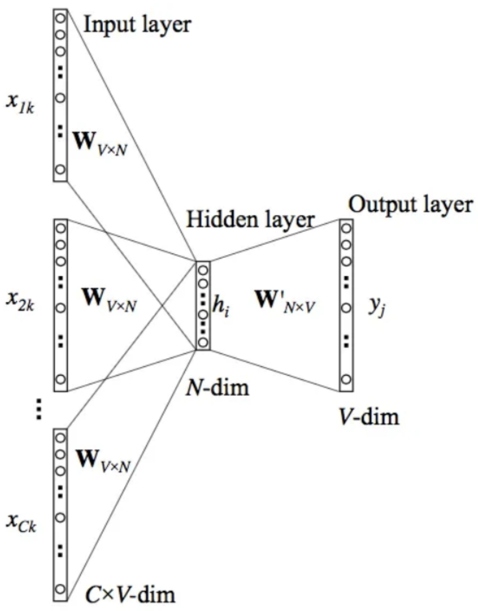

**图4**：`word2vec` 嵌入可视化

由于该网络依赖于上下文中词语之间的关系（而非词频-逆文档频率中基于词语出现或共现的统计），因此能够捕捉词语之间的语义关系。

您可以从谷歌官方页面下载预训练版本[5]。以下是实际应用词向量模型的代码示例：

```phthon
# let's load the pretrained embeddings and see how they look
import gensim
model = gensim.models.KeyedVectors.load_word2vec_format('GoogleNews-vectors-negative300.bin.gz', binary=True)

print(f"The embedding size: {model.vector_size}")
print(f"The vocabulary size: {len(model)}")

# italy - rome + london = england
model.most_similar(positive=['london', 'italy'], negative=['rome'])

### OUTPUT ###
[('england', 0.5743448734283447),
 ('europe', 0.537047266960144),
 ('liverpool', 0.5141493678092957),
 ('chelsea', 0.5138063430786133),
 ('barcelona', 0.5128480792045593)]

model.most_similar(positive=['woman', 'doctor'], negative=['man'])
### OUTPUT ###
[('gynecologist', 0.7093892097473145),
 ('nurse', 0.6477287411689758),
 ('doctors', 0.6471460461616516),
 ('physician', 0.6438996195793152),
 ('pediatrician', 0.6249487996101379)]
```

> word2vec.py: `https://gist.github.com/hesamsheikh/bba3b97d0ba6dee8e45fcb2ec3ead1de/raw/13ced76ddc3c7095821ef6237b816f14227c37dc/word2vec.py`

为了高效训练词向量模型（特别是在处理大规模词汇时），我们采用称为**负采样**的优化技术。该方法无需计算整个词汇表的完整`softmax`函数（计算成本极高），而是通过仅更新少量**负样本**（即随机选择与上下文无关的词语）以及正样本来简化任务。这显著提升了训练速度与可扩展性。

**语义关系**是一个值得探索的有趣主题，词向量模型为实验提供了简洁的框架。您可通过研究嵌入表示来剖析社会或数据中的认知偏差，或是分析历史文献中词语的语义演变轨迹。

您可以通过`TensorFlow Embedding Projector`实际可视化并操作词向量模型的嵌入表示。

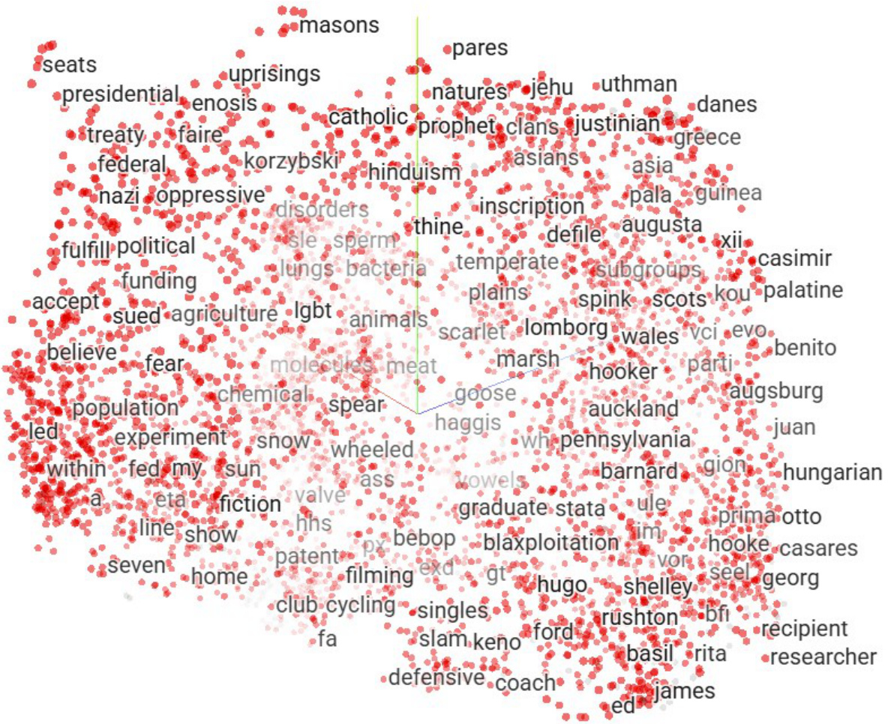

**图5**：`TensorFlow`嵌入投影器在`3D`/`2D`空间中对词向量模型嵌入的交互式探索。

### BERT（来自Transformer的双向编码器表示）

在自然语言处理领域的任何角落，您都会看到`BERT`的身影。建议您一劳永逸地深入了解`BERT`，因为它为众多大语言模型提供了思想源泉和技术基础。

> 这里有一个关于`BERT`入门的优质视频。[6]

总结而言，`BERT`是一个仅含编码器的`Transformer`模型，由四个核心部分组成：

1. **分词器**：将文本切分为整数序列。
2. **嵌入层**：将离散词元转换为向量的模块。
3. **编码器**：由多个具有自注意力机制的`Transformer`模块堆叠而成。
4. **任务头**：当编码器完成表征处理后，这个任务特定头负责处理
   用于词元生成或分类任务。

`BERT`受《**Attention is all you need**》提出的`Transformer`架构启发，演变为能生成有意义表征并理解语言的纯编码器模型。其核心思想是根据具体待解决问题对BERT进行微调，这些特定任务可以是问答（问题 + 段落 -> 答案）、文本摘要、分类等。

在预训练阶段，`BERT`被设计为同时学习两个任务：

1. **掩码语言建模**：预测句子中被遮蔽（`masked`）的词语（例：`I [MASKED] this book before` -> `read`）。
2. **下一句预测**：给定两个句子，判断句子`A`是否出现在句子`B`之前。特殊分隔符**[SEP]**用于分割两个句子，该任务类似于二分类问题。

需特别注意另一个特殊标记**[CLS]**。该标记专为分类任务设计。当模型逐层处理输入时，**[CLS]**会聚合所有输入词元的语义信息，最终形成可用于分类任务的综合特征表示。

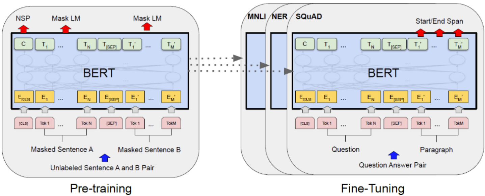

**图6**：`BERT`架构示意图（图片来源：[7]）

### 为何BERT具有里程碑意义？

`BERT`是首批基于`Transformer`架构的上下文动态嵌入表示模型。当输入句子时，`BERT`通过多层自注意力机制和前馈网络，动态整合句中所有词元的上下文信息。每个`Transformer`层的最终输出，都是经过上下文语义编码的词元表示。

## 现代大语言模型中的嵌入表示

**嵌入**表示是大语言模型的基础组件，也是一个广义术语。本文中我们所讨论的'**嵌入**'特指将词元转化为向量表示的模块，而非隐藏层中的潜在空间。

### 嵌入在大语言模型中处于什么位置？

在基于`Transformer`的模型中，'嵌入'这一术语可同时指代静态嵌入和动态上下文表示：

1. **静态嵌入表示**。首层生成的静态嵌入将词元嵌入（表示词元的向量）与位置嵌入（编码词元在序列中位置的向量）相结合。
2. **动态上下文表示**。当输入词元经过自注意力机制和前馈网络层时，其嵌入表示会被更新为上下文相关的形式。这些动态表示能根据上下文环境捕捉词元的语义。例如，单词'`bank`'在'`river bank`'和'`bank robbery`'中的词元嵌入是相同的，但经过网络各层的转换处理后，模型会根据'`bank`'出现的具体上下文环境生成不同的表示。

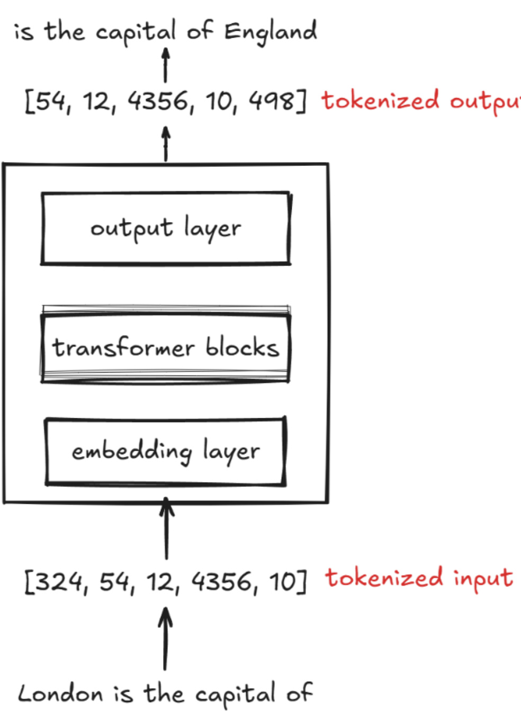

**图7**：嵌入技术在大语言模型架构中的定位概述

### 大语言模型嵌入的训练机制

大语言模型的嵌入表示在训练过程中持续优化。根据塞巴斯蒂安·拉什卡《**从零构建大语言模型**》[8]所述："虽然我们可以使用词向量模型等预训练模型生成机器学习所需的嵌入表示，但大语言模型通常会生成自己的嵌入层作为输入层组成部分，并在训练中动态更新。相较于使用词向量模型，将嵌入优化整合到大语言模型训练中的优势在于，这些嵌入表示可以针对特定任务和数据集进行定向优化。"

### torch.nn.Embedding

大语言模型中的嵌入层本质上是一个查找表。给定索引列表（词元`ID`）后，该层将返回对应的嵌入表示。《**从零构建大语言模型**》[8]对此概念进行了全面阐释。

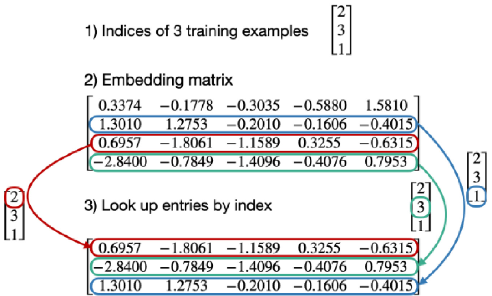

**图8**：嵌入层作为查找表的可视化示意图（图片来源：[8]）

`PyTorch`中通过`torch.nn.Embedding`实现嵌入层，其本质是一个简易的查找表数据结构。与普通线性层相比，该层的特殊之处在于可以直接处理索引输入而无需进行独热编码。从实现原理来看，嵌入层本质上就是能直接处理索引输入的线性层。

下图中包含两个步骤：

1. 将 3 个训练样本的索引转换为独热编码
2. 将独热编码输入与权重矩阵相乘

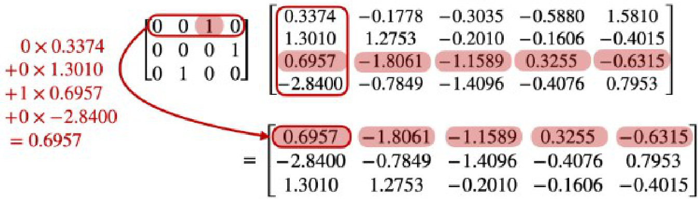

**图9**：嵌入查找过程的可视化示意图（图片来源：[8]）

塞巴斯蒂安·拉什卡的这个 Notebook深入解析了嵌入层的原理 [9]。

现在让我们实际操作模型的嵌入表示并观察可视化效果！

## 嵌入实战演示（DeepSeek-R1-Distill-Qwen-1.5B模型）

大语言模型中的嵌入层是如何构建的？

让我们剖析`Qwen`模型`中DeepSeek-R1`蒸馏版的嵌入表示。以下部分代码灵感来源于[10]。

我们首先从`Hugging Face`加载`deepseek-ai/DeepSeek-R1-Distill-Qwen-1.5B`模型并保存其嵌入参数。

**(1) 加载模型并保存嵌入参数**：

> ls1.py: `https://gist.github.com/hesamsheikh/6d62d890604078580342fb919e3d2798/raw/67929f1f890597d64cef083b94e7ff02b90484e2/ls1.py`

```python
import torch
from transformers import AutoTokenizer, AutoModel

tokenizer_name = "deepseek-ai/DeepSeek-R1-Distill-Qwen-1.5B"
model_name = tokenizer_name

# Load the tokenizer
tokenizer = AutoTokenizer.from_pretrained(tokenizer_name)
tokenizer.add_special_tokens({'pad_token': '[PAD]'})

# Load the pre-trained model
model = AutoModel.from_pretrained(model_name)

# Extract the embeddings layer
embeddings = model.get_input_embeddings()

# Print out the embeddings
print(f"Extracted Embeddings Layer for {model_name}: {embeddings}")

# Save the embeddings layer
torch.save(embeddings.state_dict(), "embeddings_qwen.pth")
```

现在让我们加载嵌入层并进行操作。将嵌入层从模型其他部分分离、单独保存和加载的目的是为了更快速高效地获取输入嵌入，而无需执行完整的模型前向传播。

**（2）加载模型嵌入表示**：

> ls2.py: `https://gist.github.com/hesamsheikh/6fb5bfbeeb69e62a94c8eeae09a03cfc/raw/71a8e95d035d9b014077347f00f494c789d0f425/ls2.py`

```python
class EmbeddingModel(nn.Module):
    def __init__(self, vocab_size, embedding_dim):
        super(EmbeddingModel, self).__init__()
        self.embedding = nn.Embedding(num_embeddings=vocab_size, embedding_dim=embedding_dim)

    def forward(self, input_ids):
        return self.embedding(input_ids)

vocab_size = 151936
dimensions = 1536
embeddings_filename = r"embeddings_qwen.pth"
tokenizer_name = "deepseek-ai/DeepSeek-R1-Distill-Qwen-1.5B"
tokenizer = AutoTokenizer.from_pretrained(tokenizer_name)

# Initialize the custom embedding model
model = EmbeddingModel(vocab_size, dimensions)

# Load the saved embeddings from the file
saved_embeddings = torch.load(embeddings_filename)

# Ensure the 'weight' key exists in the saved embeddings dictionary
if 'weight' not in saved_embeddings:
    raise KeyError("The saved embeddings file does not contain 'weight' key.")

embeddings_tensor = saved_embeddings['weight']

# Check if the dimensions match
if embeddings_tensor.size() != (vocab_size, dimensions):
    raise ValueError(f"The dimensions of the loaded embeddings do not match the model's expected dimensions ({vocab_size}, {dimensions}).")

# Assign the extracted embeddings tensor to the model's embedding layer
model.embedding.weight.data = embeddings_tensor

# put the model in eval mode
model.eval()
```

现在让我们观察一个句子如何被分词并转换为嵌入表示。

**（3）将提示词转换为嵌入表示**：

> ls3.py: `https://gist.github.com/hesamsheikh/f7918916235222ee67e5c337600ac292/raw/a54779b690ff70c58bc3210e8f364feb3f9de242/ls3.py`

```python
def find_similar_embeddings(target_embedding, n=10):
    """
    Find the n most similar embeddings to the target embedding using cosine similarity
    Args:
        target_embedding: The embedding vector to compare against
        n: Number of similar embeddings to return (default 3)
    Returns:
        List of tuples containing (word, similarity_score) sorted by similarity
    """
    # Convert target to tensor if not already
    if not isinstance(target_embedding, torch.Tensor):
        target_embedding = torch.tensor(target_embedding)

    # Get all embeddings from the model
    all_embeddings = model.embedding.weight

    # Compute cosine similarity between target and all embeddings
    similarities = torch.nn.functional.cosine_similarity(
        target_embedding.unsqueeze(0),
        all_embeddings
    )

    # Get top n similar embeddings
    top_n_similarities, top_n_indices = torch.topk(similarities, n)

    # Convert to word-similarity pairs
    results = []
    for idx, score in zip(top_n_indices, top_n_similarities):
        word = tokenizer.decode(idx)
        results.append((word, score.item()))

    return results

def prompt_to_embeddings(prompt:str):
    # tokenize the input text
    tokens = tokenizer(prompt, return_tensors="pt")
    input_ids = tokens['input_ids']

    # make a forward pass
    outputs = model(input_ids)

    # directly use the embeddings layer to get embeddings for the input_ids
    embeddings = outputs

    # print each token
    token_id_list = tokenizer.encode(prompt, add_special_tokens=True)
    token_str = [tokenizer.decode(t_id, skip_special_tokens=True) for t_id in token_id_list]

    return token_id_list, embeddings, token_str

print_tokens_and_embeddings("HTML coders are not considered programmers")
```

在上述代码中，我们对句子进行分词处理并打印词元的嵌入表示。这些嵌入表示是`1536`维向量。以下是一个简单示例，使用句子**"HTML coders are not considered programmers"**：

| **词元ID** | **词元**     | **嵌入向量（1536维）**                     |
| ---------- | ------------ | ------------------------------------------ |
| 151646     |              | -0.027466,0.002899,-0.005188 ...0.021606   |
| 5835       | HTML         | -0.018555，0.000912,0.010986 ... -0.015991 |
| 20329      | #cod         | -0.026978，-0.012939,0.021362 ...0.042725  |
| 388        | ers          | -0.012085，0.001244,-0.069336 ...-0.001213 |
| 525        | #are         | -0.001785，-0.008789,0.006195 ...-0.016235 |
| 537        | #not         | 0.016357，-0.039062，0.045898 ...0.001686  |
| 6509       | #considered  | -0.000721，-0.021118,0.027710 ...-0.051270 |
| 54846      | #programmers | -0.047852，0.057861，-0.069336 ...0.005280 |

最后，我们来看看如何找到与特定词最相似的嵌入表示。由于嵌入表示是向量，我们可以使用余弦相似度来查找与特定词最相似的嵌入表示。然后，可以使用`torch.topk`函数找到前`k`个最相似的嵌入表示。

**（4）查找相似嵌入表示**：

> ls4.py: `https://gist.github.com/hesamsheikh/63bb68c69d094e7f905ba7358e2c0771/raw/24675ea768fd4d6fa4f043089daf64eae117ea8a/ls4.py`

```python
def find_similar_embeddings(target_embedding, n=10):
    """
    Find the n most similar embeddings to the target embedding using cosine similarity

    Args:
        target_embedding: The embedding vector to compare against
        n: Number of similar embeddings to return (default 3)

    Returns:
        List of tuples containing (word, similarity_score) sorted by similarity
    """
    # Convert target to tensor if not already
    if not isinstance(target_embedding, torch.Tensor):
        target_embedding = torch.tensor(target_embedding)

    # Get all embeddings from the model
    all_embeddings = model.embedding.weight

    # Compute cosine similarity between target and all embeddings
    similarities = torch.nn.functional.cosine_similarity(
        target_embedding.unsqueeze(0),
        all_embeddings
    )

    # Get top n similar embeddings
    top_n_similarities, top_n_indices = torch.topk(similarities, n)

    # Convert to word-similarity pairs
    results = []
    for idx, score in zip(top_n_indices, top_n_similarities):
        word = tokenizer.decode(idx)
        results.append((word, score.item()))

    return results

token_id_list, prompt_embeddings, prompt_token_str = prompt_to_embeddings("USA and China are the most prominent countries in AI.")

tokens_and_neighbors = {}
for i in range(1, len(prompt_embeddings[0])):
    token_results = find_similar_embeddings(prompt_embeddings[0][i], n=6)
    similar_embs = []
    for word, score in token_results:
        similar_embs.append(word.replace(" ", "#"))
    tokens_and_neighbors[prompt_token_str[i]] = similar_embs

all_token_embeddings = {}

# Process each token and its neighbors
for token, neighbors in tokens_and_neighbors.items():
    # Get embedding for the original token
    token_id, token_emb, _ = prompt_to_embeddings(token)
    all_token_embeddings[token] = token_emb[0][1]

    # Get embeddings for each neighbor token
    for neighbor in neighbors:
        # Replace # with space
        neighbor = neighbor.replace("#", " ")
        # Get embedding
        neighbor_id, neighbor_emb, _ = prompt_to_embeddings(neighbor)
        all_token_embeddings[neighbor] = neighbor_emb[0][1]
```

## 嵌入表示图谱化：网络分析法

我们如何可视化嵌入表示？一种方法是将嵌入层视为网络，其中词元作为节点；如果两个词元向量相近，则假定其节点之间存在边连接。

例如，针对句子"**_AI agents will be the most hot topic of artificial intelligence in 2025._**"进行词元化处理，将词元转换为嵌入表示，并找出每个词元最相似的`20`个嵌入表示，即可得到如下嵌入图谱：

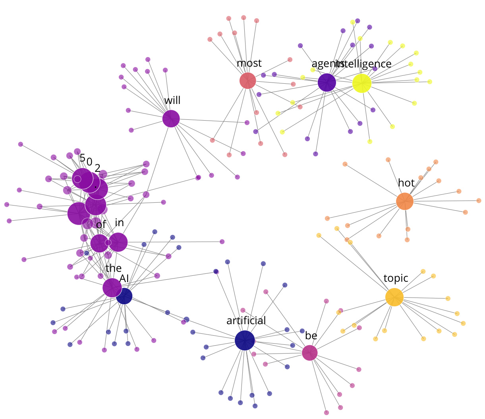

**图10**：句子"_AI agents will be the most hot topic of artificial intelligence in 2025._"的嵌入图谱可视化（_原图可以交互访问_）

实际上，您可以在文章开头的综合示例中看到`50`个词元及其最邻近词元的完整映射关系。

在之前的图示示例中，我们忽略了'词元变体'现象。一个词元或单词可能包含多种变体形式，每种变体都有独立的嵌入表示。例如，词元'`list`'可能存在多个变体形式，如'`_list`'、'`List`'等，这些变体通常都拥有与原始词元高度相似的嵌入向量。下图展示了词元'`list`'及其邻近词元的分布关系，包括其各种变体形式。

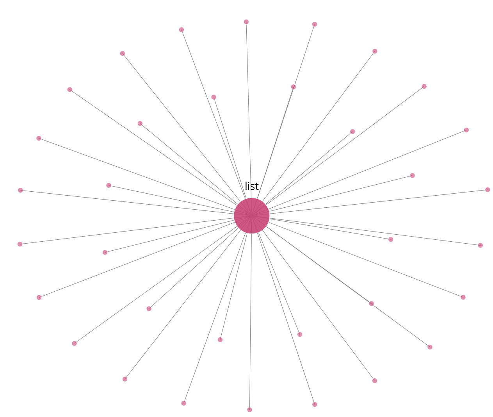

**图11**：单词'list'及其最邻近词元（包含变体形式）的向量空间分布示意图（_原图可以交互访问_）

## 总结与展望

> 本文的视觉化模板灵感来源于`distill.pub`[平台](https://distill.pub/)，如果您希望在自己的博客文章中使用该模板，可以访问此[链接](https://huggingface.co/spaces/lvwerra/distill-blog-template)获取模板资源。

**嵌入表示**始终是自然语言处理与现代大语言模型的基础核心组件。尽管机器学习和`LLM`领域每天都有新方法与技术涌现，但在大语言模型中，嵌入技术却保持着惊人的稳定性（这或许暗示了其本质重要性）。它们既具备理论上的直观可解释性，又拥有工程实践中的易用性，这些特质使其在语言模型中持续发挥着不可替代的作用。

在本篇博文中，我们深入探讨了嵌入技术的基础知识，以及其从传统统计方法到当代大语言模型应用场景的演变历程。希望本文能为您提供一个全面的入门指南，帮助您直观理解词嵌入及其表征内涵。

感谢您阅读本文。若觉此文有所助益，欢迎在`X`和`Hugging Face`平台关注我的账号，以便及时获取未来项目动态。

> X: `https://x.com/Hesamation`  
> Hugging Face: `https://huggingface.co/hesamation`

如有任何疑问或反馈建议，欢迎随时在[社区论坛](https://huggingface.co/spaces/hesamation/primer-llm-embedding/discussions)留言交流。

## 引用说明

如需在学术场景中引用本文，请使用如下格式：

**BibTeX引用格式**:

```text
@misc{llm_embeddings_explained, title = {LLM Embeddings Explained: A Visual and Intuitive Guide}, author={Hesam Sheikh Hessani}, year = {2025} , }
```

## 参考文献

1. [**自然语言处理中的词嵌入技术全面指南**](https://medium.com/@harsh.vardhan7695/a-comprehensive-guide-to-word-embeddings-in-nlp-ee3f9e4663ed)  Vardhan, H., 2024. Medium平台.
2. [**自然语言处理中的词嵌入指南**](https://www.turing.com/kb/guide-on-word-embeddings-in-nlp) 图灵,, 2022.
3. [**向量空间中词表示的有效估计方法**](http://arxiv.org/pdf/1301.3781.pdf) Mikolov, T., Chen, K., Corrado, G. 和 Dean, J., 2013. arXiv.org.
4. [**文本数据的深度学习实现方法与特征工程：连续词袋模型（CBOW）**](https://www.kdnuggets.com/2018/04/implementing-deep-learning-methods-feature-engineering-text-data-cbow.html) Sarkar, D.. KDnuggets.
5. [**词向量模型**](https://code.google.com/archive/p/word2vec/) . Google Code Archive.
6. [**BERT神经网络详解！**](https://www.youtube.com/watch?v=xI0HHN5XKDo) CodeEmporium,, 2020. YouTube.
7. [**BERT：面向语言理解的深度双向Transformer预训练**](http://arxiv.org/pdf/1810.04805.pdf) Devlin, J., Chang, M., Lee, K. 和 Toutanova, K., 2018. arXiv.
8. [**构建大型语言模型（从零开始）**](https://www.manning.com/books/build-a-large-language-model-from-scratch) . Manning Publications.
9. **从零开始实现大语言模型** Rasbt，GitHub
10. **嵌入表示** Chrishayuk，GitHub
