# 深入了解文本嵌入技术

> - 作者：`Mariya Mansurova`
> - 原文：`https://towardsdatascience.com/text-embeddings-comprehensive-guide-afd97fce8fb5/`

!`由 DALL-E 3 创建的图像` ⚠️ (原文链接)

作为人类，我们可以阅读和理解文本（至少是其中的一部分）。 计算机则相反，"以数字思考"，因此它们无法自动理解单词和句子的含义。 如果我们希望计算机理解自然语言，就需要将这些信息转换为计算机可以处理的格式——数字向量。

多年前，人们学会了如何将文本转换为机器可理解的格式（其中一个最早的版本是 [ASCII](https://en.wikipedia.org/wiki/ASCII) ）。这种方法有助于呈现和传输文本，但并没有编码单词的含义。 那时，标准的搜索技术是关键词搜索，即你只是寻找包含特定单词或 N-gram 的所有文档。

然后，经过几十年的发展，嵌入技术逐渐出现。 我们可以为单词、句子甚至图像计算嵌入。 嵌入也是数字的向量，但它们可以捕捉到意义。 因此，你可以使用它们进行语义搜索，甚至处理不同语言的文档。

在本文中，我想深入探讨嵌入技术主题，并讨论所有细节：

- 嵌入技术之前的背景以及它们是如何演变的，
- 如何使用 `OpenAI` 工具计算嵌入，
- 如何定义句子之间的相似性，
- 如何可视化嵌入，
- 最令人兴奋的部分是你如何在实践中使用嵌入。

让我们继续前进，了解嵌入的演变。

## 1. 嵌入技术的演变

我们将从简要回顾文本表示的历史开始我们的旅程。

### 1.1 词袋模型（Bag of Words）

将文本转换为向量的最基本方法是词袋模型。 让我们来看一下***理查德·P·费曼***的一句著名名言*"我们很幸运生活在一个仍在进行发现的时代".* 我们将用它来说明词袋模型的方法。

获取词袋向量的第一步是将文本拆分为单词（标记），然后将单词还原为它们的基本形式。 例如，_“running”_ 将转变为 _“run”_。 这个过程称为词干提取。 我们可以使用 `NLTK Python` 包来实现这一点。

```python
from nltk.stem import SnowballStemmer
from nltk.tokenize import word_tokenize

text = 'We are lucky to live in an age in which we are still making discoveries'

# 分词 - 将文本拆分为单词
words = word_tokenize(text)
print(words)
# ['我们', '很', '幸运', '能', '生活', '在', '一个', '时代', '中', '在',
#  '我们', '仍然', '在', '进行', '发现']

stemmer = SnowballStemmer(language = "english")
stemmed_words = list(map(lambda x: stemmer.stem(x), words))
print(stemmed_words)
# ['我们', '很', '幸运', '能', '生活', '在', '一个', '时代', '中', '在',
#  '我们', '仍然', '在', '进行', '发现']
```

现在，我们有了所有单词的基本形式列表。 下一步是计算它们的频率以创建一个向量。

```python
import collections
bag_of_words = collections.Counter(stemmed_words)
print(bag_of_words)
# {'我们': 2, '在': 2, '运气': 2, '中': 1, '生活': 1,
# '一个': 1, '时代': 1, '我们': 1, '仍然': 1, '可以': 1, '发现': 1}
```

实际上，如果我们想将文本转换为向量，我们不仅需要考虑文本中的单词，还需要考虑整个词汇表。 假设我们的词汇中还有 _我_、_你_ 和 _学习_，让我们从费曼的名言中创建一个向量。

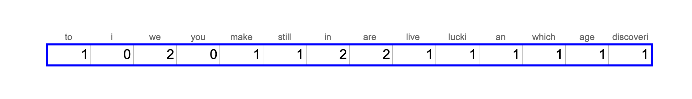

这种方法相当基础，它没有考虑单词的语义含义，因此句子 _这个女孩正在学习[数据科学](https://towardsdatascience.com/tag/data-science/)_ 和 _这个年轻女性正在学习人工智能和机器学习_ 不会彼此接近。

### 1.2 TF-IDF

一种稍微改进的词袋模型方法是 **[TF-IDF](https://en.wikipedia.org/wiki/Tf%E2%80%93idf)** (_词频 – 逆文档频率_)。它是两个指标的乘积。


- **词频** 显示了单词在文档中的频率。 计算它的最常见方法是将该文档中术语的原始计数（如词袋模型中）除以文档中的总词数。 然而，还有许多其他方法，比如仅使用原始计数、布尔 "频率" 和不同的归一化方法。 您可以在 [维基百科](https://en.wikipedia.org/wiki/Tf%E2%80%93idf) 上了解更多不同的方法。


- **逆文档频率** 表示单词提供的信息量。 例如，单词 _a_ 或 _that_ 并没有为文档的主题提供任何额外的信息。 相比之下，像 _ChatGPT_ 或 _生物信息学_ 这样的词可以帮助你定义领域（但不适用于这个句子）。 它的计算方式是文档总数与包含该词的文档数之比的对数。 IDF 越接近 0，表示该词越常见，提供的信息就越少。


因此，最终我们将得到向量，其中常见词（如 _我_ 或 _你_）的权重较低，而在文档中多次出现的稀有词的权重则较高。 这种策略会带来稍微更好的结果，但仍然无法捕捉语义含义。

这种方法的另一个挑战是它产生的向量相当稀疏。 向量的长度等于语料库的大小。 英语中大约有 470K 个独特的单词 ([source](https://en.wikipedia.org/wiki/List_of_dictionaries_by_number_of_words) )，因此我们将拥有巨大的向量。 由于句子中不会有超过 50 个独特的单词，因此向量中 99.99%的值将为 0，未编码任何信息。 看到这一点，科学家们开始考虑稠密向量表示。

### 1.3 word2vec

最著名的稠密表示方法之一是 `word2vec`，由谷歌在 2013 年提出，论文为["高效估计向量空间中的词表示"](https://arxiv.org/abs/1301.3781) ，作者为米科洛夫等人。

论文中提到的两种不同的 `word2vec` 方法是：连续词袋模型（当我们根据周围的词预测单词时）和跳字模型（相反的任务——当我们根据单词预测上下文时）。

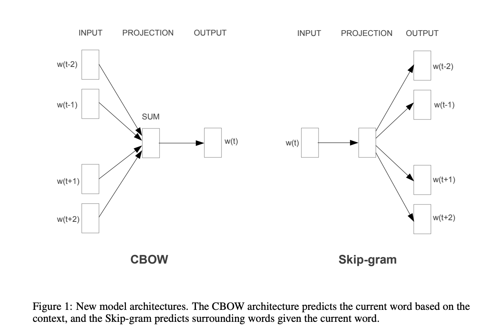

来自米科洛夫等人 2013 年的论文中的图 | [来源](https://arxiv.org/pdf/1301.3781.pdf)

稠密向量表示的高层次思想是训练两个模型：编码器和解码器。 例如，在跳字模型的情况下，我们可能会将单词 _christmas_ 传递给编码器。 然后，编码器将生成一个向量，我们将其传递给解码器，期望得到单词 _merry_、_to_ 和 _you_。

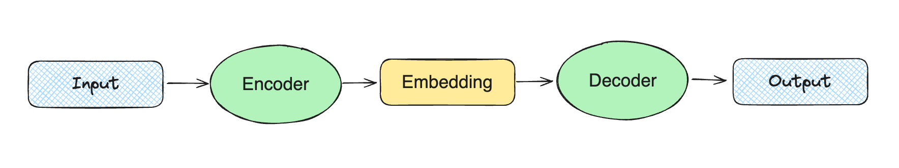

该模型开始考虑单词的意义，因为它是基于单词的上下文进行训练的。 然而，它忽略了形态学（我们可以从单词部分获得的信息，例如，_\-less_ 意味着缺乏某物）。 这个缺点后来通过查看[GloVe](https://www-nlp.stanford.edu/pubs/glove.pdf) 中的子词跳字模型得到了改善。

此外，`word2vec` 只能处理单词，但我们希望能够编码整个句子。 所以，让我们继续迈向变换器的下一个进化步骤。

### 1.4 变换器和句子嵌入

下一个进化与 `Vaswani` 等人在["Attention Is All You Need"](https://arxiv.org/abs/1706.03762) 论文中介绍的变换器方法有关。变换器能够生成信息丰富的密集向量，并成为现代语言模型的主导技术。

我不会详细介绍变换器的架构，因为这与我们的主题关系不大，并且会占用很多时间。 如果你有兴趣了解更多，有很多关于变换器的资料，例如["变换器解析"](https://daleonai.com/transformers-explained) 或["插图变换器"](https://jalammar.github.io/illustrated-transformer/) 。

变换器允许你使用相同的"核心"模型，并针对不同的用例进行微调，而无需重新训练核心模型（这需要大量时间且成本相当高）。 这导致了预训练模型的兴起。 第一个流行的模型之一是谷歌人工智能推出的 `BERT`（双向编码器表示变换器）。

在内部，`BERT` 仍然在与 `word2vec` 类似的标记级别上操作，但我们仍然希望获得句子嵌入。 因此，简单的方法可能是对所有标记的向量取平均。 不幸的是，这种方法的表现并不好。

这个问题在 `2019` 年得到了解决，当时[Sentence-BERT](https://arxiv.org/abs/1908.10084) 发布。 它在语义文本相似性任务上超越了所有之前的方法，并允许计算句子嵌入。

这是一个庞大的主题，因此我们无法在[这篇文章](https://www.pinecone.io/learn/series/nlp/sentence-embeddings/) 中涵盖所有内容。所以，如果你真的感兴趣，可以在这篇文章中了解更多关于句子嵌入的内容。

我们已经简要介绍了嵌入的演变，并对理论有了高层次的理解。 现在，是时候进入实践，学习如何使用 `OpenAI` 工具计算嵌入了。

## 2. 计算嵌入

在本文中，我们将使用 `OpenAI` 嵌入。 我们将尝试一个新的模型 `text-embedding-3-small`，该模型最近刚刚[发布](https://openai.com/blog/new-embedding-models-and-api-updates) 。 新模型的性能相比于 `text-embedding-ada-002` 有所提升：

- 在一个广泛使用的多语言检索基准（MIRACL ）上的平均得分从 `31.4%` 上升到 `44.0%`。
- 在一个常用的英语任务基准（MTEB ）上的平均表现也有所改善，从 `61.0%` 上升到 `62.3%`。

`OpenAI` 还发布了一个新的更大模型 `text-embedding-3-large`。 现在，它是他们表现最好的嵌入模型。

作为数据来源，我们将使用一小部分 [Stack Exchange 数据转储](https://archive.org/details/stackexchange) – 这是一个匿名的用户贡献内容的转储，涵盖了 [Stack Exchange 网络](https://stackexchange.com/) 上的所有内容。我选择了一些我觉得有趣的话题，并从每个话题中抽取了 100 个问题。 主题范围从生成性人工智能到咖啡或自行车，因此我们将看到相当广泛的主题。

首先，我们需要为所有的 Stack Exchange 问题计算嵌入。 值得做一次并将结果存储在本地（在文件或向量存储中）。 我们可以使用 OpenAI Python 包生成嵌入。

```python
from openai import OpenAI
client = OpenAI()

def get_embedding(text, model="text-embedding-3-small"):
   text = text.replace("n", " ")
   return client.embeddings.create(input = [text], model=model)
       .data[0].embedding

get_embedding("We are lucky to live in an age in which we are still making discoveries.")
```

结果是我们得到了一个 1536 维的浮点数向量。 我们现在可以对所有数据重复这个过程，并开始分析这些值。

你可能会问的主要问题是句子之间的意义有多接近。 为了揭示答案，让我们讨论向量之间距离的概念。

## 3. 向量之间的距离

嵌入实际上是向量。 因此，如果我们想了解两个句子之间的接近程度，我们可以计算向量之间的距离。 较小的距离相当于更接近的语义意义。

可以使用不同的度量来测量两个向量之间的距离：

- **欧几里得距离** (L2)，
- **曼哈顿距离** (L1)，
- **点积**，
- **余弦距离**。

让我们讨论一下它们。 作为一个简单的例子，我们将使用两个二维向量。

```python
    vector1 = [1, 4]
    vector2 = [2, 2]
```

### 3.1 欧几里得距离 (L2)

定义两个点（或向量）之间距离的最标准方法是欧几里得距离或 L2 范数。 这个度量在日常生活中最常用，例如，当我们谈论两个城镇之间的距离时。

这里是 L2 距离的视觉表示和公式。

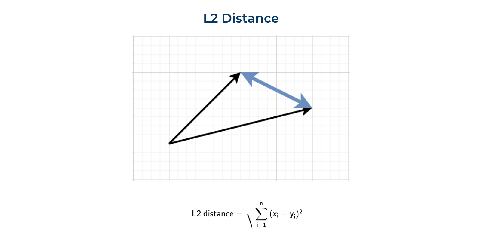

我们可以使用原生 Python 或利用 numpy 函数来计算这个度量。

```python
import numpy as np

sum(list(map(lambda x, y: (x - y) ** 2, vector1, vector2))) ** 0.5
# 2.2361

np.linalg.norm((np.array(vector1) - np.array(vector2)), ord = 2)
# 2.2361
```

### 3.2 曼哈顿距离 (L1)

另一个常用的距离是 L1 范数或曼哈顿距离。 这个距离是以曼哈顿岛（纽约）命名的。这个岛有一个网格布局的街道，曼哈顿中两个点之间的最短路线将是 L1 距离，因为你需要沿着网格行驶。

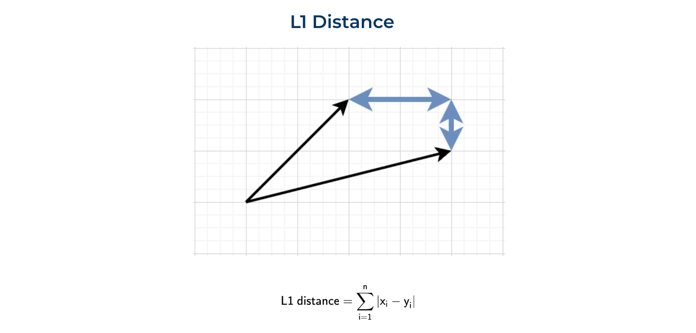

我们也可以从头开始实现它，或者使用 numpy 函数。

```python
sum(list(map(lambda x, y: abs(x - y), vector1, vector2)))
# 3

np.linalg.norm((np.array(vector1) - np.array(vector2)), ord = 1)
# 3.0
```

### 3.3 点积

另一种看待向量之间距离的方法是计算点积或标量积。 这里有一个公式，我们可以很容易地实现它。


```python
sum(list(map(lambda x, y: x*y, vector1, vector2)))
# 11

np.dot(vector1, vector2)
# 11
```

这个度量有点难以解释。 一方面，它告诉你向量是否指向同一个方向。 另一方面，结果高度依赖于向量的大小。 例如，让我们计算两个向量对之间的点积：

- `(1, 1)` 对 `(1, 1)`
- `(1, 1)` 对 `(10, 10)`。

在这两种情况下，向量是共线的，但第二种情况的点积大十倍：`2` 对 `20`。

### 3.4 余弦相似度

余弦相似度常常被使用。 余弦相似度是点积除以向量的大小（或范数）。

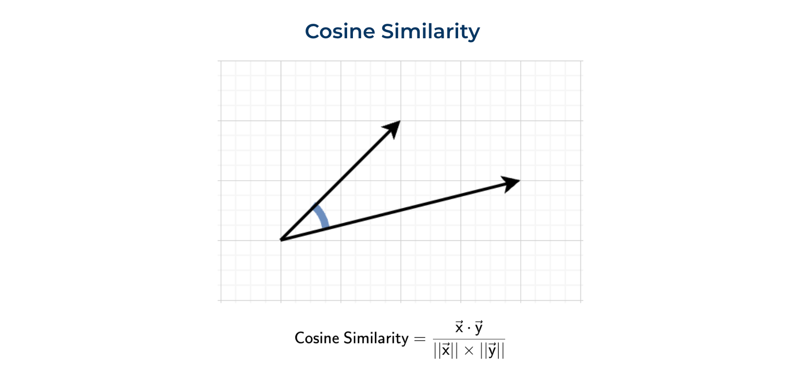

我们可以像之前那样自己计算所有内容，或者使用 sklearn 的函数。

```python
dot_product = sum(list(map(lambda x, y: x*y, vector1, vector2)))
norm_vector1 = sum(list(map(lambda x: x ** 2, vector1))) ** 0.5
norm_vector2 = sum(list(map(lambda x: x ** 2, vector2))) ** 0.5

dot_product/norm_vector1/norm_vector2

# 0.8575

from sklearn.metrics.pairwise import cosine_similarity

cosine_similarity(
  np.array(vector1).reshape(1, -1),
  np.array(vector2).reshape(1, -1))[0][0]

# 0.8575
```

函数 `cosine_similarity` 期望 `2D` 数组。 这就是为什么我们需要重塑 `numpy` 数组。

让我们稍微谈谈这个指标的物理意义。 余弦相似度等于两个向量之间的余弦。 向量越接近，指标值越高。

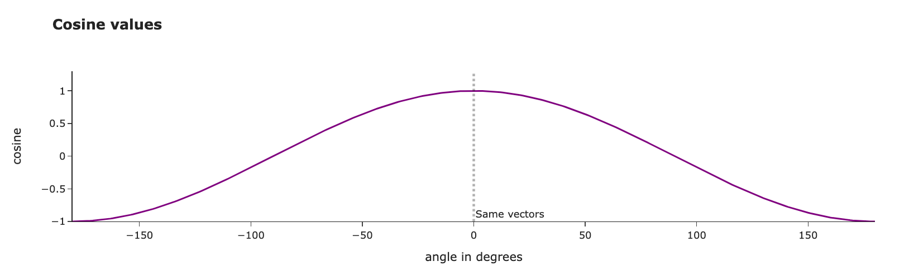

我们甚至可以计算出我们向量之间的确切角度（以度为单位）。 我们得到的结果大约是 `30 度`，看起来相当合理。

```python
import math
math.degrees(math.acos(0.8575))

# 30.96
```

### 3.5 使用什么度量？

我们讨论了不同的计算两个向量之间距离的方法，你可能会开始考虑使用哪一种。

你可以使用任何距离来比较你拥有的嵌入。 例如，我计算了不同簇之间的平均距离。 L2 距离和余弦相似度都给我们展示了相似的图景：

- 簇内的对象彼此之间比与其他簇的对象更接近。 解释我们的结果有点棘手，因为对于 L2 距离，距离越近意味着距离越小，而对于余弦相似度——度量越高表示对象越接近。不要搞混了。
- 我们可以发现一些主题彼此非常接近，例如，_政治_ 和 _经济学_ 或 _人工智能_ 和 _数据科学_。

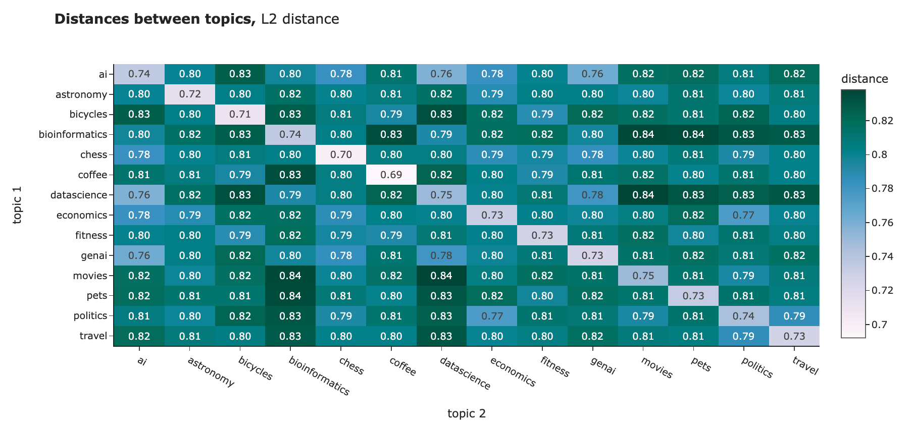

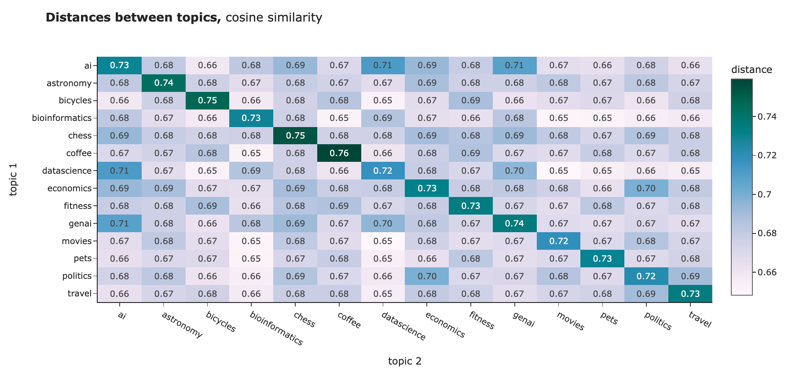

然而，对于[NLP](https://towardsdatascience.com/tag/nlp/ "NLP") 任务，最佳实践通常是使用余弦相似度。其背后的原因有：

- 余弦相似度的范围在 `-1` 到 `1` 之间，而 `L1` 和 `L2` 是无界的，因此更容易解释。
- 从实际角度来看，计算点积比计算欧几里得距离的平方根更有效。
- 余弦相似度受到维度诅咒的影响较小（我们稍后会讨论这个问题）。

> `OpenAI` 的嵌入已经进行了归一化，因此在这种情况下，点积和余弦相似度是相等的。

你可能会在上面的结果中发现，簇间距离和簇内距离之间的差异并不大。根本原因是我们向量的高维度。 这个效应被称为"维度诅咒": 维度越高，向量之间距离的分布越窄。 您可以在[这篇文章](https://towardsai.net/p/l/why-should-euclidean-distance-not-be-the-default-distance-measure) 中了解更多细节。

我想简要展示一下它是如何工作的，以便您获得一些直觉。 我计算了 OpenAI 嵌入值的分布，并生成了 300 个具有不同维度的向量集。 然后，我计算了所有向量之间的距离并绘制了直方图。 您可以很容易地看到，向量维度的增加使得分布变得更窄。

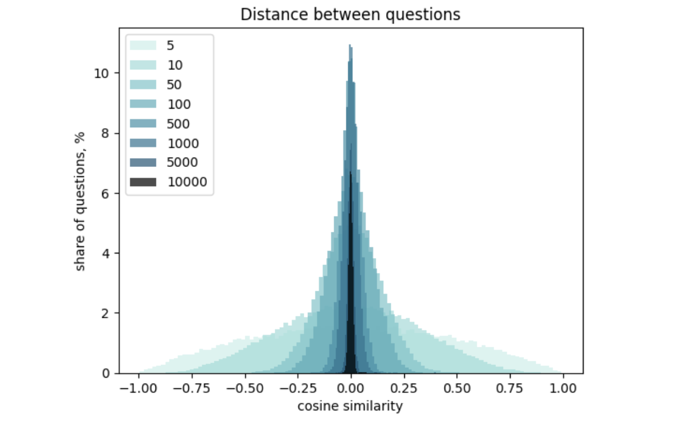

我们已经学会了如何测量嵌入之间的相似性。 至此，我们完成了理论部分，接下来将进入更实用的部分（可视化和实际应用）。 让我们从可视化开始，因为首先看到数据总是更好的。

## 4. 可视化嵌入

理解数据的最佳方式是将其可视化。不幸的是，嵌入有 `1536` 个维度，因此查看数据相当具有挑战性。 然而，有一种方法：我们可以使用降维技术将向量投影到二维空间。

### 4.1 主成分分析

最基本的降维技术是 [主成分分析](https://en.wikipedia.org/wiki/Principal_component_analysis) (PCA) 。让我们尝试使用它。

首先，我们需要将嵌入转换为一个二维的 numpy 数组，以便传递给 sklearn。

```python
import numpy as np
embeddings_array = np.array(df.embedding.values.tolist())
print(embeddings_array.shape)
# (1400, 1536)
```

然后，我们需要初始化一个 PCA 模型，设置 `n_components = 2`（因为我们想创建一个二维可视化），在整个数据上训练模型并预测新值。

```python
from sklearn.decomposition import PCA

pca_model = PCA(n_components = 2)
pca_model.fit(embeddings_array)

pca_embeddings_values = pca_model.transform(embeddings_array)
print(pca_embeddings_values.shape)
# (1400, 2)
```

结果，我们得到了一个仅包含两个特征的矩阵，因此我们可以很容易地在散点图上进行可视化。

```python
fig = px.scatter(
    x = pca_embeddings_values[:,0],
    y = pca_embeddings_values[:,1],
    color = df.topic.values,
    hover_name = df.full_text.values,
    title = 'PCA embeddings', width = 800, height = 600,
    color_discrete_sequence = plotly.colors.qualitative.Alphabet_r
)

fig.update_layout(
    xaxis_title = 'first component',
    yaxis_title = 'second component')
fig.show()
```

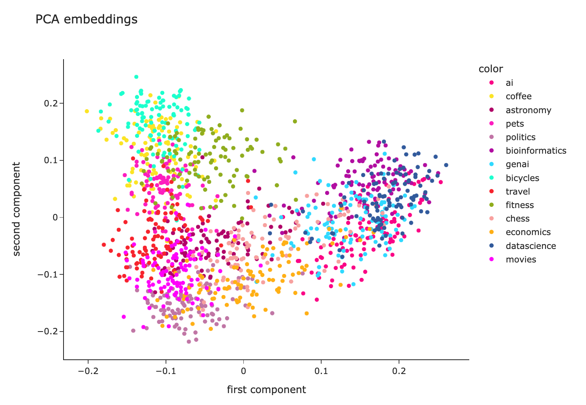

我们可以看到每个主题的问题彼此非常接近，这很好。 然而，所有的簇都是混合在一起的，因此还有改进的空间。

### 4.2 t-SNE

主成分分析是一种线性算法，而大多数关系在现实生活中是非线性的。 因此，由于非线性，我们可能无法分离这些簇。 让我们尝试使用一种非线性算法 [t-SNE](https://en.wikipedia.org/wiki/T-distributed_stochastic_neighbor_embedding) ，看看它是否能够显示更好的结果。

代码几乎是相同的。我只是使用了 t-SNE 模型而不是主成分分析。

```python
    from sklearn.manifold import TSNE
    tsne_model = TSNE(n_components=2, random_state=42)
    tsne_embeddings_values = tsne_model.fit_transform(embeddings_array)

    fig = px.scatter(
        x = tsne_embeddings_values[:,0],
        y = tsne_embeddings_values[:,1],
        color = df.topic.values,
        hover_name = df.full_text.values,
        title = 't-SNE embeddings', width = 800, height = 600,
        color_discrete_sequence = plotly.colors.qualitative.Alphabet_r
    )

    fig.update_layout(
        xaxis_title = 'first component',
        yaxis_title = 'second component')
    fig.show()
```

t-SNE 的结果看起来好得多。 大多数簇都被分开了，除了 _生成式人工智能_、_数据科学_ 和 _人工智能_。不过，这也是可以预料的——我怀疑我自己能否分开这些主题。

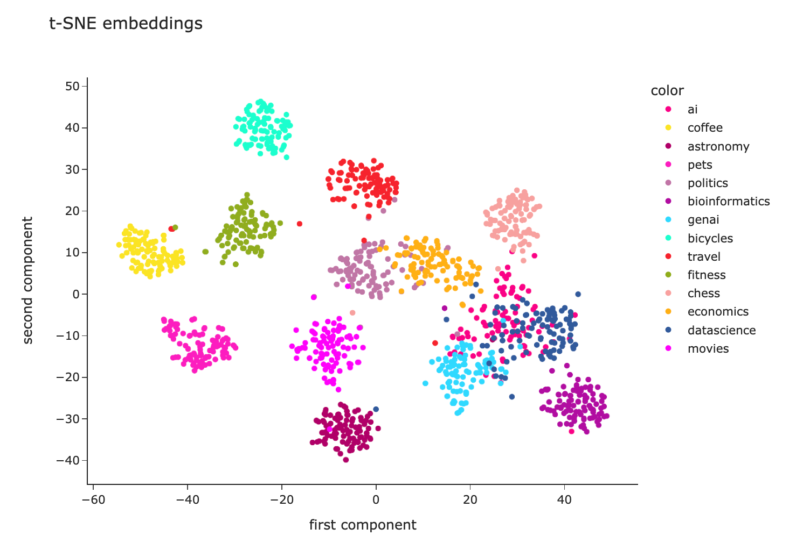

通过这个可视化，我们可以看到嵌入在编码语义意义方面表现得相当不错。

此外，你可以将其投影到三维空间并进行可视化。我不确定这是否实用，但在三维中玩弄数据可能会很有启发性和吸引力。

```python
tsne_model_3d = TSNE(n_components=3, random_state=42)
tsne_3d_embeddings_values = tsne_model_3d.fit_transform(embeddings_array)

fig = px.scatter_3d(
    x = tsne_3d_embeddings_values[:,0],
    y = tsne_3d_embeddings_values[:,1],
    z = tsne_3d_embeddings_values[:,2],
    color = df.topic.values,
    hover_name = df.full_text.values,
    title = 't-SNE embeddings', width = 800, height = 600,
    color_discrete_sequence = plotly.colors.qualitative.Alphabet_r,
    opacity = 0.7
)
fig.update_layout(xaxis_title = 'first component', yaxis_title = 'second component')
fig.show()
```

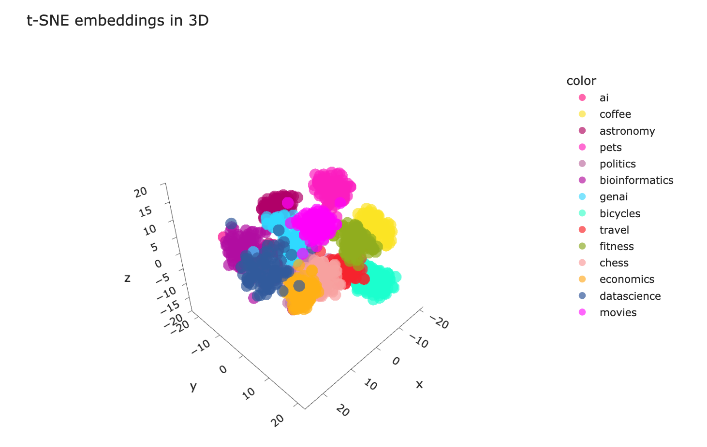

### 4.3 条形码

理解嵌入的方式是将它们可视化为条形码，并查看它们之间的相关性。 我挑选了三个嵌入的例子：两个彼此最接近，另一个是我们数据集中最远的例子。

```python
embedding1 = df.loc[1].embedding
embedding2 = df.loc[616].embedding
embedding3 = df.loc[749].embedding

import seaborn as sns
import matplotlib.pyplot as plt
embed_len_thr = 1536

sns.heatmap(np.array(embedding1[:embed_len_thr]).reshape(-1, embed_len_thr),
    cmap = "Greys", center = 0, square = False,
    xticklabels = False, cbar = False)
plt.gcf().set_size_inches(15,1)
plt.yticks([0.5], labels = ['AI'])
plt.show()

sns.heatmap(np.array(embedding3[:embed_len_thr]).reshape(-1, embed_len_thr),
    cmap = "Greys", center = 0, square = False,
    xticklabels = False, cbar = False)
plt.gcf().set_size_inches(15,1)
plt.yticks([0.5], labels = ['AI'])
plt.show()

sns.heatmap(np.array(embedding2[:embed_len_thr]).reshape(-1, embed_len_thr),
    cmap = "Greys", center = 0, square = False,
    xticklabels = False, cbar = False)
plt.gcf().set_size_inches(15,1)
plt.yticks([0.5], labels = ['Bioinformatics'])
plt.show()
```

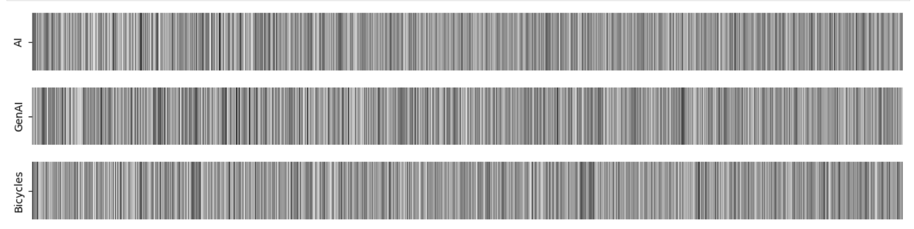

在我们的案例中，由于高维度，判断向量彼此是否接近并不容易。 然而，我仍然喜欢这个可视化。 在某些情况下，这可能会很有帮助，所以我与您分享这个想法。

我们已经学会了如何可视化嵌入，并且对它们理解文本含义的能力没有任何疑虑。 现在，是时候进入最有趣和迷人的部分，讨论如何在实践中利用嵌入。

## 5. 实际应用

当然，嵌入的主要目标并不是将文本编码为数字向量或仅仅为了可视化它们。我们可以从捕捉文本含义的能力中获益良多。 让我们来看一些更实际的例子。

### 5.1 聚类

让我们从聚类开始。 聚类是一种无监督学习技术，它允许您在没有任何初始标签的情况下将数据分成组。 聚类可以帮助您理解数据中的内部结构模式。

我们将使用最基本的聚类算法之一 – [K-means](https://scikit-learn.org/stable/modules/clustering.html#k-means) 。对于 K-means 算法，我们需要指定簇的数量。 我们可以使用 [轮廓系数](https://scikit-learn.org/stable/modules/generated/sklearn.metrics.silhouette_score.html) 来定义最佳的簇数量。

我们尝试在 `2` 到 `5`0 之间的 `k`（簇的数量）。 对于每个 `k`，我们将训练一个模型并计算轮廓系数。 轮廓系数越高，聚类效果越好。

```python
from sklearn.cluster import KMeans
from sklearn.metrics import silhouette_score
import tqdm

silhouette_scores = []
for k in tqdm.tqdm(range(2, 51)):
    kmeans = KMeans(n_clusters=k,
                    random_state=42,
                    n_init = 'auto').fit(embeddings_array)
    kmeans_labels = kmeans.labels_
    silhouette_scores.append(
        {
            'k': k,
            'silhouette_score': silhouette_score(embeddings_array,
                kmeans_labels, metric = 'cosine')
        }
    )

fig = px.line(pd.DataFrame(silhouette_scores).set_index('k'),
       title = '<b>Silhouette scores for K-means clustering</b>',
       labels = {'value': 'silhoutte score'},
       color_discrete_sequence = plotly.colors.qualitative.Alphabet)
fig.update_layout(showlegend = False)
```

在我们的案例中，当 `k = 11` 时，轮廓系数达到了最大值。 因此，我们将使用这个簇的数量作为我们最终模型的参数。

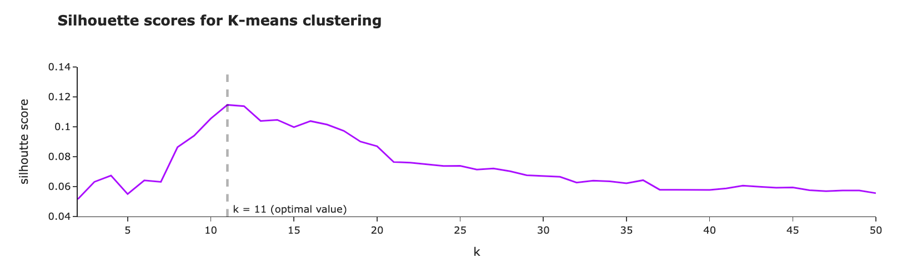

让我们使用 `t-SNE` 进行降维来可视化簇，就像我们之前做的那样。

```python
tsne_model = TSNE(n_components=2, random_state=42)
tsne_embeddings_values = tsne_model.fit_transform(embeddings_array)

fig = px.scatter(
    x = tsne_embeddings_values[:,0],
    y = tsne_embeddings_values[:,1],
    color = list(map(lambda x: 'cluster %s' % x, kmeans_labels)),
    hover_name = df.full_text.values,
    title = 't-SNE embeddings for clustering', width = 800, height = 600,
    color_discrete_sequence = plotly.colors.qualitative.Alphabet_r
)
fig.update_layout(
    xaxis_title = 'first component',
    yaxis_title = 'second component')
fig.show()
```

从视觉上看，我们可以看到算法能够很好地定义簇——它们分隔得相当好。

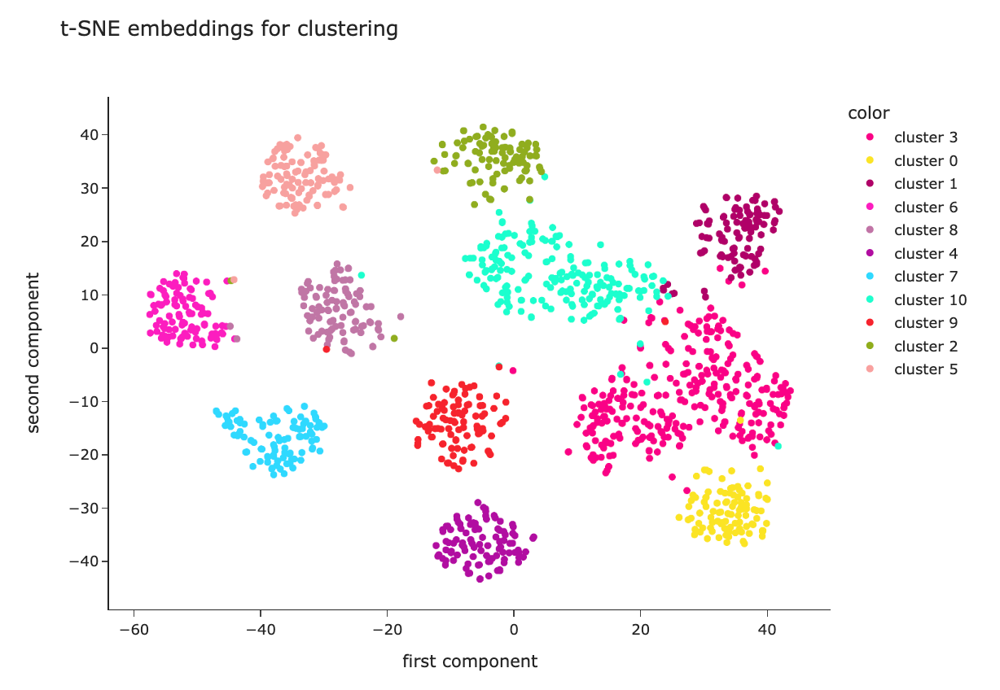

我们有实际的主题标签，因此我们甚至可以评估聚类的好坏。让我们看看每个簇的主题混合。

```python
df['cluster'] = list(map(lambda x: 'cluster %s' % x, kmeans_labels))
cluster_stats_df = df.reset_index().pivot_table(
    index = 'cluster', values = 'id',
    aggfunc = 'count', columns = 'topic').fillna(0).applymap(int)

cluster_stats_df = cluster_stats_df.apply(
  lambda x: 100*x/cluster_stats_df.sum(axis = 1))

fig = px.imshow(
    cluster_stats_df.values,
    x = cluster_stats_df.columns,
    y = cluster_stats_df.index,
    text_auto = '.2f', aspect = "auto",
    labels=dict(x="cluster", y="fact topic", color="share, %"),
    color_continuous_scale='pubugn',
    title = '<b>Share of topics in each cluster</b>', height = 550)

fig.show()
```

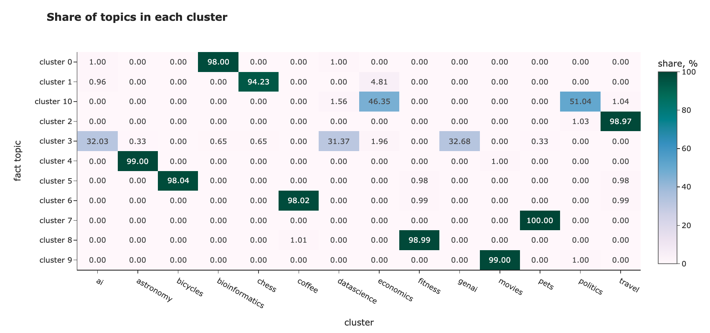

在大多数情况下，聚类效果很好。 例如，聚类 `5` 几乎只包含关于自行车的问题，而聚类 `6` 则是关于咖啡的。 然而，它无法区分相近的主题：

- _人工智能_、_生成性人工智能_ 和 _数据科学_ 都在一个聚类中，
- 与 _经济学_ 和 _政治_ 在同一个聚类中。

在这个例子中，我们仅使用嵌入作为特征，但如果您有任何额外的信息（例如，提问者的年龄、性别或国家），您也可以将其包含在模型中。

### 5.2 分类

我们可以使用嵌入进行分类或回归任务。 例如，您可以用它来预测客户评论的情感（分类）或 `NPS` 分数（回归）。

由于分类和回归是监督学习，您需要有标签。 幸运的是，我们知道问题的主题，可以拟合一个模型来预测它们。

我将使用随机森林分类器。如果您需要快速回顾随机森林的内容，可以在 [这里](https://medium.com/towards-data-science/interpreting-random-forests-638bca8b49ea) 找到。为了正确评估分类模型的性能，我们将把数据集分为训练集和测试集（80% 对 20%）。 然后，我们可以在训练集上训练我们的模型，并在测试集上测量质量（模型未见过的问题）。

```python
from sklearn.ensemble import RandomForestClassifier
from sklearn.model_selection import train_test_split
class_model = RandomForestClassifier(max_depth = 10)

# 定义特征和目标
X = embeddings_array
y = df.topic

# 将数据分为训练集和测试集
X_train, X_test, y_train, y_test = train_test_split(
    X, y, random_state = 42, test_size=0.2, stratify=y
)

# 拟合与预测
class_model.fit(X_train, y_train)
y_pred = class_model.predict(X_test)
```

为了估计模型的性能，让我们计算一个混淆矩阵。 在理想情况下，所有非对角元素应该为 0。

```python
from sklearn.metrics import confusion_matrix
cm = confusion_matrix(y_test, y_pred)

fig = px.imshow(
  cm, x = class_model.classes_,
  y = class_model.classes_, text_auto='d',
  aspect="auto",
  labels=dict(
      x="predicted label", y="true label",
      color="cases"),
  color_continuous_scale='pubugn',
  title = '<b>Confusion matrix</b>', height = 550)

fig.show()
```

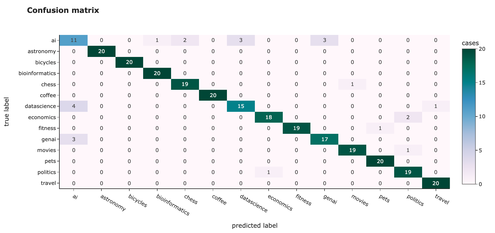

我们可以看到与聚类相似的结果：一些主题很容易分类，准确率为 `100%`，例如*"自行车"*或*"旅行"*，而其他一些则难以区分（尤其是*"人工智能"*）。

然而，我们达到了 `91.8%` 的整体准确率，这相当不错。

### 5.3 寻找异常

我们还可以使用嵌入来寻找数据中的异常。 例如，在 `t-SNE` 图中，我们看到一些问题远离它们的簇，例如*"旅行"*主题。 让我们看看这个主题，尝试寻找异常。 我们将使用 [孤立森林算法](https://scikit-learn.org/stable/modules/generated/sklearn.ensemble.IsolationForest.html) 来实现这一点。

```python
from sklearn.ensemble import IsolationForest

topic_df = df[df.topic == 'travel']
topic_embeddings_array = np.array(topic_df.embedding.values.tolist())

clf = IsolationForest(contamination = 0.03, random_state = 42)
topic_df['is_anomaly'] = clf.fit_predict(topic_embeddings_array)

topic_df[topic_df.is_anomaly == -1][['full_text']]
```

所以，我们在这里。我们找到了旅行主题中最不常见的评论 ([来源](https://travel.stackexchange.com/questions/150735/is-it-safe-to-drink-the-water-from-the-fountains-found-all-over-the-older-parts) )。

```text
Is it safe to drink the water from the fountains found all over
the older parts of Rome?

When I visited Rome and walked around the older sections, I saw many
different types of fountains that were constantly running with water.
Some went into the ground, some collected in basins, etc.

Is the water coming out of these fountains potable? Safe for visitors
to drink from? Any etiquette regarding their use that a visitor
should know about?
```

由于它谈论的是水，这条评论的嵌入与咖啡主题相近，因为人们也讨论用水冲泡咖啡。 因此，嵌入表示是相当合理的。

我们可以在我们的 `t-SNE` 可视化中找到它，并看到它实际上接近 _咖啡_ 聚类。

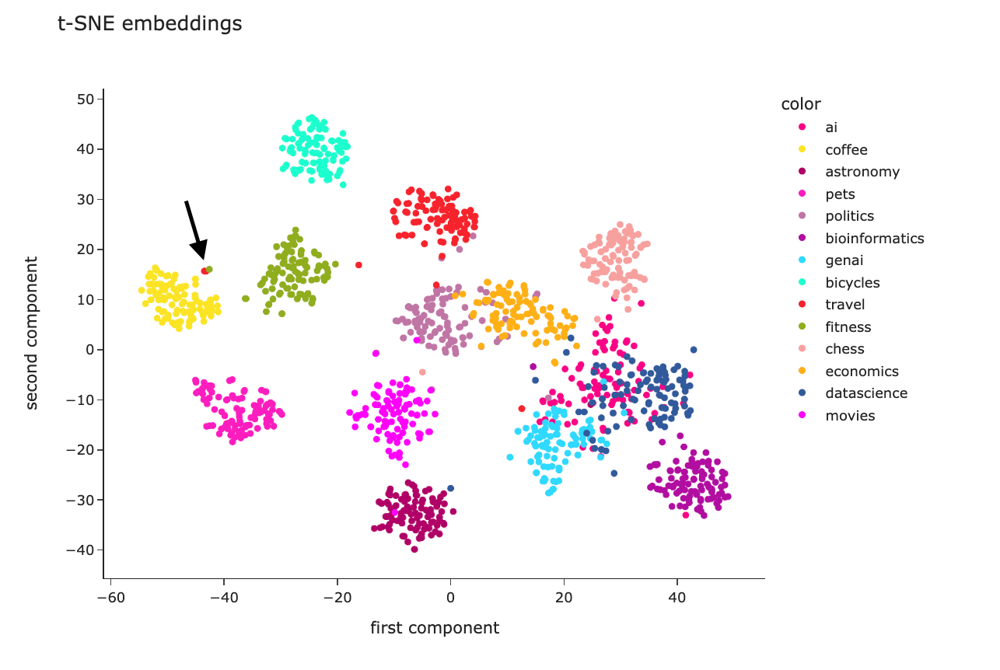

### 5.4 RAG – 检索增强生成

随着大型语言模型最近的流行，嵌入技术在 `RAG` 用例中得到了广泛应用。

当我们有大量文档（例如，来自 ·Stack Exchange· 的所有问题）时，我们需要检索增强生成，因为我们无法将它们全部传递给大型语言模型，因为

- 大型语言模型在上下文大小上有限制（目前，`GPT-4 Turbo` 的限制是 `128K`）。
- 我们为令牌付费，因此总是传递所有信息会更昂贵。
- 大型语言模型在更大的上下文中表现较差。 你可以查看 Needle In A Haystack – Pressure Testing LLMs 以了解更多细节。

为了能够处理广泛的知识库，我们可以利用 RAG 方法：

- 计算所有文档的嵌入并将其存储在向量存储中。
- 当我们收到用户请求时，我们可以计算其嵌入并从存储中检索与该请求相关的文档。
- 仅将相关文档传递给大型语言模型以获得最终答案。

要了解更多关于 RAG 的信息，请随时阅读我更详细的文章 [这里.](https://towardsdatascience.com/rag-how-to-talk-to-your-data-eaf5469b83b0)

## 6. 总结

在这篇文章中，我们详细讨论了文本嵌入技术。 希望现在你对这个主题有了全面而深入的理解。 以下是我们旅程的快速回顾：

- 首先，我们回顾了处理文本的方法的演变。
- 然后，我们讨论了如何理解文本之间是否具有相似的含义。
- 之后，我们看到了文本嵌入可视化的不同方法。
- 最后，我们尝试将嵌入用作聚类、分类、异常检测和 RAG 等不同实际任务中的特征。

> 非常感谢你阅读这篇文章。 如果你有任何后续问题或评论，请在评论区留言。

## 7. 参考文献

在这篇文章中，我使用了来自 [Stack Exchange 数据转储](https://archive.org/details/stackexchange) 的数据集，该数据集在 [知识共享许可证](https://creativecommons.org/licenses/by-sa/4.0/) 下提供。

本文的灵感来源于以下课程：

- "[理解和应用文本嵌入"](https://www.deeplearning.ai/short-courses/google-cloud-vertex-ai/) 由 DeepLearning.AI 与 Google Cloud 合作提供，
- ["向量数据库：从嵌入到应用"](https://learn.deeplearning.ai/vector-databases-embeddings-applications/lesson/1/introduction) 由 DeepLearning.AI 与 Weaviate 合作提供。
