# 量化技术可视化指南

> - 原文：`https://newsletter.maartengrootendorst.com/p/a-visual-guide-to-quantization`
> - 作者：`Maarten Grootendorst`

顾名思义，大型语言模型的规模通常过于庞大，难以在消费级硬件上运行。这类模型的参数量可达数十亿级别，通常需要配备大容量显存的 GPU 来加速推理过程。

为此，越来越多的研究聚焦于通过优化训练方式、引入适配器等技术缩小模型规模。其中一项关键技术便是***量化***。

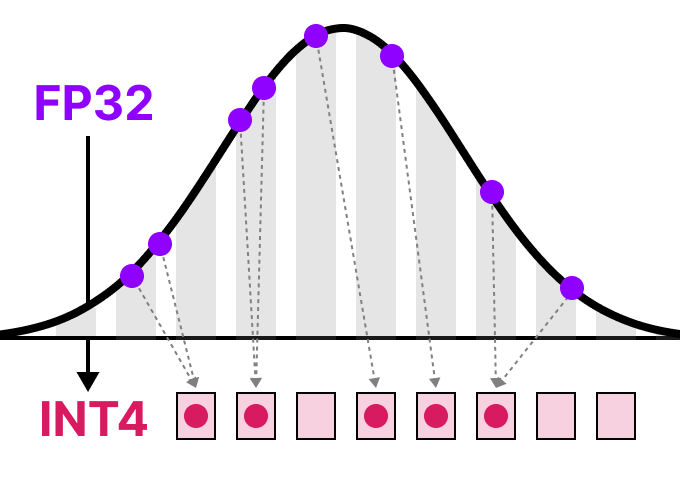

本文将以语言建模为背景，系统介绍量化技术领域，通过逐层剖析核心概念助您建立直观认知。我们将深入解析量化的各类方法、实际应用场景及其底层原理。

作为可视化指南，文中将包含大量图表辅助建立量化技术的直观理解！

如需查看更多与大语言模型相关的可视化内容并支持本专栏，请查看我撰写的《[动手学大语言模型](https://www.amazon.com/Hands-Large-Language-Models-Understanding/dp/1098150961)》一书！

_附言：如果您阅读了这本书，一个**简短的评价**将对我意义重大——这真的对我们作者很有帮助！_

---

## 1. LLM 的核心挑战

`LLM` 的名称源于其庞大的参数规模。当今主流模型通常包含数十亿参数（主要为***权重***），其存储开销极为昂贵。

在推理过程中，激活值由输入数据与权重相乘产生，其规模同样可能非常庞大。

因此，我们需要以最高效的方式表示数十亿个数值，最大限度减少存储特定值所需的空间占用。

让我们从基本原理出发，在探讨优化方法之前，先深入理解数值的原始表示方式。

### 1.1 数值表示方法

数值通常以浮点数（计算机科学中称为*floats*）形式表示，即带有小数点的正负实数。

这些数值通过「_比特位数_」（二进制数字）进行编码。[IEEE-754](https://en.wikipedia.org/wiki/IEEE_754) 标准定义了如何用比特位数构成三个功能组件来表示数值：_符号位_、*指数位*以及*小数位（或称尾数）*。

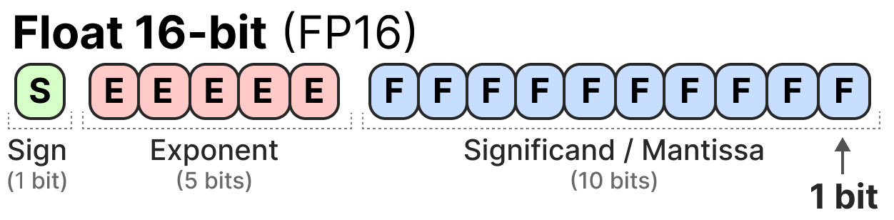

通过这三个组件的比特值组合，可计算出对应的具体数值：

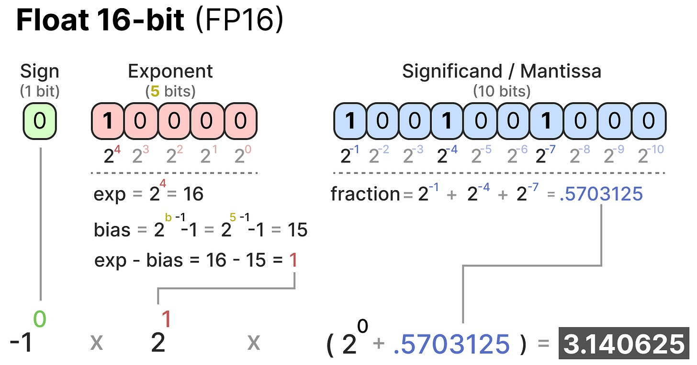

一般而言，分配的比特位数越多，数值表示的精度就越高：

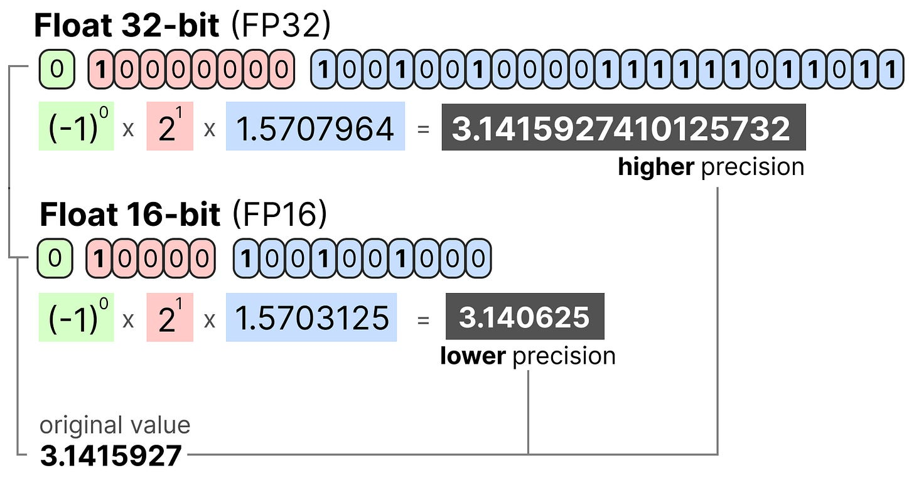

### 1.2 内存约束条件

可用的比特位数越多，所能表示的数值范围就越大。

特定表示方法所能容纳的数值区间称为*动态范围*，而相邻两个数值之间的间隔则称为*精度*。

这些比特位数具备一个实用特性：可精确计算设备存储给定数值所需的内存空间。鉴于 8 比特(bit)组成 1 字节(byte)，我们可以为大多数浮点表示方法建立基础计算公式。

> [!NOTE]
> 实际应用中，推理过程所需的(V)RAM 容量还需考虑其他因素，例如上下文长度和模型架构设计。

现在假设我们有一个包含 700 亿个参数的模型。大多数模型原生采用 32 位浮点数（常称为*全精度*）表示，仅加载模型就需要占用**280GB**内存空间。

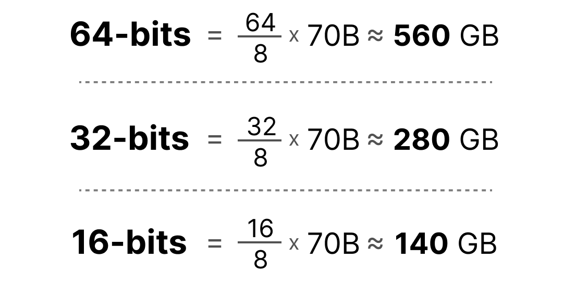

因此，尽可能减少表示模型参数所需的比特位数（在训练过程中也是如此！）变得极具必要性。然而，随着精度的降低，模型的准确性通常也会随之下降。

我们希望在减少数值表示所需比特位数的同时保持准确性……这正是*量化*技术的关键价值所在！

---

## 2. 量化技术导论

量化的核心目标是将模型参数从高位宽表示（如 32 位浮点数）转换为低位宽表示（如 8 位整数）。

当减少用于表示原始参数的比特位数时，通常会导致一定程度的精度损失（表现为粒度降低）。

为了直观演示这种效果，我们可以任取一张图像，仅使用 8 种色彩来呈现它：

> 本图片基于[Slava Sidorov](https://pixabay.com/users/slava_web-designer-39623293/?utm_source=link-attribution&utm_medium=referral&utm_campaign=image&utm_content=8668140) 的原作进行修改并适配。

注意放大后的区域相较于原图显得更‘粗糙’，这是因为我们使用了更少的颜色来进行表示。量化的核心目标是通过减少表征原始参数所需的比特位数（类比颜色数量），在最大限度保持参数原始精度的前提下实现高效存储

### 2.1 常用数据类型

首先，我们对比分析常规数据类型与 32 位（即*全精度*或*FP32*）表示方式的差异：

#### 2.1.1 FP16 浮点格式

以下展示从`32`位浮点格式（FP32）转换为`16`位浮点格式（即*半精度*或*FP16*）的实例：

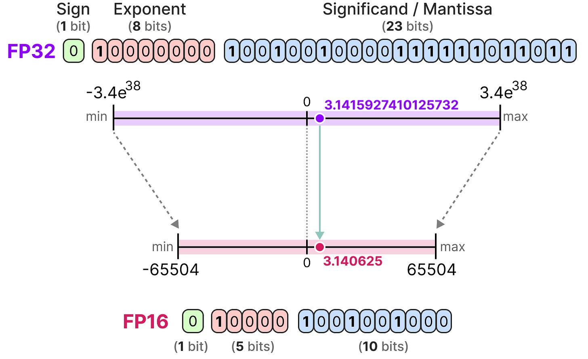

值得注意的是，FP16 的数值表示范围相较 FP32 存在显著缩减

#### 2.1.2 BF16

为实现与原始`FP32`相近的数值覆盖范围，研究者提出了*bfloat16*（BF16）这种“截断式 FP32”的浮点格式：

`BF16`虽然与`FP16`占用相同的存储空间（`16`位），但其数值表示范围更广，因此被广泛应用于深度学习领域。

#### 2.1.3 INT8

当我们将比特位数进一步降低时，便会进入基于整数的表示方法范畴，而不再使用浮点表示法。以`FP32`浮点格式转换为 8 比特的`INT8`为例，其比特位数将缩减至原始值的四分之一：

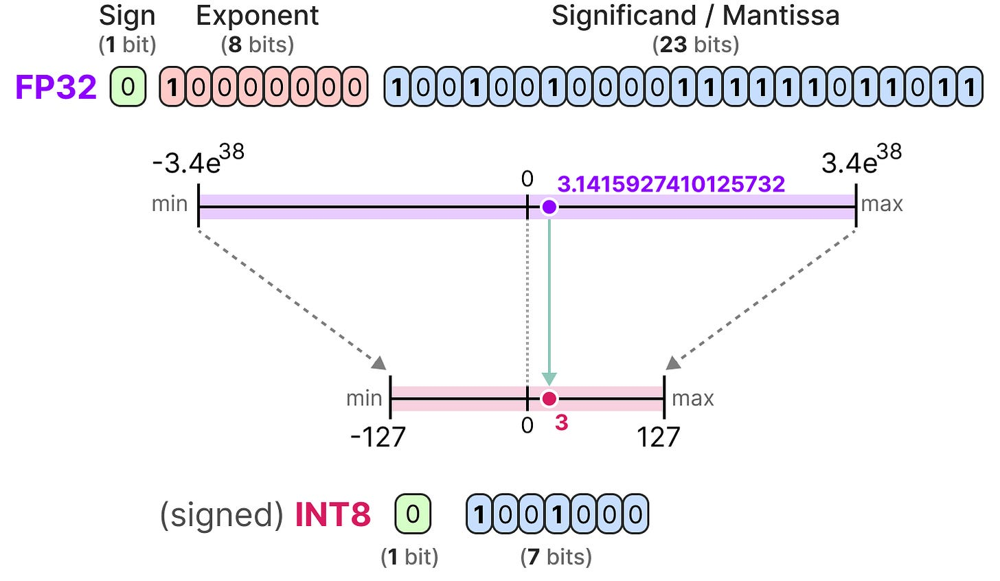

具体硬件条件下，基于整数的运算速度可能优于浮点运算，但这一优势并非绝对成立。然而，通常当使用较少比特位数时，计算速度会显著提升。

每减少一个比特位，都需要通过映射操作将初始的`FP32`浮点表示'压缩'到更低位宽中。

实际上，我们无需将完整的`FP32`范围[-3.4e38, 3.4e38]映射到`INT8`，只需找到将模型参数的实际数据范围适配到`INT8`的方法即可。

常见的压缩/映射方法包括*对称量化*和*非对称量化*，这些都属于*线性映射*的范畴。

接下来我们将具体分析这些从 FP32 到 INT8 的量化方法。

### 2.2 对称量化

对称量化的核心原理是将原始浮点数值范围对称地映射到以零为中心的量化空间。通过前文示例可以观察到，量化前后的数值分布始终保持着以零为中心的对称特性。

这种方法的显著特征是：浮点空间中的零值经过量化后，在量化空间中仍精确保持为零值。

对称量化的一种典型形式称为绝对值最大（_absmax_）量化。

给定一组数值，我们以*最高*绝对值（**α**）作为范围来进行线性映射。

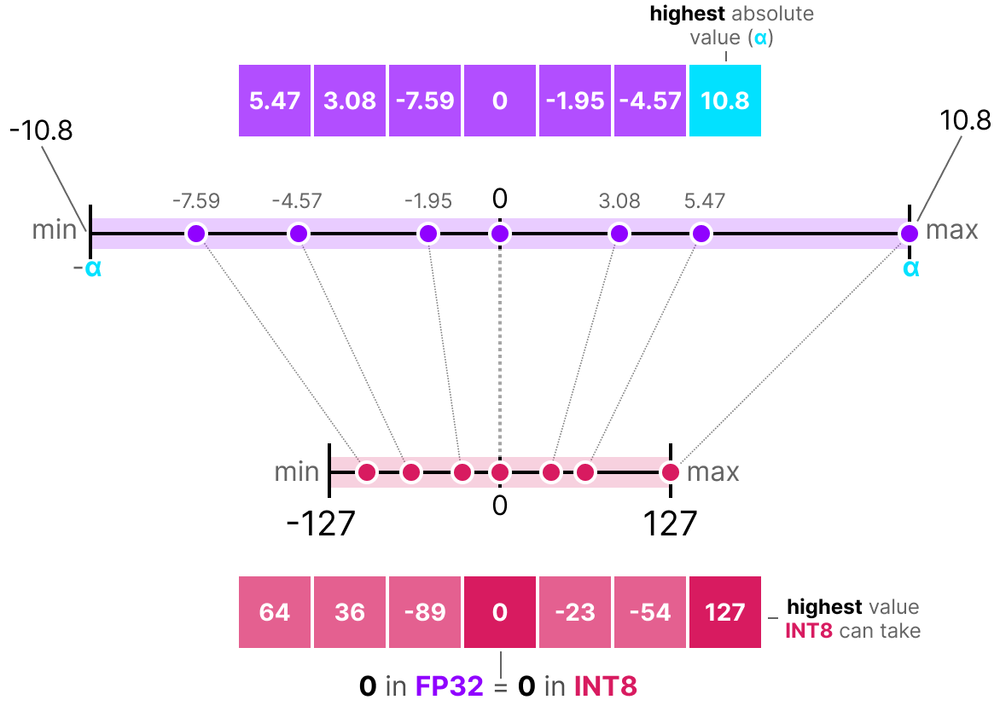

注意数值范围\[-127, 127\]表示受限区间。无约束范围设定为[-128, 127]，具体取值取决于所采用的量化方法。

由于该映射是以零为中心的线性变换，其计算公式较为简明。

我们通过以下公式计算比例因子（_**s**_）：

- 其中***b***表示目标量化字节数（8 字节），
- **α**表示输入张量中的最大绝对值，

随后使用计算得到的比例因子***s***对输入值***x***执行量化：

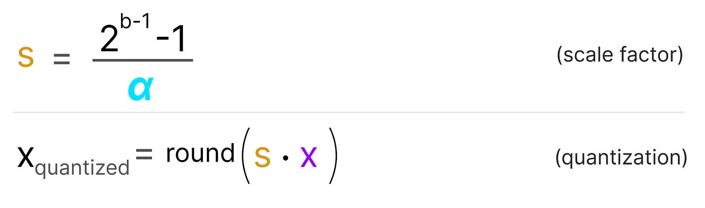

代入实际数值后可得以下表达式：

若要还原原始 FP32 浮点格式数值，可使用先前计算的*比例因子*（_**s**_）对量化值进行逆量化。

量化解量化过程还原原始值的操作流程如下：

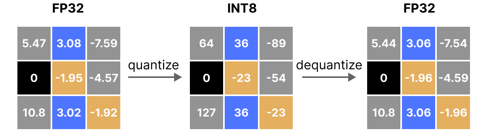

可见部分数值（如**3.08**和**3.02**）在 INT8 量化时均被映射为整数值**36**。 当将数值解量化恢复为 FP32 浮点格式时，其精度会有所损失且无法再保持原有的区分度。

这种现象通常被称为*量化误差*，可通过计算原始值与解量化值之间的差值来量化评估。

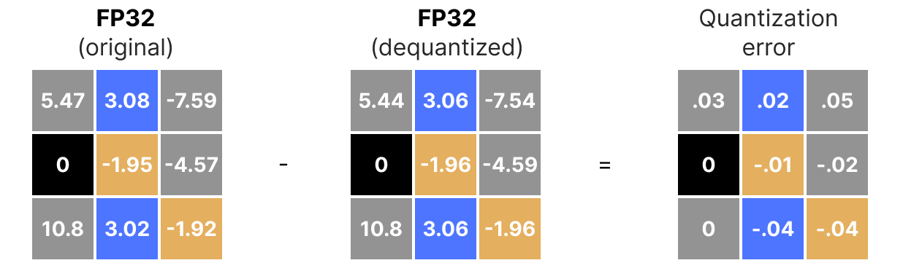

通常使用的比特位数越少，产生的量化误差往往越大。

### 2.3 非对称量化

与对称量化不同，非对称量化的数值分布并不以零点为对称中心。该方法将浮点数值范围的最小值（**β**）和最大值（**α**）分别映射至量化范围的极值区间。

我们将要深入探讨的方法被称为*零点量化*。

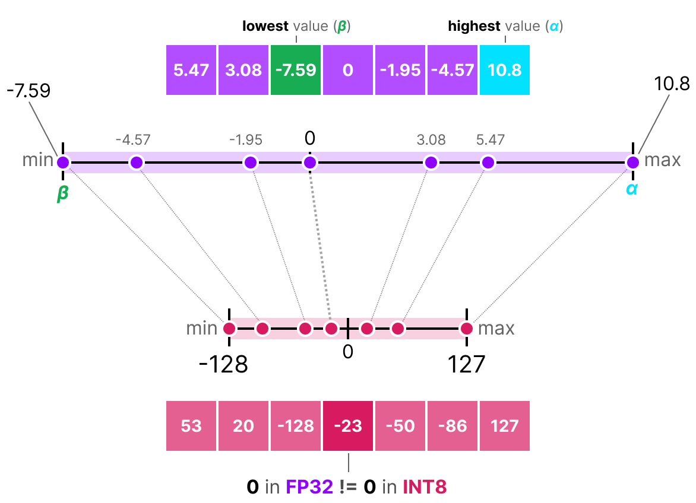

是否注意到零点位置发生了偏移？这正是其被称为*非对称量化*的原因。在\[-7.59, 10.8\]数值范围内，最小值与最大值到零点的距离呈现不对称性。

基于零点的位置偏移特性，需计算 INT8 数值范围的零点值以实现精确的线性映射。与对称量化类似，我们仍需计算比例因子（\_ **s**\_），但此时使用 INT8 取值范围\[-128, 127\]的差值进行计算

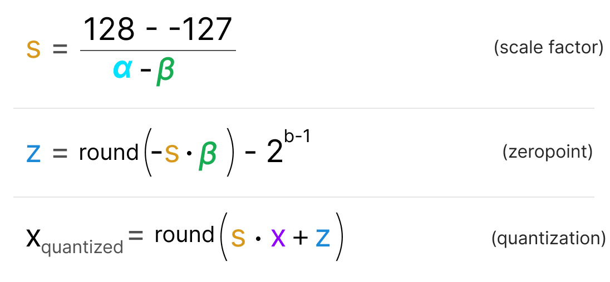

需要注意的是，由于该方法要求计算 INT8 范围内的零点（\_ **z**\_）用于权重调整，操作步骤相对复杂

依照既定方法，我们代入量化公式：

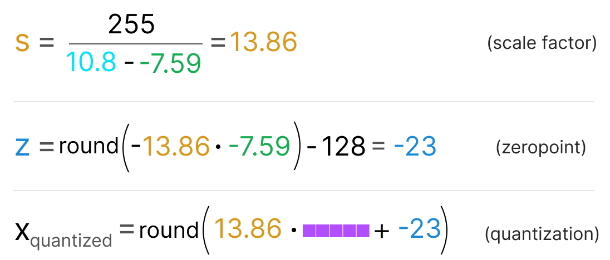

若要将 INT8 量化模型解量化回 FP32 格式，需使用预先计算的比例因子（\_ **s**\_）和零点参数（\_ **z**\_）

除此之外，解量化过程本身较为直观：

将对称量化与非对称量化方法并列对比时，二者的核心差异立即可辨：

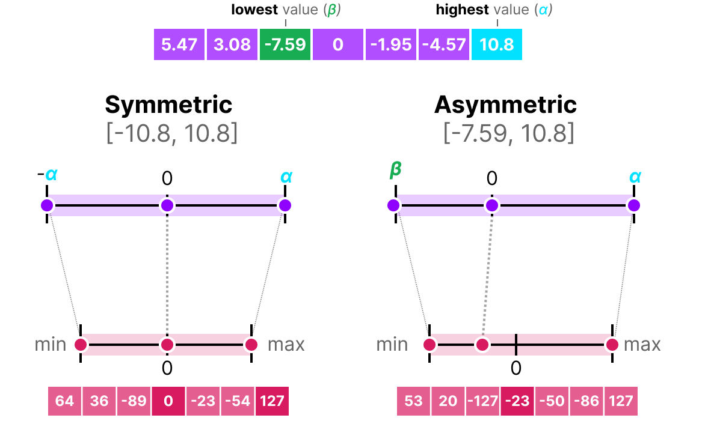

请注意对称量化天然的零中心特性与非对称量化的偏移分布形成鲜明对比

### 2.4 范围映射与数值截断

在前文案例中，我们已深入解析如何将向量值域映射至低比特位表示的方法尽管这种方法可以映射向量的全部取值范围，但它存在一个显著缺陷——即会产生*离群值*。

假设存在如下取值的向量：

注意观察其中一个值明显大于其他所有值，可视为离群值。若将该向量的全部取值范围进行映射，则所有较小值都会被压缩至相同的低比特表示形式，从而丧失其差异性特征：

这正是前文使用的 absmax 量化方法。需注意的是，若不实施截断操作，非对称量化同样会出现类似现象。

作为替代方案，我们可以选择*截断*特定数值。截断的核心在于重新设定原始值的动态范围，使得所有异常值统一归为相同数值。

如下例所示，若手动将动态范围设定为\[-5, 5\]，该区间外的所有值无论大小都将被统一映射为-127 或 127：

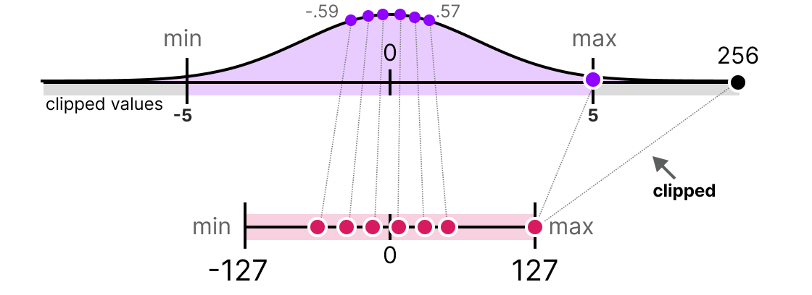

该方法的核心优势在于能大幅降低*正常值域数据*的量化误差。但相应地，*异常值数据*的量化误差会增大。

### 2.5 校准过程

本例中展示的是通过主观选择\[-5, 5\]范围的简易实现方式。该范围的选择过程称为*校准*，其核心目标是寻找既能覆盖最大数据量又能最小化量化误差的最优区间。

需注意，不同类型的参数在执行此校准步骤时存在差异性。

#### 2.5.1 权重（及偏置项）

由于大语言模型（LLM）的权重和偏置项在模型运行前就已确定，因此可将其视为*静态*参数。以[Llama 3约20GB的模型文件](https://huggingface.co/meta-llama/Meta-Llama-3-8B/tree/main) 为例，其主要构成部分即为权重和偏置项。

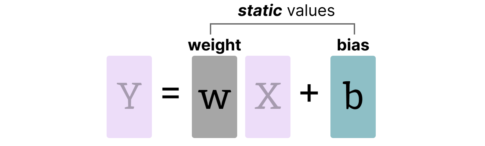

鉴于偏置项数量级（百万级）远小于权重参数（十亿级），通常采用更高精度（如 INT16）存储偏置项，而量化优化的核心目标集中在权重处理。

针对已知且保持静态的权重参数，选择量化范围的校准技术主要包括：

- 手动选定输入范围的*百分位点*；
- 通过优化原始权重与量化权重之间的*均方误差*（MSE）进行校准；
- 最小化原始数据与量化值间的*信息熵*（KL 散度）。

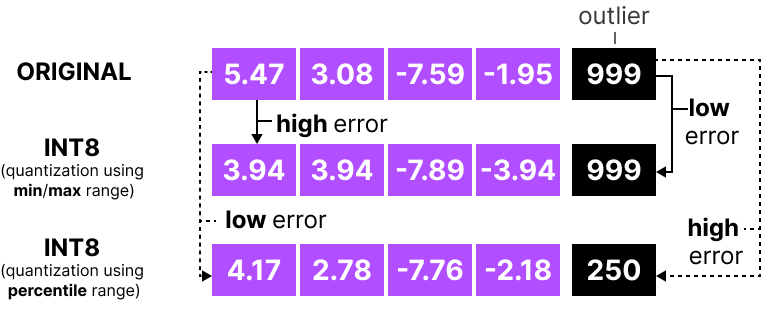

若采用百分位数选择策略，将产生与先前讨论相似的数值截断现象。

#### 2.5.2 激活值

在大型语言模型（LLM）中持续更新的输入通常被称为「_激活值_」。

需要注意的是，这些数值之所以称为激活值，是因为它们通常会通过某些激活函数（如Sigmoid或ReLU）进行处理。

与权重不同，在推理过程中，激活值会随着输入数据的变化而动态改变，因此对其进行精确量化颇具挑战。

由于这些数值会在每个隐藏层处理后更新，我们只有在模型执行推理、输入数据流经网络时才能确定其具体值。

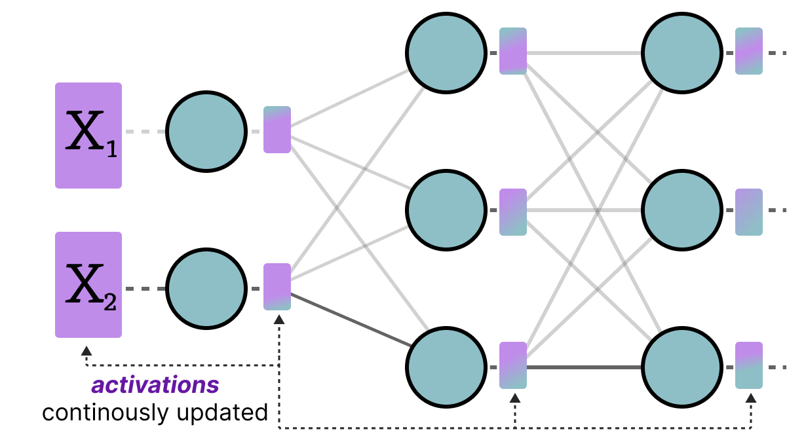

总体而言，校准权重和激活值的量化方法可分为两大类：

- 训练后量化（PTQ）
  - 训练***完成***后量化
- 量化感知训练（QAT）
  - 训练/微调***过程中***量化

---

## 3. 训练后量化技术

训练后量化（PTQ）是目前最主流的量化方法之一。该技术要求在模型完成训练**后**，对其参数（含权重和激活值）执行量化操作。

*权重*的量化可采用对称量化或非对称量化方法。而*激活值*的量化则需通过模型推理获取其潜在分布，因其数值范围无法预先确定。激活值的量化主要包含两种形式：

- *动态*量化
- *静态*量化

### 3.1 动态量化

当数据通过隐藏层后，系统会收集其产生的激活值：

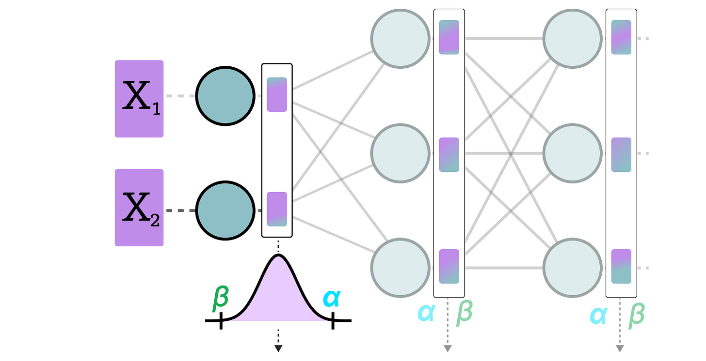

基于这些激活值的分布特征，可计算出量化输出所需的*零点*(\_**z**_)和比例因子_(**s**)：

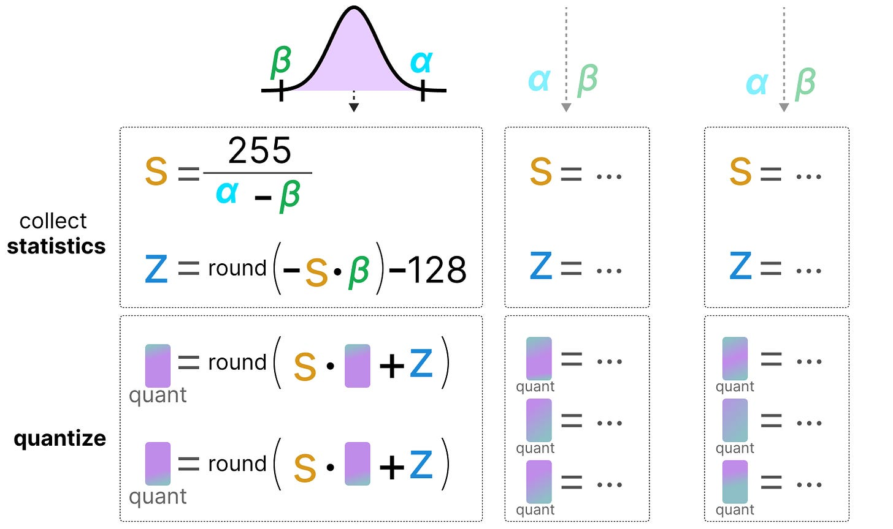

该过程会在数据每次流经新的网络层时重复执行因此，每个网络层都具有独立的***z***和***s***参数值，从而形成差异化的量化方案。

### 3.2 静态量化

与动态量化不同，静态量化不在推理过程中实时计算*零点*(\_**z**\_)和比例因子\_(\_**s**\_)，而是采用预先计算的方式。为确定这些参数值，需使用**校准数据集**输入模型以收集潜在的数据分布：

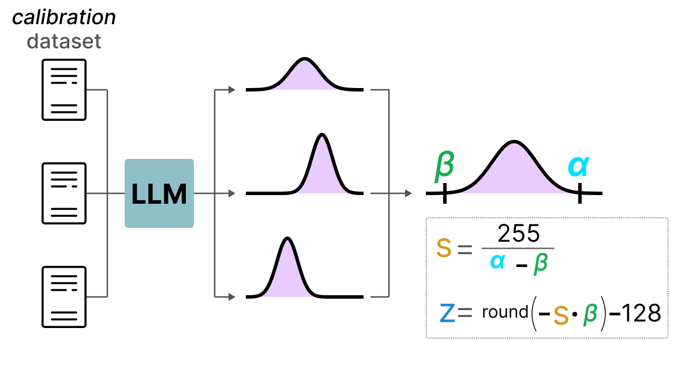

完成数据收集后，即可计算出推理阶段执行量化所需的***s***和***z***参数值。在实际执行推理时，***s***和***z***参数值不会实时计算，而是采用全局统一值对所有激活值进行量化处理。

总体而言，动态量化通常具有更高精度，因其专门针对每个隐藏层独立计算***s***和***z***参数值。但这种方式可能增加计算耗时，需实时执行参数值的计算过程。

相较之下，静态量化虽然精度稍逊，但由于已预存固定的***s***和***z***量化参数，执行效率显著更高。

### 3.3 4 比特量化技术前沿

实践证明，突破`8`比特以下的量化存在显著挑战，量化误差会随着比特位数的减少呈指数级增长。当前主要通过智能量化策略实现`6`比特、`4`比特乃至`2`比特的突破（但行业普遍不建议采用低于`4`比特的方案）。

我们将深入解析`HuggingFace`社区广泛采用的两种代表性方法：

- _**GPTQ**_（全模型`GPU`部署方案）
- _**GGUF**_（支持部分层`CPU`卸载方案）

#### 3.3.1 GPTQ 算法

`GPTQ`算法堪称`4`比特量化领域最著名的实践方法之一[1](https://newsletter.maartengrootendorst.com/p/a-visual-guide-to-quantization#footnote-1-145531349)

该算法采用非对称量化方法，并逐层进行处理：每一层在进入下一层前均独立完成量化：

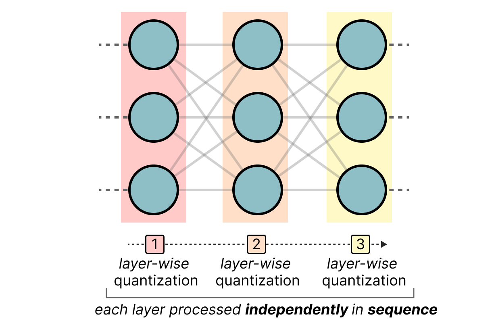

在此逐层量化过程中，算法首先将层的权重转换为逆海森矩阵作为模型损失函数的二阶导数，海森矩阵揭示了模型输出对各个权重变化的敏感程度。简而言之，它实际上反映了层中每个权重的（逆）重要性

与海森矩阵中较小值对应的权重更为关键，因为这些权重的微小扰动可能导致模型性能的显著波动

> 在逆海森矩阵中，数值越低表示该权重越“重要”。

接下来，我们首先对权重矩阵中第一行的权重进行量化，随后执行解量化操作：

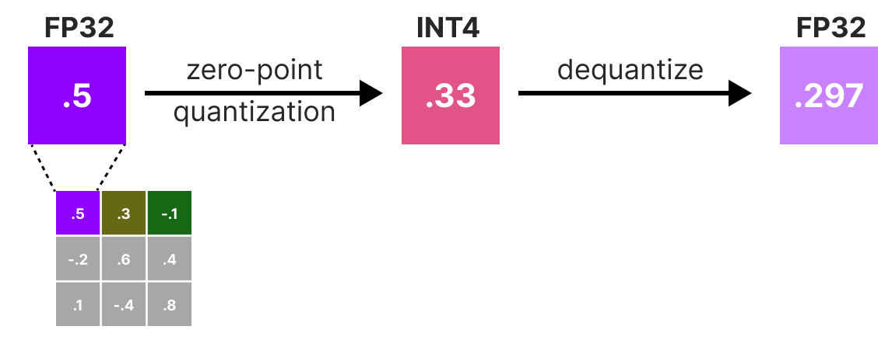

通过该过程，我们可以计算**量化误差（**\_q\_**）**，并利用预先计算的逆海森矩阵（\_h_1）对其进行加权处理。本质上，我们基于权重的重要性创建了一个加权量化误差：

接下来，我们将这个加权量化误差重新分配到该行中的其他权重上，从而保持网络的整体功能和输出特性。

例如，针对第二个权重（即 0.3（\_x_2*）），我们会将量化误差（\_q*）乘以该权重的逆海森矩阵值（\_h_2\_）后进行累加

我们可以对当前行中的第三个权重执行相同操作：

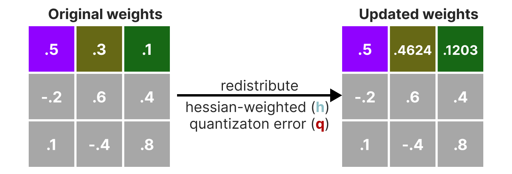

我们持续迭代执行这种加权量化误差的重新分配过程，直至所有权重值完成量化。

该方法行之有效的原因在于，神经网络中的权重通常具有相互关联性。因此，当某个权重出现量化误差时，相关权重会通过逆海森矩阵（inverse-Hessian）进行协同更新。

> [!NOTE]
> [研究者](https://arxiv.org/pdf/2210.17323) 采用了多项优化技巧以提升计算效率和模型性能，包括为海森矩阵引入阻尼因子、实施「惰性批处理」策略，以及采用Cholesky分解进行信息预计算。我们强烈推荐观看[该YouTube技术讲解视频](https://www.youtube.com/watch?v=mii-xFaPCrA) 以深入理解本主题。
>
> [!TIP]
> 如需针对推理速度进行极致优化的量化方案，请重点关注EXL2 框架的实现。

#### 3.3.2 GGUF 格式

虽然GPTQ算法是实现大型语言模型全量GPU部署的优秀量化方案，但在实际硬件条件受限时，此时可借助GGUF格式的层级卸载特性，将模型任意计算层动态分配至CPU执行。[2](https://newsletter.maartengrootendorst.com/p/a-visual-guide-to-quantization#footnote-2-145531349)

当显存（VRAM）不足时，该方案允许您同时利用 CPU 和 GPU 进行协同计算。

GGUF 量化方法迭代更新频繁，其具体实现可能因位量化级别的不同而有所差异。然而，其通用量化原理可概括如下：

首先，将神经网络某层的权重矩阵分割为多个'超块'，每个超块包含若干'子块'集合。从这些区块结构中，可提取出比例因子（\_ **s**\_）和 alpha 参数（\_ **α**\_）：

对于特定'子块'的量化处理，可采用先前所述的*absmax*绝对值最大化量化方法。需特别注意，该方法通过将权重值与比例因子（\_ **s**\_）相乘实现量化缩放：

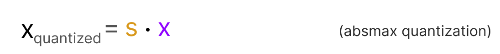

比例因子虽基于'子块'数据计算得出，但最终需使用'超块'的独立比例因子完成量化过程：

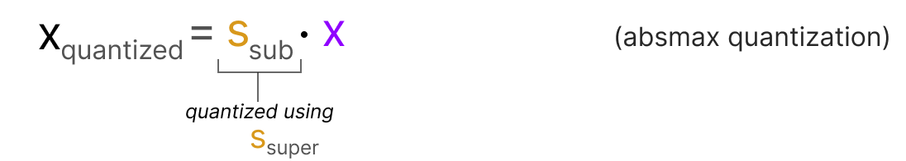

这种分层量化机制利用'超块'的比例因子（**s_super**）对'子块'比例因子（**s_sub**）进行二次量化。

各比例因子的量化级别可能不同，通常'主'模块的比例因子比'子'模块具有更高的精度。

为便于理解，我们将以三种量化位宽（2 位、4 位和 6 位）为例进行说明：

> [!NOTE]
> 根据量化类型的不同，需通过附加最小值参数（\_ **m** _）对零点进行校准。这些量化模型的量化方式与比例因子（\_ **s**_）保持一致。

关于所有量化级别的概述，请参考原始拉取请求 。 如需了解基于重要性矩阵的量化方法，请查阅此拉取请求 。

---

## 4. 量化感知训练

在第三部分中，我们演示了如何在模型训练完成***后***实施量化操作。该方法的局限性在于：量化过程未与模型实际训练流程相结合。

量化感知训练（QAT）正是为此而设计。区别于训练后量化（PTQ）的事后处理方式，QAT 通过在训练***过程中***同步学习量化参数来实现优化。

由于量化误差在训练阶段即被纳入优化目标，QAT 相比 PTQ 具有更高的精度优势。具体实现流程如下：

在训练过程中，会引入所谓的「_fake_」伪量化操作。该过程首先将权重量化至 INT4 等低精度格式，随后反量化为 FP32 浮点格式：

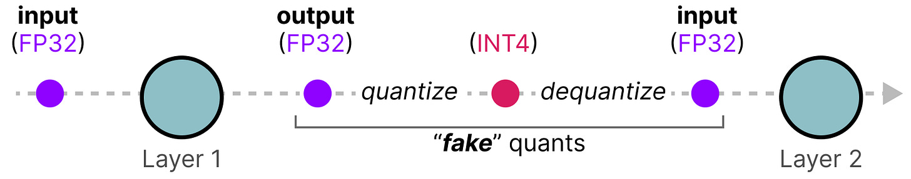

通过这种方式，模型可以在训练过程中将量化过程纳入考量，包括损失计算和权重更新的全过程。

量化感知训练（QAT）致力于寻找「_wide_」宽域极小值以降低量化误差，因为「_narrow_」窄域极小值通常会产生更大的量化误差。

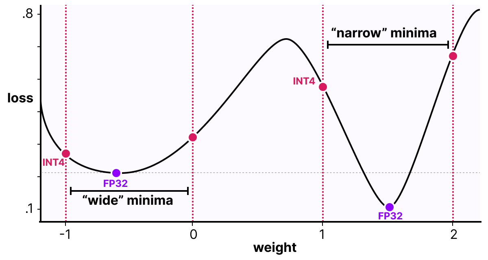

例如，假设在反向传播过程中未考虑量化效应。根据梯度下降算法，我们会选择损失值最小的权重参数。然而，若该权重处于「_narrow_」窄域极小值区域，将会引发较大的量化误差。

相反地，若将量化纳入考量，则会在「_wide_」宽域极小值区域选择不同的更新权重，从而显著降低量化误差。

因此，尽管训练后量化（`PTQ`）在高精度（如`FP32`浮点格式）下表现更优，但量化感知训练（`QAT`）在低精度（如`INT4`）下的实际部署效果更佳，这正是量化技术追求的目标。

### 4.1 1 位大型语言模型时代：比特网络

如先前所述，`4`位量化已属极小规模，但若进一步压缩至更低位宽会如何？

[比特网络](https://arxiv.org/pdf/2310.11453) 应运而生，其采用单`1`位量化表示模型权重，每个权重仅取**\-1**或**1**两种值。[3](https://newsletter.maartengrootendorst.com/p/a-visual-guide-to-quantization#footnote-3-145531349)

该方法通过将量化过程深度集成至`Transformer`架构实现。

值得注意的是，作为多数大型语言模型基石的`Transformer`架构，其核心计算单元由线性层构成：

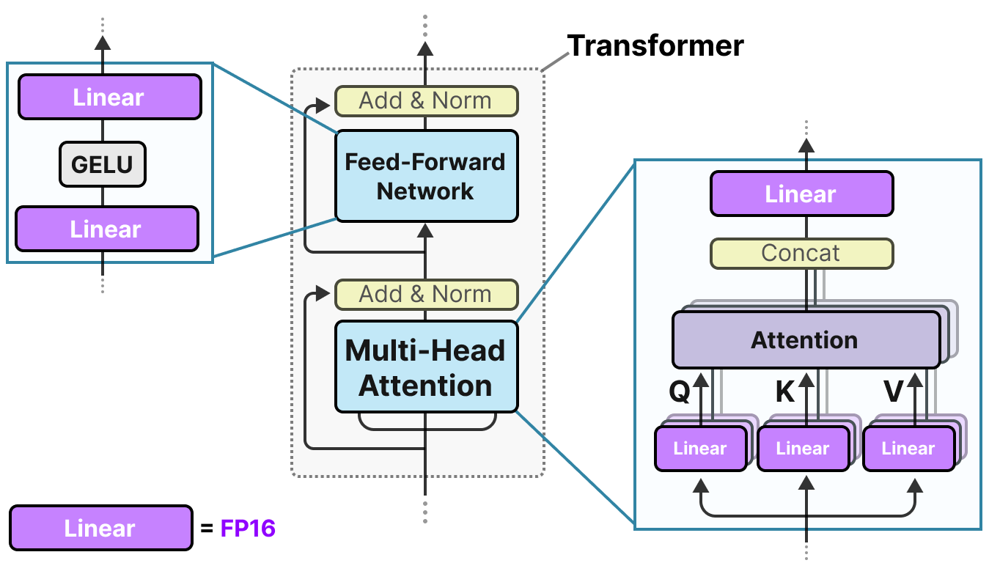

这些线性层通常以 FP16 浮点格式等高精度数值表示，且承载了模型绝大部分权重参数。

比特网络通过其创新设计的**比特线性层**替代传统线性层：

比特线性层与标准线性层功能一致，通过权重矩阵与激活值的乘积运算生成输出结果。

相比之下，比特线性层采用 1 位量化表示模型权重，并利用`INT8`格式编码激活值：

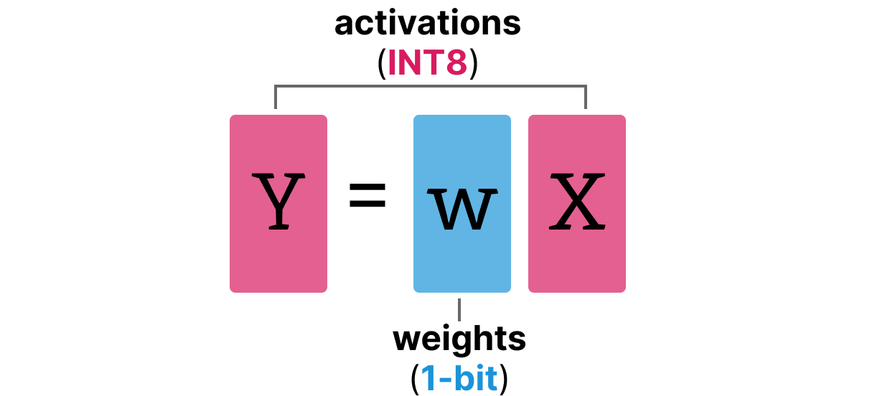

与量化感知训练（`QAT`）类似，比特线性层在训练过程中会执行'模拟量化'操作，用于评估权重和激活值量化后的效果：

> [!NOTE]
> 原论文使用**γ**作为参数符号，但为保持与本文示例符号体系一致，此处统一采用**α**。 需特别指出，此处的**β**参数与零点量化中的定义不同，它表示平均绝对值。

下面我们将分步骤详解比特线性层的实现机制。

#### 4.1.1 权重量化

在训练阶段，权重首先以`INT8`格式存储，随后通过*符号函数*的基础策略量化为`1`位精度。

其核心原理是将权重分布中心归零处理：将零值左侧数据统一映射为`-1`，右侧数据映射为`1`。

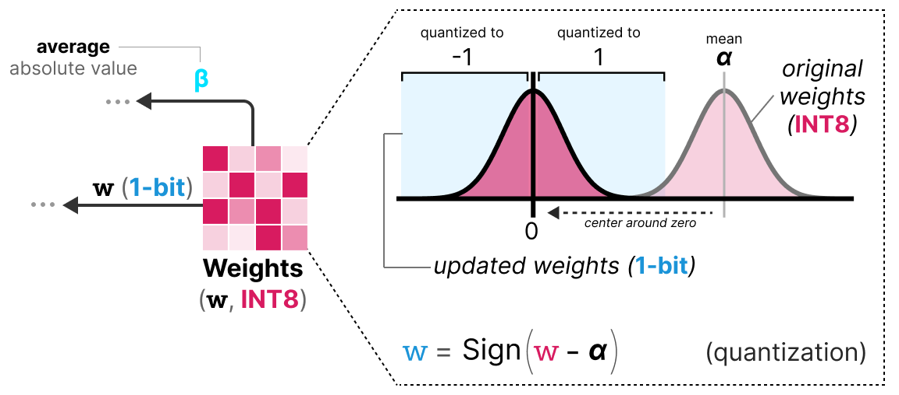

系统会持续追踪**β（平均**绝对值**）**参数，该值将用于后续的逆量化过程。

#### 4.1.2 激活值量化

在激活值量化环节，比特线性层运用*绝对值最大化量化*技术，将`FP16`格式的激活值转换为`INT8`精度，以满足矩阵乘法（×）运算的高精度要求。

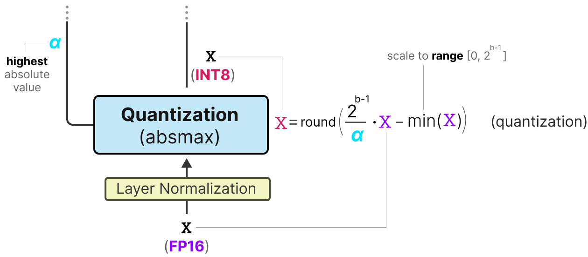

系统会持续记录**α（最大**绝对值**）**参数，该值将用于后续的逆量化过程。

#### 4.1.3 逆量化

我们持续追踪了**α（激活值的最大绝对值）**和**β（权重的平均绝对值）**，这些参数将帮助我们将激活值解量化回 FP16 浮点格式。

输出激活值通过{α, γ}参数组进行重新缩放，以将其逆量化为原始精度：

至此流程完成！该方法相对简单直观，使得模型仅需用**\-1**和**1**两个数值即可表征。

应用此方法后，研究者发现模型规模越大，`1`位量化模型与全精度`FP16`训练模型之间的性能差异越小。

但此现象仅存在于大型模型（参数量>300 亿），较小模型的性能差距仍较为明显。

### 4.2 所有大语言模型均采用 1.58 比特量化

[比特网络1.58b](https://arxiv.org/pdf/2402.17764) 的提出旨在改进前文所述的扩展性问题[4](https://newsletter.maartengrootendorst.com/p/a-visual-guide-to-quantization#footnote-4-145531349)

这种创新方法中，每个权重不仅可以是**\-1**或**1**，现在还可取**0**作为值，从而形成三元权重体系。值得注意的是，仅引入**0**值就显著提升了比特网络的性能，并大幅加速了计算过程。

#### 4.2.1 零值的威力

为何添加`0`值能产生如此显著的性能提升？其核心机制完全体现在*矩阵乘法*的优化上！

首先，我们需要理解标准矩阵乘法的基本运算原理。在进行输出计算时，需执行权重矩阵与输入向量的乘积运算。下图直观展示了权重矩阵第一层的首次乘积累加运算过程：

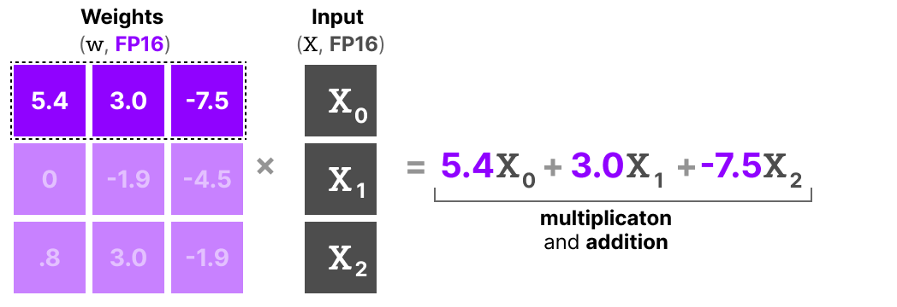

需要特别指出，该运算包含两个关键步骤：**相乘**（单个权重与输入值逐元素相乘）和**累加**（将所有乘积结果求和）。

与之形成对比的是，比特网络 1.58b 采用的三元权重机制通过以下规则有效规避了乘法运算：

- 1: 需要累加当前值
- 0: 舍弃当前值
- \-1：需要减去该数值时

因此，当权重完成 1.58 位量化后，您仅需进行加法运算即可：

该方案不仅能大幅提升计算速度，还可实现**特征筛选**功能。

通过将指定权重置零，可直接忽略该参数，避免了传统 1 位表征必须进行的加减运算。

#### 4.2.2 量化技术

比特网络`1.58b`采用改进型*绝对值均值量化*方案，此方法基于先前介绍的绝对值最大化量化改进而来。

该方法通过压缩权重参数分布，并基于绝对均值（**α**）执行数值量化处理。最终将量化结果取整至`-1`、`0`或`1`三个离散值：

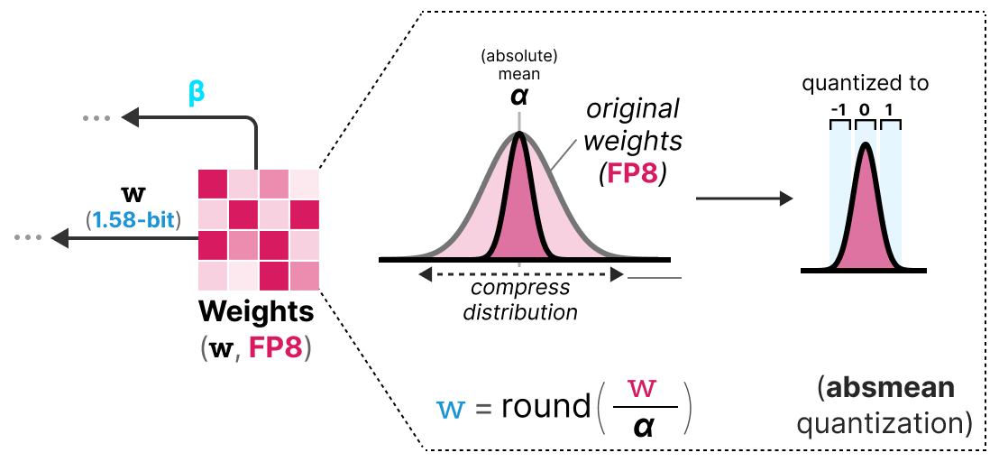

相较原版比特网络，激活值量化机制仅存在一项改进：激活值的缩放范围从原有的\[ **0** , **2ᵇ⁻¹** \]区间调整为采用区间\[ **-2ᵇ⁻¹** , **2ᵇ⁻¹** \]，而非使用*绝对值最大化量化*方法。

至此，实现`1.58`比特量化主要依靠两个关键技术：

- 引入**0**值构建三元表示\[-1, 0, 1\]
- 针对权重的*绝对值均值量化*

“在延迟、内存使用和能耗方面，**13B** 的 BitNet b1.58 模型比 **3B** 的 FP16 LLM 更高效。”

通过仅使用计算高效的`1.58`比特参数，最终我们获得了轻量化模型！

我们的量化之旅到此结束！希望本文能让您对量化、GPTQ、GGUF 和 BitNet 的潜力有更深入的了解。谁知道未来的模型会有多小呢？！

---

## 5. 延伸阅读

希望本文能帮助您初步理解量化技术！如需深入探究，推荐以下学习资源：

- `HuggingFace`关于**[LLM.int8()](https://huggingface.co/blog/hf-bitsandbytes-integration)**量化方法的技术博客（相关论文参见[此处](https://arxiv.org/pdf/2208.07339) ）
- 另一篇值得阅读的`HuggingFace`博客详细阐述了[嵌入向量量化](https://huggingface.co/blog/embedding-quantization) 技术
- 一篇关于[Transformer数学基础](https://blog.eleuther.ai/transformer-math/) 的博客文章，详细解析了`Transformer`模型计算与内存使用相关的基础数学原理。
- [此工具](https://huggingface.co/spaces/NyxKrage/LLM-Model-VRAM-Calculator) 与[该平台](https://vram.asmirnov.xyz/) 是计算指定模型所需**显存**的两个优质资源。
- 如需深入了解用于微调的量化技术**QLoRA**[⁵](https://newsletter.maartengrootendorst.com/p/a-visual-guide-to-quantization#footnote-5-145531349) ，您可参考我的即将出版著作《[动手学大语言模型](https://www.amazon.com/Hands-Large-Language-Models-Understanding/dp/1098150961) 》，书中对此有系统论述。
- 这个[精彩的YouTube视频](https://www.youtube.com/watch?v=mii-xFaPCrA) 以极为直观的方式讲解了**GPTQ算法**的核心原理。
