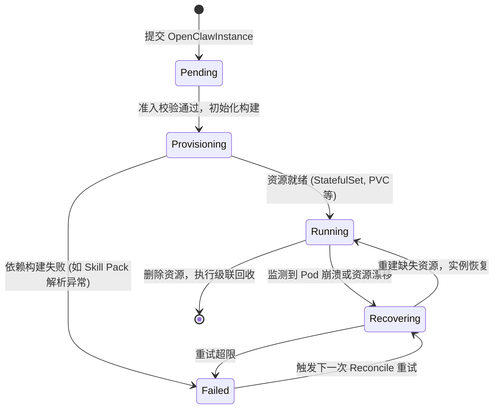

# 云原生 AI Agent 基础设施：OpenClaw Operator 架构深度解析

本文将深入探讨 OpenClaw Kubernetes Operator 的核心架构设计与工程实践。在云原生时代，如何安全、高效地编排复杂的 AI Agent 运行时环境成为了一个重要课题。OpenClaw 通过声明式 API 和精巧的控制平面设计，为这一痛点提供了优雅的解决方案。

---

## 1. 快速入门与实践体验

通过极简的命令行交互即可完成控制面安装与 AI Agent 实例部署，使开发者能够零门槛体验 Kubernetes 声明式编排在 AI 基础设施交付中的极致效率。

### 1.1. 环境准备与安装

依托标准的 Kubernetes 工具链，开发者可以在本地环境（如 Kind 或 Minikube）中快速编译源码、注册 CRD，并一键启动 Operator 控制器进行调试。确保当前 kubeconfig 上下文具有 cluster-admin 权限以注册 CRD。

首先，克隆代码仓库并利用 `make` 工具链完成 CRD（自定义资源定义）的安装与控制器的本地运行。

```bash
# 安装 CRD 到当前所在的 Kubernetes 集群
make install

# 在本地直接运行 Operator 控制器（便于调试与观察日志）
make run
```

### 1.2. 声明式拉起 Agent 实例

仅需提交单一的声明式 CRD 清单，控制平面即可触发级联调度，自动渲染并拉起包含网络策略、持久化存储、严格安全基线及 Chromium Sidecar 的复杂 Agent 运行栈。

准备以下 YAML 文件，并使用 `kubectl apply -f` 提交到集群中。系统将自动生成对应的 StatefulSet、ConfigMap、Service 以及 NetworkPolicy。

```yaml
# 声明一个 OpenClawInstance 自定义资源
apiVersion: openclaw.rocks/v1alpha1
kind: OpenClawInstance
metadata:
  name: demo-agent
  namespace: default
spec:
  # 指定 Agent 的核心镜像版本
  image: ghcr.io/openclaw-rocks/agent:latest
  # 开启 Chromium 浏览器 Sidecar，用于支持网页自动化任务
  enableChromium: true
  # 配置 Agent 的存储要求，确保状态持久化
  storage:
    size: 5Gi
```

### 1.3. 工作负载与容器拓扑结构

以 StatefulSet 为核心控制单元，通过多容器 Sidecar 模式与 Localhost 网络共享，构建出兼顾状态持久化与高频交互性能的复杂 Agent 运行栈。

当上述资源清单生效后，Operator 会在底层渲染出如下拓扑结构。Agent 主容器与 Chromium Sidecar 共享同一个 Network Namespace，通过 `localhost` 进行 CDP (Chrome DevTools Protocol) 高效通信；同时通过挂载 `emptyDir` 共享数据卷，实现任务文件的快速交换。

```text
+-------------------------------------------------------------+
|                  StatefulSet (demo-agent)                   |
|                                                             |
|  +-------------------------------------------------------+  |
|  | Pod (demo-agent-0)                                    |  |
|  |                                                       |  |
|  |  +----------------+     localhost      +-----------+  |  |
|  |  |                |   (CDP Protocol)   |           |  |  |
|  |  | Agent 主容器    | <================> | Chromium  |  |  |
|  |  |                |                    | Sidecar   |  |  |
|  |  +-------+--------+                    +-----+-----+  |  |
|  |          |                                   |        |  |
|  |          |           Shared Volume           |        |  |
|  |          +---------> (emptyDir) <------------+        |  |
|  +-------------------------------------------------------+  |
|                             |                               |
|                             v                               |
|  +-------------------------------------------------------+  |
|  | PersistentVolumeClaim (PVC)                           |  |
|  | (保障长期记忆与会话状态不随 Pod 重启而丢失)                  | |
|  +-------------------------------------------------------+  |
+-------------------------------------------------------------+
```

---

## 2. 声明式 Agent 编排与状态机流转

基于自定义资源与单向数据流驱动的状态机设计，OpenClaw 从根本上化解了外部 GitOps 流水线下发与 Agent 内部动态自配置之间的字段权属冲突痛点。在 Reconcile 循环中，控制面持续监控资源状态并驱动 Agent 实例进行生命周期流转。

### 2.1. 控制面状态机流转

以下是 OpenClaw 实例生命周期的状态机流转图，展示了从用户提交 OpenClawInstance 自定义资源（CR）到服务就绪或失败恢复的宏观过程：



### 2.2. CRD 模型与 SSA 机制的结合

OpenClawInstance 与 OpenClawSelfConfig 双模型通过 Kubernetes Server-Side Apply (SSA) 机制协同工作，利用细粒度的字段所有权追踪安全地合并多方并发的配置变更。

OpenClaw Operator 引入了 `OpenClawInstance` 自定义资源来承载 Agent 运行所需的完整参数。而在实际业务中，Agent 往往需要根据运行时状态动态修改自身配置（例如发现并加载新的技能包）。为了解决内部自配置与外部 GitOps（如 ArgoCD 或 Flux）之间的字段权属冲突，系统引入了 `OpenClawSelfConfig` 并结合 Kubernetes 的 Server-Side Apply (SSA) 机制。

SSA 的核心优势在于它能够精确追踪字段的所有权（通过 `metadata.managedFields`），从而安全地合并不同管理器的修改，有效避免了互相覆盖。

```go
// 使用 controllerutil.CreateOrUpdate 配合 SSA 机制
// 确保资源更新时的幂等性与字段所有权安全，避免不必要的 Reconcile 循环
obj := &appsv1.Deployment{
    ObjectMeta: metav1.ObjectMeta{
        Name:      resources.DeploymentName(instance),
        Namespace: instance.Namespace,
    },
}
_, err := controllerutil.CreateOrUpdate(ctx, r.Client, obj, func() error {
    // 调用纯函数 (resources.BuildDeployment) 生成期望资源状态
    desired := resources.BuildDeployment(instance)
    // 在声明式更新闭包内执行对象字段赋值，修改当前 obj
    obj.Labels = desired.Labels
    obj.Spec = desired.Spec
    // 建立 OwnerReference 以便实现级联垃圾回收 (GC)
    return controllerutil.SetControllerReference(instance, obj, r.Scheme)
})
```

需要注意的是，SSA 仅仅解决了所有权冲突，并未解决业务语义上的冲突（如并发修改同一个数组索引时的 Last-Write-Wins 问题）。因此，OpenClaw 在架构上需要配合 Validating Webhook 进行严格的语义校验，以防止恶意或错误的配置被持久化到集群中。

---

## 3. 核心组件构建：纯函数与确定性存储

数据平面的资源构建严格遵循纯函数范式，特别是针对浏览器自动化场景的存储架构，采用确定性的资源绑定以彻底保障 Agent 状态的连续性。

### 3.1. 摒弃 Deployment：StatefulSet 的架构考量

在无状态横向扩展盛行的当下，选择 StatefulSet 作为核心负载的承载体，旨在利用其稳定的网络标识与持久化 PVC 强绑定特性，确保 Agent 长期记忆与登录会话等关键上下文的不丢失。

在构建 Agent 运行时栈时，一个关键的架构决策是使用 StatefulSet 而非 Deployment。这一选择并非为了传统的有状态服务水平扩展，而是为了确保 Chromium 缓存 PVC 和 Agent 数据 PVC 的确定性命名与持久化绑定。

在复杂的浏览器自动化任务中，维持上下文连续性（如登录状态、长期记忆）至关重要。StatefulSet 能够提供稳定的网络标识和持久化存储绑定，确保即使 Pod 发生重启或跨节点迁移，Agent 依然能够无缝挂载原有的缓存数据，极大提升了任务执行的稳定性和效率。

### 3.2. 纯函数驱动的资源富化管线

将 Kubernetes 原生对象的拼装过程完全下沉至纯函数层，彻底解耦了业务编排逻辑与底层基础设施渲染，使得配置注入过程高度可测试且状态完全可预测。

在代码的 `internal/resources` 模块中，所有的资源构建逻辑均采用纯函数（Pure Functions）实现。控制器（Controller）仅负责状态机的轮询和事件流转，而具体的 ConfigMap、Secret 等资源的拼装则完全下沉至构建层。

这种设计的亮点在于灵活的配置富化管线。例如，系统可以通过 `enrichConfigWithOTelMetrics` 等函数，在运行时动态地将 OpenTelemetry 监控指标和 Gateway 认证凭证注入到 Agent 的配置中。这使得外部动态依赖（如 GitHub 技能包）能够实时反映在运行时环境中，同时保证了代码的高可测试性，无需依赖 envtest 即可完成单元测试。

---

## 4. 纵深防御：从软隔离到微型沙箱

AI 基础设施的安全底座必须兼顾极低性能损耗与强硬隔离能力，OpenClaw 当前依托 Kubernetes 原生能力构筑了坚固的容器级防线，并正积极探索向单一进程内部收敛的下一代沙箱架构。

### 4.1. 基于 Kubernetes 原生的软隔离基线

依托 Kubernetes 的 Pod 安全上下文与 NetworkPolicy 机制，系统预置了包含只读文件系统、内核特权彻底剥夺以及 Default-Deny 网络控制在内的严苛基础防护基线。

OpenClaw 默认采用极度严格的安全基线。Agent 及其 Sidecar（如 Chromium）被强制要求以非 Root 用户运行，并且挂载只读根文件系统。在内核权限方面，丢弃了所有 Linux Capabilities，并启用了 `RuntimeDefault` Seccomp 配置文件。

```yaml
# 典型的 Agent 容器安全上下文配置 (Pod Security Standards)
securityContext:
  runAsUser: 1000 # 强制非 Root 用户运行
  runAsNonRoot: true
  readOnlyRootFilesystem: true # 只读根文件系统，防止恶意载荷落地
  allowPrivilegeEscalation: false # 禁止特权提升
  seccompProfile:
    type: RuntimeDefault # 启用默认的系统调用拦截
  capabilities:
    drop:
      - ALL # 彻底丢弃所有 Linux 内核特权
```

在网络层面，系统默认注入 Default-Deny 的 NetworkPolicy，仅放行必需的 DNS 和外部 HTTPS 流量，彻底切断了 Agent 在集群内部横向移动（Lateral Movement）的可能性。同时，通过注入环境变量 `NPM_CONFIG_IGNORE_SCRIPTS=true`，有效防范了恶意的 NPM 供应链攻击。

### 4.2. 架构取舍：为何排除 gVisor 与 Kata Containers？

从第一性原理出发，Chromium 浏览器对共享内存（/dev/shm）和密集底层系统调用的强依赖，使得 gVisor 或 Kata Containers 等重量级硬隔离方案在上下文切换损耗与渲染兼容性上面临难以逾越的技术鸿沟。

尽管 gVisor 或 Kata Containers 能够提供基于内核或微型虚拟机的极致安全隔离，但 OpenClaw 经过审慎评估后排除了这些方案。其核心矛盾在于 Chromium 浏览器对共享内存（`/dev/shm`）和密集系统调用的强依赖。

具体来看，gVisor 通过 Sentry 进程实现内核 ABI，在处理 Chromium 密集的 `futex` 或 `memfd_create` 等系统调用时，用户态与内核态的切换开销会显著增加任务延迟，甚至导致渲染进程崩溃。此外，要求底层集群预装特定 `RuntimeClass` 会严重破坏 Operator 的开箱即用体验。因此，依托 Linux 原生 LSM 和 Seccomp 机制成为了性能与安全平衡下的最佳工程实践。

### 4.3. 前瞻演进：基于 Landlock 的进程级沙箱

需要澄清的是，本节探讨的 Landlock 进程级沙箱目前属于纯粹的架构设计蓝图，尚未在 OpenClaw Operator 当前的代码库中实质落地。

针对 Agent 与 Chromium Sidecar 共享 `emptyDir` 卷所带来的潜在信任危机，OpenClaw 计划在未来的版本演进中，探索引入类似 OpenShell Lite 的轻量级进程沙箱（基于 Landlock 与 Seccomp-BPF）。

在架构设想中，未来可以通过在容器内部动态施加 Landlock 规则（作为叠加在现有 Seccomp 之上的第二层防护机制），来严格限制 Agent 进程在共享目录下的执行权限。具体而言，理论上能够制定只包含读/写权限的 Landlock 白名单策略，排除 `LANDLOCK_ACCESS_FS_EXECUTE` 标志位，从而禁止在共享目录下执行任何二进制文件。这种无需特权（Rootless）且毫秒级启动的架构思路，为最终实现函数级别的动态“工具调用沙箱（Per-Tool Sandbox）”指明了极具潜力的技术方向。

---

## 5. 总结与展望

声明式、高内聚、低耦合的 Operator 架构，不仅化解了复杂 Agent 运行时的自动部署难题，更为支撑大规模、强安全要求的云原生 AI 应用落地奠定了坚实的基础设施底座。

OpenClaw Kubernetes Operator 展现了如何将云原生设计的最佳实践深度融入 AI Agent 的基础设施构建中。从 Server-Side Apply 的冲突解决，到 StatefulSet 的持久化绑定，再到克制而严谨的软隔离安全边界，每一个架构决策都体现了对业务连续性与安全底线的深刻思考。随着 AI Agent 能力的不断拓展，这种声明式、高内聚、低耦合的基础设施基座，必将成为支撑大规模 AI 应用落地的核心基石。
