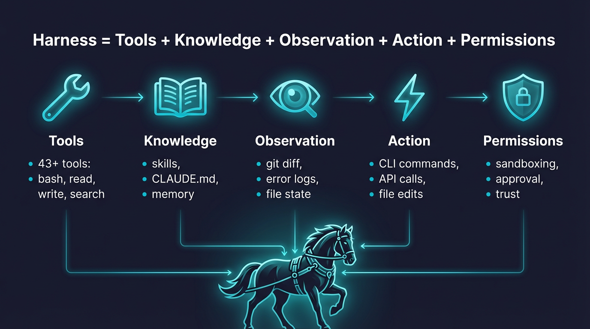

# OpenHarness 深入浅出：解密开源智能体基础设施

大型语言模型（`LLM`）在推理与生成能力上取得了突破性进展，但它们本身受限于静态的上下文窗口，无法直接与真实世界进行交互。要让模型成为能够自主解决复杂任务的工程化智能体（`Agent`），必须为其配备执行动作的工具、持久化的记忆以及安全隔离的运行边界。这就是“智能体基础设施”（`Agent Harness`）的核心使命。

> 项目地址：<

## 目录

- [OpenHarness 深入浅出：解密开源智能体基础设施](#openharness-深入浅出解密开源智能体基础设施)
  - [目录](#目录)
  - [1. 为什么我们需要一个智能体基础设施？](#1-为什么我们需要一个智能体基础设施)
  - [2. 快速入门：从一行命令到全自动修 Bug](#2-快速入门从一行命令到全自动修-bug)
    - [2.1 安装与配置](#21-安装与配置)
    - [2.2 运行示例：一键重构代码库](#22-运行示例一键重构代码库)
  - [3. 架构说明](#3-架构说明)
    - [3.1 核心执行流图解](#31-核心执行流图解)
    - [3.2 子系统模块划分](#32-子系统模块划分)
  - [4. 核心功能解析](#4-核心功能解析)
    - [4.1 并发工具引擎](#41-并发工具引擎)
    - [4.2 工具抽象与注册](#42-工具抽象与注册)
    - [4.3 细粒度的权限管控](#43-细粒度的权限管控)
  - [5. 核心流程说明](#5-核心流程说明)
  - [6. 总结](#6-总结)

---

## 1. 为什么我们需要一个智能体基础设施？

目前在学术界与工业界，已经形成了一个广泛的共识：要让模型成为能够自主解决复杂任务的工程化智能体（`Agent`），必须为其配备执行动作的工具、持久化的记忆以及安全隔离的运行边界。

然而，共识的背后却掩盖着基础设施标准缺失的痛点。当前，研究人员与开发者在探索前沿的智能体应用时，往往需要从零构建底层的工具路由、权限管控与记忆管理等脚手架。这种各自为战的现状，不仅极大地提高了构建专业智能体的工程门槛，也让开源社区难以在一个标准、透明的底座上快速验证新的工具链、技能组件以及多智能体协同模式。

为了填补纯粹的模型智能与复杂的物理环境执行之间的鸿沟，`OpenHarness` 应运而生。作为一个轻量级且高度可扩展的开源智能体基础设施项目，它将复杂的设计哲学高度浓缩为了一个“智能体能力等式”，并以此为基石构建了整个工程架构：



> [!TIP]
> **Harness = Tools + Knowledge + Observation + Action + Permissions**

在这个等式中，模型仅提供基础的智能（`Intelligence`），而基础设施（`Harness`）则负责将其补全为真正的 `Agent`：

- **Tools（工具）**：赋予模型与外部世界交互的“手”。在 `OpenHarness` 中体现为涵盖文件读写、终端执行、网络检索等超过 43 个核心工具。
- **Knowledge（知识）**：提供特定领域的“记忆与常识”。对应项目中的 `Skills` 技能树系统与 `MEMORY.md` 持久化机制。
- **Observation（观察）**：赋予模型“眼”。通过工具执行后获取的终端输出、文件内容等反馈结果，让模型能够感知环境状态。
- **Action（行动）**：形成实际的物理改变。包括修改文件、执行构建脚本、提交代码等具体的动作执行器。
- **Permissions（权限）**：赋予“安全边界”。大模型的幻觉需要被收敛在安全的沙盒内，对应项目中的多级权限模式与拦截器。

通过这套开箱即用的机制，`OpenHarness` 致力于为研究人员和开发者提供一个透明、安全的工程底座，将纯粹的模型“大脑”转化为具备“手眼”能力的超级工作站。

---

## 2. 快速入门：从一行命令到全自动修 Bug

为了让开发者能够以最低成本体验智能体的实际运行效果，`OpenHarness` 提供了极简的命令行启动方式。只要大家拥有 `Python` 环境和一个模型 API Key，就可以立刻让它接管工作区，实现从分析到执行的自动化。

### 2.1 安装与配置

首先，确保本地环境已安装 `Python 3.10` 及以上版本。我们将使用 `uv`（一个极速的 Python 包管理器）来进行环境隔离与安装。

```bash
# 克隆项目并安装依赖
git clone 
cd OpenHarness
uv sync --extra dev
```

接下来，我们需要配置一个兼容的大语言模型。这里以国内完全兼容 Anthropic 协议的 Kimi（月之暗面）为例，只需在终端中导出以下环境变量：

```bash
export ANTHROPIC_BASE_URL=https://api.moonshot.cn/anthropic
export ANTHROPIC_API_KEY=YOUR_KIMI_API_KEY
export ANTHROPIC_MODEL=kimi-k2.5
```

### 2.2 运行示例：一键重构代码库

环境准备就绪后，我们来看一个具体的硬核场景：“让智能体自主扫描当前代码库，并找出最需要重构的 3 个地方”。

只需在项目目录下执行这样一行非交互式（Headless）命令：

```bash
uv run oh -p "Inspect this repository and list the top 3 refactors"
```

敲下回车后，系统会自动拉起后台执行引擎，智能体开始自主调用 `Glob` 工具扫描文件树，接着使用 `Read` 工具查阅核心源码。最终，终端会直接打印出结构化的重构方案。以下是真实运行的输出日志节选：

````markdown
Based on my inspection of this OpenHarness repository, here are the **top 3 refactors** I would recommend:

---

## 1. **Consolidate Duplicate QueryContext Construction** (`src/openharness/engine/query_engine.py:107-147`)

**Issue:** `QueryContext` is constructed identically in both `submit_message()` and `continue_pending()` methods.

**Current pattern:**

```python
# Lines 110-123 and 131-143 - nearly identical dataclass instantiation
context = QueryContext(
    api_client=self._api_client,
    tool_registry=self._tool_registry,
    # ... 10 more fields repeated
)
```

**Refactor:** Extract a private `_build_context(max_turns: int | None = None)` method to eliminate duplication and reduce maintenance burden when adding new context fields.

---

## 2. **Extract Permission Checking Logic** (`src/openharness/engine/query.py:191-199`)

**Issue:** The `_execute_tool_call()` function mixes tool lookup, input validation, permission checking, and hook execution.

**Current pattern:**

```python
# Lines 174-199 - multiple concerns in one function
tool = context.tool_registry.get(tool_name)
# ... validation ...
decision = context.permission_checker.evaluate(
    tool_name,
    is_read_only=tool.is_read_only(parsed_input),
    file_path=_file_path,
    command=_command,
)
```

**Refactor:** Extract a `_check_permissions()` helper that encapsulates the permission decision logic, including the fallback handling for missing tools and the `PermissionDecision` interpretation. This would make the main execution flow more readable and testable.

---

## 3. **Unify Task/Agent Lifecycle Management** (`src/openharness/tasks/manager.py` + `src/openharness/swarm/subprocess_backend.py`)

**Issue:** There's tight coupling between `BackgroundTaskManager` and `SubprocessBackend`. The backend reaches into the task manager's internals and maintains parallel state (`_agent_tasks` mapping).

**Current pattern:**

```python
# subprocess_backend.py:68-88
manager = get_task_manager()
record = await manager.create_agent_task(...)
self._agent_tasks[agent_id] = record.id  # Parallel state tracking
```

**Refactor:** Introduce a `TeammateTask` abstraction that wraps the task manager's record and provides a cleaner interface. The backend should delegate to this abstraction rather than directly manipulating task IDs. This would also make it easier to support other backends (tmux, iTerm2) consistently.

---

**Honorable mentions:**

- The `PermissionChecker` in `src/openharness/permissions/checker.py` could benefit from extracting the rule-matching logic into a separate `PathRuleEngine`
- `src/openharness/cli.py` has significant inline subcommand implementations that could be moved to dedicated command modules
````

在这个过程中，`OpenHarness` 内置的**并发工具调用**和**容错机制**在后台默默地处理了所有的环境交互。开发者无需编写任何胶水代码，就拥有了一个能够深入理解复杂项目架构的高级 `AI` 开发副驾。

---

## 3. 架构说明

一个健壮的智能体底座需要处理从输入解析、安全拦截到最终执行的复杂链路。`OpenHarness` 将这一生命周期抽象为 10 个相互独立但紧密协作的子系统，构建了灵活且可插拔的整体架构，确保在提供强大功能的同时维持系统的安全与稳定。

### 3.1 核心执行流图解

为了直观地展示系统的流转过程，可以参考项目的核心执行流架构图。该图清晰地勾勒了从用户输入到系统底层执行的完整闭环。


在这个执行流中：

- 用户的输入从 `CLI`（或终端 UI）进入 `QueryEngine`。
- 随后通过模型适配器触发 `Tool Registry` 中的工具调用。
- 工具执行前，必然会经过 `Permissions + Hooks` 的拦截与校验。
- 最终，工具产生的物理效果（读写文件、执行 Shell 等）会再次反馈给 `QueryEngine`。

### 3.2 子系统模块划分

基于上述执行流，源码目录下（`src/openharness/`）的核心模块可以分为四个主要的架构层：

- **引擎与调度层**
  - **`engine/`**：核心驱动枢纽，负责管理对话历史并驱动“查询 - 流式响应 - 工具调用 - 循环”的主链路。
  - **`coordinator/`**：多智能体调度中枢，负责子智能体衍生、系统提示词（`System Prompt`）的组装以及跨团队的协作指令。
  - **`tasks/`**：后台任务管理器，允许大模型派生出不会阻塞主线程的异步任务。
- **动作与知识层**
  - **`tools/`**：内置超过 43 种原子化能力，涵盖文件读写、终端命令、网络检索以及 `MCP`（模型上下文协议）对接。
  - **`skills/`**：按需加载的领域知识库。通过 Markdown 文件定义智能体在特定任务（如代码审查、撰写测试）中的行为准则。
  - **`memory/`**：跨会话知识持久化。通过自动读写 `MEMORY.md` 及子文件，为智能体提供长期记忆抽象。
- **安全与扩展层**
  - **`permissions/`**：多级权限模式与路径级拦截规则，保障本地运行环境不被恶意指令破坏。
  - **`hooks/`**：生命周期事件钩子，支持在工具调用前后（`PreToolUse` / `PostToolUse`）插入自定义检查逻辑。
  - **`plugins/`**：插件系统，完全兼容社区的 `claude-code` 插件生态，可快速引入自定义指令与行为模式。
- **接口与协议层**
  - **`api/`**：抹平不同模型提供商差异的适配层，支持 Anthropic 协议、OpenAI 协议以及 GitHub Copilot 认证。
  - **`mcp/`**：标准的模型上下文协议客户端，让智能体能够直接与本地 IDE 或远程知识库建立连接。

---

## 4. 核心功能解析

引擎层、工具抽象与权限拦截是驱动整个智能体安全、高效运作的基石。在底层实现上，`OpenHarness` 采用了高度模块化的面向对象设计，以下将通过核心代码片段解剖其实现细节。

### 4.1 并发工具引擎

在 `openharness/engine/query.py` 中，系统定义了并发工具调用的核心逻辑。框架不仅支持标准的顺序调用，还针对无依赖的多工具调用进行了异步并发优化，从而大幅缩短模型感知环境的 I/O 等待时间。

```python
# 遍历模型返回的工具调用请求
if len(tool_calls) == 1:
    # 单一工具场景：顺序执行并立即抛出结果事件
    tc = tool_calls[0]
    yield ToolExecutionStarted(tool_name=tc.name, tool_input=tc.input), None
    # 异步执行底层工具逻辑
    result = await _execute_tool_call(context, tc.name, tc.id, tc.input)
    yield ToolExecutionCompleted(
        tool_name=tc.name,
        output=result.content,
        is_error=result.is_error,
    ), None
    tool_results = [result]
else:
    # 多工具场景：在同一轮次中并发执行没有依赖关系的工具
    for tc in tool_calls:
        yield ToolExecutionStarted(tool_name=tc.name, tool_input=tc.input), None

    # 借助 asyncio.gather 并发拉起所有任务，显著降低 I/O 阻塞时间
    results = await asyncio.gather(
        *[_execute_tool_call(context, tc.name, tc.id, tc.input) for tc in tool_calls]
    )
```

这段代码揭示了其高并发能力：当大模型同时规划了读取多个文件的动作时，框架会自动进行并发分发，避免了传统线性执行带来的长耗时等待。

### 4.2 工具抽象与注册

框架中所有的工具均继承自统一的 `BaseTool` 抽象类。每个工具自带类型安全的 `Pydantic` 输入模型，并且能够自动生成适配大模型的 `JSON Schema`。

```python
class BaseTool(ABC):
    """OpenHarness 工具的基类"""

    name: str
    description: str
    input_model: type[BaseModel] # Pydantic 数据验证模型

    @abstractmethod
    async def execute(self, arguments: BaseModel, context: ToolExecutionContext) -> ToolResult:
        """执行具体的工具逻辑"""

    def to_api_schema(self) -> dict[str, Any]:
        """将工具定义转换为 Anthropic Messages API 期望的 Schema 格式"""
        return {
            "name": self.name,
            "description": self.description,
            "input_schema": self.input_model.model_json_schema(),
        }
```

这种设计使得开发者可以极低成本地扩展自定义工具。只需定义好入参模型和 `execute` 方法，框架即可自动完成参数校验、`Schema` 导出及结果封装。

### 4.3 细粒度的权限管控

将自动化程序接入真实系统必须建立在严密的安全边界之上。在 `openharness/permissions/checker.py` 中，权限校验器（`PermissionChecker`）会在工具真正执行前进行多维度拦截。

```python
def evaluate(self, tool_name: str, *, is_read_only: bool, file_path: str | None = None, command: str | None = None) -> PermissionDecision:
    """返回工具是否允许立即运行的决策结果"""
    # 1. 检查工具显式黑名单
    if tool_name in self._settings.denied_tools:
        return PermissionDecision(allowed=False, reason=f"{tool_name} is explicitly denied")

    # 2. 检查基于 glob 的路径规则（如拦截 /etc/*）
    if file_path and self._path_rules:
        for rule in self._path_rules:
            if fnmatch.fnmatch(file_path, rule.pattern) and not rule.allow:
                return PermissionDecision(allowed=False, reason=f"Path {file_path} matches deny rule")

    # 3. 如果是只读工具，默认放行
    if is_read_only:
        return PermissionDecision(allowed=True, reason="read-only tools are allowed")

    # 4. 在默认模式下，存在状态变更的工具需要人工二次确认
    return PermissionDecision(allowed=False, requires_confirmation=True, reason="Mutating tools require user confirmation")
```

该拦截器确保了哪怕大模型发生了幻觉或遭到提示词注入攻击，高危操作（如修改敏感配置、执行 `rm -rf`）也会被强行阻断。

---

## 5. 核心流程说明

从用户在终端敲下回车键开始，到智能体输出最终答复，整个系统经历了一次严密的闭环交互流。在这个被称为 `Agent Loop` 的过程中，多个模块会依次介入协同工作：

1. **输入解析与上下文组装**：用户的自然语言指令首先进入 `QueryEngine`。系统会自动将工作目录下的基础规则（如 `CLAUDE.md`）与当前会话历史拼接成结构化的系统提示词（`System Prompt`）。
2. **大模型推理**：拼接好的提示词通过适配层（如 `AnthropicApiClient`）发送至大语言模型。模型根据上下文环境，开始生成推理过程与工具调用意图。
3. **安全拦截与生命周期挂载**：在模型返回工具调用指令后，请求必须经过 `PermissionChecker` 的黑白名单校验。如果涉及文件写入等高危操作，系统会触发终端的人工审批弹窗，并执行相关的钩子函数（`PreToolUse`）。
4. **工具执行与结果回传**：被放行的指令被路由至 `Tool Registry` 执行，例如拉起 `Bash` 脚本或检索本地文件。工具的物理执行结果（如标准输出或错误堆栈）会被重新封装为 `ToolResult` 并喂回给大模型。
5. **循环直至任务完结**：模型查阅工具返回结果后，如果认为信息足够，则生成最终的总结性解答；如果信息不足，则会根据反馈结果再次发起新的工具调用，形成经典的感知与行动循环（`Agent Loop`），直到最终任务达成。

---

## 6. 总结

在迈向通用人工智能（`AGI`）的进程中，模型的智力上限固然决定了天花板，但基础设施的完善程度却决定了应用落地的底线。`OpenHarness` 通过将复杂的智能体工程挑战拆解为工具调用、安全隔离、记忆持久化与多节点协同等模块，成功为大模型装配上了探索物理世界的“手与眼”。

对于极客与开发者而言，它是一个开箱即用的日常提效利器；而对于学术研究团队与企业架构师来说，它更是一个透明、安全且高度可扩展的定制沙盒。依托于统一的工具规范与协同协议，`OpenHarness` 正在极大地降低多智能体工作流的研发门槛，成为探索前沿 `AI` 应用生态不可多得的开源基石。
