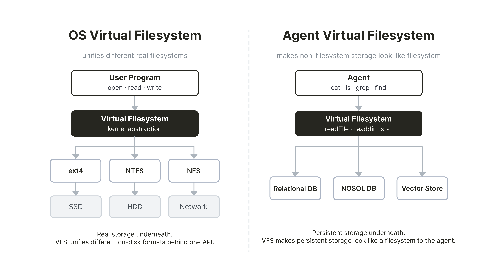
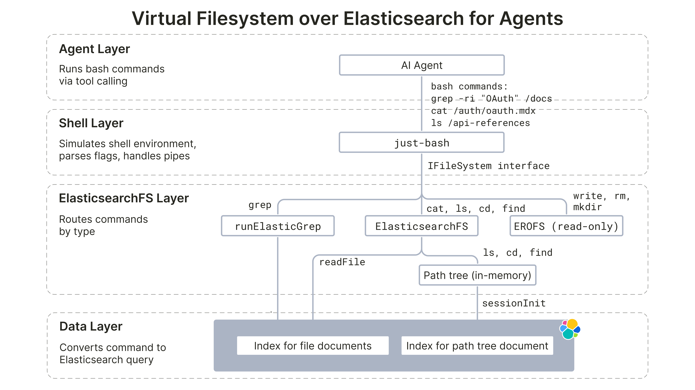

# Implementing a virtual filesystem over Elasticsearch

> Source: [Leonie Monigatti – Implementing a virtual filesystem over Elasticsearch](https://leoniemonigatti.com/blog/virtual-filesystem-elasticsearch.html)
>
> Published: May 5, 2026

Giving an agent `grep` and `cat` over Elasticsearch.

How to implement a virtual filesystem over persistent data storage, such as an Elasticsearch database, to give AI agents access to shell commands, like `grep` and `cat`.

## On this page

- [Implementing a virtual filesystem over Elasticsearch](#implementing-a-virtual-filesystem-over-elasticsearch)
  - [On this page](#on-this-page)
  - [What is a "virtual filesystem" for agents](#what-is-a-virtual-filesystem-for-agents)
  - [Architecture Overview](#architecture-overview)
  - [Implementation details](#implementation-details)
    - [Access control via DLS](#access-control-via-dls)
    - [`ls`, `cd`, `find`: Navigating the filesystem](#ls-cd-find-navigating-the-filesystem)
    - [`cat`: Reading files](#cat-reading-files)
    - [`grep`: The two-stage optimization](#grep-the-two-stage-optimization)
  - [Known Limitations](#known-limitations)
  - [Trying it out](#trying-it-out)
  - [Summary](#summary)
  - [References](#references)

---

LLMs have been trained on vast amounts of shell sessions and codebases. That's why agents are naturally good at using CLIs and navigating filesystems.

A recent [blog post describing how LangSmith Agent Builder's memory system is built on a filesystem](https://x.com/hwchase17/status/2011814697889316930) kicked off a discussion about whether "filesystems are all you need". Harrison Chase, LangChain's CEO and the blog's author, later clarified that they actually don't store the data in a real filesystem but in a database and only expose it to the agent in the shape of a filesystem. A few weeks later, [Mintlify described how they built a virtual filesystem on top of their existing database](https://www.mintlify.com/blog/how-we-built-a-virtual-filesystem-for-our-assistant) to enable an agent to run `cat`, `ls`, `grep`, and `find` via the `just-bash` library.

Inspired by these blogs, I explore how you can **implement a virtual filesystem over Elasticsearch**. This is intended as a **proof-of-concept** implementation and aims to stay as close as possible to the architecture described in the Mintlify blog. You can find the resulting implementation of `ElasticsearchFs` at iamleonie/elasticsearch-fs.

## What is a "virtual filesystem" for agents

The term "virtual filesystem" is traditionally used in the context of operating systems. There, a [virtual filesystem](https://en.wikipedia.org/wiki/Virtual_file_system) is the layer that lets every program use the same `open`, `read`, and `write` calls whether it's reading from an SSD, a USB stick, or a network share.

In the context of AI agents, a virtual filesystem describes a filesystem-shaped interface on top of persistent storage, such as a relational database, a vector store, or, as in this case, Elasticsearch. This lets the agent use `ls`, `cat`, `find`, and `grep` over the stored data. The agent running, for example, `grep -r "access_token" /docs` is searching a filesystem and doesn't know it's interacting with a search index. Thus, commands like `grep` become an interface, the implementation of which can make use of powerful search features, such as vector search or hybrid search.



## Architecture Overview

The resulting implementation of the `ElasticsearchFs` virtual filesystem has four layers, similar to the Mintlify blog:

1. **Agent layer:** The LLM agent runs shell commands via tool calls.
2. **Shell layer:** `just-bash` is a TypeScript library that intercepts those shell command strings, parses flags, handles pipes, and dispatches to a `IFileSystem` interface.
3. **`ElasticsearchFs` layer:** Implements the `IFileSystem` interface against the underlying data layer.
4. **Data layer:** Data is stored in an Elasticsearch Serverless cluster.



*"Virtual filesystem for AI agents over a Database (Elasticsearch)"。*

In addition to the implementation described in the Mintlify blog, we also consider the following [design guidelines for virtual filesystems described in the LangChain documentation](https://docs.langchain.com/oss/python/deepagents/backends#use-a-virtual-filesystem):

- **Absolute path handling and normalization.** Paths are always absolute. `normalizePath` ensures any path the agent passes is canonicalized before any tree lookup or Elasticsearch call (e.g., `auth/oauth` becomes `/auth/oauth`).
- **Implement `ls` and `glob` efficiently (server-side filtering where available, otherwise local filter).** Both operations run in-memory after session boot without any Elasticsearch calls.
- **Handle errors explicitly:** LangChain's guideline recommends structured result types with an error field for missing files or invalid patterns. Since our implementation builds on top of `just-bash`, we use POSIX-style `ErrnoException` errors (`ENOENT`, `ENOTDIR`, `EROFS`). Additionally, we follow Mintlify's **read-only** design and thus every write operation throws `EROFS`.

## Implementation details

The implementation splits into four areas: access control, filesystem navigation, file reading, and file search. You can find the full implementation in the `elasticsearch-fs` repository.

### Access control via DLS

`ElasticsearchFs` delegates file access control to Elasticsearch [Document Level Security](https://www.elastic.co/docs/deploy-manage/users-roles/cluster-or-deployment-auth/controlling-access-at-document-field-level#document-level-security) (DLS): Each query gets attached to an Elasticsearch role, and every request made under that role is automatically filtered by that query at search time. This reduces the chance of accidental data leaks because access checks are enforced in the data layer for every query path.

For this POC implementation, we follow the example path tree policy shape from the Mintlify blog with three roles: `PUBLIC`, `BILLING`, and `INTERNAL`. Additionally, we have a fourth role `SYSTEM` for ingestion.

| Path | PUBLIC | INTERNAL | BILLING | SYSTEM |
| --- | --- | --- | --- | --- |
| /auth/oauth.mdx | x | x | x | x |
| /auth/api-keys.mdx | x | x | x | x |
| /internal/billing.mdx | - | x | x | x |
| /internal/audit-log.mdx | - | x | - | x |
| /api-reference/users.mdx | x | x | x | x |
| /api-reference/payments.mdx | - | - | x | x |
| /api-reference/search-use-case/* | x | x | x | x |

The roles are created and attached to an API key in the Serverless project by setting privileges as follows:

```json
{
  "PUBLIC": {
    "cluster": [],
    "indices": [
      {
        "names": ["elasticsearchfs-chunks"],
        "privileges": ["read"],
        "query": {
          "bool": {
            "should": [
              { "prefix": { "slug": "auth/" } },
              { "prefix": { "slug": "api-reference/search-use-case/" } },
              { "term": { "slug": "api-reference/users" } }
            ],
            "minimum_should_match": 1
          }
        }
      },
      {
        "names": ["elasticsearchfs-meta"],
        "privileges": ["read"]
      }
    ]
  }
}
```

### `ls`, `cd`, `find`: Navigating the filesystem

`ElasticsearchFs` follows a similar startup shape as the Mintlify blog. The ingestion step writes a `__path_tree__` document to a metadata index (`elasticsearchfs-meta`), and each session loads that one document first.

```typescript
const doc = await client.get({
  index: 'elasticsearchfs-meta',
  id: '__path_tree__',
});

const json = Buffer.from(payload, 'base64').toString('utf8');
const pathTree = JSON.parse(json);
```

Visibility is then resolved by pruning that path tree with the selected runtime profile (`PUBLIC`, `BILLING`, `INTERNAL`, `SYSTEM`) against `isPublic` and `groups`. That means a `BILLING` session never lists `/internal/audit-log.mdx`, and probing that path returns `ENOENT` because the path doesn't exist in the profile-scoped tree.

The visible slugs are transformed into two compact structures:

- `Set<string>` of canonical file paths
- `Map<string, string[]>` from directory path to child names.

After session initialization, `ls`, `cd`, and `find` are all tree-walking operations over the same in-memory state and do not need to query Elasticsearch. `ls` reads direct children from `dirs`, `cd` validates whether a target directory exists in that map, and `find` traverses the `dirs` graph recursively while checking `files` for leaf paths.

### `cat`: Reading files

Reading files is a single Elasticsearch call. When the agent runs `cat /auth/oauth.mdx`, `just-bash` calls `readFile`, which resolves the path to the slug `auth/oauth` and queries Elasticsearch for that slug:

```typescript
async readFile(path: string): Promise<string> {
  const slug = this.resolveReadFileSlug(path);

  const results = await this.client.search<FileHitSource>({
    index: ELASTICSEARCHFS_FILES_INDEX,
    size: 1,
    _source: ['content'],
    query: {
      bool: {
        filter: [{ term: { slug } }],
      },
    },
  });

  const hit = results.hits.hits[0];
  const content = hit?._source?.content;
  if (content === undefined) {
    throw enoent();
  }

  return content;
}
```

Additionally, `resolveReadFileSlug` rejects directory paths with `ENOTDIR` and unknown paths with `ENOENT` before any network call.

### `grep`: The two-stage optimization

Similar to Mintlify, we implement a two-stage optimization for the `grep` implementation because a naive `grep -r` would read every in-scope file over the network. However, `just-bash`'s `defineCommand` hook lets us register a custom `grep`, which allows us to implement a two-stage `grep` optimization. The custom `grep` receives raw argv tokens, which we parse with `yargs-parser`.

The **first stage (coarse filtering)** narrows the candidate set first by running a search query over the database. Depending on the pattern shape, it chooses a query type for literal patterns or regex patterns.

Literal patterns (`-F` / `--fixed-strings`, or no regex metacharacters) are split into two coarse-query shapes. First, ignore-case literals (`-i`) use `match_phrase` on `content`:

```json
{
  "query": {
    "bool": {
      "filter": [{ "terms": { "slug": ["<slugs-in-scope>"] } }],
      "must": [{ "match_phrase": { "content": "<literal-pattern>" } }]
    }
  }
}
```

On the other hand, case-sensitive literals use `regexp` on `content.pattern` with an escaped literal:

```json
{
  "query": {
    "bool": {
      "filter": [{ "terms": { "slug": ["<slugs-in-scope>"] } }],
      "must": [
        {
          "regexp": {
            "content.pattern": {
              "value": ".*(<escaped-literal-pattern>).*",
              "case_insensitive": false
            }
          }
        }
      ]
    }
  }
}
```

Regex patterns use `regexp` on `content.pattern`, which is a `wildcard` multi-field. Note that running [`regexp` on the `content` field is possible as well but only allows term-level matching](https://www.elastic.co/docs/reference/query-languages/query-dsl/query-dsl-regexp-query).

```json
{
  "query": {
    "bool": {
      "filter": [{ "terms": { "slug": ["<slugs-in-scope>"] } }],
      "must": [
        {
          "regexp": {
            "content.pattern": {
              "value": ".*(<regex-pattern>).*"
            }
          }
        }
      ]
    }
  }
}
```

In the **second stage (fine-filter)**, each candidate slug is read via `readFile`. The content is split on line boundaries and each line is tested against a compiled `RegExp` (or a plain `includes` check for fixed-string patterns).

```typescript
  // Coarse Filter: Ask backing store for slugs matching the string/regex
  const matchedSlugs = await elasticsearchFs.findMatchingFiles(
      coarseFilter,
      slugsUnderDirs,
    );

  if (matchedSlugs.length === 0) return { stdout: '', stderr: '', exitCode: 1 };

  // Fine Filter: Narrow to resolved hit paths.
  const matchedPaths = matchedSlugs.map((slug) => slugToPath(slug));

  // Exec: Let the in-memory RegExp engine format the final output
  return execBuiltin(
    scannedArgs,
    matchedPaths,
    elasticsearchFs,
    shouldPrefixFilePath,
  );
```

## Known Limitations

This implementation is a POC and has the following known limitations:

- **Coarse grep can produce false negatives.** The coarse stage uses Elasticsearch/Lucene regexp syntax while the fine stage uses JavaScript `RegExp`. This mismatch can produce false negatives before validation.
- **No bulk-prefetch.** Mintlify's grep coarse stage identifies candidate files in the data store, then bulk-fetches all matching chunks into a cache before the fine-filter pass, so large recursive queries complete in milliseconds. `ElasticsearchFs` reads each candidate file individually via `readFile`, with no in-process cache.
- **`stat` returns placeholder metadata.** `size` is always `0` and `mtime` is always epoch — `stat` makes no Elasticsearch call. Session boot loads only path-tree metadata (and not per-file timestamps/sizes); although `updated_at` exists on documents, this implementation does not materialize it into the in-memory tree. The practical consequence: `ls -l`, `find -mtime`, and `find -size` are not truthful.
- **`.mdx`-only file type.** The path tree is keyed on `/<slug>.mdx` exclusively. Files with any other extension cannot be represented in the tree and are invisible to the agent.

## Trying it out

You can use the virtual filesystem over Elasticsearch as follows:

```typescript
import { ElasticsearchFs } from '../src/core/elasticsearchfs.js';
import { runElasticGrep } from '../src/core/grep.js';
import { Bash, defineCommand } from 'just-bash';
import { createESClient } from '../src/es-adapter/client.js';
import { initSessionTree } from '../src/session.js';

// 1. Initialize ES client with the user profile
const profile = "PUBLIC"
const client = createESClient(profile);

// 2. Initialize the path tree 
const session_tree = await initSessionTree(client, profile);

// 3. Initialize the virtual filesystem
const elasticsearchFs = new ElasticsearchFs({
  client: client,
  files: session_tree.files,
  dirs: session_tree.dirs,
});

// 4. Define custom grep command
const grep = defineCommand('grep', async (args, ctx) =>
  runElasticGrep(args, ctx, elasticsearchFs),
);

// 5. Initialize Bash instance over Elasticsearch backend with custom grep command 
const bash = new Bash({
  fs: elasticsearchFs,
  cwd: '/',
  customCommands: [grep],
});

// 6. Usage examples
await bash.exec('grep -ri "OAuth" /auth');
await bash.exec('cat /auth/oauth.mdx');
await bash.exec('ls /api-reference');
```

## Summary

This blog implements `ElasticsearchFs`, a virtual filesystem over Elasticsearch. It is built on top of `just-bash` and exposes `cat`, `ls`, `cd`, `find`, and `grep` for an agent while keeping access control close to the data. This POC has not been benchmarked. The goal is to explore the architecture and implementation, not to validate latency or cost claims.

The code is available in the repository. For a more production-ready implementation, the next upgrades could be an in-process/remote cache for repeated file reads during grep-heavy sessions or a semantic search alternative to `grep`. Note that the latter would require additional chunking on the files and reassembly at query time.

## References

- Mintlify. [*How we built a virtual filesystem for our assistant*](https://www.mintlify.com/blog/how-we-built-a-virtual-filesystem-for-our-assistant)
- Vercel Labs. `just-bash` GitHub repository
- LangChain. [*Design guidelines: Use a virtual filesystem*](https://docs.langchain.com/oss/python/deepagents/backends#use-a-virtual-filesystem)
