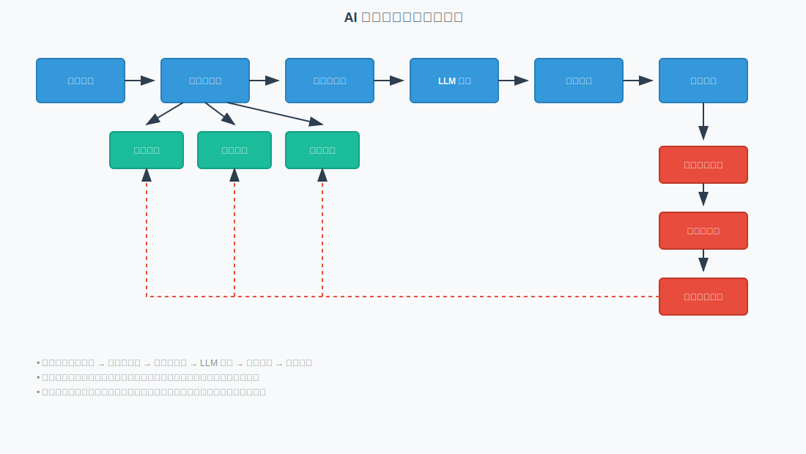

# AI 智能体记忆系统

上下文窗口再大也有边界，一旦 Agent 需要跨会话记住用户偏好、业务知识和历史决策，独立的长程记忆系统就从「错也不错」变成必选项。本目录按「理论 → 架构 → 案例 → 代码」四层组织内容，完整梳理从底层机制、分层记忆模式，到 MemoryOS / Mem0 / LangChain Memory 等主流方案的工程落地路径。

---

## 目录

- [AI 智能体记忆系统](#ai-智能体记忆系统)
  - [目录](#目录)
  - [1. 记忆系统架构与内容导览](#1-记忆系统架构与内容导览)
    - [1.1 通用架构总览](#11-通用架构总览)
    - [1.2 核心文档索引](#12-核心文档索引)
  - [2. 主流记忆系统横向对比](#2-主流记忆系统横向对比)
    - [2.1 架构与特性对比](#21-架构与特性对比)
    - [2.2 性能基准对比](#22-性能基准对比)
  - [3. 参考资源](#3-参考资源)
    - [3.1 官方与开源项目](#31-官方与开源项目)
    - [3.2 核心学术文献](#32-核心学术文献)

---

## 1. 记忆系统架构与内容导览

不同记忆系统表面上的差异很大，但内核上都在回答同样几个问题：要记什么、放在哪里、怎么检索、什么时候更新。本节先给出一张综合主流方案后的分层架构图，再补充一份按「理论 / 架构 / 案例 / 代码」分类的文档索引，把从概念到代码的路径一次打通。

### 1.1 通用架构总览

> [!NOTE]
> **架构说明**：以下通用架构图基于现有 AI Agent 记忆系统的主流设计模式，综合参考了 MemoryOS [3]、Mem0 [4]、LangChain Memory 等系统的架构特点。

现代智能体记忆系统通常采用增强型分层架构设计，融合了智能调度、多策略检索和质量评估等先进功能：

- **主流程（蓝色）**：处理用户输入，通过多策略检索（语义/关键词/图谱）构建高质量上下文，最终生成响应。
- **记忆层（绿色）**：分为短期（会话缓存）、中期（向量索引/语义搜索）和长期（知识图谱/规则库）三层。
- **更新流程（红色）**：基于用户反馈和质量评估（相关性/准确性/时效性），执行个性化学习与记忆动态更新。

### 1.2 核心文档索引

记忆系统的学习资料数量很多，但写作视角差异明显——有人从理论模型出发，有人从框架实现拆解，有人则贴着真实产品（如 Claude Code、SuperMemory）的落地细节。下面这张表按「理论 / 架构 / 案例 / 代码」分类了本目录的文献，让你根据自己的阅读偏好快速穿越。

| 分类           | 文档链接                                                                                  | 核心内容与适用对象                                      |
| -------------- | ----------------------------------------------------------------------------------------- | ------------------------------------------------------- |
| **理论与综述** | [AI 智能体记忆系统：理论与实践](./research/theory/ai-agent-memory-theory.md)              | 详解分层记忆机制及演进路径，适合架构师 [1, 5]。         |
|                | [大模型 Agent 记忆综述](./research/theory/llm-agent-memory-survey.md)                     | 梳理记忆系统的数学模型与研究背景，适合研究人员 [2, 6]。 |
|                | [记忆系统演进思考](./research/theory/memory-systems-are-dead.md)                          | 探讨独立记忆系统向 Agent 框架内化的结构性演进趋势。     |
| **系统与架构** | [MemoryOS 开发指南](./research/systems/memoryos-architecture-guide.md)                    | 模块化架构设计、系统配置及调优建议。                    |
|                | [MemMachine 深度解析](./research/systems/memmachine-deep-dive.md)                         | 重新定义智能体交互体验与长程记忆管理。                  |
|                | [Mem0 快速入门](./research/systems/mem0-quickstart.md)                                    | 托管平台与自建版本的快速集成指南，适合应用开发者。      |
|                | [Hermes 内存架构解析](./research/systems/hermes-agent-memory-management.md)               | 深度解析 Hermes Agent 的四层内存栈架构与设计哲学。      |
| **案例与分析** | [Claude Code 记忆分析](./research/case-studies/claude-code-memory-analysis.md)            | 基于 Markdown 文件的极简本地持久化记忆生态。            |
|                | [Claude Code 执行流](./research/case-studies/claude-code-agent-execution-flow.md)         | Agent 核心循环与深度 AST 结构感知的代码库探索。         |
|                | [SuperMemory 集成分析](./research/case-studies/supermemory-agent-integration-analysis.md) | 针对第二大脑应用的外部记忆集成方案剖析。                |
| **实战代码**   | [LangChain 记忆实践](./langchain/langchain_memory.md)                                     | 核心 API 详解及 LangGraph 状态管理应用。                |
|                | [实战代码目录](./langchain/code/index.md)                                                | 包含指代消解对话系统与微服务部署的完整演示项目。        |

---

## 2. 主流记忆系统横向对比

多维度对比 MemoryOS、Mem0 和 LangChain Memory 三种主流记忆系统框架，旨在为开发者在不同业务场景下的技术选型提供量化依据。

### 2.1 架构与特性对比

核心架构、存储介质及适用场景决定了记忆系统的基础能力上限。以下通过对比这些关键维度，直观呈现不同系统的技术侧重点。

| 特性         | MemoryOS                     | Mem0                         | LangChain Memory             |
| ------------ | ---------------------------- | ---------------------------- | ---------------------------- |
| **核心架构** | 模块化分层架构（短/中/长）   | 云原生架构（用户/会话/代理） | 链式/缓冲式记忆管理          |
| **存储方式** | 本地文件 + 向量存储          | 向量数据库                   | 内存 + 基础持久化            |
| **适用场景** | 企业级应用、需要数据隐私控制 | 快速构建原型、使用托管服务   | 简单对话系统、LangChain 生态 |
| **检索性能** | < 100 ms                     | < 50 ms                      | 依赖本地实现                 |
| **扩展能力** | 优秀                         | 优秀                         | 良好                         |

### 2.2 性能基准对比

为直观评估各记忆系统在实际运行中的表现，本节从准确率、Token 节省率等维度对主流系统进行了基准测试数据对比，以辅助企业级应用选型。

> [!NOTE]
> **数据说明**：Mem0 数据基于 LOCOMO 基准测试；MemoryOS 数据标注 `*` 来自其学术论文；LangChain 数据基于社区报告。

| 指标             | MemoryOS       | Mem0         | LangChain Memory |
| ---------------- | -------------- | ------------ | ---------------- |
| **准确率**       | 89.7%\*        | 85.2%        | 45.7%            |
| **Token 节省率** | 高度优化\*     | 90%          | 无明显优化       |
| **响应速度提升** | 60%\*          | 91%          | 基线水平         |
| **系统资源占用** | CPU / 内存中等 | CPU / 内存低 | 内存占用较高     |

---

## 3. 参考资源

### 3.1 官方与开源项目

- MemoryOS GitHub
- Mem0 GitHub
- [LangChain Memory 官方文档](https://python.langchain.com/docs/modules/memory/)

### 3.2 核心学术文献

[1] Yaxiong Wu et al., "From Human Memory to AI Memory: A Survey on Memory Mechanisms in the Era of LLMs," arXiv preprint arXiv:2504.15965, 2025.
[2] Zeyu Zhang et al., "A Survey on the Memory Mechanism of Large Language Model based Agents," arXiv preprint arXiv:2404.13501, 2024.
[3] Jiazheng Kang et al., "Memory OS of AI Agent," arXiv preprint arXiv:2506.06326, 2025.
[4] Prateek Chhikara et al., "Mem0: Building Production-Ready AI Agents with Scalable Long-Term Memory," arXiv preprint arXiv:2504.19413, 2025.
[5] Zihong He et al., "Human-inspired Perspectives: A Survey on AI Long-term Memory," arXiv preprint arXiv:2411.00489, 2024.
[6] OpenAI et al., "GPT-4 Technical Report," arXiv preprint arXiv:2303.08774, 2023.
