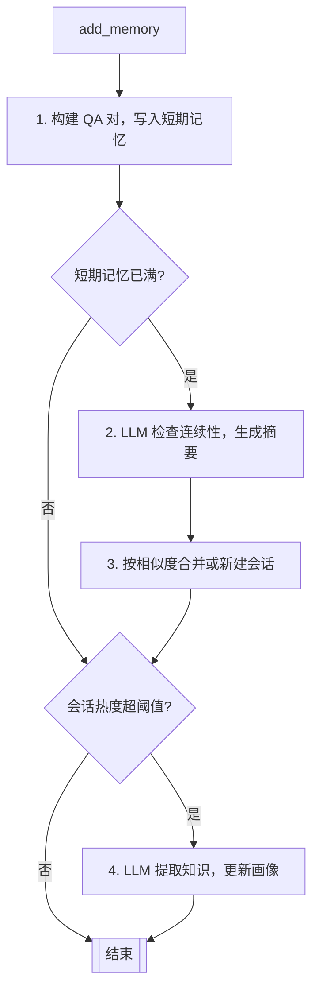
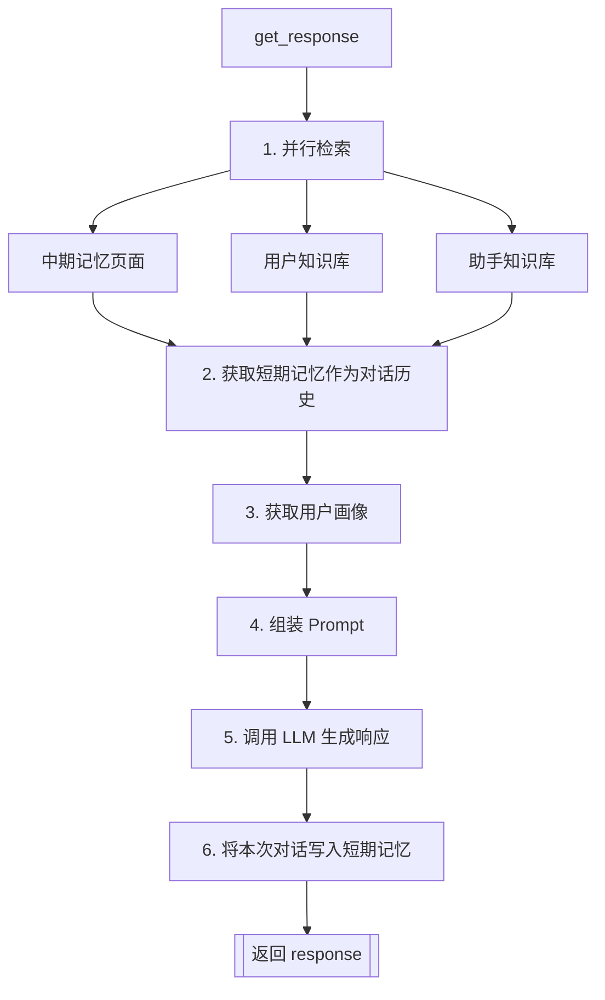

# MemoryOS 智能记忆系统架构设计与开发指南（2026-03）

## 目录

- [MemoryOS 智能记忆系统架构设计与开发指南（2026-03）](#memoryos-智能记忆系统架构设计与开发指南2026-03)
  - [目录](#目录)
  - [1. 概述](#1-概述)
  - [2. 快速开始](#2-快速开始)
    - [2.1 安装 MemoryOS](#21-安装-memoryos)
    - [2.2 从传统 LLM 调用迁移](#22-从传统-llm-调用迁移)
    - [2.3 基础使用示例](#23-基础使用示例)
      - [2.3.1 初始化 MemoryOS](#231-初始化-memoryos)
      - [2.3.2 添加记忆和获取响应](#232-添加记忆和获取响应)
  - [3. 系统架构](#3-系统架构)
    - [3.1 架构总览](#31-架构总览)
    - [3.2 三层记忆模块](#32-三层记忆模块)
    - [3.3 编排模块](#33-编排模块)
    - [3.4 存储架构](#34-存储架构)
  - [4. 核心流程](#4-核心流程)
    - [4.1 写入流程（add_memory）](#41-写入流程add_memory)
    - [4.2 读取流程（get_response）](#42-读取流程get_response)
    - [4.3 自动升级机制](#43-自动升级机制)
  - [5. 配置参考](#5-配置参考)
    - [5.1 构造函数参数](#51-构造函数参数)
    - [5.2 方法参数](#52-方法参数)
    - [5.3 调优建议](#53-调优建议)
  - [6. 注意事项](#6-注意事项)

---

## 1. 概述

当前 AI 助手在多轮对话中普遍缺乏跨会话的记忆持久化能力，导致用户偏好和历史上下文无法延续，个性化体验难以实现。MemoryOS 针对这一问题，为 AI 助手提供了一套智能记忆管理系统。系统采用三层记忆架构（短期 → 中期 → 长期），借鉴操作系统的内存管理机制，通过基于热度的自动升级实现知识沉淀；存储层支持 JSON + FAISS 和 ChromaDB 两种可插拔后端，适应从原型开发到生产环境的不同场景。本文档涵盖快速开始、系统架构、核心流程与配置参考，帮助开发者快速上手并理解内部运作原理。

---

## 2. 快速开始

MemoryOS 提供了简便的安装和集成方式，无论是全新项目还是从现有的基于大语言模型的应用进行迁移，只需寥寥数行代码即可完成智能记忆模块的挂载。

### 2.1 安装 MemoryOS

系统已发布至官方软件源，支持通过包管理工具直接引入，同时也开放了完整的源代码供深度定制。

```bash
# 使用 pip 安装
pip install memoryos-pro

# 或从源码安装
git clone 
cd MemoryOS/memoryos-pypi
pip install -r requirements.txt
```

### 2.2 从传统 LLM 调用迁移

引入 MemoryOS 的核心范式转变是：将对 LLM 的直接调用替换为对 MemoryOS 的调用。传统方式需要开发者手动维护 `messages` 历史列表，且内容在进程退出后全部丢失；而 MemoryOS 自动管理短期对话历史、自动提取和检索跨会话知识，开发者只需关注业务逻辑。

**之前（传统 LLM 调用）**：

```python
from openai import OpenAI

client = OpenAI(api_key="your-api-key")
history = []  # 手动维护对话历史，进程退出后丢失

def chat(user_input: str) -> str:
    history.append({"role": "user", "content": user_input})
    response = client.chat.completions.create(
        model="gpt-4o-mini",
        messages=history
    )
    reply = response.choices[0].message.content
    history.append({"role": "assistant", "content": reply})
    return reply
```

**之后（使用 MemoryOS）**：

```python
from memoryos import Memoryos

# 初始化内存操作系统实例
memo = Memoryos(
    user_id="user123",
    openai_api_key="your-api-key",
    data_storage_path="./memoryos_data"
)

def chat(user_input: str) -> str:
    # 自动检索记忆、构建 Prompt、调用 LLM、并将对话写入记忆
    return memo.get_response(query=user_input)
```

两种方式的关键差异：

| 对比项         | 传统 LLM 调用            | MemoryOS                        |
| -------------- | ------------------------ | ------------------------------- |
| 对话历史管理   | 手动维护 `messages` 列表 | 自动短期记忆（`deque`）         |
| 跨会话记忆     | 无，进程退出后丢失       | 自动持久化到中/长期记忆         |
| 用户画像与知识 | 无                       | 自动提取并检索                  |
| 个性化响应     | 需自行写入 System Prompt | `get_response()` 自动融入上下文 |
| 代码复杂度     | 高（需手动管理状态）     | 低（两个方法即可完成全部）      |

> [!NOTE]
> `get_response()` 的 `style_hint` 参数为预留参数，功能尚未实现。如需注入自定义 System Prompt，当前版本需直接修改 `prompts.py` 中的模板。

### 2.3 基础使用示例

MemoryOS 的核心 API 就两个：`add_memory()` 和 `get_response()`。大多数场景下只需使用 `get_response()`，它在返回响应后会自动调用 `add_memory()` 将本轮对话写入记忆，形成闭环。

> [!NOTE]
> 主动调用 `add_memory()` 适用于需要将外部来源的信息（如第三方数据、用户资料）注入记忆的场景。

#### 2.3.1 初始化 MemoryOS

在应用启动阶段，通过传入用户唯一标识与存储路径即可实例化系统核心控制器，自动加载该用户的历史状态。

```python
from memoryos import Memoryos

# 创建 MemoryOS 实例
memo = Memoryos(
    user_id="user123",                    # 用户唯一标识
    openai_api_key="your-api-key",        # OpenAI API 密钥
    data_storage_path="./memoryos_data",   # 数据存储路径
    assistant_id="assistant",             # 助手标识
    llm_model="gpt-4o-mini"               # LLM 模型
)
```

#### 2.3.2 添加记忆和获取响应

使用 `add_memory()` 存储对话，使用 `get_response()` 获取基于记忆的智能响应：

```python
# 添加对话记忆
memo.add_memory(
    user_input="我喜欢喝咖啡，特别是拿铁",
    agent_response="好的，我记住了您喜欢拿铁咖啡。"
)

# 获取智能响应（内部并行检索记忆、构建 Prompt、调用 LLM，详见第 4.2 节）
response = memo.get_response(
    query="推荐一些咖啡给我",
    relationship_with_user="friend",  # 可选：影响回复风格，默认 "friend"
)
print(response)  # 返回 str 类型，即 LLM 基于记忆上下文生成的个性化回复
```

---

## 3. 系统架构

MemoryOS 的架构设计灵感来源于操作系统的内存管理机制——通过分层存储和智能调度，在有限资源下实现高效的数据访问。系统采用“三层记忆 + 双编排器”架构：三层记忆（短期/中期/长期）负责数据存储，Updater 和 Retriever 两个编排器分别负责写入和读取路径。存储层提供文件存储和 ChromaDB 两种独立版本，上层 API 接口保持一致。

### 3.1 架构总览

下图展示了 MemoryOS 的整体架构。`Memoryos` 类作为门面（Facade）统一对外提供 `add_memory()` 和 `get_response()` 接口。

**写入路径**：`Memoryos` 直接将 QA 对写入 `ShortTermMemory`，当短期记忆满容量时触发 `Updater.process_short_term_to_mid_term()`，由 `Updater` 将最早的 QA 对弹出、检查对话连续性、生成多主题摘要，并按相似度合并到现有会话或创建新会话。

**读取路径**：`Memoryos` 直接从 `ShortTermMemory` 获取对话历史，同时调用 `Retriever.retrieve_context()` 并行检索中期页面、用户知识和助手知识。

**长期记忆更新**：长期记忆分为两个独立实例——`user_long_term_memory`（存储用户画像和用户知识库）和 `assistant_long_term_memory`（存储助手知识库）。每次 `add_memory()` 调用后，`Memoryos._trigger_profile_and_knowledge_update_if_needed()` 检查中期会话热度是否超过阈值，超过时并行触发画像分析和知识提取。

```text
                           ┌─────────────────────┐
                           │      Memoryos       │
                           │    (Facade/Main)    │
                           └──────────┬──────────┘
                                      │
                 ┌────────────────────┴────────────────────┐
                 │                                         │
                 ▼                                         ▼
           ┌─────────────┐                           ┌─────────────┐
           │   Updater   │                           │  Retriever  │
           │  (Write)    │                           │   (Read)    │
           └──────┬──────┘                           └──────┬──────┘
                  │                                         │
                  ▼                                         ▼
    ┌─────────────────────────────────────────────────────────────────────┐
    │                           Storage Layer                             │
    │  ┌─────────────┐    ┌─────────────┐    ┌─────────────────────────┐  │
    │  │  ShortTerm  │───►│   MidTerm   │───►│       LongTerm          │  │
    │  │   Memory    │ovf │   Memory    │h>=t│  ┌─────────┐ ┌────────┐ │  │
    │  └─────────────┘    └─────────────┘    │  │User LTM │ │Asst LTM│ │  │
    │                                        │  └─────────┘ └────────┘ │  │
    │                                        └─────────────────────────┘  │
    └─────────────────────────────────────────────────────────────────────┘
```

**组件说明：**

| 组件                | 职责                                                                                                                                                                                  |
| ------------------- | ------------------------------------------------------------------------------------------------------------------------------------------------------------------------------------- |
| **Memoryos**        | 门面类，统一暴露 `add_memory()` 和 `get_response()` 接口；管理两个 LTM 实例；触发热度驱动的知识更新                                                                                   |
| **Updater**         | 写入编排器：处理对话连续性检查、LLM 多主题摘要生成、相似度匹配与会话合并/新建                                                                                                         |
| **Retriever**       | 读取编排器：使用 ThreadPoolExecutor 并行检索中期页面、用户知识、助手知识，Top-K 堆排序聚合                                                                                            |
| **ShortTermMemory** | 短期记忆：`deque` (FIFO) 存储最近 N 轮 QA 对，满容量时触发向中期记忆升级                                                                                                              |
| **MidTermMemory**   | 中期记忆：内存字典存储会话，动态 FAISS 索引支持语义检索，热度堆追踪最热门会话                                                                                                         |
| **LongTermMemory**  | 长期记忆：系统创建两个实例——`user_long_term_memory` 存储用户画像（`user_profiles`）和用户知识（`knowledge_base`）；`assistant_long_term_memory` 存储助手知识（`assistant_knowledge`） |

### 3.2 三层记忆模块

三层记忆借鉴了计算机存储层次的设计思想：短期记忆类似 CPU 缓存，容量小但访问快；中期记忆类似内存，存储经过压缩的会话摘要；长期记忆类似磁盘，持久化存储提取后的知识。记忆在层级之间的流转由容量和热度两个阈值驱动。

| 记忆层   | 类                | 存储内容                     | 默认容量        | 核心数据结构                                         |
| -------- | ----------------- | ---------------------------- | --------------- | ---------------------------------------------------- |
| 短期记忆 | `ShortTermMemory` | 最近 QA 对                   | 10 条           | `deque` (FIFO)                                       |
| 中期记忆 | `MidTermMemory`   | 会话（含摘要、页面链、热度） | 2000 个会话     | `dict` (sessions) + `list` (heap) + 动态 FAISS       |
| 长期记忆 | `LongTermMemory`  | 用户画像、用户知识、助手知识 | 100 条知识/实例 | `dict` (profiles) + `deque` (knowledge) + 动态 FAISS |

- **短期记忆**：`deque` 存储最近 N 轮 QA 对，`add_qa_pair()` 追加，`pop_oldest()` 弹出。满容量触发 `Updater` 升级。
- **中期记忆**：`sessions` 字典存储会话对象（含 `summary`、`details` 页面列表、`H_segment` 热度、`N_visit` 访问计数等）；`heap` 存储 `(-H_segment, sid)` 用于快速获取最热门会话；检索时动态构建 FAISS 索引。
- **长期记忆**：系统创建两个 `LongTermMemory` 实例。`user_long_term_memory` 使用 `user_profiles`（用户画像字典）和 `knowledge_base`（用户知识 deque）；`assistant_long_term_memory` 使用 `assistant_knowledge`（助手知识 deque）。检索时动态构建 FAISS 索引。

### 3.3 编排模块

编排模块是连接三层记忆的纽带。Updater 封装了短期→中期升级的写入路径逻辑；Retriever 封装了读取路径，使用并行检索提升响应速度。中期到长期的升级（画像分析和知识提取）由 `Memoryos` 主类的 `_trigger_profile_and_knowledge_update_if_needed()` 方法在检测到热度阈值后触发。这种设计使得记忆模块保持纯粹的存储职责，而复杂的业务逻辑集中在编排层。

| 模块   | 类          | 职责                                                                     | 依赖               |
| ------ | ----------- | ------------------------------------------------------------------------ | ------------------ |
| 更新器 | `Updater`   | 短期→中期升级：对话连续性检查、多主题摘要生成、相似度匹配与会话合并/新建 | 短期/中期记忆, LLM |
| 检索器 | `Retriever` | 并行检索、结果聚合                                                       | 中期/长期记忆      |

- **Updater**：`process_short_term_to_mid_term()` 执行流程：
  1. 从 STM 弹出最早的 QA 对（直到不再满容量，通常为 1 条）
  2. `check_conversation_continuity()` - LLM 检查相邻对话连续性
  3. `generate_page_meta_info()` - LLM 生成页面元信息
  4. `gpt_generate_multi_summary()` - LLM 生成多主题摘要和关键词
  5. `insert_pages_into_session()` - 按相似度合并到现有会话或新建会话

  详见第 4.3 节「自动升级机制」之「短期 → 中期」部分。

- **Retriever**：`retrieve_context()` 使用 `ThreadPoolExecutor(max_workers=3)` 并行执行三个检索任务：
  1. `_retrieve_mid_term_context()` - 从中期记忆检索页面：先将用户查询文本向量化，然后通过 `MidTermMemory.search_sessions()` 基于会话摘要的语义相似度筛选候选会话，再在每个会话的页面中基于页面嵌入向量计算相似度，最后使用最小堆（min-heap）维护 Top-K 页面，按相似度分数降序返回
  2. `_retrieve_user_knowledge()` - 从用户 LTM 检索知识：将用户查询文本向量化后，基于知识条目的嵌入向量进行相似度搜索
  3. `_retrieve_assistant_knowledge()` - 从助手 LTM 检索知识：将用户查询文本向量化后，基于知识条目的嵌入向量进行相似度搜索

  详见第 4.2 节「读取流程」。

### 3.4 存储架构

MemoryOS 提供两种存储后端版本，分别对应独立的子项目。默认版本（`memoryos-pypi`）使用 JSON 文件 + FAISS 索引，快速启动，适合本地开发和小规模场景；ChromaDB 版本（`memoryos-chromadb`）使用 ChromaDB 向量数据库，适合大规模数据和生产环境。两个版本的上层 API 接口保持一致，开发者可根据场景选择对应的版本。

| 特性       | 文件存储版本 (memoryos-pypi) | ChromaDB 版本 (memoryos-chromadb) |
| ---------- | ---------------------------- | --------------------------------- |
| 存储方式   | JSON 文件 + FAISS 索引       | ChromaDB 向量数据库               |
| 适用场景   | 小规模数据、快速原型         | 大规模数据、生产环境              |
| 依赖复杂度 | 低（需 faiss-cpu）           | 中（需安装 chromadb）             |

---

## 4. 核心流程

MemoryOS 对外暴露两个核心方法：`add_memory()` 和 `get_response()`。前者负责写入，将对话存入短期记忆并在必要时触发层级升级；后者负责读取，检索相关记忆并生成个性化响应。两个流程通过自动升级机制连接，形成完整的记忆生命周期：对话 → 短期记忆 → 中期摘要 → 长期知识。

### 4.1 写入流程（add_memory）

写入流程核心设计是"延迟升级"——每次调用只做必要的短期存储，仅在容量或热度触发时才执行昂贵的 LLM 操作。这避免了每次对话都调用 LLM，显著降低成本和延迟。

流程由 `Memoryos.add_memory()` 方法编排：

1. 直接将 QA 对写入 `ShortTermMemory`
2. 若 STM 满容量，调用 `Updater.process_short_term_to_mid_term()` 执行升级
3. 调用 `_trigger_profile_and_knowledge_update_if_needed()` 检查最热门会话是否超阈值，若满足条件则触发 LTM 更新

```python
memo.add_memory(
    user_input="我是一名软件工程师，主要用 Python",
    agent_response="好的，我记住了您的职业和技术栈。"
)
```

调用上述方法时，系统执行以下流程：



### 4.2 读取流程（get_response）

读取流程核心设计是"并行检索 + 上下文融合"。系统使用 `ThreadPoolExecutor` 同时检索中期记忆页面（即存储在中期记忆会话中的 QA 对页面）、用户知识和助手知识，将结果与短期对话历史融合后调用 LLM 生成响应。响应生成后会自动写入短期记忆，形成闭环。

流程由 `Memoryos.get_response()` 方法编排：

1. 调用 `Retriever.retrieve_context()` 并行检索中期页面、用户知识、助手知识
2. 调用 `ShortTermMemory.get_all()` 获取短期记忆作为对话历史
3. 调用 `user_long_term_memory.get_raw_user_profile()` 获取用户画像
4. 格式化检索结果（中期页面、用户知识、助手知识）和对话元数据
5. 组装 Prompt（System Prompt + User Prompt）
6. 调用 LLM 生成响应
7. 调用 `add_memory()` 将本次对话写入短期记忆

```python
response = memo.get_response(query="推荐一些 Python 学习资源")
```

调用上述方法时，系统执行以下流程：



### 4.3 自动升级机制

自动升级是 MemoryOS 实现知识沉淀的核心机制。系统通过两个阈值驱动记忆的层级流转：容量阈值驱动短期到中期的升级，热度阈值驱动中期到长期的升级。这种设计确保只有真正重要的信息才会被提取为持久化知识。

**短期 → 中期**（容量驱动）：当 `len(short_term_memory) >= short_term_capacity`（默认 10）时

1. 从 STM 弹出最早的 QA 对（弹出直到 STM 不再满容量，通常为 1 条）
2. `check_conversation_continuity()` - LLM 检查相邻对话连续性（逐条执行）
3. `generate_page_meta_info()` - LLM 生成页面元信息（逐条执行）
4. `gpt_generate_multi_summary()` - LLM 生成多主题摘要和关键词（批量执行）
5. `insert_pages_into_session()` - 按相似度合并到现有会话或新建会话，生成向量嵌入并更新 FAISS 索引（批量执行）

**中期 → 长期**（热度驱动）：当 `session.heat >= mid_term_heat_threshold`（默认 5.0）时

热度计算公式：

$$
H_{segment} = \alpha \cdot N_{visit} + \beta \cdot L_{interaction} + \gamma \cdot R_{recency}
$$

其中：

- $N_{visit}$：访问次数（检索命中时 +1）
- $L_{interaction}$：交互长度（对话轮次数）
- $R_{recency} = e^{-\Delta t / \tau}$：时间衰减因子（ $\tau = 24\,\text{h}$ ）
- $\alpha, \beta, \gamma$：权重系数，默认均为 1.0

热度超过阈值后，`Memoryos._trigger_profile_and_knowledge_update_if_needed()` 检查最热门会话中是否有未分析页面（`analyzed=False`）。若有，则使用 `ThreadPoolExecutor(max_workers=2)` 并行执行：

1. `gpt_user_profile_analysis()` - LLM 分析用户画像 → 更新 `user_long_term_memory.user_profiles`
2. `gpt_knowledge_extraction()` - LLM 提取知识 → 分别写入 `user_long_term_memory.knowledge_base`（用户私有知识）和 `assistant_long_term_memory.assistant_knowledge`（助手知识）
3. 将会话中所有页面标记为已分析（`analyzed=True`），重置 `N_visit` 和 `L_interaction`，更新 `last_visit_time`，重新计算 `H_segment`

> [!NOTE]
> 短期记忆升级时，LLM 会检查相邻对话的连续性，确保中期记忆中的会话具有良好的语义完整性。

---

## 5. 配置参考

MemoryOS 的核心行为由构造函数参数全面控制，开发者无需修改任何源码即可调整全系统行为。参数设计遵循"开箱即可用"的原则——所有参数均有合理默认值，仅需提供必填项（用户 ID、API 密钥、存储路径）即可运行。其余参数是性能调优旋钮：容量参数控制 LLM 调用频率和内存占用，热度阈值控制知识更新频率，相似度阈值控制会话粒度。合理配置这些参数可在成本、响应速度和记忆深度之间取得最优平衡。

### 5.1 构造函数参数

`Memoryos` 构造函数的主要参数（带 `*` 为必填）。快速上手时仅需三个必填项，其余参数均有默认值。以下示例展示了自定义配置：

```python
memo = Memoryos(
    user_id="user123",                    # 必填：用户唯一标识
    openai_api_key="your-api-key",        # 必填：OpenAI API 密钥
    data_storage_path="./memoryos_data",  # 必填：持久化存储路径
    assistant_id="my_assistant",          # 助手标识（隔离不同助手的记忆空间）
    llm_model="gpt-4o-mini",              # LLM 模型
    short_term_capacity=20,               # 短期记忆容量（默认 10）
    mid_term_heat_threshold=3.0,          # 热度升级阈值（默认 5.0）
    mid_term_similarity_threshold=0.7,    # 会话合并相似度阈值（默认 0.6）
    embedding_model_name="BAAI/bge-m3",   # 嵌入模型
)
```

| 参数                            | 默认值                         | 说明               |
| ------------------------------- | ------------------------------ | ------------------ |
| `user_id` \*                    | -                              | 用户唯一标识       |
| `openai_api_key` \*             | -                              | OpenAI API 密钥    |
| `data_storage_path` \*          | -                              | 数据存储路径       |
| `assistant_id`                  | `"default_assistant_profile"`  | 助手标识           |
| `openai_base_url`               | `None`                         | 自定义 API 地址    |
| `llm_model`                     | `"gpt-4o-mini"`                | LLM 模型           |
| `embedding_model_name`          | `"all-MiniLM-L6-v2"`           | 嵌入模型           |
| `embedding_model_kwargs`        | `None`（bge-m3 自动启用 fp16） | 嵌入模型额外参数   |
| `short_term_capacity`           | `10`                           | 短期记忆容量       |
| `mid_term_capacity`             | `2000`                         | 中期记忆容量       |
| `long_term_knowledge_capacity`  | `100`                          | 长期知识容量       |
| `retrieval_queue_capacity`      | `7`                            | 检索返回最大页面数 |
| `mid_term_heat_threshold`       | `5.0`                          | 热度升级阈值       |
| `mid_term_similarity_threshold` | `0.6`                          | 会话合并相似度阈值 |

### 5.2 方法参数

`add_memory()` 和 `get_response()` 是 MemoryOS 的两个核心方法。

**`add_memory()`**：

| 参数             | 类型   | 必填 | 说明                                             |
| ---------------- | ------ | ---- | ------------------------------------------------ |
| `user_input`     | `str`  | 是   | 用户输入文本                                     |
| `agent_response` | `str`  | 是   | 助手回复文本                                     |
| `timestamp`      | `str`  | 否   | 时间戳，默认自动生成（格式 `%Y-%m-%d %H:%M:%S`） |
| `meta_data`      | `dict` | 否   | 预留元数据字段，当前版本未使用                   |

**`get_response()`**：

| 参数                          | 类型   | 默认值     | 说明                                                                     |
| ----------------------------- | ------ | ---------- | ------------------------------------------------------------------------ |
| `query`                       | `str`  | -（必填）  | 用户查询文本                                                             |
| `relationship_with_user`      | `str`  | `"friend"` | 与用户的关系设定，影响回复风格                                           |
| `style_hint`                  | `str`  | `""`       | 预留参数，功能尚未实现，如需自定义 System Prompt 请直接修改 `prompts.py` |
| `user_conversation_meta_data` | `dict` | `None`     | 当前对话的元数据，会注入到 System Prompt 中                              |

返回值：`str`，LLM 基于记忆上下文生成的响应文本。调用结束后会自动执行 `add_memory()` 将本轮对话写入短期记忆。

### 5.3 调优建议

针对不同的业务规模与响应延迟要求，系统暴露了多维度的调节旋钮，通过平衡资源开销与上下文深度来满足定制化需求。

**容量参数**：

| 参数                            | 推荐范围 | 调优方向                           |
| ------------------------------- | -------- | ---------------------------------- |
| `short_term_capacity`           | 5-20     | 较大值减少升级频率，节省 LLM 调用  |
| `mid_term_heat_threshold`       | 3-10     | 较小值更频繁更新用户画像           |
| `mid_term_similarity_threshold` | 0.5-0.8  | 较大值会话更聚焦，较小值合并更激进 |

**模型选择**：

| 场景     | LLM 模型      | 嵌入模型                    | 说明               |
| -------- | ------------- | --------------------------- | ------------------ |
| 开发测试 | `gpt-4o-mini` | `all-MiniLM-L6-v2`          | 默认配置，成本低   |
| 生产环境 | `gpt-4`       | `BAAI/bge-m3`               | 自动启用 FP16 优化 |
| 高性能   | `gpt-4`       | `Qwen/Qwen3-Embedding-0.6B` | 更强的语义理解     |

---

## 6. 注意事项

将 MemoryOS 从开发环境迁移到生产环境时，有几个关键维度需要开发者提前了解：线程模型的边界、LLM 调用的成本结构、嵌入模型的离线部署方式，以及存储引擎的依赖管理，建议在正式上线前逐项核查：

- **线程安全**：所有记忆模块在持久化写入时使用 `threading.Lock` 保护（`load()` 未加锁），支持多线程环境下的安全写入。但同一个 `Memoryos` 实例不应在多进程间共享。
- **LLM 调用成本**：短期记忆的容量（`short_term_capacity`）直接影响 LLM 调用频率——容量越小，升级越频繁，LLM 调用越多。建议根据实际对话频率和成本预算调整此参数。
- **嵌入模型加载**：首次使用时 `sentence-transformers` 会从 HuggingFace 下载模型文件。在离线环境中，需提前下载模型并通过 `embedding_model_name` 指定本地路径。
- **FAISS 依赖**：默认存储版本（`memoryos-pypi`）依赖 `faiss-cpu`。如需 GPU 加速，可安装 `faiss-gpu`，无需修改代码。使用 ChromaDB 版本（`memoryos-chromadb`）时需额外安装 `chromadb`（`pip install chromadb`），该版本不依赖 FAISS。
- **推理标签剥离**：`clean_reasoning_model_output()` 会对所有 LLM 输出无条件剥离 `<think>` 标签，不限于特定推理模型。使用非推理模型时不受影响，但自定义 prompt 中应避免使用 `<think>` 标签以防被误剥离。
