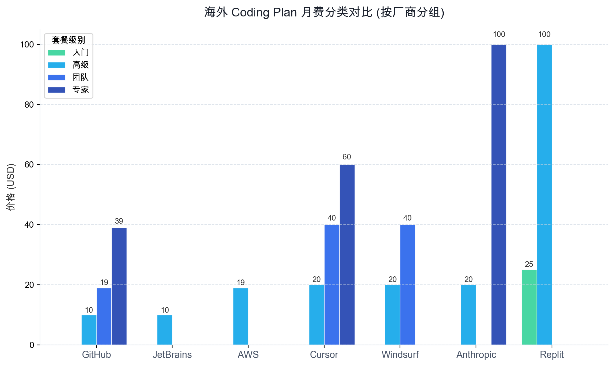
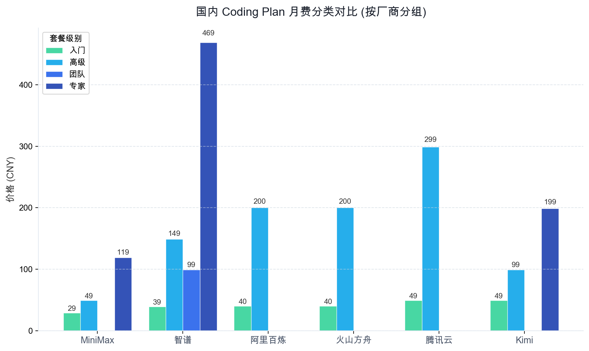

# 附录：2026 年国内外主流 Coding Plan 真实数据看板

作为《每月花多少才不冤？2026 年国内外 11 款 Coding Plan 深度对比与避坑指南》的配套数据附录，本文档直接提取归一化后的厂商定价源数据，通过结构化表格与分组柱状图，直观呈现各家工具的费用阶梯与核心用量限制，为您提供纯粹的数据查阅参考。

## 1 海外套餐数据看板

### 1.1 海外套餐详情表

基于美元（USD）计费体系，覆盖 GitHub、Cursor、Windsurf 等海外主流服务商。

| 厂商 | 产品 | 套餐 | 分类 | 月费 | 用量限制 | 限制条款 |
| --- | --- | --- | --- | --- | --- | --- |
| GitHub | GitHub Copilot | Free | **入门** | $0.0 | - | - |
| GitHub | GitHub Copilot | Pro | **高级** | $10 | 每月高级请求次数与额度以官方页面为准 | - |
| GitHub | GitHub Copilot | Pro+ | **专家** | $39 | 1,500 次高级请求/月（以官方页面为准） | - |
| GitHub | GitHub Copilot | Business | **团队** | $19 | - | - |
| GitHub | GitHub Copilot | Enterprise | **专家** | $39 | - | 购买入口为 Contact sales（以官方页面说明为准） |
| Cursor | Cursor | Hobby | **入门** | $0.0 | - | - |
| Cursor | Cursor | Pro | **高级** | $20 | 500 次快速请求/月 | - |
| Cursor | Cursor | Business | **团队** | $40.0 | - | - |
| Cursor | Cursor | Ultra | **专家** | $200.0 | - | - |
| Cursor | Cursor | Pro+ | **专家** | $60 | 1,500 次快速请求/月 | - |
| Windsurf | Windsurf (Codeium) | Free | **入门** | $0.0 | - | - |
| Windsurf | Windsurf (Codeium) | Pro | **高级** | $20 | Prompt Credits 与模型支持范围以官方页面为准 | - |
| Windsurf | Windsurf (Codeium) | Teams | **团队** | $40 | - | - |
| AWS | Amazon Q Developer | Pro | **高级** | $19 | 每月代理请求次数与包含的 LOC 额度以官方页面为准 | - |
| Anthropic | Claude (含 Claude Code) | Pro | **高级** | $20 | 约 4.4 万 Tokens（以官方页面说明为准） | - |
| Anthropic | Claude (含 Claude Code) | Max | **专家** | $100 | Max 套餐存在不同用量档位（5x 或 20x），以官方页面说明为准 | - |
| JetBrains | JetBrains AI | AI Pro | **高级** | $10 | AI Credits 额度以官方页面为准 | - |
| JetBrains | JetBrains AI | AI Ultimate | **高级** | $60 | AI Credits 额度以官方页面为准 | - |
| JetBrains | JetBrains AI | AI Enterprise | **专家** | 按需 / 未公开 | - | - |
| Replit | Replit | Core | **入门** | $25 | - | - |
| Replit | Replit | Pro | **高级** | $100 | $100 monthly credits（以官方页面说明为准） | - |

### 1.2 海外套餐月费阶梯图
  
海外工具的定价普遍以 $10–$20 作为个人开发者的标准入场门槛，而包含高阶推理模型与无限制并发特性的专家版（如 Cursor Ultra、Anthropic Max）则迅速拉升至 $100–$200 的高位区间，形成显著的消费分层。
  

## 2 国内套餐数据看板

### 2.1 国内套餐详情表

基于人民币（CNY）计费体系，重点披露国内厂商在流量控制（如 5 小时限流窗口）与 API 禁用协议方面的硬性约束条款。

| 厂商 | 产品 | 套餐 | 分类 | 月费 | 用量限制 | 限制条款 |
| --- | --- | --- | --- | --- | --- | --- |
| 阿里云 | 阿里云百炼 Coding Plan | Lite | **入门** | ¥40 | 不支持 qwen3.6-plus | 自 2026 年 3 月 20 日起停止新购；4 月 13 日起停止续费与升级 |
| 阿里云 | 阿里云百炼 Coding Plan | Pro | **高级** | ¥200 | 独家支持 qwen3.6-plus（每月请求次数与限流规则以官方页面为准） | - |
| 腾讯云 | 腾讯云 Coding Plan | Lite | **入门** | ¥49 | 1200 次请求/5 小时；9000 次请求/周；18000 次请求/月（以官方活动页说明为准） | 每日限量供应，部分活动套餐可能出现“已抢光” |
| 腾讯云 | 腾讯云 Coding Plan | Pro | **高级** | ¥299 | 6000 次请求/5 小时；45000 次请求/周；90000 次请求/月（以官方活动页说明为准） | 每日限量供应，部分活动套餐可能出现“已抢光” |
| 火山方舟 | 火山方舟 Coding Plan | Lite | **入门** | ¥40 | 每 5 小时最多约 1200 次请求；每周最多约 9000 次请求；每订阅月最多约 18000 次请求（以官方文档为准） | 不能用于 API 调用，仅在 AI 编程工具中生效（以官方文档为准） |
| 火山方舟 | 火山方舟 Coding Plan | Pro | **高级** | ¥200 | Lite 的 5 倍用量；每 5 小时最多约 6000 次请求；每周最多约 45000 次请求；每订阅月最多约 90000 次请求（以官方文档为准） | 不能用于 API 调用，仅在 AI 编程工具中生效（以官方文档为准） |
| MiniMax | MiniMax Token Plan | Starter（标准版） | **入门** | ¥29 | M2.7：600 次请求/5 小时（以官方定价文档为准） | - |
| MiniMax | MiniMax Token Plan | Plus（标准版） | **高级** | ¥49 | M2.7：1500 次请求/5 小时（以官方定价文档为准） | - |
| MiniMax | MiniMax Token Plan | Max（标准版） | **专家** | ¥119 | M2.7：4500 次请求/5 小时（以官方定价文档为准） | - |
| Kimi | Kimi Code Plan | 日常使用 | **入门** | ¥49 | 提供专属 Kimi Code 使用额度（额度口径以官方页面为准） | 需在支持的 Code Agent 工具中使用（以官方文档说明为准） |
| Kimi | Kimi Code Plan | 效率升级 | **高级** | ¥99 | 每周更新的使用额度（以官方页面说明为准） | - |
| Kimi | Kimi Code Plan | 专业优选 | **专家** | ¥199 | 更高并发上限（以官方页面说明为准） | - |
| Kimi | Kimi Code Plan | 全能尊享 | **专家** | ¥699 | 尊享更高额度（以官方页面说明为准） | - |
| 智谱 | 智谱龙虾套餐（团队协作版） | 龙虾体验卡 | **入门** | ¥39 | 包含 3500 万 tokens（GLM-5-Turbo）（以官方页面说明为准） | 有效期：1 个月；页面显示已售罄；每个账号每类月卡限购 5 张；龙虾套餐目前仅支持 GLM-5-Turbo（以官方页面说明为准） |
| 智谱 | 智谱龙虾套餐（团队协作版） | 龙虾进阶卡 | **团队** | ¥99 | 包含 1 亿 tokens（GLM-5-Turbo）（以官方页面说明为准） | 有效期：1 个月；页面显示已售罄；每个账号每类月卡限购 5 张；龙虾套餐目前仅支持 GLM-5-Turbo（以官方页面说明为准） |
| 智谱 | 智谱龙虾套餐（团队协作版） | 联系销售 | **高级** | 按需 / 未公开 | 按需定制资源额度（以官方页面说明为准） | 页面展示为按需定制与联系销售；不提供公开固定价 |
| 智谱 | 智谱 GLM Coding Plan | Lite | **入门** | ¥49 | - | - |
| 智谱 | 智谱 GLM Coding Plan | Pro | **高级** | ¥149 | - | - |
| 智谱 | 智谱 GLM Coding Plan | Max | **专家** | ¥469 | - | - |

### 2.2 国内套餐月费阶梯图
  
国内市场的竞争使其入门定价高度收敛于 ¥30–¥50 区间，而面向高阶研发的专业版则跃升至 ¥100–¥300 的价格带，此阶梯差价本质上是开发者为突破“5 小时限流窗口”与获取大额度 API 配额所支付的溢价。
  

