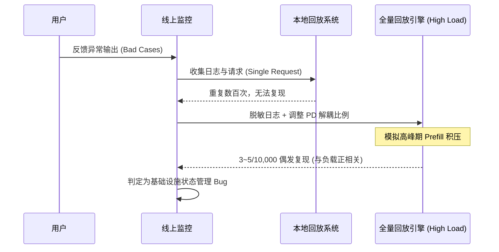
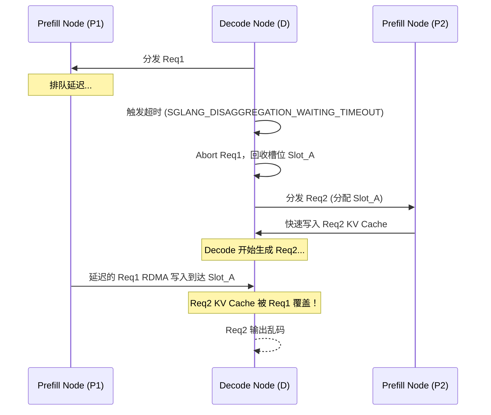
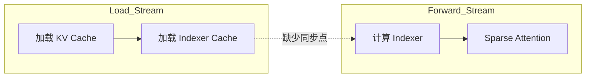
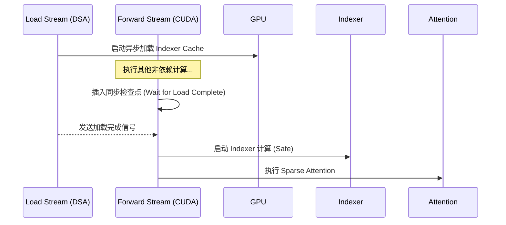
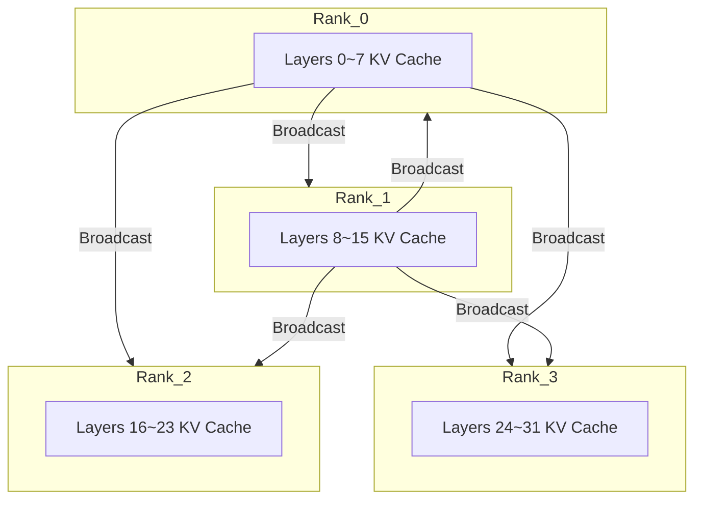
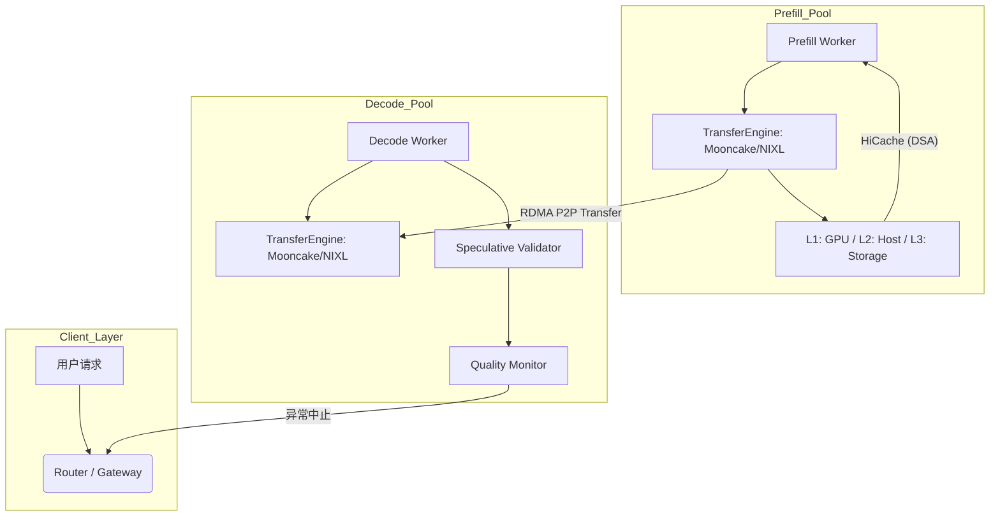

# Scaling Pain：超大规模 Coding Agent 推理实践（Tech Deep Dive）

> 原文链接：[https://z.ai/blog/scaling-pain](https://z.ai/blog/scaling-pain)

我们对 Scaling Laws 的信念不仅推动了模型参数和数据规模的不断突破，也将基础设施工程推向了极限。这一过程不可避免地伴随着成长的阵痛，我们将其称为 **Scaling Pain**。

随着大语言模型的应用超越简单的对话，转向更复杂、长周期的 Coding Agent 任务，我们的推理基础设施承受了前所未有的压力，每天需要处理数亿次 Coding Agent 请求。在过去几周中，部分用户在复杂任务中遇到了几种类型的异常输出，包括乱码、复读和生僻字。这些问题在标准推理设置下并未出现，仅在高并发、长上下文的工作负载中暴露，使得它们极难被稳定复现。

经过数周的调查、调试和压力测试，团队最终定位并修复了几个独立的底层竞态条件 Bug。我们还针对此过程中暴露的系统瓶颈进行了定向优化，显著提升了推理系统的稳定性与效率。

本技术博文将分享此次排查过程中的经验教训，深入探讨以下内容，希望能帮助社区更好地理解并克服 Coding Agent 推理的 Scaling Pain：

- 三种异常现象（乱码、复读、生僻字）的识别机制
- 投机采样指标在实时质量监控中的作用
- KV Cache 竞态问题的定位与修复（BugFix #1）
- HiCache 异步加载导致的 Read-before-ready 时序缺陷（BugFix #2）
- LayerSplit 分层缓存方案优化 Prefill 性能

---

## 1. 异常现象识别：从用户反馈到日志分析

通过建立从线上异常监控到本地高压力回放的闭环排错体系，我们成功地将偶发性的输出质量问题转化为可复现的系统负载压力测试案例，为后续的根因分析奠定了数据基础。

我们在 GLM-5 的线上系统中观察到了以下三类输出异常：

| 异常类型                     | 特征                         |
| ---------------------------- | ---------------------------- |
| **乱码（Garbled Output）**   | 输出无意义或不连贯字符       |
| **复读（Repetition）**       | 高频重复相同 token 或语句块  |
| **生僻字（Rare Character）** | 生成极少使用的中文字符或符号 |

### 1.1 排查方法

为确定问题来源是模型本身还是推理基础设施链路，我们采用了分阶段的实验复现流程：



---

## 2. 投机采样指标：输出质量的实时监控信号

将投机采样（Speculative Decoding）从单纯的推理加速手段转变为输出一致性的实时探针，通过监控草稿模型与目标模型之间的接受度波动，为长上下文生成过程中的状态损坏提供了亚毫秒级的防御性响应。

我们发现投机采样的以下两个关键指标在异常发生时呈现极其稳定的统计模式：

- `spec_accept_length`：连续接受的候选 token 长度，反映了 KV Cache 状态的一致性。
- `spec_accept_rate`：被目标模型接受的草稿 token 比例，反映了生成分布的确定性。

### 2.1 异常与指标关联性（原理分析）

在长上下文生成过程中，投机采样的本质是“草稿模型”与“目标模型”之间关于上下文概率分布的一致性校验。当发生底层内存错误时，这种一致性会被打破，从而表现为特定的统计学异常：

| 异常类型      | spec_accept_length | spec_accept_rate | 状态解释                                                                                                                                                                      |
| ------------- | ------------------ | ---------------- | ----------------------------------------------------------------------------------------------------------------------------------------------------------------------------- |
| 乱码 / 生僻字 | 极低（< 1.0）      | 中等偏低         | **KV Cache 竞态污染**导致目标模型读取到错乱上下文，其输出分布崩溃（趋向随机的低频词）。由于目标模型与草稿模型分布产生巨大鸿沟，导致目标模型几乎 100% 拒绝草稿模型的正常预测。 |
| 复读          | 偏高               | 极高（> 0.96）   | **Attention 模式坍缩**导致注意力权重过度集中在最近生成的几个词上。模型陷入极高置信度的“死循环”（如不断预测 `the`）。此时草稿与目标模型达成畸形的一致，接受率飙升至几乎 100%。 |

> [!TIP]
> 简而言之：
>
> - **如果草稿模型给出的所有正常预测都被目标模型 100% 拒绝，那说明目标模型已经“疯了”（读到了乱码内存）。**
> - **如果一个本来应该有“创造性”的模型突然变得和“复读机”一样确定，那一定是底层的 KV Cache 状态脏了。**

### 2.2 动态异常监控（Telemetry）策略

在 SGLang 的调度器实现中，系统没有采用侵入性较强的硬拦截，而是将投机采样指标作为内部状态暴露，供外部监控系统进行异常探测：

```python
# python/sglang/srt/managers/scheduler.py
# 将 spec_accept_length 作为内部状态遥测指标暴露
if not self.spec_algorithm.is_none() and self.spec_total_num_forward_ct > 0:
    avg_spec_accept_length = (
        self.spec_total_num_accepted_tokens / self.spec_total_num_forward_ct
    )
    logger.info(f"{avg_spec_accept_length=}")
```

通过这一无侵入的日志遥测（Telemetry）机制，外部网关或监控系统可以在发现 `avg_spec_accept_length` 异常下降时，主动下发重试指令，有效防止了损坏的 KV Cache 持续污染输出。

---

## 3. BugFix #1：PD 分离架构下的 KV Cache 竞态

PD（Prefill-Decode）分离架构中异步 Abort 逻辑与底层 RDMA 写入时序的错位，是导致跨请求内存污染的根本原因。我们通过在 TransferEngine 中引入显式的状态同步确认机制，确保了 KV Cache 槽位在彻底停止写入前不会被复用。

### 3.1 异常场景描述

由于 Decode 侧在触发超时 Abort 时未同步通知 Prefill 侧，导致旧请求 Req1 的 RDMA 写入在 Req2 复用该内存块后仍在继续，从而覆盖了 Req2 的合法数据。

#### 3.1.1 竞态时间轴



### 3.2 修复方案：强制执行生命周期一致性

我们通过重构 `TransferEngine`（如 Mooncake）的 Abort 逻辑，引入了跨节点的“安全回收”信号。

- **显式通知**：Decode 侧 Abort 时必须向 Prefill 侧发送同步通知。
- **写入屏障**：Prefill 侧确认所有在途的 RDMA 操作已完成或已取消。
- **配置优化**：合理设置 `SGLANG_DISAGGREGATION_WAITING_TIMEOUT`（默认 300s），为长序列预留足够的时间窗口。

该显式状态同步确认机制经历了长期的开源社区协作演进。基础的 Abort 拦截与队列清理逻辑由 PR #8352 和 PR #6535 奠定，解决了核心的竞态冲突；PR #9817 修复了异步回收过程中的内存泄漏问题；最终通过 PR #24522 将底层的轮询确认状态（`KVPoll.Failed`）统一抽象到了所有的 Transfer Engine 后端。

---

## 4. BugFix #2：HiCache 加载时序缺陷（Read-before-ready）

在 HiCache 的多级缓存异步加载流水线中，通过引入基于内存屏障的同步点，解决了计算流与数据加载流在并行重叠时的 Read-before-ready 竞态缺陷，确保了索引计算的原子性。

### 4.1 核心问题：流水线重叠导致的非同步访问

在基于 DSA（Data Streaming Accelerator）的 HiCache 实现中，为了追求极致性能，系统将数据加载（Load Stream）与计算（Forward Stream）进行了异步重叠，但忽略了 Indexer Cache 的加载完成依赖。

> 关于 HiCache 的完整架构（HiRadixTree、L1/L2/L3 三级存储、预取与写回策略、`page_first` 内存布局等）可参阅本仓 `HiCache 深入详解` ⚠️ (原文链接)。

#### 4.1.1 原始时序缺陷



### 4.2 修复方案：引入显式同步屏障

我们在内核启动前插入了强制性的同步约束，确保计算流在感知到数据完全就绪后再进行后续处理。



此修复已作为 Pull Request #22811 提交给 SGLang 社区，显著提升了 HiCache 在高压环境下的鲁棒性。

---

## 5. 优化：KV Cache 分层存储 LayerSplit

> [!NOTE]
> 注：LayerSplit 作为一项针对长上下文的探索性优化方案，目前仍处于原型验证阶段，其核心理念和实验数据在本文中首次披露，尚未正式合入 SGLang 主分支。

通过 LayerSplit 方案重新定义分布式 KV Cache 的存储边界，在大幅降低单卡显存占用的同时，利用通信-计算重叠技术实现了吞吐量的阶梯式提升，突破了长上下文场景下的显存容量瓶颈。

### 5.1 设计背景

在 Context Parallelism (CP) 模式下，传统的全量存储方案会导致显存冗余，限制了可承载的最大上下文长度。

### 5.2 核心设计：分层切分与广播重叠

- **Layer-wise Partitioning**：每个 GPU 只负责存储部分 Transformer 层的 KV Cache。
- **Broadcast-Compute Overlap**：在计算第 N 层时，预先通过高性能网络广播第 N+1 层的数据，将通信开销隐藏在计算耗时中。

#### 5.2.1 存储架构示意



### 5.3 性能收益分析

测试环境：GLM-5.1，90% 缓存命中率。

| 上下文长度 | 基准 TPS | LayerSplit TPS | 吞吐提升  | 显存节省 |
| ---------- | -------- | -------------- | --------- | -------- |
| 40K        | 12.3     | 13.6           | +10%      | ~25%     |
| 80K        | 7.5      | 10.6           | +41%      | ~50%     |
| 120K       | 4.2      | 9.8            | **+132%** | **~75%** |

---

## 6. 总结与启示

为长上下文 Coding Agent 构建可靠的推理基础设施，需要一种超越传统性能指标的严谨工程方法，以确保端到端的模型状态完整性。

这就是 Coding Agent 推理中真正的 **Scaling Pain**：随着模型、上下文和工作负载的扩展，推理基础设施中隐藏的假设开始以模型质量故障的形式浮出水面。仅仅追求吞吐量、延迟和可用性已经不够；系统还必须保证每次生成背后模型状态的绝对正确。Scaling Laws 推动了能力的边界，但只有严谨的系统工程才能让这种能力在超大规模下保持可靠。

在 Coding Agent 推理系统中，我们面临的是一个融合了长上下文、高并发与多级缓存架构的复杂工程问题。我们分享这些经验教训，希望能帮助社区避开类似的陷阱，为未来的 AGI 构建足够鲁棒的推理基础设施。

| 维度           | 挑战                     | 核心对策                           |
| -------------- | ------------------------ | ---------------------------------- |
| **异常识别**   | 偶发性、难复现           | 利用投机采样指标建立“质量实时探针” |
| **内存一致性** | 跨节点竞态、内存复用污染 | 引入显式的 TransferEngine 状态同步 |
| **流水线安全** | 异步重叠导致的非同步读写 | 强制执行 Load-Use 排序与内存屏障   |
| **显存瓶颈**   | 长序列显存冗余           | LayerSplit 分层存储 + 通信计算重叠 |

---

## 7. 系统架构图

为了支持上述优化，SGLang 演进为一套具备强一致性保证的 PD 分离架构，通过多级缓存与高性能传输引擎（TransferEngine）协同工作。

### 7.1 组件与部署视图



---

## 8. 通用抽象设计建议（可复用系统模式）

### 8.1 模式一：异步 IO 的显式状态机

在涉及跨节点内存操作（如 RDMA）时，绝不能仅依赖本地定时器来释放资源。必须通过跨节点的事件通知机制（如 `EventPublisher`）建立完整的异步状态机，确保“分配-写入-确认-回收”的闭环。

### 8.2 模式二：将性能组件作为质量反馈源

投机采样、KV Cache 压缩等原本为了性能设计的组件，由于其对 KV Cache 状态的高度敏感性，可以作为廉价且高效的质量监控信号源（Telemetry），实现“性能与鲁棒性”的双赢。

---

## 9. 附录

### 9.1 关键术语表 (Glossary)

| 术语                     | 含义                                              |
| ------------------------ | ------------------------------------------------- |
| **Prefill**              | 输入上下文处理阶段，计算密集型                    |
| **Decode**               | 逐 token 生成阶段，显存带宽密集型                 |
| **TransferEngine**       | 负责跨节点 KV Cache 迁移的核心引擎（如 Mooncake） |
| **HiCache**              | 基于 GPU/Host/Storage 的三级分层缓存系统          |
| **Speculative Decoding** | 使用小模型预估 + 大模型验证的加速技术             |
| **PD Disaggregation**    | 将 Prefill 和 Decode 物理分离的分布式架构         |

### 9.2 相关资源

- [SGLang 官方文档](https://docs.sglang.io)
- Mooncake 传输引擎源码
- [GLM-5 模型最佳实践](https://z.ai/models/glm-5)

---

## 10. 致谢 (Acknowledgement)

本文详细介绍的发现与优化，是旨在提升大规模 Agent 推理系统鲁棒性的协作努力的成果。

本篇博客展示了我们对 Coding Agent 推理中一系列系统级问题的调查，包括问题的复现与分析，以及相应的优化措施。感谢 [**芯核纪元（XCORESIGMA Co., Ltd.）**](https://xcoresigma.com/) 和 [**中国科学院计算技术研究所 处理器芯片全国重点实验室（SKLP）**](https://sklp.ict.ac.cn/) 团队的合作与支持。
