# KV Cache 层级流水线并行

**层级流水线并行** (Layer-wise Pipelining) 是 LMCache 和 DualPath 等先进 LLM 推理系统为了解决 **KV Cache 存取延迟** 和 **显存容量限制** 而采用的核心优化机制。本文讨论的“并行”特指计算与 I/O 的重叠执行，而非多设备间的模型并行或数据并行。其核心思想是将 KV Cache 的加载/存储与 GPU 的模型层级计算进行**交错重叠处理**，从而部分掩盖 I/O 延迟并提升系统吞吐量。

本文基于 LMCache 源码解读文档 [1] 和 DeepSeek DualPath 论文 [2] 对该技术进行详细阐述。

---

## 1. 核心概念

层级流水线并行是一种 **计算与 I/O 重叠 (Computation-I/O Overlap)** 的策略，在长上下文推理场景中，它常被具体化为 **层级预填充 (Layerwise Prefill)** 技术。

### 1.1 背景与动机

在处理长上下文的预填充 (Prefill) 阶段时，GPU 的 HBM 容量往往会成为瓶颈。

- **传统方式**: 需要将整个批次 (Batch) 中所有层的激活值 (Activations) 和 KV Cache 都驻留在显存中。
- **导致后果**: 这限制了可以同时处理的批次大小，导致 GPU 计算单元无法被填满，**GPU 利用率低下**。

**层级流水线** 则利用了 LLM **逐层计算 (Layer-by-Layer Execution)** 的特性：

- 在 GPU 计算第 $i$ 层时，系统在后台 **同步加载** 第 $i+1$ 层的数据；
- 或者在后台 **异步持久化** 第 $i-1$ 层的数据。

下图展示了普通推理与层级流水线推理的时间线对比：

```mermaid
gantt
    dateFormat  s
    axisFormat  %S
    title 推理模式对比：串行 vs 层级流水线

    section 串行模式
    加载 Layer 0       :a1, 0, 1s
    计算 Layer 0       :a2, after a1, 1s
    加载 Layer 1       :a3, after a2, 1s
    计算 Layer 1       :a4, after a3, 1s
    加载 Layer 2       :a5, after a4, 1s
    计算 Layer 2       :a6, after a5, 1s

    section 层级流水线
    加载 Layer 0       :b1, 0, 1s
    计算 Layer 0       :b2, after b1, 1s
    加载 Layer 1       :b3, 1, 1s
    计算 Layer 1       :b4, after b2, 1s
    存储 Layer 0       :b5, after b2, 1s
    加载 Layer 2       :b6, 2, 1s
    计算 Layer 2       :b7, after b4, 1s
    存储 Layer 1       :b8, after b4, 1s
```



> **注**：在流水线模式中，"计算 Layer $i$" 的时间被用来部分掩盖 "加载 Layer $i+1$" 和 "存储 Layer $i-1$" 的 I/O 延迟，实现交错执行。

---

## 2. 设计原理

层级流水线的设计建立在 LLM 推理计算的局部性特征之上，通过将张量计算与 I/O 硬件资源彻底解耦，并辅以精细的显存生命周期管理，从根本上打破了传统同步执行的硬件壁垒。

1. **计算局部性 (Locality) 与 逐层分配**:
   在模型的前向传播中，**每一层仅需要其对应的层特定 KV Cache**。这意味着系统不需要在显存中同时保存所有层的 KV Cache。
   - **逐层分配与释放**: KV Cache 可以在处理到特定层时才分配，并在该层计算完成后立即释放。
   - **显存复用**: GPU 在每一时刻仅需要持有当前正在计算的那一层的前向批次 KV Cache，这有效降低了峰值显存需求。

2. **资源解耦 (Resource Decoupling)**:
   - 利用 GPU 的 **DMA 引擎** 进行显存与主机内存 (H2D/D2H) 的传输；
   - 利用 **存储网卡 (SNIC)** 进行主机与远程存储的 I/O；
   - 利用 **计算网卡 (CNIC)** (如 RDMA) 进行节点间传输。
     这些 I/O 操作可以与 GPU 的 Tensor Core 计算 **异步执行**，互不干扰。

3. **显存节省 (Memory Savings)**:
   通过逐层分配和释放 KV Cache 空间，显存只需持有当前正在计算的那一层 (或几层) 数据。这使得峰值显存占用可降低至原来的 1/L（L 为模型层数），为增大 Batch Size 提供了可能，但实际收益受限于计算瓶颈和调度开销，从而在条件允许下提高 GPU 计算单元的利用率。


### 2.1 理想生命周期

在流水线中，每一层的 KV Cache 都会经历一个简化的理想生命周期，具体工程实现（如预分配、预取等）将在第 3 节详细展开：

1. **分配**：在 CPU 或显存中准备缓冲区。
2. **加载**：数据从外部存储流向 CPU 内存，再上传至 GPU 显存。
3. **计算**：参与 Attention 计算，生成新的 KV。
4. **卸载/释放**：若需持久化则回传至 CPU 写入存储，否则释放显存空间。

---

## 3. 工程实现中的具体策略

在实际工程落地中，LMCache [1] 针对 vLLM 等引擎的底层调度逻辑进行了重构，通过生成器模式与多级缓存预取策略有效隐藏了数据加载耗时，将优化重心精准锚定在降低首字延迟 (TTFT) 上。

### 3.1 生成器模式 (Generator Pattern)

LMCache 的存储和检索接口 (如 `store_layer` 和 `retrieve_layer`) 并不执行单一的阻塞操作，而是采用 Python 的 `yield` 机制构建流水线。

- **存储流程**: 将存储任务拆解为细粒度步骤嵌入在模型每一层的计算循环中：
  1. 初始化 (计算 Hash)；
  2. 等待上一层 D2H 完成；
  3. 启动当前层 D2H；
  4. 提交持久化任务。

- **检索流程**: 构建 **"生产者-消费者"** 模型。
  - **生产者**: 负责从后端 (L1-L4 存储) 读取数据；
  - **消费者**: GPU 连接器 (GPU Connector) 负责将数据拷贝至显存。

```python
# 伪代码示例：LMCache 的层级检索生成器
def retrieve_layer(self, tokens):
    # 启动阶段：预取第 0 层和第 1 层 (Prefetch-2 策略)
    prefetch(0); prefetch(1)

    for i in range(num_layers):
        # 消费者：等待第 i 层数据就绪 (可能已经在后台加载完毕)
        layer_data = wait_for_layer(i)

        # 生产者：触发第 i+2 层的预取 (保持流水线充盈)
        # 当前在计算 i，利用计算时间部分掩盖 i+2 的 I/O
        if i + 2 < num_layers:
            prefetch(i + 2)

        # 将第 i 层数据 yield 给计算引擎，进入计算阶段
        yield layer_data
```

### 3.2 预取策略 (Prefetching)

为了最大化重叠效果，LMCache 采用了 **"Prefetch-2"** 策略，即始终保持 **2 层** 的预取深度：

1. **启动阶段 (Warmup)**: 在开始计算前，立即触发 **第 0 层** 和 **第 1 层** 的加载任务。这是为了防止流水线初期出现 "气泡" (Bubble)。
2. **掩盖延迟 (Overlap)**:
   - 当 GPU 开始计算 **Layer 0** 时，I/O 系统已经在后台加载 **Layer 2**。
   - 理想情况下，计算 Layer $i$ 的时间 $T_{comp}$ 应大于或等于加载 Layer $i+2$ 的时间 $T_{io}$。
3. **流式协调 (Synchronization)**: 后续通过 `wait_for_layer_load` 在每一层计算前进行流式协调，确保数据就绪。如果 $T_{io} > T_{comp}$，则流水线会发生阻塞 (Stall)。

### 3.3 显存与内存管理

为了确保流水线在数据传输过程中不会因为频繁的内存分配而抖动，LMCache 实施了严格的内存管理策略：

- **全局预分配 (Global Pre-allocation)**: 在流水线启动前，LMCache 会一次性预分配所有层所需的 CPU 内存 (`MemoryObj`)，避免在推理关键路径上因频繁申请内存导致抖动。
- **同位置约束 (Same-location Constraint)**: 为了保证流水线的稳定性，系统强制要求同一 Key 的所有层级数据必须存储在同一个后端位置 (如都在磁盘或都在远程)，不支持跨介质碎片化存储。这简化了预取逻辑，避免了多源数据合并带来的复杂性。

### 3.4 计算与 I/O 比例的量化估算

流水线并行的有效性取决于计算时间 $T_{comp}$ 与 I/O 时间 $T_{io}$ 的比例。如果 $T_{io} > T_{comp}$，则流水线会发生阻塞。
以典型的长上下文场景为例进行简单估算：

- **假设条件**：Batch Size = 1，Sequence Length = 32K，Hidden Size = 4096，FP16 精度。
- **单层 KV Cache 大小**：$32768 \times 4096 \times 2 \times 2$ (K 和 V) $\approx 512$ MB。
- **I/O 时间 ($T_{io}$)**：若使用 PCIe 4.0 x16 (实际带宽约 24 GB/s)，单层加载时间约为 $512 \text{ MB} / 24 \text{ GB/s} \approx 21.3$ ms。
- **计算时间 ($T_{comp}$)**：在 NVIDIA H100 等高性能 GPU 上，单层 Attention 的计算时间可能仅为几毫秒（例如 5 ms）。

在这个假设场景下，$T_{io} (21.3 \text{ ms}) > T_{comp} (5 \text{ ms})$，流水线将受限于 I/O 瓶颈。因此，实际工程中通常需要结合更大 Batch Size（增加计算密度）或更高速的互联方案（如 NVLink 或 DualPath 的多节点并行加载）来平衡计算与 I/O，从而使重叠策略真正有效。需要注意的是，上述估算基于特定假设（PCIe 4.0、FP16、H100），实际值因硬件（如 PCIe 5.0、NVLink）、模型结构（GQA 可显著减少 KV 大小）和优化库（如 FlashAttention-2）而异，读者应结合自身环境重新测算。

---

## 4. DualPath 中的演进

面对长上下文带来的单机带宽极限，DualPath [2] 将层级流水线并行从 **单机 I/O 优化** 升级为 **集群级带宽调度**，系统性解决了分布式预填充场景下的数据碎裂与计算网络流量竞争问题。

### 4.1 核心问题：存储 I/O 瓶颈与数据碎裂

- **存储带宽瓶颈**: 在长上下文场景中，Prefill 阶段的 KV Cache 加载导致 Prefill 节点的存储网卡 (SNIC) 饱和。
- **数据碎裂**: 层级执行会将 KV Cache 切分为大量细粒度的块 (fine-grained blocks)，这可能带来传输和存储管理上的挑战。

### 4.2 双路径加载 (Dual-Path Loading)

为了平衡存储 I/O 压力，DualPath 引入了第二条加载路径，利用空闲的 Decode 节点带宽来辅助加载数据。两条路径的对比如下：

| 特性         | **PE Read Path** (传统路径)                          | **DE Read Path** (新增路径)                              |
| :----------- | :--------------------------------------------------- | :------------------------------------------------------- |
| **数据流向** | Storage $\rightarrow$ PE Buffer $\rightarrow$ PE HBM | Storage $\rightarrow$ **DE Buffer** $\rightarrow$ PE HBM |
| **涉及网卡** | Prefill 节点 SNIC                                    | **Decode 节点 SNIC** + 计算网络 (RDMA)                   |
| **瓶颈资源** | Prefill 节点存储带宽                                 | Decode 节点存储带宽 + 节点间 RDMA 带宽                   |
| **适用场景** | 标准加载，小 Batch 或低负载                          | 高负载、长上下文，Prefill 节点 I/O 饱和时                |

### 4.3 块布局优化 (Block Layout Optimization)

为了兼顾存储效率和传输效率，DualPath 设计了两种块布局：

1. **Full Block (全块)**: 包含所有层的数据。用于分布式存储交互，减少元数据开销。
2. **Layer Block (层块)**: 仅包含单层的数据。用于层级流式加载到显存中，支持细粒度的流水线执行。

### 4.4 流量隔离 (Traffic Isolation)

由于层级加载引入了复杂的计算网络流量，DualPath 采用以下技术确保 KV Cache 的搬运不会干扰对延迟敏感的模型推理通信：

- **CNIC 中心化管理**: 采用 **计算网卡 (CNIC)** 进行中心化流量调度。
- **虚拟信道 (VL)**: 利用 RDMA 的 Virtual Lanes 技术进行优先级划分，确保关键通信路径的低延迟。

---

## 5. 挑战与局限性

将原本同步的张量计算重构为异步流式管道不可避免地引入了系统复杂性，特别是在分布式状态同步、显存碎片控制以及异构网络延迟抖动等方面，给工程落地带来了严峻考验：

1. **同步开销 (Synchronization Overhead)**:
   流水线需要精细的同步机制 (如 CUDA Events, Python AsyncIO)。过多的同步点可能会引入 CPU 开销，抵消部分重叠带来的收益。

2. **网络抖动 (Network Jitter)**:
   在依赖远程存储 (L4) 或 DualPath 跨节点传输时，网络延迟的波动可能导致流水线 "气泡" (Bubble)。一旦 I/O 延迟超过计算时间，GPU 就必须空转等待数据。

3. **显存碎片 (Memory Fragmentation)**:
   频繁的逐层分配和释放显存容易导致显存碎片。解决方案通常是使用预分配的内存池 (Memory Pool) 或 PyTorch 的 Caching Allocator。

4. **复杂性 (Complexity)**:
   将原本简单的串行加载逻辑重构为异步流水线，客观上增加了代码的复杂度和调试难度，特别是在处理异常 (如 I/O 失败) 和状态回滚时。

---

## 6. 性能收益

通过将 I/O 阻塞时间转化为有效的计算重叠，层级流水线架构在延迟指标与吞吐量上限两个维度均突破了传统显存墙的限制，在长上下文与智能体场景下展现出可观的收益：

1. **降低首字延迟 (TTFT)**: LMCache 通过 I/O 与计算的重叠，消除了显式的数据加载等待时间。
2. **提升吞吐量**:
   - **显存效率**: 逐层加载释放了显存压力，为增大 Batch Size 创造了条件（理论峰值显存占用降至 1/L），但实际有效批次大小受计算与 I/O 比例限制，需结合具体场景评估。
   - **带宽利用率**: DualPath 通过聚合集群内所有节点的存储带宽，解决了单节点 I/O 瓶颈。
3. **实测数据**:
   - **JCT 优化**: 相较于未采用层级流水线优化的基线系统，在 DualPath 系统中引入层级预填充后，平均可将作业完成时间 (JCT) 减少约 **17.21%**。
   - **整体提升**: 在智能体 (Agentic) 等高缓存命中率场景下，在 DualPath 论文的实验条件下，端到端吞吐量提升最高达 **1.87 倍** (离线推理) 和 **1.96 倍** (在线服务) [2]。

---

## 7. 总结

层级流水线并行通过深入推理引擎底层的调度重构，成功将原本串行的 I/O 阻塞转化为隐式计算重叠，已成为跨越 LLM 显存墙的关键基础设施。其核心价值与演进趋势主要体现在以下维度：

- **核心价值**: 它将原本串行的 "I/O 等待" 时间转化为有效的 "计算重叠" 时间，打破了存储带宽与计算延迟之间的硬性耦合。
- **演进路径**: 从 LMCache 的单机显存优化，到 DualPath 的集群级带宽调度，该技术展示了在不同规模下解决 KV Cache 瓶颈的通用性。
- **未来展望**: 随着大模型上下文长度的持续增长 (如 1M+ Context)，层级流水线将成为未来推理系统的标配，并可能进一步结合预测性预取 (Speculative Prefetching) 和异构存储分层，以应对更极端的性能挑战。

---

## 8. 参考文献

1. LMCache Project. "LMCache Documentation". GitHub Repository. Available: 
2. Y. Li et al., "DualPath: Rethinking KV Cache Loading for Agentic LLM Inference," arXiv preprint arXiv:2602.21548v2, 2024. Available: [https://arxiv.org/abs/2602.21548](https://arxiv.org/abs/2602.21548)
