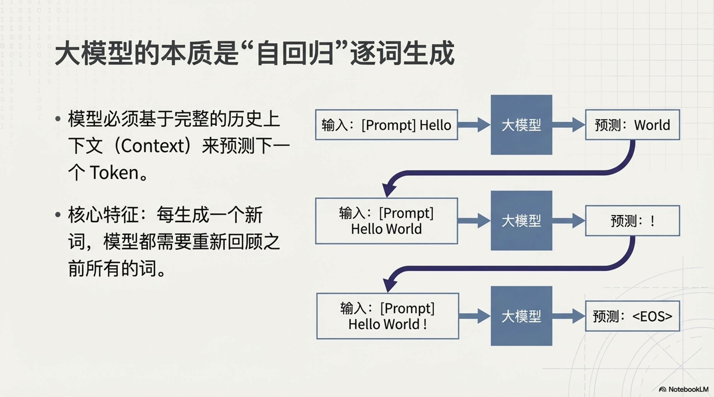
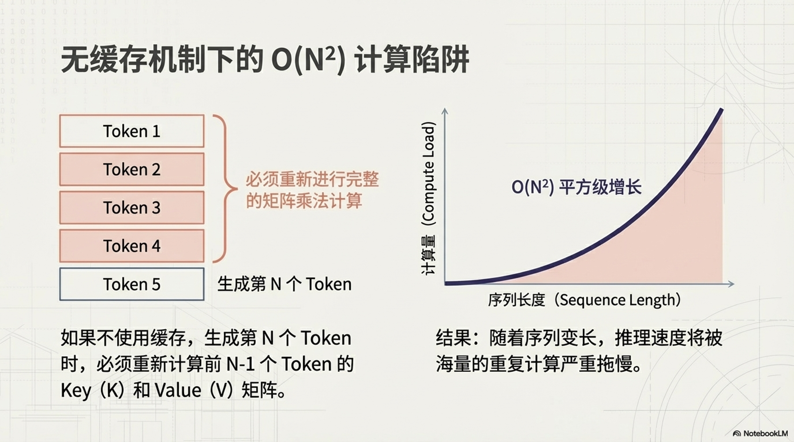
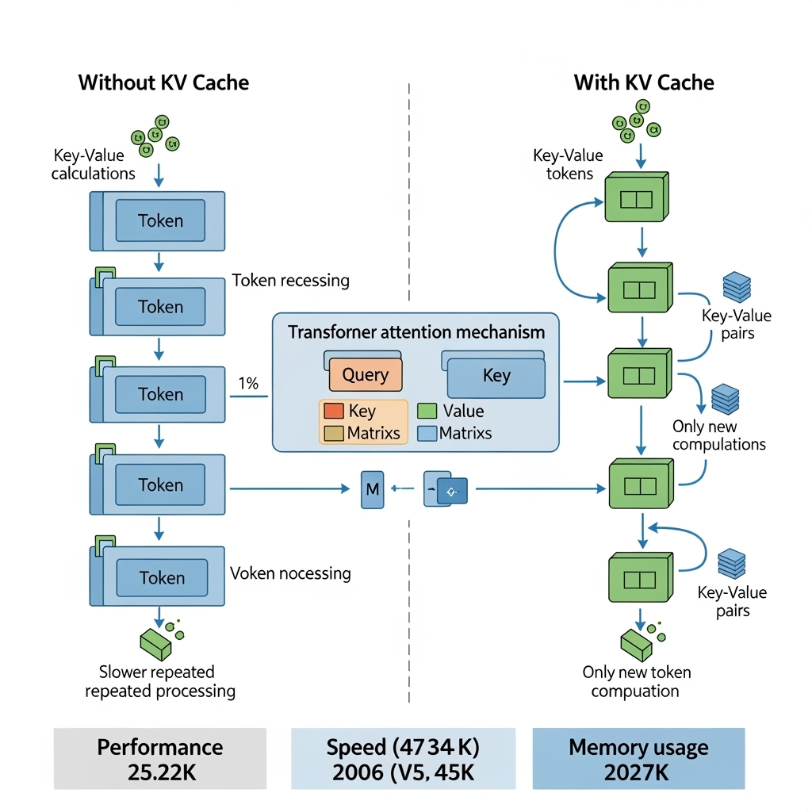
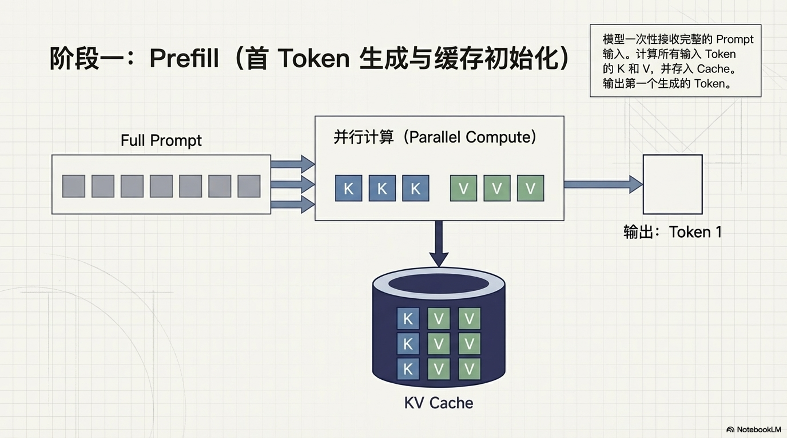
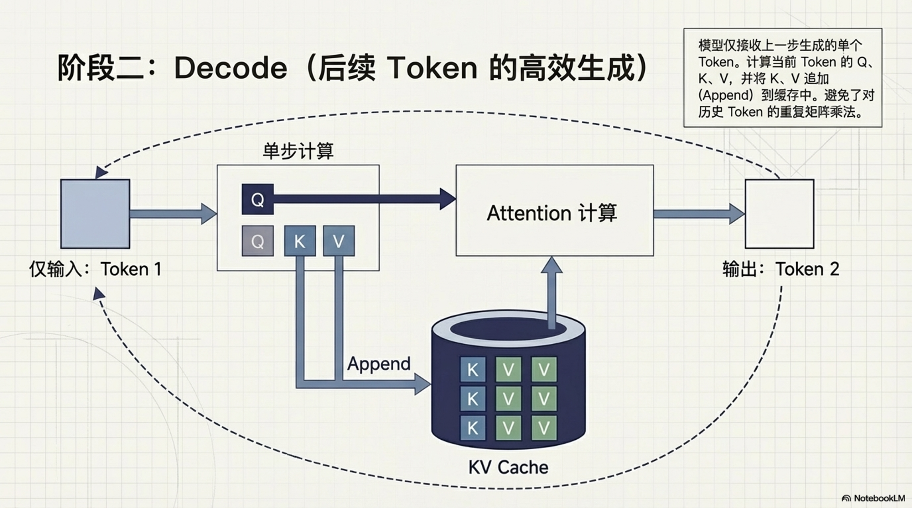
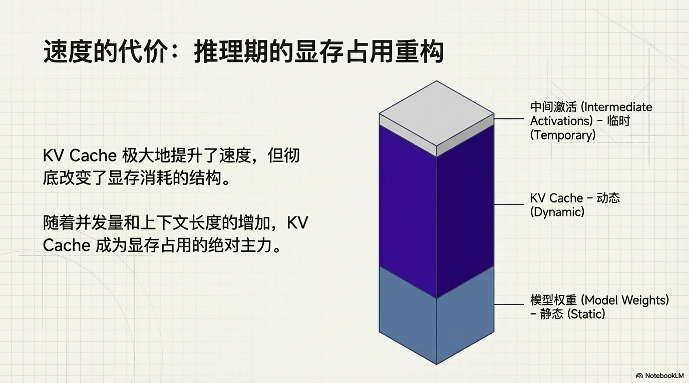
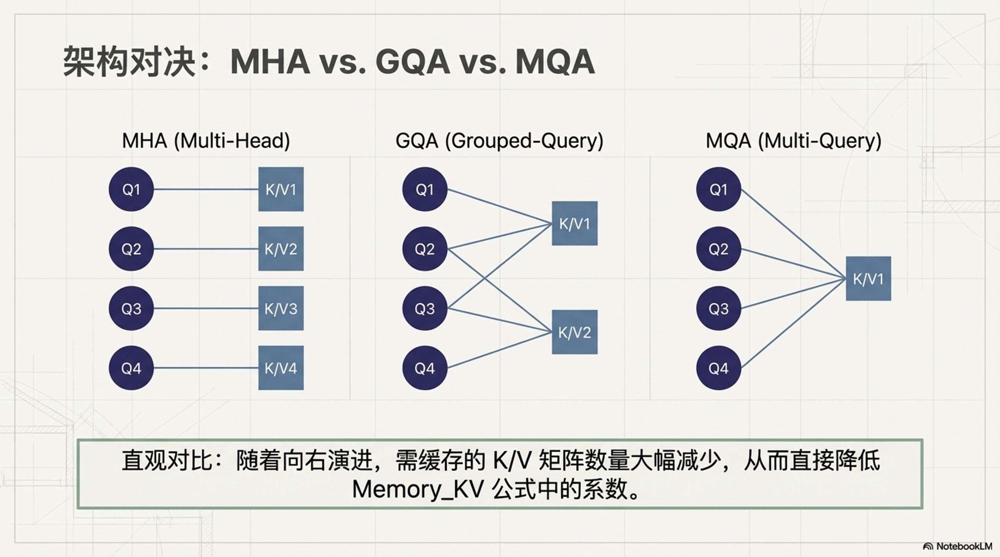

# KV Cache 原理简介

## 1. 背景：大模型推理的挑战

在大语言模型（LLM）的推理过程中，尤其是文本生成任务中，模型通常采用自回归（Autoregressive）的方式逐个生成 Token。这种生成机制如果不加以优化，会面临严重的计算效率问题，理解这一基础模式是后续探索性能优化手段的前提。

### 1.1 自回归生成模式

在自回归生成中，模型根据之前的上下文（Context）预测下一个 Token。例如，给定输入 "Hello"，模型预测 "World"；接着给定 "Hello World"，模型预测 "!"。在没有缓存时，模型必须将 "Hello" 等历史上下文重复编码。这意味着每生成一个新的 Token，模型都需要回顾并重新计算之前所有的 Token。



### 1.2 重复计算问题

如果不使用缓存机制，每生成一个新的 Token，模型都需要将之前所有 Token 重新输入模型，并重新计算它们的 Key (K) 和 Value (V) 矩阵。随着序列长度的增加，这种重复计算若仅看单步前向，无缓存时注意力计算量为 $O(N^2)$，其中 $N$ 为当前序列长度。若考虑从第 1 个 Token 生成到第 $L_{gen}$ 个 Token 的完整过程，累积计算量约为 $O(L_{gen}^3)$，延迟将随生成长度急剧恶化。



---

## 2. KV Cache 核心原理

为了解决自回归生成中的重复计算问题，KV Cache 技术通过“空间换时间”的策略，将已计算过的中间结果存储起来，从而避免了大量冗余的矩阵运算，直接降低了单步推理的计算复杂度。

### 2.1 什么是 KV Cache？

KV Cache 本质上是一种缓存机制，用于存储 Transformer 模型中 Attention 层的 Key 和 Value 矩阵。在推理过程中，模型只需要计算**当前新生成 Token** 的 Query (Q)、Key (K) 和 Value (V)，然后将新的 K 和 V 追加到缓存中。最后，利用当前的 Q 与**完整的缓存**（历史 K/V + 当前 K/V）进行注意力计算。

**有无 KV Cache 的对比：**


### 2.2 工作流程详解

KV Cache 的工作流程可以分为两个阶段：

1. **Prefill 阶段（首 Token 生成）**：
   - 模型接收完整的 Prompt 输入。
   - 计算所有输入 Token 的 K 和 V，并将它们存入 Cache。
   - 生成第一个输出 Token。
     

2. **Decode 阶段（后续 Token 生成）**：
   - 模型仅接收上一步生成的 Token。
   - 计算该 Token 的 Q、K、V。
   - 将新计算的 K、V 追加（Append）到 Cache 中。
   - 利用完整的 Cache (历史 K/V + 当前 K/V) 计算 Attention。
   - 生成下一个 Token，循环上述过程。
     

### 2.3 伪代码示例

以下是 KV Cache 更新逻辑的简化伪代码表示：

```python
# KV Caching 伪代码示例
# 采用 HuggingFace 常见的 shape 布局:
# [batch_size, seq_len, num_heads, head_dim]
class KVCache:
    def __init__(self):
        # 初始化空的缓存
        self.cache = {"key": None, "value": None}

    def update(self, key, value):
        """
        更新缓存：将新的 Key 和 Value 追加到现有缓存中
        """
        if self.cache["key"] is None:
            # 如果缓存为空，直接存储
            self.cache["key"] = key
            self.cache["value"] = value
        else:
            # 否则，在 seq_len 维度上进行拼接（该 shape 下 dim=1）
            # 注意：具体维度索引取决于不同框架的实现布局
            self.cache["key"] = torch.cat([self.cache["key"], key], dim=1)
            self.cache["value"] = torch.cat([self.cache["value"], value], dim=1)

    def get_cache(self):
        return self.cache
```

以上维度仅为示意。若实现采用 `[batch_size, num_heads, seq_len, head_dim]` 等其他布局，应将拼接维度相应调整。

## 3. 显存占用分析

虽然 KV Cache 极大地提升了推理速度，但这种“空间换时间”的做法也带来了显著的显存开销。随着并发请求数（Batch Size）和上下文序列长度的增加，动态增长的缓存数据会占用大量 GPU 显存，成为制约系统吞吐量的核心瓶颈。

详细请参考`LLM 模型推理显存占用深度的分析` ⚠️ (原文链接)。

### 3.1 显存占用的主要构成

在 LLM 推理中，显存主要被以下三部分占用：

1. **模型权重 (Model Weights)**：静态占用，取决于模型参数量和精度。
2. **KV Cache**：动态占用，随着序列长度和 Batch Size 线性增长。
3. **中间激活 (Intermediate Activations)**：推理时的临时计算缓冲区。



### 3.2 KV Cache 显存计算公式

KV Cache 的显存占用可以通过以下公式估算：


$$
\text{Memory}_{KV} \approx 2 \times b_{kv} \times L \times B \times S \times H \times \frac{N_{kv}}{N_{attn}}
$$

其中：

- $2$：同时缓存 Key 和 Value 矩阵。
- $b_{kv}$：数据精度（Bytes），如 FP16 为 2。
- $L$：模型层数 (Layers)。
- $B$：并发请求数 (Batch Size)。
- $S$：每个请求的平均序列长度（Prompt + 已生成 Token）。
- $H$：隐藏层维度 (Hidden Size)。
- $N_{kv}$：KV Head 的数量（GQA/MQA 中的分组数）。
- $N_{attn}$：Query Head 的数量（总注意力头数）。当使用 MHA 时 $N_{kv} = N_{attn}$，系数为 1。

### 3.3 实例分析

以 **Qwen3-0.6B** 为例，其单 Token 的 KV Cache 占用极小，但在大模型（如 Llama-2-70B）中，KV Cache 可能高达数十 GB，成为制约并发数的主要瓶颈。


---

## 4. 优缺点对比与权衡

引入 KV Cache 从根本上改变了模型推理的性能特征。在实际应用中，系统架构师需要在计算速度的显著提升与显存资源的急剧消耗之间寻找最佳平衡点，不同的业务场景对这种权衡有着完全不同的偏好。

### 4.1 速度与显存的 Trade-off

在评估是否引入缓存机制时，需要清晰地认识到计算效率与内存消耗之间的反向关系，以下表格直观展示了两者在不同维度的核心差异。

| 特性           | 标准推理 (Standard Inference)     | KV Caching                      |
| :------------- | :-------------------------------- | :------------------------------ |
| **单步计算量** | 随序列长度平方级增长 ($O(N^2)$)   | 随序列长度线性增长 ($O(N)$)     |
| **显存占用**   | 较低，主要取决于模型权重          | 较高，随序列长度线性增加        |
| **推理速度**   | 随生成长度增加显著变慢 (计算瓶颈) | 速度快且相对稳定 (显存带宽瓶颈) |
| **适用场景**   | 短文本、显存极其受限的场景        | 长文本生成、高吞吐服务          |

说明：上表中的“单步计算量”指标针对的是 Decode 阶段生成单个 Token 的场景。若估算生成 $L_{gen}$ 个 Token 的累计复杂度，无 KV Cache 近似为 $O(L_{gen}^3)$；有 KV Cache 时通常近似为 $O(P^2 + P \cdot L_{gen} + L_{gen}^2)$（其中 $P$ 为 Prompt 长度，$P^2$ 来自 Prefill）。

### 4.2 为什么 KV Cache 是必须的？

对于现代 LLM 应用（如 RAG、长文档摘要），上下文长度往往达到 32k 甚至 128k。如果不使用 KV Cache，生成延迟将变得难以接受。因此，KV Cache 已成为所有主流推理框架（如 vLLM, HuggingFace Transformers）的标准配置。

---

## 5. 进阶：如何降低 KV Cache 开销

为了缓解标准多头注意力（MHA）下 KV Cache 带来的巨大显存压力，模型架构层面演进出了多种优化方案。通过在多个 Query 之间共享 Key 和 Value，可以在几乎不损失模型表现的前提下，成倍降低缓存大小。


### 5.1 Multi-Query Attention (MQA)

MQA 让所有的 Attention Head 共享同一组 Key 和 Value 矩阵，从而将 KV Cache 的大小压缩到原来的 $1/N_{attn}$。这极大地降低了显存占用，但可能会轻微影响模型性能。

### 5.2 Grouped-Query Attention (GQA)

GQA 是 MQA 和标准 MHA (Multi-Head Attention) 的折中方案。它将 Query Head 分组，每组共享一对 K/V Head。例如，Llama-2-70B 就使用了 GQA，显著提升了推理吞吐量，同时保持了较好的模型效果。



不同注意力机制的 Head 对应关系如下：

- **MHA (左)**: 每个 Query Head 都有对应的 Key/Value Head。
- **GQA (中)**: 多个 Query Head 共享一组 Key/Value Head (分组共享)。
- **MQA (右)**: 所有 Query Head 共享同一组 Key/Value Head。

---

## 6. 推荐阅读与工程实践

将 KV Cache 技术真正落地到高并发的生产环境中，需要面对内存碎片化、首字延迟（TTFT）与吞吐量的综合博弈。业界已经发展出一系列成熟的系统级优化方案，帮助推理引擎在有限硬件下压榨出极限性能。

### 6.1 工程实践要点

在真实推理服务中，KV Cache 的优化目标通常不是单一指标，而是综合平衡首字延迟、单 Token 延迟、吞吐与显存成本。以下是最常见的实践方向：

1. **TTFT / TPOT 指标分拆优化**：
   - TTFT (Time To First Token) 主要受 Prefill 影响，优化重点是批处理策略、算子融合与高效调度。
   - TPOT (Time Per Output Token) 主要受 Decode 影响，优化重点是 KV 访存效率与带宽利用率。

2. **Paged KV Cache（分页缓存）**：
   - 将连续大块 KV 内存切分为页，按需分配与回收，减少内存碎片。
   - 支持更高并发与更灵活的请求调度，是高吞吐推理框架中的常见方案。

3. **KV Cache 量化（如 FP8 / INT8）**：
   - 通过降低 KV 精度显著减少显存占用与带宽压力。
   - 需要在速度、显存收益与精度损失之间做任务级评估。

4. **淘汰与窗口策略（Eviction / Sliding Window）**：
   - 对超长上下文可采用滑动窗口、分段摘要或优先级淘汰策略。
   - 核心目标是在有限显存下维持可接受的生成质量与系统稳定性。

### 6.2 推荐阅读与资源

- **文章**: [KV Caching Explained (Hugging Face)](https://huggingface.co/blog/not-lain/kv-caching) - 本文的主要参考来源。
- **可视化**: [KV Caching in LLMs, explained visually](https://www.dailydoseofds.com/p/kv-caching-in-llms-explained-visually/) - 包含生动的动画演示。
- **论文**: [GQA: Training Generalized Multi-Query Transformer Models from Multi-Head Checkpoints](https://arxiv.org/abs/2305.13245) - GQA 的原始论文。
