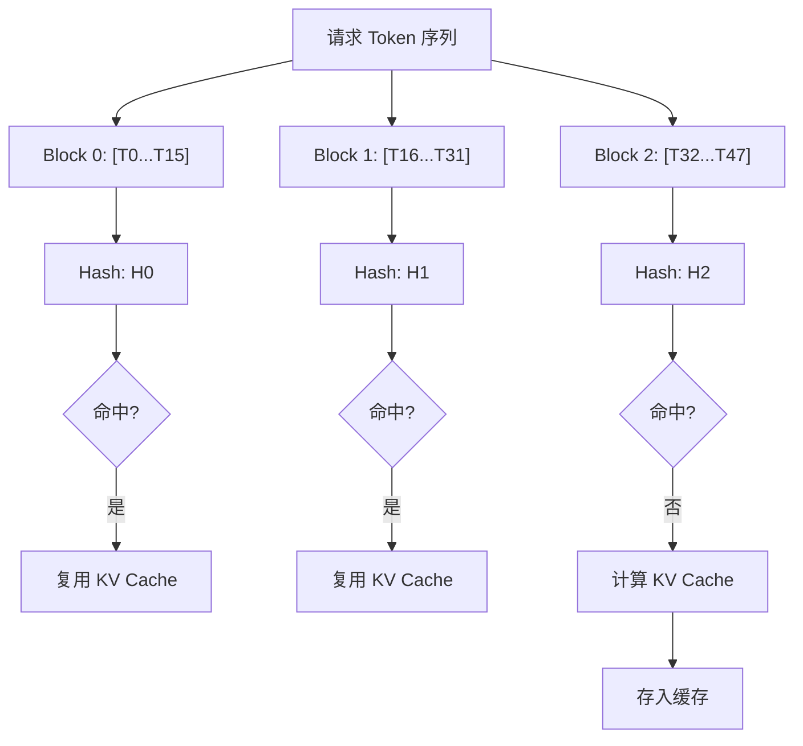
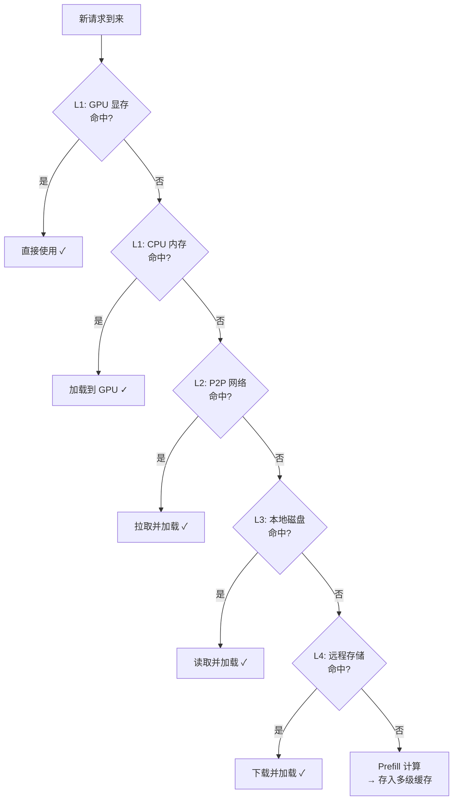

# Prefix Caching 技术详解：从原理到 vLLM/LMCache 实践

## 1. 引言：为什么需要 Prefix Caching？

**Prefix Caching（前缀缓存）** 是一种通过缓存共享前缀的 KV Cache 来避免重复计算的推理优化技术。在大语言模型（LLM）的实际应用中，许多请求往往共享相同的**前缀（Prefix）**，例如：

- **System Prompt**：同一应用的所有请求使用相同的系统指令
- **Few-shot Examples**：相同的示例在多个请求中复用
- **RAG 场景**：检索到的文档片段被多个查询复用
- **多轮对话**：历史对话上下文在后续轮次中反复出现

如果每次请求都从零开始计算这些重复前缀的 KV Cache，将造成巨大的**计算浪费**。以一个 8K token 的 System Prompt 为例：

- 按照 `KV Cache 原理简介` ⚠️ (原文链接) 中的分析，Prefill 阶段 Attention 部分的计算复杂度为 $O(N^2)$
- 如果每秒有 100 个请求，每个请求都重复计算这 8K token 的 KV Cache，将消耗大量 GPU 算力
- 这些重复计算本质上是**完全冗余的**——相同的输入总是产生相同的 KV 输出

**Prefix Caching** 正是为解决这一问题而设计的优化技术。其核心思想非常直观：

> **相同的 token 序列总是产生相同的 KV Cache，因此只需计算一次，后续请求直接复用即可。**

通过 Prefix Caching，我们可以跳过前缀部分的 QKV 投影和自注意力计算，将 Prefill 计算量大幅降低。例如对于一个 8K 前缀 + 256 token 用户输入的典型场景，理论加速比可达约 $16.5\times$（详见第 5.1 节分析），从而显著降低 **TTFT (Time-To-First-Token)** 并提升系统吞吐量。

---

## 2. Prefix Caching 核心原理

本章将介绍 Prefix Caching 的核心原理，包括基本概念、前缀匹配的约束条件以及哈希 Key 的设计方案。

### 2.1 基本概念

Prefix Caching 的核心机制可以分为三个步骤：

1. **切分（Chunking）**：将 token 序列按固定大小切分为多个 **Chunk**（在通用概念中称为 Chunk，在 vLLM 的 PagedAttention 实现中特指 Block）
2. **哈希（Hashing）**：为每个 Chunk 计算唯一的哈希值作为缓存 Key
3. **查找与复用（Lookup & Reuse）**：新请求到来时，逐 Chunk 查找缓存，命中则复用，未命中则计算并存储

```text
输入 Token 序列: [T0,  T1,  T2,  T3,  T4,  T5,  T6,  T7,  T8,  T9,  T10,  T11]
                |----- Chunk 0 -----|---- Chunk 1 -----|----- Chunk 2 -----|
                    Hash: H0              Hash: H1            Hash: H2

缓存查找:
  - H0 命中 → 复用 Chunk 0 的 KV Cache
  - H1 命中 → 复用 Chunk 1 的 KV Cache
  - H2 未命中 → 计算 Chunk 2 的 KV Cache 并存储
```

### 2.2 前缀匹配的约束

由于 Transformer 的因果注意力（Causal Attention）机制，**后续 token 的 KV Cache 依赖于之前所有 token 的信息**。这意味着：

- Prefix Caching 必须从**序列开头**开始逐 Chunk 匹配
- 一旦某个 Chunk 未命中，**后续所有 Chunk 都必须重新计算**
- 即使后续 Chunk 的 token 内容与缓存中某条记录相同，由于上下文不同，其 KV Cache 也不相同

```text
请求 A: [System Prompt] + [Query A]  → 缓存 System Prompt 的 KV
请求 B: [System Prompt] + [Query B]  → 复用 System Prompt 的 KV ✓
请求 C: [Query C] + [System Prompt]  → 无法复用（前缀不匹配）✗
```

> **注**：对于打破前缀约束的非前缀复用场景（如 RAG 中的乱序文档），可以使用 `CacheBlend` 等高级技术通过选择性重算实现近似复用。

### 2.3 哈希 Key 的设计

Prefix Caching 的哈希 Key 设计直接影响缓存的命中率和正确性。常见的设计有两种：

#### 2.3.1 增量哈希

增量哈希（Incremental Hash）方案中，每个 Chunk 的哈希值**依赖于之前所有 Chunk 的内容**，形成一条哈希链：

$$
H_0 = \text{Hash}(\text{Chunk}_0)
$$

$$
H_i = \text{Hash}(H_{i-1}, \text{Chunk}_i), \quad i > 0
$$

**优点**：

- 天然编码了前缀依赖关系
- 相同的 token 内容 + 相同的前缀 → 相同的哈希值
- 不同的前缀 + 相同的 token 内容 → 不同的哈希值

**缺点**：

- 需要按序计算，无法并行

#### 2.3.2 内容哈希 + 位置编码

直接对 Chunk 内容及其位置信息计算哈希：

$$
H_i = \text{Hash}(\text{Chunk}_i, \text{Position}_i)
$$

**优点**：

- 可以并行计算所有 Chunk 的哈希
- 适合预计算场景

**缺点**：

- 需要额外机制确保前缀一致性

vLLM 和 LMCache 均采用**增量哈希**方案，以确保缓存复用的正确性。

---

## 3. vLLM 的 Automatic Prefix Caching (APC)

vLLM 从 v0.4.0 开始引入了 **Automatic Prefix Caching (APC)** 功能 [1]，实现了 GPU 显存内的高效前缀缓存。

> **背景知识**：vLLM 的 APC 设计深受 **SGLang** 提出的 **RadixAttention** [3] 启发。不同之处在于，SGLang 使用 Radix Tree（基数树）来维护 token 序列与 KV Cache 的映射关系，而 vLLM 选择了更易于与其 Block Manager 集成的 **Hash Table（哈希表）** 方案。尽管数据结构不同，两者在缓存淘汰策略（如 LRU + 引用计数）上是高度一致的。Hash Table 方案的优势在于查找时间复杂度为 $O(1)$ 且易于与现有的 PagedAttention 块管理集成，但在处理大量极短前缀时可能会面临一定的内存碎片化挑战。

### 3.1 启用方式

vLLM 支持通过命令行参数和 Python API 两种方式启用 APC。

```bash
# 启动 vLLM 服务时开启 APC
vllm serve meta-llama/Llama-2-7b-hf --enable-prefix-caching
```

```python
# 使用 Python API 时开启 APC
from vllm import LLM
llm = LLM(model="meta-llama/Llama-2-7b-hf", enable_prefix_caching=True)
```

### 3.2 核心实现：Block Hash

vLLM 的 APC 基于 **PagedAttention**（一种将 KV Cache 分块管理的内存优化技术）的 Block 粒度实现缓存。核心数据结构是 `BlockHashToBlockMap`：

```python
# vLLM Block Hash 计算逻辑（简化）
def hash_block_tokens(
    parent_block_hash: Optional[int],  # 父 Block 的哈希值
    curr_block_token_ids: Tuple[int, ...],  # 当前 Block 的 Token IDs
) -> int:
    """计算 Block 的哈希值，形成哈希链"""
    return hash((parent_block_hash, curr_block_token_ids))
```

关键设计点：

1. **Block 粒度**：以 Block（通常 16-32 个 token）为缓存单位，而非单个 token
2. **哈希链**：每个 Block 的哈希值依赖于父 Block，确保前缀一致性
3. **引用计数**：使用引用计数管理 Block 生命周期，支持多请求共享

### 3.3 缓存查找与分配流程

当新请求到来时，vLLM 的 Block Manager 执行以下流程：

```text
1. 将请求的 Token 序列切分为 Block 大小的 Chunk
2. 从第一个 Block 开始，逐个计算哈希并查找缓存：
   - 命中：复用已有 Block，增加引用计数
   - 未命中：分配新 Block，计算 KV Cache，存入缓存
3. 标记第一个未命中的位置为 Prefill 起点
4. 仅对未命中部分执行 Prefill 计算
```



### 3.4 Prefix Caching 与混合注意力模型

对于采用混合注意力机制的模型（如 Gemma-3 的 Sliding Window + Full Attention），vLLM 的 `Hybrid KV Cache Manager` 提供了分层的 Prefix Caching 支持：

- **Full Attention 层**：标准的从左到右前缀匹配
- **Sliding Window 层**：从右到左匹配，只关心最近 `sliding_window_size` 个 token
- **混合模型**：取 Full Attention 和 Sliding Window 匹配长度中的较小值作为有效匹配长度

### 3.5 局限性

vLLM 原生 APC 的主要局限在于：

1. **仅限 GPU 显存**：缓存存储在 GPU 显存中，受容量限制。此外，当大量短前缀缓存占据显存时，可能导致 Block Table 碎片化，影响大 batch 的分配效率。
2. **单实例隔离**：不同 vLLM 实例之间无法共享缓存
3. **重启丢失**：进程重启后缓存完全丢失

这些局限正是 LMCache 等外部 KV Cache 管理系统要解决的问题。下一章将介绍 LMCache 如何通过多级存储架构突破这些限制。

---

## 4. LMCache 的多级 Prefix Caching

`LMCache` 在 vLLM APC 的基础上，提供了**跨介质、跨实例**的 Prefix Caching 能力。

### 4.1 架构概览

LMCache 在 vLLM 的 GPU 显存缓存（由 APC 管理）之外，提供了额外的多级存储扩展：

| 层级 | 存储介质                        | 典型延迟 | 应用场景     |
| ---- | ------------------------------- | -------- | ------------ |
| L1   | CPU 内存 (LocalCPUBackend)      | ~100 μs  | 本地扩展缓存 |
| L2   | P2P 网络 (P2PBackend)           | ~1 ms    | 跨实例共享   |
| L3   | 本地磁盘 (LocalDiskBackend/GDS) | ~10 ms   | 持久化缓存   |
| L4   | 远程存储 (Redis/S3/Mooncake)    | ~100 ms  | 集群级共享   |

> **注**：GPU 显存中的 KV Cache 由 vLLM 的 PagedAttention 和 APC 机制管理，LMCache 负责 GPU 显存之外的存储层级。此表层级编号为 LMCache 扩展存储的编号，与经典缓存层级中的 L1/L2 含义略有不同。

### 4.2 Token Hash 机制

LMCache 使用 **Token Content Hash** 作为缓存 Key，与 vLLM 的 Block Hash 设计类似但更加灵活：

```python
# LMCache Token Hash 计算（简化）
# 注意：实际实现通常使用 XXHash 等高性能确定性哈希算法，
# 以确保跨进程/跨实例的一致性。此处使用 hash() 仅为简化示意。
class TokenDatabase:
    def get_cache_key(
        self,
        token_ids: List[int],
        chunk_size: int,
    ) -> List[CacheKey]:
        """将 Token 序列切分并计算增量哈希"""
        keys = []
        parent_hash = None
        for i in range(0, len(token_ids), chunk_size):
            chunk = tuple(token_ids[i:i + chunk_size])
            chunk_hash = hash((parent_hash, chunk))
            keys.append(CacheKey(hash=chunk_hash, start=i, end=i+chunk_size))
            parent_hash = chunk_hash
        return keys
```

关键设计：

1. **增量确定性哈希**：每个 Chunk 的哈希值由当前 Chunk 的 token 内容与父 Chunk 的哈希值共同决定，相同的前缀序列始终产生相同的 Key 链
2. **跨实例一致性**：基于确定性哈希算法，同一模型的不同实例对相同 token 序列产生相同的 Key，天然支持跨实例缓存共享
3. **可序列化**：Key 可以在网络中传输，支持分布式查找

### 4.3 多级缓存查找

LMCache 的 `StorageManager` 实现了 **Waterfall（瀑布式）** 检索策略：



### 4.4 跨实例共享场景

LMCache 支持两种跨实例共享模式：

#### 4.4.1 集中式共享

所有实例通过一个中心化的缓存服务（如 Redis 或 S3）进行 KV Cache 的读写，即 Hub-and-Spoke 模式，适合部署简单、实例数量适中的场景。

```text
         ┌──────────────┐
         │LMCache Server│
         │ (Redis/S3)   │
         └──────┬───────┘
                │
       ┌────────┴────────┐
       │                 │
┌──────┴──────┐    ┌─────┴───────┐
│ vLLM 实例 A  │    │ vLLM 实例 B │
│ + LMCache   │    │ + LMCache   │
└─────────────┘    └─────────────┘

流程：
1. 实例 A 计算 System Prompt 的 KV Cache
2. 实例 A 将 KV Cache 写入 LMCache Server
3. 实例 B 收到包含相同 System Prompt 的请求
4. 实例 B 从 LMCache Server 读取 KV Cache，跳过 Prefill
```

#### 4.4.2 点对点共享

实例之间通过 P2P 网络直接传输 KV Cache 数据，即 Mesh 模式，由一个轻量的 Cache Controller 管理元数据，适合对延迟敏感、实例间网络带宽充足的场景。

```text
┌─────────────┐      P2P 传输      ┌─────────────┐
│ vLLM 实例 A │◄──────────────────►│ vLLM 实例 B │
│ + LMCache   │                   │ + LMCache   │
└──────┬──────┘                   └──────┬──────┘
       │                                 │
       └─────────────┬───────────────────┘
                     │
            ┌────────┴─────────┐
            │ Cache Controller │
            │  (元数据管理)      │
            └──────────────────┘

流程：
1. 实例 A 计算 KV Cache，向 Controller 注册元数据
2. 实例 B 需要相同前缀，查询 Controller 获取位置
3. 实例 B 直接从实例 A 拉取数据（支持 RDMA/TCP）
```

> **注**：在底层传输协议选择上，RDMA 的典型延迟约为 1-2 μs，而传统 TCP 约为 10-50 μs。借助 RDMA 极低的通信开销，可以最大化 P2P 模式在延迟敏感场景下的核心价值。

### 4.5 配置示例

以下示例展示了如何通过配置文件和命令行启动带有多级 Prefix Caching 的 vLLM 服务。

```yaml
# LMCache 配置示例：启用多级 Prefix Caching
chunk_size: 256 # 每个 Chunk 的 Token 数量
local_cpu: true # 启用 CPU 内存缓存
local_disk: /mnt/nvme/lmcache # 启用本地磁盘缓存
remote_url: redis://cache-server:6379 # 启用远程缓存
p2p_enabled: true # 启用 P2P 共享
```

```bash
# 启动带 LMCache 的 vLLM
# --enable-prefix-caching: 启用 vLLM 内置的 Prefix Caching (显存内)
# --kv-transfer-config: 启用 LMCache 连接器以支持多级缓存和跨实例共享
LMCACHE_CONFIG_FILE=lmcache_config.yaml vllm serve meta-llama/Llama-2-7b-hf \
    --enable-prefix-caching \
    --kv-transfer-config '{"kv_connector":"LMCacheConnectorV1","kv_role":"kv_both"}'
```

---

## 5. 性能收益分析

本章从理论和实测两个维度分析 Prefix Caching 带来的性能收益，并给出最佳实践建议。

### 5.1 理论分析

为了量化 Prefix Caching 的加速效果，建立如下简化模型。

**假设**：

- System Prompt 长度： $P$ tokens
- 用户 Query 长度： $Q$ tokens
- Prefill 计算复杂度： $O(N^2)$（其中 $N = P + Q$）

**无 Prefix Caching**：

每个请求都需要对完整序列执行 Prefill。由于因果注意力机制（Causal Attention）的掩码特性，Attention 矩阵中约有一半的元素需要计算：

$$
\text{Cost}_{\text{total}} \approx \frac{1}{2}(P + Q)^2 \approx \frac{1}{2}P^2 \quad (\text{当 } P \gg Q)
$$

**有 Prefix Caching（命中）**：

前缀部分的 KV Cache 直接从缓存加载，跳过其 QKV 投影和自注意力计算。但后缀 $Q$ 个 token 在 Attention 时仍需访问前缀的全部 KV 数据（即每个 query token 都要 attend 到 $P$ 个前缀 token 和之前的 query token）：

$$
\text{Cost}_{\text{cached}} \approx Q \cdot P + \frac{1}{2}Q^2 \approx Q(P + 0.5Q) \quad (\text{当 } P \gg Q \text{ 时，}Q^2 \text{ 项可忽略})
$$

此外还需加上缓存读取的 I/O 开销（Cache Load）。

**加速比**（假设 $P = 8192$， $Q = 256$）：

精确的浮点运算比为：

$$
\frac{\frac{1}{2}(P+Q)^2}{Q \cdot P + \frac{1}{2}Q^2}
$$

当 $P \gg Q$ 时，分母可近似为 $Q(P+Q)$，得到一个简洁且保守的加速比估计：

$$
\text{Speedup} \approx \frac{\frac{1}{2}(P + Q)^2}{Q(P + Q)} = \frac{P + Q}{2Q} = \frac{8448}{512} = 16.5\times
$$

> **直观理解**：加速比 ≈ 总长度 / (2 × 用户输入长度)。也就是说，8K 前缀 + 256 用户输入 → 理论加速约 16.5 倍。

可以看出，加速比近似等于前缀与后缀长度比的一半 $\frac{P}{2Q}$，随前缀长度**线性增长**。这意味着前缀越长、用户 Query 越短，Prefix Caching 的收益越显著。

### 5.2 实测数据

根据 LMCache 官方文档 [2] 的基准测试数据，在典型场景下的性能提升如下（测试基于 Llama-2-7B 模型，单 A100 GPU 环境）：

| 场景       | 前缀长度   | TTFT 降低 | 吞吐量提升 |
| ---------- | ---------- | --------- | ---------- |
| 多轮对话   | 2K tokens  | 60-80%    | 2-3x       |
| RAG 应用   | 4K tokens  | 70-85%    | 3-5x       |
| 长文档处理 | 8K+ tokens | 80-95%    | 5-10x      |

### 5.3 最佳实践

以下是在生产环境中使用 Prefix Caching 时的关键优化建议。

1. **Chunk Size 选择**：
   - 太小：哈希计算开销大，缓存管理复杂
   - 太大：命中粒度粗，内存利用率低
   - 推荐：256-512 tokens（为 vLLM Block Size 的整数倍，便于缓存对齐）。实验表明，256 tokens 的 chunk 能够很好地平衡哈希计算开销（约占总计算量的 0.1% 以下）与内存对齐效率。

2. **System Prompt 设计**：
   - 将稳定的指令放在前面
   - 动态内容（如用户名、时间戳）放在后面
   - 避免在中间插入变化内容（会破坏后续前缀）

3. **缓存预热**：
   - 服务启动时预先计算常用前缀的 KV Cache
   - 使用 LMCache Server 持久化，避免冷启动

### 5.4 缓存失效与一致性

在实际生产环境中，除了考虑缓存命中，还需要妥善处理**缓存失效（Invalidation）**问题。当模型权重更新（如 LoRA 热切换或模型整体升级）时，旧版本的 KV Cache 将不再有效。为保证一致性，系统通常采用以下机制：

- **Model Version Tag**：在缓存 Key 中引入模型版本或哈希标识，隔离不同版本模型的缓存空间。
- **TTL（Time-To-Live）淘汰**：为长期未访问的缓存设置过期时间，结合 LRU 策略自动清理失效数据，防止脏数据污染。

---

## 6. 进阶话题

本章讨论 Prefix Caching 与其他推理优化技术的协同使用方式，以及在特殊场景下的扩展应用。

### 6.1 与 Chunked Prefill 的协同

[Chunked Prefill](https://docs.vllm.ai/en/latest/features/chunked_prefill.html) 将长 Prefill 拆分为多个小批次执行，与 Decode 请求交替调度。Prefix Caching 可以与 Chunked Prefill 协同工作：

- 缓存命中的 Chunk 完全跳过
- 仅对未命中的 Chunk 执行 Chunked Prefill
- 进一步降低长前缀场景的调度延迟

### 6.2 与 PD 分离架构的结合

在 `Prefill-Decode 分离架构` 中，Prefix Caching 可以显著优化 Prefill 节点的负载：

- Prefill 节点维护热门前缀的缓存
- 相同前缀的请求路由到同一 Prefill 节点
- 通过 PDBackend 将 KV Cache 推送到 Decode 节点

---

## 7. 非前缀复用与 CacheBlend

Prefix Caching 主要解决的是严格前缀匹配的问题。对于 RAG 场景中检索文档顺序不固定的情况，传统的前缀缓存会因为顺序打乱而失效。`CacheBlend` 提供了一种创新的解决方案：

- 允许复用非前缀位置的 KV Cache
- 通过选择性重算修正 Attention 偏差
- 在复用率和计算开销之间动态平衡

---

## 8. 总结

Prefix Caching 是 LLM 推理优化中的关键技术，通过缓存和复用重复前缀的 KV Cache，可以显著降低 Prefill 计算开销（实测 TTFT 降低 60%-95%，取决于前缀长度和应用场景）。

**核心要点回顾**：

1. **原理**：相同 token 序列 → 相同 KV Cache，利用哈希索引实现高效查找
2. **vLLM APC**：GPU 显存内的自动前缀缓存，以 Block 为粒度，使用哈希链确保正确性
3. **LMCache**：多级存储 + 跨实例共享，将 Prefix Caching 扩展到 CPU/磁盘/远程存储
4. **应用场景**：多轮对话、RAG、长文档处理、共享 System Prompt

**技术选型建议**：

| 场景             | 推荐方案                              |
| ---------------- | ------------------------------------- |
| 单实例、显存充足 | vLLM APC（内置）                      |
| 单实例、显存不足 | vLLM + LMCache（CPU/磁盘扩展）        |
| 多实例、需要共享 | vLLM + LMCache（P2P 或 Server 模式）  |
| 生产级高可用     | vLLM + LMCache（Redis/Mooncake 后端） |

---

## 9. 参考资料

### 9.1 延伸阅读

- `KV Cache 原理简介` ⚠️ (原文链接) - KV Cache 基础概念
- `LMCache 架构概览` - LMCache 系统设计
- `LMCacheConnector 源码分析` - vLLM 集成实现
- `CacheBlend 技术详解` - RAG 场景的非前缀复用
- `Hybrid KV Cache Manager` - 混合注意力模型的 Prefix Caching

### 9.2 项目文档

- [1] vLLM Team, "Automatic Prefix Caching," _vLLM Documentation_, 2026. [Online]. Available: https://docs.vllm.ai/en/latest/features/automatic_prefix_caching.html
- [2] LMCache Team, "LMCache Documentation," _LMCache_, 2026. [Online]. Available: https://docs.lmcache.ai

### 9.3 学术论文

Prefix Caching 的核心思想与实现机制在多篇学术论文中均有探讨，其中最具代表性的是 SGLang 提出的 RadixAttention 和 Prompt Cache：

- [3] L. Zheng et al., "SGLang: Efficient Execution of Structured Language Model Programs," _arXiv preprint arXiv:2312.07104_, 2023.
  - **贡献**：提出了 **RadixAttention** 技术，通过维护 Radix Tree（基数树）来自动管理和复用 KV Cache。vLLM 的 APC 借鉴了其 LRU 淘汰策略，但采用了 Hash Table（哈希表）作为底层数据结构。

- [4] I. Gim et al., "Prompt Cache: Modular Attention Reuse for Low-Latency Inference," _arXiv preprint arXiv:2311.04934_, 2023.
  - **贡献**：系统阐述了通过复用 Attention 状态来加速 LLM 推理的模块化方法，验证了其在长文本场景下的显著收益。
