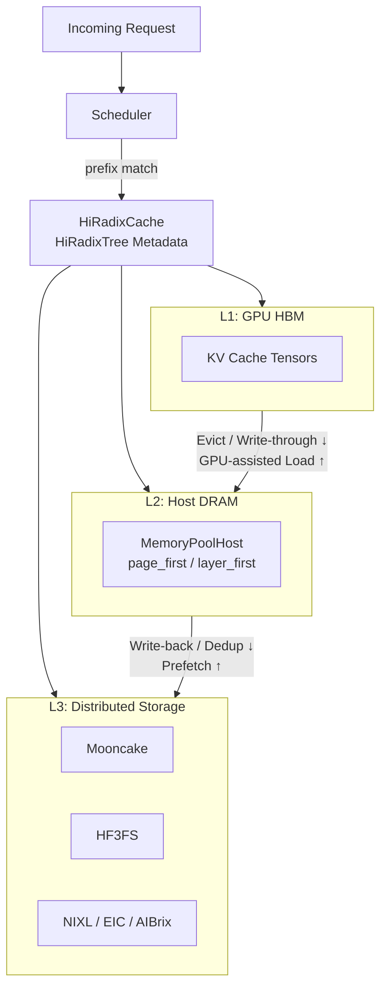
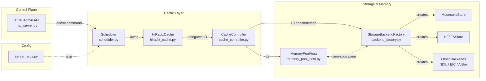

# HiCache 深入详解

`HiCache` 是 `SGLang` 为大语言模型（`LLM`）推理提供的分层 `KV Cache` 架构，通过将 `GPU` 显存、宿主机内存与分布式存储后端（如 `Mooncake`、`HF3FS`）纳入统一的三级缓存体系，突破单节点显存容量天花板并实现跨实例的前缀共享。本文面向 `SGLang` 的使用者与二次开发者，梳理其演进背景、多级调度机制与工程权衡，并给出关键代码入口以便深入源码。

## 目录

- [1. 演进背景：大语言模型推理的缓存挑战](#1-演进背景大语言模型推理的缓存挑战)
- [2. 核心痛点：单点容量与全局调度的矛盾](#2-核心痛点单点容量与全局调度的矛盾)
  - [2.1 跨节点 KV Cache 共享的缺失](#21-跨节点-kv-cache-共享的缺失)
  - [2.2 I/O 带宽与计算资源的争抢](#22-io-带宽与计算资源的争抢)
- [3. 架构解析：HiCache 的多级缓存与全局调度机制](#3-架构解析hicache-的多级缓存与全局调度机制)
  - [3.1 HiRadixTree：前缀树驱动的元数据拓扑](#31-hiradixtree前缀树驱动的元数据拓扑)
  - [3.2 数据预取与多层级读取链路](#32-数据预取与多层级读取链路)
  - [3.3 数据写回与全局共享策略](#33-数据写回与全局共享策略)
  - [3.4 跨数据路径的性能底座：零拷贝与内存布局重构](#34-跨数据路径的性能底座零拷贝与内存布局重构)
  - [3.5 控制面：存储后端的运行时热插拔](#35-控制面存储后端的运行时热插拔)
- [4. 权衡与取舍：架构设计背后的工程考量](#4-权衡与取舍架构设计背后的工程考量)
  - [4.1 缓存规模与命中收益的非线性增长](#41-缓存规模与命中收益的非线性增长)
  - [4.2 异构张量并行的复用局限](#42-异构张量并行的复用局限)
  - [4.3 PD 分离架构下的数据一致性挑战](#43-pd-分离架构下的数据一致性挑战)
  - [4.4 存储成本与命中率的量化权衡](#44-存储成本与命中率的量化权衡)
- [5. 配置示例](#5-配置示例)
  - [5.1 最简配置：仅启用主机内存](#51-最简配置仅启用主机内存)
  - [5.2 多实例共享：Mooncake + page_first_direct](#52-多实例共享mooncake--page_first_direct)
  - [5.3 集群式部署：HF3FS + 异构 TP](#53-集群式部署hf3fs--异构-tp)
  - [5.4 PD 分离部署下的 HiCache](#54-pd-分离部署下的-hicache)
  - [5.5 运行时动态挂载 / 卸载 L3 后端](#55-运行时动态挂载--卸载-l3-后端)
  - [5.6 参数速查表](#56-参数速查表)
- [6. 总结](#6-总结)

---

## 1. 演进背景：大语言模型推理的缓存挑战

在大语言模型推理的 `Prefill` 阶段，将输入序列转化为 `KV Cache` 的过程通常伴随极高的浮点计算与显存占用开销。当海量并发请求共享相同的上下文前缀时，传统的显存管理方案往往无法跨越请求边界有效利用这些重复数据，直接导致严重的冗余计算，并成为长上下文（`Long-context`）与多轮对话场景下制约系统吞吐量的核心瓶颈。

早期推理系统通过引入基于前缀树的显存复用技术，在单机 `GPU` 闲置显存内实现了 `KV Cache` 的细粒度共享。`SGLang` 最初利用 `RadixTree` 结构在 `GPU` 显存中组织和复用 `KV Cache`，极大地优化了单实例内的前缀共享效率。然而，当推理场景从单机实验走向长上下文、多路问答（`Multi-QA`）与万卡集群并存时，这套建立在"单机显存闲置即可用资源"假设之上的方案开始显现出它的边界——而这一边界的具体形态，将在下一节展开。

---

## 2. 核心痛点：单点容量与全局调度的矛盾

单机 `RadixTree` 的局限在两个维度上被同时放大：其一，推理并发量激增与上下文窗口数倍拉长，使得单节点 `GPU` 显存乃至 `CPU` 内存已完全无法满足海量 `KV Cache` 的常驻与流转需求；其二，集群规模的扩大让跨节点的前缀共享从"可选优化"变为"硬性刚需"。如何打破物理节点边界，实现 `KV Cache` 的全局透明共享与高效网络流转，成为下一代大规模推理引擎亟需解决的核心难题。

### 2.1 跨节点 KV Cache 共享的缺失

在常规的分布式部署环境下，不同推理实例各自维护相互隔离的显存缓存池，这不仅造成了全局存储资源的严重浪费，更导致具有相同系统提示词（`System Prompt`）或历史会话前缀的请求在路由到不同计算节点时，仍需重新执行极其昂贵的 `Prefill` 矩阵乘法计算。缺乏全局统一的缓存视图意味着集群的整体算力被大量毫无意义的冗余前置计算所吞噬，难以支撑企业级的高并发大规模推理服务。

### 2.2 I/O 带宽与计算资源的争抢

跨设备（如 `CPU` 到 `GPU`）或跨节点的频繁缓存换入换出极易引发 `PCIe` 总线或 `RDMA` 网络的带宽瓶颈。若海量数据的搬运过程无法与模型的前向传播（`Forward Pass`）实现有效的计算重叠（`Overlap`），反而会因为传输阻塞而显著增加端到端的推理首字延迟（`TTFT`）。在海量并发下，纯粹的存储容量扩充如果缺乏与之匹配的高效 I/O 异步调度配合，往往会因为数据搬运的同步等待而彻底拖垮整个推理链路的吞吐表现。

---

## 3. 架构解析：HiCache 的多级缓存与全局调度机制

借鉴现代 `CPU` 经典的 L1/L2/L3 三级缓存设计理念，`HiCache` 将昂贵且极速的 `GPU` 显存作为 L1 缓存、容量较大的宿主机 `CPU` 内存作为 L2 缓存，并前瞻性地引入分布式存储后端（如 `Mooncake`、`HF3FS` 等）作为全局共享的 L3 缓存。通过深度重构元数据拓扑，配合物理连续的零拷贝传输与定制化并发 I/O 算子，系统成功实现了海量缓存数据在多级异构介质间的透明、极速流转。

本节按 **「数据面 + 控制面」** 两条正交主线展开：数据面（第 3.1–3.4 节）覆盖元数据寻址（3.1）、读写路径（3.2、3.3）与贯穿读写的性能底座（3.4）；控制面（第 3.5 节）则解决运行时的可管理性与可用性。

三级存储介质与核心数据路径如下图所示：`HiRadixTree` 在本地维护全局元数据视图，调度器基于其匹配结果驱动跨层的预取（L3→L2→L1）与写回（L1→L2→L3）数据流。



至于实现层面，`HiCache` 由一组解耦的组件协同完成从调度决策到底层 I/O 的全链路。控制面（HTTP `attach`/`detach`）与数据面（read / write）共享 `Scheduler → HiRadixCache → CacheController` 的调用栈，仅在 `BackendFactory` 层向不同的 L3 后端分叉，关键组件及其交互关系如下图：



### 3.1 HiRadixTree：前缀树驱动的元数据拓扑

跨级、跨介质缓存的数据流转首要解决的是极速全局寻址与状态匹配问题。`HiCache` 扩展了单机的基数树（`RadixTree`）结构，在本地内存中实时维护全局分布式 `KV Cache` 的多级拓扑视图。这一结构在文档中称为 `HiRadixTree`，在源码中由 `HiRadixCache` 类实现。

`HiRadixTree` 将前缀树的逻辑节点精准映射到物理连续的 `KV Cache` 内存分块上。针对 L1（`GPU`）、L2（`CPU`）和 L3（分布式网络存储）这三级架构，该树结构能够纳管并精确定位每一段前缀数据当前所处的存储层级与生命周期状态。在处理新到达的推理请求时，系统仅需在本地遍历 `HiRadixTree` 元数据即可完成前缀匹配。整个匹配过程纯粹在元数据层面进行，不涉及任何实际的张量数据拷贝或显存分配操作，从而将调度层的匹配延迟压缩至微秒级别。

**代码参考**：多级前缀树的元数据管理与树节点匹配逻辑主要实现在 hiradix_cache.py 中，该文件的 `HiRadixCache` 类接管了传统的单级 `RadixCache`。

### 3.2 数据预取与多层级读取链路

当本地 `HiRadixTree` 匹配发现请求所需的历史数据存在于远端 L3 存储时，系统将主动向 L3 发起高度并行的预取（`Prefetch`）网络请求。针对不同业务对首字延迟与缓存命中率的敏感度差异，系统在控制器层面提供了极其细粒度的预取生命周期控制策略。

一旦 L3 命中的 `KV Cache` 连续长度超过预设阈值（`prefetch_threshold`，默认 256 个 Token），系统即刻在后台触发预取操作。`HiCache` 在核心调度器中提供了三种预取策略：

- **`best_effort`**：一旦本地 `GPU` 满足当前计算的最小依赖条件即终止网络预取，适合对首字延迟（`TTFT`）要求苛刻的实时对话场景。
- **`wait_complete`**：强制挂起计算流并等待全量历史数据拉取完成，追求极致的缓存命中率，常用于长文本离线分析。
- **`timeout`**：结合基础超时 `prefetch_timeout_base` 与按拉取长度线性增长的 `prefetch_timeout_per_ki_token`，动态计算超时上限，兼顾延迟与命中率。

在张量并行（`TP`）架构下，系统还会通过 `all_reduce(op=min)` 算子确保所有参与分布式计算的 `GPU` 在预取状态与命中长度上达成严格的分布式共识。

**代码参考**：数据预取策略的控制调度流以及生命周期管理位于 cache_controller.py 中的 `CacheController` 类。

### 3.3 数据写回与全局共享策略

读路径解决了"远端数据如何拉近"，写路径则对称地回答"本地热点如何扩散"——被频繁访问的局部热点 `KV Cache` 需要及时下沉至 L2 与 L3 存储，以释放宝贵的 L1 显存空间并供集群内其他推理实例复用。写回（`Write-back`）机制通过解耦上层的数据访问与底层的物理持久化，在复杂的网络环境中平衡了带宽开销与缓存命中收益。

为了适应不同硬件环境的网络带宽与存储容量限制，系统内置了三种自适应写回策略：

- **`write_through`**：数据生成后即时同步至下一级存储，在带宽充裕的网络下能带来最高的全局缓存收益，为当前默认策略。
- **`write_through_selective`**：基于访问频率追踪，仅对高频热点数据进行跨级备份，大幅削减 I/O 抖动。
- **`write_back`**：仅在数据被上层 L1 显存池触发容量驱逐（`Evict`）时才被动下沉。

在跨实例的全局共享层面，数据从 L2 写入 L3 时会进行严格的哈希或前缀去重判定，确保底层分布式系统（如 `Mooncake` 高性能缓存系统）中仅保留一份全局唯一的 `KV Cache` 副本，从而在有限的存储预算下最大化集群的整体并发承载力。

**代码参考**：L3 存储后端的具体读写实现以 `Mooncake` 为例见 mooncake_store.py；`HF3FS` 的对接实现见 storage_hf3fs.py。

### 3.4 跨数据路径的性能底座：零拷贝与内存布局重构

第 3.2 节的预取与第 3.3 节的写回之所以能与前向计算重叠而不拖垮端到端延迟，根源在于本节描述的内存布局重构与 `GPU` 辅助 I/O 算子——它们并非与 3.2、3.3 并列的第三条数据路径，而是贯穿整条数据面的**横切性能底座**。具体地，海量缓存数据在 `CPU` 内存与 `GPU` 显存之间的跨总线搬运是整个系统最脆弱的性能瓶颈；通过彻底重构宿主机层面的内存数据排列，并引入专门针对注意力机制设计的 `GPU` 辅助算子，系统大幅降低了数据跨介质传输的序列化开销与碎片化读取延迟。

传统 `GPU` 矩阵计算天然采用 `layer_first`（按层优先）的数据内存排布，而为了适配 L3 存储基于物理页（`Page`）粒度的网络零拷贝（`Zero-copy`）传输，`HiCache` 引入了 `page_first` 与 `page_first_direct` 两种内存布局。这种结构将同一物理页内的所有 `KV Cache` 张量数据进行连续物理存放，显著提升了 `PCIe` 总线的顺序 I/O 吞吐能力。布局的选择与 I/O 后端（`hicache-io-backend`，取值 `kernel` 或 `direct`）强耦合：`page_first_direct` 需要与 `direct` 后端配合，`page_first` 则配合 `kernel` 后端。

在预填充（`Prefill`）阶段，系统利用 `Compute-Transfer Overlap` 技术，在计算当前层（`Layer N`）注意力的同时，通过异构流异步传输下一层（`Layer N+1`）的数据。配合 `SGLang` 为注意力访存定制的 `GPU-assisted I/O Kernels`，`CPU` 到 `GPU` 的回填速度相较朴素实现可获得数倍提升（具体加速比取决于硬件与 page size 配置）。

**代码参考**：主机内存池的布局重构逻辑主要体现在 memory_pool_host.py 中；运行时参数（`--hicache-mem-layout`、`--hicache-io-backend`、`--hicache-write-policy` 等）的声明与校验详见 server_args.py。

### 3.5 控制面：存储后端的运行时热插拔

完成数据面的极致优化后，`HiCache` 还需在控制面向生产环境承诺可用性——在复杂且对稳定性要求极高的生产环境中，底层 L3 分布式存储后端的配置变更、扩缩容或无损升级往往要求上层推理服务保持绝对的高可用（`High Availability`）。通过在调度器核心层面对请求队列进行严格的系统屏障（`Barrier`）控制，系统支持在服务进程运行期间动态调整全局存储拓扑。

`HiCache` 提供了一套基于 `HTTP Admin API` 的热插拔控制链路，允许运维人员在完全不重启推理进程的情况下，动态挂载（`Attach`）或卸载（`Detach`）L3 存储后端。为了保障切换过程中的分布式数据一致性，核心调度器（`Scheduler`）会执行极其严格的空闲状态（`Idle-state`）检测。系统会阻塞并校验队列，确保当前既无运行中的推理 `Batch` 也无排队等待任务时方可执行底层连接切换。

在数据并行（`DP`）模式下，该机制还会通过进程间通信同步校验所有计算节点的切换状态，防止出现集群存储配置割裂引发的幽灵错误。

**代码参考**：控制面的 HTTP 接口入口见 ；空闲状态检测与后台热插拔调度逻辑（包括存储后端的初始化与切换）位于 scheduler.py 中相应的后端管理方法。

---

## 4. 权衡与取舍：架构设计背后的工程考量

`HiCache` 架构在大幅突破单机 `KV Cache` 容量天花板的同时，不可避免地引入了分布式网络系统的状态一致性复杂性与额外的 I/O 线程调度开销。本节沿 **容量 / 拓扑 / 时序 / 成本** 四个维度展开，它们共同构成 `HiCache` 落地的完整决策象限。在实际业务落地与万卡集群规划时，需结合具体模型的负载特征对各项指标进行深度的针对性调优。

### 4.1 缓存规模与命中收益的非线性增长

盲目且无限制地扩大 L2 主机内存或 L3 远端分布式存储池并不能线性提升系统的整体吞吐量。当核心的系统级热点数据已被充分缓存后，额外分配的物理资源所带来的缓存命中率增益将呈现极其明显的边际递减效应。

在配置系统参数时，架构师需要深刻理解业务场景中长尾数据的访问特征分布。一旦大部分高频复用的系统提示词（`System Prompt`）或多轮核心对话前缀已被有效持久化，进一步成倍增加主机内存配额仅能带来微弱的 `TTFT` 性能提升，反而会成倍增加操作系统层面的内存碎片与内核垃圾回收（`GC`）压力。

### 4.2 异构张量并行的复用局限

跨集群的 `KV Cache` 全局网络共享在面对异构的张量并行规模（例如 `TP=4` 的计算实例与 `TP=8` 的计算实例混合部署在同一 L3 命名空间）时，需通过配置张量并行的最小公倍数（`tp_lcm_size`）进行精细的内存切片对齐。这在一定程度上显著增加了元数据网络路由的复杂性与计算冗余。

当集群内同时存在不同并发切分规模的模型副本时，为了实现底层 `KV Cache` 物理数据的无缝跨节点互通，系统必须基于 `tp_lcm_size` 对注意力头（`Attention Head`）的张量切片进行实时的网络重组与内存对齐。这一精妙机制虽然在逻辑上彻底打通了异构算力集群的物理边界，但不可避免地引入了额外的内存碎片化切分逻辑与潜在的跨节点 `RDMA` 带宽损耗，需要在大规模混部时进行审慎的算力收益评估。

**代码参考**：异构 `TP` 切片的后端工厂处理逻辑参考 backend_factory.py；`tp_lcm_size` 的实际切分在 mooncake_store.py 中基于 `should_split_heads` 分支完成。

### 4.3 PD 分离架构下的数据一致性挑战

在 `Prefill-Decode`（`PD`）分离部署的极致优化模式下，`Prefill` 节点通过高速网络直接复用 `Decode` 节点异步卸载的 `KV Cache` 数据时，极易受到生命周期异步回收（`Abort` 信号）的竞态影响。工程实现上需通过注入严格的超时控制机制，以防止跨节点的内存被提前覆盖或回收。

当 `Decode` 节点因用户主动取消请求或生成完毕而尝试回收对应显存时，若 `Prefill` 节点正处于跨网络的数据拉取阶段，便会引发分布式数据竞争（`Distributed Data Race`）。为此，系统在底层引入了专门的超时控制环境变量 `SGLANG_DISAGGREGATION_WAITING_TIMEOUT`（默认 300 秒），在跨节点传输链路上给予发起端充分的等待窗口，避免接收端显存在传输尚未完成时被回收。以秒级等待窗口换取跨节点缓存流转链路的稳定性，是 `HiCache` 在 PD 分离场景下的关键工程取舍。

**代码参考**：超时控制的环境变量定义见 environ.py；实际消费该变量的传输连接管理位于 conn.py。

### 4.4 存储成本与命中率的量化权衡

前三条权衡聚焦于技术可行性，而 L3 存储的扩容决策最终还需回答一个极其实际的经济问题：每扩充一单位分布式存储容量，到底能换回多少 `Prefill` 计算的释放？无论是基于 RDMA NVMe 的 `Mooncake` 还是基于持久化存储的 `HF3FS`，L3 所占用的每 TB 物理资源都是真金白银的基础设施支出，而缓存命中率相对存储容量的增长曲线通常呈对数衰减。

具体而言，系统提示词（`System Prompt`）与多轮会话前缀的复用频次分布决定了 L3 的有效工作集大小：当工作集已被完整覆盖后，额外扩容的 L3 能命中的只是长尾低频数据，其减少的 `Prefill FLOPs` 折合成 `GPU` 时成本可能远低于等量 L3 存储的租赁开销。在生产部署前，建议通过采样访问日志计算"复用前缀累计分布曲线"（`CDF`），据此反推 L3 的最优容量档位，而非简单按"L2 的 N 倍"盲目配置。

**代码参考**：存储后端的容量声明与实例化入口位于 backend_factory.py；各后端内部的生命周期与驱逐逻辑见 mooncake_store.py / storage_hf3fs.py。

---

## 5. 配置示例

第 4 章梳理的四条权衡（容量边际、异构 TP、PD 一致性、存储成本）最终需要落到具体的命令行参数上。以下场景由简入繁，将 `TTFT` 敏感度、集群规模、PD 拓扑等决策维度映射为 `HiCache` 的典型启动命令，覆盖从单实例主机内存扩容到集群级 L3 共享、PD 分离以及运维动态调整。命令风格参考 hicache_moe_kv_offloading_zh.md。

### 5.1 最简配置：仅启用主机内存

在不引入 L3 存储的情况下，仅将 L2 主机内存纳入分层缓存。适用于单实例、上下文中等的部署场景，能迅速验证 HiCache 收益。

```bash
python -m sglang.launch_server \
  --model-path deepseek-ai/DeepSeek-V3 \
  --tp 8 \
  --enable-hierarchical-cache \
  --hicache-ratio 2.0                # L2 = 2x L1 KV Cache
```

### 5.2 多实例共享：Mooncake + page_first_direct

若多个推理实例位于同一 RDMA / NVLink 域且希望共享热前缀，引入 `Mooncake` 作为 L3 后端能显著提升系统提示词、多轮会话的 TTFT 表现。

```bash
python -m sglang.launch_server \
  --model-path deepseek-ai/DeepSeek-V3 \
  --tp 8 \
  --enable-hierarchical-cache \
  --hicache-ratio 2.0 \
  --hicache-mem-layout page_first_direct \
  --hicache-io-backend direct \
  --hicache-write-policy write_through \
  --hicache-storage-backend mooncake \
  --hicache-storage-prefetch-policy wait_complete
```

### 5.3 集群式部署：HF3FS + 异构 TP

针对大规模 `DeepSeek-R1` 等模型在 HF3FS 上的集群式部署，可以通过 `tp_lcm_size` 打通异构 TP 实例之间的 KV Cache 共享。

```bash
python -m sglang.launch_server \
  --model-path deepseek-ai/DeepSeek-R1 \
  --tp 8 \
  --enable-hierarchical-cache \
  --hicache-ratio 2.0 \
  --hicache-mem-layout page_first_direct \
  --hicache-io-backend direct \
  --hicache-write-policy write_through \
  --hicache-storage-backend hf3fs \
  --hicache-storage-prefetch-policy wait_complete \
  --hicache-storage-backend-extra-config '{"tp_lcm_size": 8}'
```

### 5.4 PD 分离部署下的 HiCache

`HiCache` 可与 `Prefill-Decode` 分离部署模式共存：Prefill 节点负责共享前缀利用，Decode 节点异步卸载历史会话。

```bash
# Prefill 节点
python -m sglang.launch_server \
  --model-path deepseek-ai/DeepSeek-R1 \
  --disaggregation-mode prefill \
  --enable-hierarchical-cache \
  --hicache-storage-backend hf3fs \
  --hicache-storage-prefetch-policy wait_complete

# Decode 节点：将 Decode 阶段的 KV Cache 异步卸载到 L3 供 Prefill 节点复用
python -m sglang.launch_server \
  --model-path deepseek-ai/DeepSeek-R1 \
  --disaggregation-mode decode \
  --disaggregation-decode-enable-offload-kvcache \
  --hicache-storage-backend hf3fs
```

> [!NOTE]
> `--disaggregation-decode-enable-offload-kvcache` 必须与 `--hicache-storage-backend` 同时设置；若遇到跨节点拉取超时，可通过环境变量 `SGLANG_DISAGGREGATION_WAITING_TIMEOUT` 调整等待窗口（默认 300 秒）。

### 5.5 运行时动态挂载 / 卸载 L3 后端

在运维场景下，`HiCache` 允许通过 `HTTP Admin API` 在不重启服务的前提下切换 L3 后端，常用于存储集群滑滚升级与故障隔离：

```bash
# 挂载新的 L3 后端
curl -X POST http://${HOST}:${PORT}/set_hicache_storage_backend \
  -H 'Content-Type: application/json' \
  -d '{"storage_backend": "mooncake"}'

# 卸载当前 L3 后端（需确保队列空闲）
curl -X POST http://${HOST}:${PORT}/set_hicache_storage_backend \
  -H 'Content-Type: application/json' \
  -d '{"storage_backend": null}'
```

### 5.6 参数速查表

| 参数                                     | 默认值          | 说明                                                                         |
| ---------------------------------------- | --------------- | ---------------------------------------------------------------------------- |
| `--enable-hierarchical-cache`            | `False`         | 启用 HiCache 的总开关                                                        |
| `--hicache-ratio`                        | `2.0`           | L2 主机内存相对 L1 KV Cache 的倍数                                           |
| `--hicache-size`                         | `0`             | 按绝对容量（GB / rank）覆盖 `hicache-ratio`                                  |
| `--hicache-write-policy`                 | `write_through` | `write_through` / `write_through_selective` / `write_back`                   |
| `--hicache-mem-layout`                   | `layer_first`   | `layer_first` / `page_first` / `page_first_direct`                           |
| `--hicache-io-backend`                   | `kernel`        | `kernel` / `direct`（需与布局配套）                                          |
| `--hicache-storage-backend`              | `None`          | `file` / `mooncake` / `hf3fs` / `nixl` / `aibrix` / `eic` / `dynamic`        |
| `--hicache-storage-prefetch-policy`      | `best_effort`   | `best_effort` / `wait_complete` / `timeout`                                  |
| `--hicache-storage-backend-extra-config` | `None`          | JSON / YAML / TOML，用于 `tp_lcm_size`、`prefetch_timeout_base` 等细粒度控制 |

> [!TIP]
> 完整的参数说明见 server_arguments.md，针对 MoE 模型的进阶调优详见 hicache_moe_kv_offloading_zh.md。

---

## 6. 总结

从第 5 章的具体命令回望整个体系：`HiCache` 通过 `HiRadixTree` 元数据视图、三种预取与三种写回策略、`page_first` 系列内存布局以及存储后端热插拔机制，将 `KV Cache` 的作用域从单卡、单机扩展到了跨节点的分布式命名空间，同时以显式的超时与屏障控制回避了分布式一致性陷阱。架构师在启用时需结合业务的 `TTFT` 敏感度、并发模式与网络带宽，精细化调整写策略、预取策略与 L2 / L3 容量，才能在扩容带来的命中率收益与 I/O、一致性开销之间取得最佳平衡。

归根结底，`HiCache` 的本质是把第 1 章中单机 `RadixTree` 的前缀复用思想**扩展到了分布式命名空间**——从一棵树的本地遍历，到一张跨节点元数据视图的全局编排。
