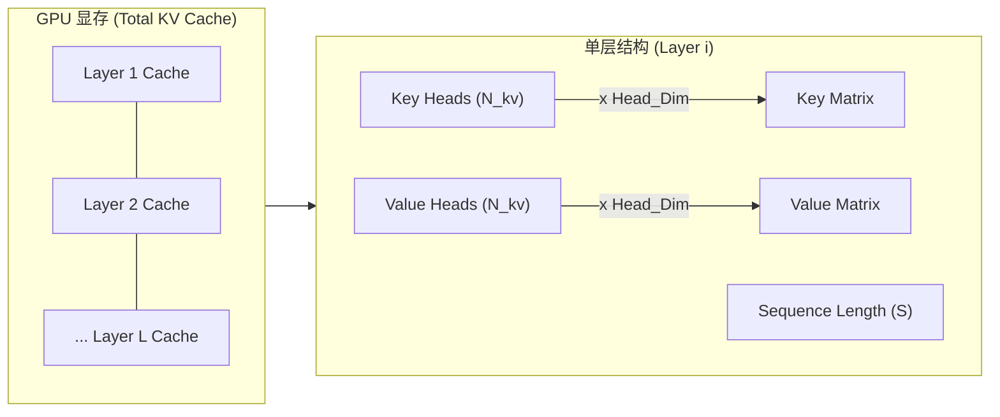
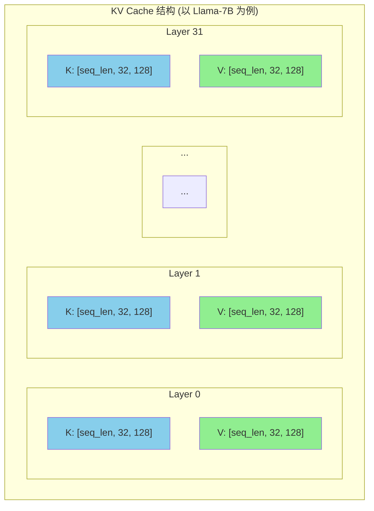

# LLM 模型推理显存占用深度的分析

在 LLM 的推理与部署中，**显存**通常是最先触达的系统性瓶颈：它同时约束了单卡可加载的模型规模、可服务的**并发请求数**（Batch Size），以及可支持的**上下文长度**（Context Window）。尤其在**自回归生成**（autoregressive decoding）场景中，显存会随输入与输出 Token 的累积而持续增长，进而影响吞吐与延迟的稳定性。

## 1. 推理显存的构成

与训练过程不同，推理过程不需要**存储梯度**（Gradients）和**优化器状态**（Optimizer States）。在主流 LLM 推理系统中，显存占用可以拆解为三类：

1. **模型权重（Model Weights）**：静态占用，取决于模型参数量和精度。
2. **KV Cache（Key-Value Cache）**：动态占用，随着序列长度和 Batch Size 线性增长。
3. **中间激活（Intermediate Activations）**：动态占用，推理时的临时计算缓冲区，通常较小。

需要强调的是，上述仅为理论显存占用。实际部署时还会有框架运行时开销（如 CUDA 上下文、算子 workspace、内存分配器碎片等），因此在估算总显存时应预留一定 buffer。

---

## 2. 模型权重（Model Weights）

这是显存占用的“基本盘”。无论是否进行推理，加载模型本身就需要占用这部分显存。

近似估算公式：

$$
\text{Memory}_{\text{weights}} \approx P \times b_{w}
$$

其中：

- $P$：模型参数量（Parameters）。
- $b_{w}$：每个参数占用的字节数（Bytes per parameter）。

常见精度下：

- FP16/BF16： $b_{w}=2$；
- INT8： $b_{w}=1$；
- INT4： $b_{w}=0.5$。

注：INT8/INT4 的估算通常未计入量化权重的 metadata（如 scale / zero-point 或 per-group scaling 参数），实际占用会略高，且不同推理框架的存储格式可能不同。

以 “Qwen3-0.6B” 为例（数量级估算）：

- FP16： $0.6 \times 10^9 \times 2 \approx 1.2 \times 10^9\,\text{Bytes} \approx 1.12\,\text{GiB}$（十进制约 1.2 GB； $1\,\text{GiB} = 1024^3\,\text{Bytes}$）。
- INT8：约为 FP16 的一半。
- INT4：约为 FP16 的四分之一。

---

## 3. 关键模型参数说明

在深入计算 KV Cache 之前，我们需要先明确几个决定显存占用的核心模型参数。以 Hugging Face `transformers` 库中常见的 `config.json` 为例（参考 [Qwen3-0.6B](https://huggingface.co/Qwen/Qwen3-0.6B/blob/main/config.json)）：

- **hidden_size ($H$)**：模型隐藏层的维度大小。
  - 它定义了 Token Embedding 的大小，通常也决定了注意力头的维度： $d_{head} = H / N_{attn}$。
  - 直接影响模型权重大小和 KV Cache 的总容量。
- **num_hidden_layers ($L$)**：模型的层数（Transformer Blocks）。层数越多，需要缓存的 KV 对就越多。
- **num*attention_heads ($N*{attn}$)**：注意力头的总数量。
- **num*key_value_heads ($N*{kv}$)**：用于 Key 和 Value 的头数量。
  - 在标准 **MHA** (Multi-Head Attention) 中， $N_{kv} = N_{attn}$。
  - 在 **GQA** (Grouped-Query Attention) 或 **MQA** (Multi-Query Attention) 中， $N_{kv} < N_{attn}$，这能显著降低 KV Cache 的显存占用。
- **max_position_embeddings**：模型支持的最大上下文窗口长度。这是 $S$ (Sequence Length) 的理论上限。
- **vocab_size**：词表大小。
  - 主要影响 Embedding 层和最后的 LM Head 层的参数量。
  - 注：若配置中 `tie_word_embeddings: true`，则这两层共享参数。
- **intermediate_size**：MLP 层（Feed Forward Network）的中间维度。
  - 在传统结构（如 BERT/GPT-2）中通常为 $4H$。
  - 在现代使用 SwiGLU 激活的模型（如 Llama, Qwen）中，该值通常设定为 $\frac{8}{3}H$ 的近似值。
  - **特例**：在 Qwen3-0.6B 中，该值为 **3072** ($3H$)。这直接影响模型权重大小。

理解这些参数对于准确估算显存至关重要，尤其是在处理使用了 GQA 技术的现代大模型（如 Llama-2-70B, Qwen1.5-72B 等）时。

---

## 4. KV Cache 显存

KV Cache 是 LLM 推理优化中“空间换时间”的关键技术。在自回归生成阶段，如果不缓存历史 Token 的 Key/Value，则每一步解码都需要重复计算前缀部分的注意力相关结果，导致计算复杂度显著上升。实际系统通常采用 KV Cache 以换取更低的计算量与更稳定的延迟。

### 4.1 KV Cache 的物理结构与推导过程

为了理解 KV Cache 的显存公式，我们需要深入到模型内部，看一个 Token 在进入显存时究竟发生了什么。

#### 4.1.1 显存中的 KV Cache 结构

对于每一个 Token，在每一层，模型都会生成对应的 Key 和 Value 张量。假设模型的隐藏层维度为 $H$，注意力头总数为 $N_{attn}$，则每个头的维度 $D_{head} = H / N_{attn}$。

- **Key Tensor**: 形状为 `[N_kv, D_head]`
- **Value Tensor**: 形状为 `[N_kv, D_head]`

其中 $N_{kv}$ 是用于存储 KV 的头数（在 MHA 中等于 $N_{attn}$，在 GQA 中小于 $N_{attn}$）。

我们可以将整个 KV Cache 想象成一个巨大的三维矩阵，随着生成的 Token 数量增加，这个矩阵在“序列长度”方向上不断变长：



一个具体的 Llama-7B 例子如下：



#### 4.1.2 逐步推导公式

**1. 单层、单 Token 的大小**：
我们需要存储 Key 和 Value 两个矩阵。

$$
\text{Size}_{\text{layer, token}} = 2 \times N_{kv} \times D_{head} \times \text{Precision}
$$

**2. 引入模型参数 $H$**：

利用关系 $D_{head} = \frac{H}{N_{attn}}$，替换上式中的 $D_{head}$：

$$
\text{Size}_{\text{layer, token}} = 2 \times N_{kv} \times \frac{H}{N_{attn}} \times \text{Precision}
$$

整理后：

$$
\text{Size}_{\text{layer, token}} = 2 \times H \times \frac{N_{kv}}{N_{attn}} \times \text{Precision}
$$

**3. 扩展到全模型（$L$ 层）**：

$$
\text{Size}_{\text{model, token}} = L \times \text{Size}_{\text{layer, token}} = 2 \times L \times H \times \frac{N_{kv}}{N_{attn}} \times \text{Precision}
$$

**4. 扩展到总并发 ($B$) 和总长度 ($S$)**：

$$
\text{Total KV Memory} = B \times S \times \text{Size}_{\text{model, token}}
$$

最终得到我们熟知的通用公式。

提示：若模型配置提供显式的 `head_dim` 或分别给出 `qk_head_dim / v_head_dim`，应优先使用这些维度计算 KV Cache；仅在缺省时，才使用 $D_{head} = H / N_{attn}$ 的近似关系。

### 4.2 KV Cache 的通用估算公式

考虑到现代 LLM 普遍采用 MHA（多头注意力）或 GQA（分组查询注意力），我们将 KV Cache 的显存计算公式展开为包含模型核心参数的形式：

$$
\text{Memory}_{KV} \approx 2 \times b_{kv} \times L \times B \times S \times H \times \frac{N_{kv}}{N_{attn}}
$$

其中：

- **$2$**：同时缓存 Key 和 Value 矩阵。
- **$b_{kv}$**：KV 数据的精度（Bytes）。通常 FP16/BF16 为 2。
- **$L$**：模型层数（num_hidden_layers，见第 3 节定义）。
- **$B$**：并发请求数（Batch Size）。
- **$S$**：当前上下文总长度（Prompt + Generated），最大不超过 max_position_embeddings。
- **$H$**：模型隐藏层维度（hidden_size，见第 3 节定义）。
- **$N_{kv} / N_{attn}$**：GQA/MQA 的优化系数（KV 头数与总头数之比）。
  - 对于 MHA（如 Llama-1/Qwen-1），该比值为 1。
  - 对于 GQA/MQA，该比值在不同模型间差异很大（例如有的模型为 1/8 或 1/4，也存在 1/2 的配置），会线性影响 KV Cache 的显存占用。

对于 FP16/BF16 ($b_{kv}=2$)，公式可简化为：

$$
\text{Memory}_{KV} \approx 4 \times L \times H \times B \times S \times \frac{N_{kv}}{N_{attn}}
$$

> **适用范围与限制**：上述公式适用于 MHA、GQA、MQA 以及 MLA（通过 $N_{kv}/N_{attn}$ 或等效的 `head_dim` 处理）等标准注意力机制。对于采用**跨 Token 压缩**（如 DeepSeek V4 的 c4a/c128a）、**K=V 共享**等新范式的模型，上述公式不再适用，需使用 4.6 节的分层计算方式。

### 4.3 每 Token 的 KV Cache 体积

为了计算**单个并发请求下，每增加 1 个 Token** 所带来的显存开销（即 KV Cache 的单位密度），我们将 $B=1$（单并发）和 $S=1$（单 Token）代入上式（FP16/BF16）：

$$
\text{Size}_{KV,\text{per-token}} \approx 4 \times L \times H \times \frac{N_{kv}}{N_{attn}}
$$

这条公式非常关键：它说明 KV Cache 的显存与序列长度、并发呈严格线性关系，而 GQA 技术通过降低 $N_{kv}/N_{attn}$ 比率直接减少了该系数。

### 4.4 例：Qwen3-0.6B 的单 Token KV Cache

以 Qwen3-0.6B 为例，根据其模型配置（见第 3 节），并采用 Qwen3 固定的 `head_dim = 128`（而非 $H/N_{attn}$ 近似），可得到更准确的单 Token 显存：

- $L = 28$
- $N_{kv} = 8$ (GQA, ratio = 0.5)
- 每层每 Token： $2 \times N_{kv} \times \text{head\_dim} \times \text{Precision} = 2 \times 8 \times 128 \times 2 = 4{,}096\,\text{Bytes}$
- 跨全模型（28 层）： $4{,}096 \times 28 = 114{,}688\,\text{Bytes} \approx 112\,\text{KiB}$

相比于传统的 13B 级模型（单 Token 约 0.8 MB），小模型配合 GQA 技术使得 KV Cache 极小，这意味着在同样的显存预算下可以支持极大的并发或超长的上下文。对于采用 MLA/DSA 等机制的模型，请参见 4.5 速查表获取按实现口径整理的数据。

**注意：若模型未显式定义 `head_dim`，应优先按 $H/N_{attn}$ 保守估算。**

---

### 4.5 不同模型 KV Cache 速查表

本小节在统一假设与公开配置下，给出常见模型的 KV Cache 单 Token 密度与满上下文体积，便于容量规划与横向对比。除特别说明外，统一采用 bfloat16（2 bytes）。Qwen3 dense 系列统一使用 head_dim = 128；DeepSeek-R1 使用 MLA 压缩存储；GLM-5 的计算依据其公开配置中的 num_hidden_layers、num_key_value_heads 及 qk_head_dim / v_head_dim 等字段。除非特别说明，“满上下文 KV Cache 总量”按单请求（B=1）计算，公式为“KV/token × 上下文长度”。单位采用 1024 进制（KB、MB、GB 为 KiB、MiB、GiB 的近似标法）。

| 模型                    | 层数              | KV Heads                 | KV/token                             | 上下文长度 | 满上下文 KV Cache 总量               |
| ----------------------- | ----------------- | ------------------------ | ------------------------------------ | ---------- | ------------------------------------ |
| Qwen3-0.6B              | 28                | 8                        | **114,688 B ≈ 112 KB**               | 32K        | ~3.5 GB                              |
| Qwen3-1.7B              | 28                | 8                        | **114,688 B ≈ 112 KB**               | 32K        | ~3.5 GB                              |
| Qwen3-4B                | 36                | 8                        | **147,456 B ≈ 144 KB**               | 128K       | ~18.0 GB                             |
| Qwen3-8B                | 36                | 8                        | **147,456 B ≈ 144 KB**               | 128K       | ~18 GB                               |
| Qwen3-14B               | 40                | 8                        | **163,840 B ≈ 160 KB**               | 128K       | ~20 GB                               |
| Qwen3-32B               | 64                | 8                        | **262,144 B ≈ 256 KB**               | 128K       | ~32 GB                               |
| Qwen3-30B-A3B (MoE)     | 48                | 4                        | **98,304 B ≈ 96 KB**                 | 128K       | ~12 GB                               |
| Qwen3-235B-A22B (MoE)   | 94                | 4                        | **192,512 B ≈ 188 KB**               | 128K       | ~23.5 GB                             |
| DeepSeek-R1 (MLA)       | 61                | MLA                      | **70,272 B ≈ 69 KB**                 | 160K       | ~10.7 GB                             |
| GLM-5 (MoE DSA)         | 78                | 64（逻辑）/ 1（物理）    | **100,152 B ≈ 97.8 KB（BF16 上限）** | 202K       | ~18.9 GB（BF16 上限）                |
| DeepSeek V4 (Pro/Flash) | 30 c4a + 31 c128a | 共享 K=V + 跨 Token 压缩 | **~9.4 KB（BF16 等效平均）**         | 1M         | ~9.62 GB（BF16）/ ~4.3 GB（fp8+fp4） |

> 注意：
>
> 1. MoE 模型（30B-A3B、235B-A22B）的 KV heads 仅为 4，相比同参数量 dense 模型 KV Cache 更小；同时激活参数少导致 recompute 也相对快，两者部分抵消。
> 2. DeepSeek-R1 使用 MLA 压缩存储，KV/token 仅 69 KB，是 Qwen3-32B（256 KB）的 27%，但 recompute 代价最高（128 MHA heads + 大 hidden + shared expert），是 Offloading 的最强受益者。
> 3. GLM‑5 的上限口径依据公开配置：num_hidden_layers = 78、num_key_value_heads = 64、kv_lora_rank = 512、qk_rope_head_dim = 64、index_head_dim = 128、max_position_embeddings = 202,752。按 bfloat16 上限计算：MLA 主 KV 每层每 Token ≈ 1,152 B（head_size = 576），Indexer 每层每 Token ≈ 132 B，合计每层每 Token ≈ 1,284 B；跨 78 层得到 KV/token ≈ 100,152 B（≈ 97.8 KB），满上下文（≈ 202K）约 18.9 GB（上限）。配置参考： [GLM‑5 config.json](https://huggingface.co/zai-org/GLM-5/blob/main/config.json)。
> 4. GLM‑5 的注意力采用 DSA（Top‑K KV 稀疏检索）+ MLA（Latent KV 压缩）。Indexer 典型参数：index_topk = 2048、index_n_heads = 32、index_head_dim = 128；全序列只保留压缩的 latent KV（物理 num_kv_heads = 1），查询时通过 Indexer 稀疏选取 Top‑K 位置参与注意力。论文说明： [GLM‑5: from Vibe Coding to Agentic Engineering](https://arxiv.org/html/2602.15763v1)；模型卡： [HF Model Card](https://huggingface.co/zai-org/GLM-5)。
> 5. 工程实态下，稀疏 MLA 通常采用 fp8_ds_mla KV 格式（主 KV ≈ 656 B/层/Token，Indexer ≈ 132 B/层/Token），KV/token ≈ 61,464 B（≈ 60 KB），满上下文约 11.6 GB，显著低于表中 bfloat16 上限；因此 GLM‑5 的容量规划应结合实际后端与 dtype 选择（如 fp8_ds_mla 优先，必要时再按 BF16 上限预留）。vLLM 官方指南推荐以 GLM‑5‑FP8 部署 [5]。
> 6. GLM‑5 的 "64（逻辑）/ 1（物理）" 表示索引与计算采用多头逻辑（index_n_heads × index_head_dim），而实际持久化的 latent KV 采用 1 个物理头进行压缩存储；因此 GLM‑5 的 KV 显存随上下文增长以 latent KV 为主，Top‑K 稀疏缓冲与 index_topk 成正比。
> 7. DeepSeek V4（含 Pro 与 Flash）采用共享 K=V 的跨 Token 压缩注意力：c4a 层（30 层）按 1/4 压缩且带有 Indexer 缓存，c128a 层（31 层）按 1/128 压缩，每层另含 128 个 Token 的滑动窗口。BF16 下 1M 上下文的 KV Cache 仅 ~9.62 GiB，相比传统 MLA 设计减少约 88.5%；工程部署中可采用 fp8 KV + fp4 indexer 进一步压缩至约 4.3 GiB。详见 4.6 节。部署指南参考 [vLLM DeepSeek V4](https://recipes.vllm.ai/deepseek-ai/DeepSeek-V4-Pro)。

---

### 4.6 跨 Token 压缩注意力（以 DeepSeek V4 为例）

DeepSeek V4 引入了一种全新的注意力范式，其 KV Cache 计算无法沿用第 4.2 节的通用公式。核心差异在于以下三个设计：

1. **K=V 共享**：Key 和 Value 共用同一矩阵，不再有 $2\times$ 系数。为保证正确性，注意力输出需应用**逆 RoPE**（Inverse RoPE），使输出仅依赖相对位置信息。
2. **跨 Token 压缩**：不再按注意力头压缩（GQA/MLA），而是将连续多个 Token 的 KV 加权合并为一个压缩 Token。DeepSeek V4 使用两种压缩：
   - **c4a**：压缩比 $C_{c4a}=4$，步长 4，每 8 个未压缩 Token 加权压缩为 1 个。
   - **c128a**：压缩比 $C_{c128a}=128$，步长 128，每 128 个未压缩 Token 加权压缩为 1 个。
3. **层类型异构**：不同层采用不同的注意力策略（c4a / c128a / 仅滑动窗口），不能简单地乘以统一层数 $L$。

此外，c4a 层还包含额外的 **Indexer Cache**，用于稀疏注意力的 Top-$k$ 索引计算。

#### 4.6.1 核心参数

| 符号        | 含义                                   | DeepSeek V4 典型值 |
| ----------- | -------------------------------------- | ------------------ |
| $d_{kv}$    | 共享 KV 的 latent 维度（kv_lora_rank） | 512                |
| $W$         | 滑动窗口大小（未压缩 Token 数）        | 128                |
| $C_{c4a}$   | c4a 压缩比                             | 4                  |
| $C_{c128a}$ | c128a 压缩比                           | 128                |
| $d_{idx}$   | Indexer 维度                           | 128                |
| $L_{c4a}$   | c4a 层数                               | 30                 |
| $L_{c128a}$ | c128a 层数                             | 31                 |
| $S$         | 总序列长度（Prompt + Generated）       | ≤ 1M               |
| $B$         | 并发请求数                             | —                  |
| $b_{kv}$    | KV 精度（Bytes）                       | 2 (BF16), 1 (FP8)  |

#### 4.6.2 分层计算公式

**c4a 层（每层、每序列）**：

$$
M_{\text{c4a\_layer}} = b_{kv} \times \left[ \left(W + \frac{S}{C_{c4a}}\right) \times d_{kv} + \frac{S}{C_{c4a}} \times d_{idx} \right]
$$

- 第一项 $(W + S/C_{c4a}) \times d_{kv}$：主 KV Cache（含滑动窗口未压缩部分 + 压缩后的部分）。
- 第二项 $(S/C_{c4a}) \times d_{idx}$：Indexer Cache，用于稀疏检索。

> **注**：严格计算时应使用 $\min(S, W)$ 替代 $W$，以正确处理 $S < W$ 的短序列情况。当 $S \gg W$ 时，$\min(S, W) = W$，上式不变。

**c128a 层（每层、每序列）**：

$$
M_{\text{c128a\_layer}} = b_{kv} \times \left(W + \frac{S}{C_{c128a}}\right) \times d_{kv}
$$

c128a 层 $k$ 值（8192）足够大，可视为全注意力，因此无需独立的 Indexer Cache。

**全模型总 KV Cache**：

$$
M_{KV,\text{total}} = B \times \left[ L_{c4a} \times M_{\text{c4a\_layer}} + L_{c128a} \times M_{\text{c128a\_layer}} \right]
$$

#### 4.6.3 数值示例：1M 上下文（BF16）

以 61 层 DeepSeek V4（30 c4a + 31 c128a）、$S = 1{,}048{,}576$、$B=1$、BF16 为例：

**c4a 层**：

$$
\begin{aligned}
M_{\text{c4a\_layer}} &= 2 \times \left[ \left(128 + \frac{1{,}048{,}576}{4}\right) \times 512 + \frac{1{,}048{,}576}{4} \times 128 \right] \\
&= (128 + 262{,}144) \times 1024 + 262{,}144 \times 256 \\
&\approx 268{,}582{,}912 + 67{,}108{,}864 \approx 335{,}691{,}776 \ \text{Bytes} \approx 320.1 \ \text{MiB}
\end{aligned}
$$

**c128a 层**：

$$
\begin{aligned}
M_{\text{c128a\_layer}} &= 2 \times \left(128 + \frac{1{,}048{,}576}{128}\right) \times 512 \\
&= (128 + 8{,}192) \times 1024 \approx 8{,}519{,}680 \ \text{Bytes} \approx 8.1 \ \text{MiB}
\end{aligned}
$$

**全模型**：

$$
\begin{aligned}
M_{KV,\text{total}} &= 30 \times 320.1 \ \text{MiB} + 31 \times 8.1 \ \text{MiB} \\
&\approx 9{,}603 + 251 \approx 9.62 \ \text{GiB}
\end{aligned}
$$

#### 4.6.4 混合精度部署（工程实态）

在实际工程部署（vLLM）中，推荐使用混合精度进一步压缩：

- 主 KV Cache：**FP8**（$b_{kv}=1$）
- Indexer Cache：**FP4**（$b_{idx}=0.5$）

在此配置下，1M 上下文的 KV Cache 总量约为 **4.3 GiB**，相比 BF16 全精度减少约 55%。

> **为什么是 55% 而非 50%？** 若仅将主 KV 从 BF16 降至 FP8（2× 压缩），总量约为 4.8 GiB（恰好减半）。但 Indexer Cache 从 BF16 降至 **FP4**（4× 压缩），进一步从 64 MiB/层 缩减至 16 MiB/层。由于 c4a 层（30 层）的 Indexer 占总 KV 的近 20%，FP4 带来的额外节省将整体压缩率从 50% 拉升至 55%。

#### 4.6.5 与 4.2 节通用公式的对比

若将同等配置的 MLA 模型套入第 4.2 节公式（$L=61$，等效 $H=d_{kv}+d_{idx}=640$，$S=1$M，BF16），结果为约 83.9 GiB。DeepSeek V4 通过跨 Token 压缩 + K=V 共享设计，在 BF16 下节省约 **88.5%**。

> **范式判断指南**：第 4.2 节的通用公式适用于 MHA / GQA / MQA / MLA 等需要在每层、每 Token 存储独立 K 与 V 矩阵的传统注意力机制。当模型在 `config.json` 中引入 `compress_ratio` 或类似跨 Token 压缩参数时，必须使用本节的分层公式。

## 5. 中间激活与临时缓冲

在推理过程中，除了权重和 KV Cache，还需要显存来存储算子计算的中间结果（如 Attention 的打分矩阵、MLP 第一层的扩维输出等）。与 KV Cache 不同，这些中间张量通常在一次前向计算后即可释放，因此一般不会随生成 Token 累积。

- **特点**：用完即弃，不随序列长度累积，但受 Batch Size 和上下文长度影响较大。
- **阶段差异**：Prefill 阶段一次性处理完整 Prompt，中间张量规模通常更大；Decode 阶段每步仅处理 1 个新 Token，中间开销通常更小（仅存储单层激活）。

**工程估算建议**：

显存中的“非权重、非 KV”部分实际上包含两块：

1. **固定系统开销**：CUDA Context、框架运行时（如 PyTorch 的 CUDA 初始化与内存分配器元数据）、算子 workspace 等。该值受驱动版本、CUDA 版本、框架版本与算子选择影响较大，业界没有统一的“固定值”。实践中常见量级为数百 MB 到 1 GB+，建议以实际环境 `nvidia-smi`/框架统计为准（机制说明见参考资料 3-4）。
2. **动态激活**：与 Batch Size 呈线性关系。

因此，原本“权重显存的 20%”这一经验法则在不同推理框架/模型结构下并不稳健，且对小模型尤其容易低估固定开销。对于 Qwen3-0.6B 这样的小模型，更建议预留 **1 GB ~ 2 GB** 的固定余量作为工程 buffer（并在上线前以真实工作负载压测校准），而不是按权重比例计算。此外，对于 MoE 模型（如 Qwen3-30B-A3B），由于专家路由计算产生的临时激活张量规模通常大于同量级 Dense 模型，其固定预留量应适当上浮（例如建议预留 2 ~ 4 GB）。

$$
\text{Memory}_{\text{overhead}} \approx 1~\text{GiB} + \alpha \times B
$$

在容量规划时，为安全起见，我们通常建议：**总显存预算 - 权重 - 2GB = 可用 KV Cache**。这 2GB 包含了系统开销、激活值以及碎片冗余。
在工程实践中，也可将该项理解为 “减去 1 GB ~ 2 GB 的固定 buffer（保守取 2 GB）”。

---

## 6. 端到端估算流程（容量规划）

在做推理容量规划时，建议按如下步骤计算，并明确每一步的假设：

1. 确定权重精度与并行方式，估算 $\text{Memory}_{weights}$。
2. 选定服务侧目标：最大并发 $B$、最大总长度 $S$（Prompt + Output），估算 $\text{Memory}_{KV}$。
3. 预留系统开销与中间激活: $\text{Memory}_{overhead}$ 。
   - 大模型（>7B）：可按权重的 20% 估算。
   - 小模型（<1B）：建议直接预留 1 GB ~ 2 GB 固定值（保守取 2 GB），并在真实负载下校准。
4. 检查是否满足：

$$
\text{Memory}_{\text{weights}} + \text{Memory}_{KV} + \text{Memory}_{overhead} \le \text{GPU Memory Budget}
$$

下面给出一段伪代码，描述如何将上述公式落地到估算器中（示例仅用于说明计算流程）：

```python
# 输入：模型结构与服务目标 (Qwen3-0.6B)
P = 0.6e9         # 参数量（Parameters）
L = 28            # 层数（num_hidden_layers）
H = 1024          # 隐藏维度（hidden_size）
B = 32            # 并发（Batch Size）
S_prompt = 512    # 输入长度（prompt tokens）
S_gen = 512       # 输出长度（generated tokens）
N_attn = 16       # 注意力头数
N_kv = 8          # KV 头数 (GQA)

# 权重与 KV 精度
bw = 2            # FP16/BF16：2 bytes
bkv = 2           # FP16/BF16：2 bytes

# 计算：权重显存（Bytes）
mem_weights = P * bw

# 计算：KV Cache 显存（Bytes）
# 注意：引入 GQA 系数 N_kv / N_attn，其中 H * (N_kv / N_attn) 等价于 N_kv * head_dim
S_total = S_prompt + S_gen
mem_kv = 2 * bkv * L * B * S_total * H * (N_kv / N_attn)

# 计算：系统开销与中间激活（Bytes）
# 对于小模型，通常建议预留固定 buffer（例如 1.5 GB ≈ 1.4 GiB）涵盖 CUDA Context + Activation + 碎片冗余
mem_overhead = 1.4 * 1024**3

mem_total = mem_weights + mem_kv + mem_overhead
```

对于**跨 Token 压缩注意力模型**（如 DeepSeek V4），上述 $M_{KV}$ 估算需替换为以下分层计算：

```python
# 输入：DeepSeek V4 模型结构与服务目标
d_kv = 512         # 共享 KV 的 latent 维度（kv_lora_rank）
d_idx = 128        # Indexer 维度
W = 128            # 滑动窗口大小
C_c4a = 4          # c4a 压缩比
C_c128a = 128      # c128a 压缩比
L_c4a = 30         # c4a 层数
L_c128a = 31       # c128a 层数
B = 1              # 并发数
S = 1_048_576      # 总序列长度（1M token）
bkv = 2            # BF16：2 bytes

# c4a 层：主 KV + Indexer
mem_c4a_layer = bkv * ((min(S, W) + S / C_c4a) * d_kv + (S / C_c4a) * d_idx)

# c128a 层：仅主 KV（无 Indexer）
mem_c128a_layer = bkv * (min(S, W) + S / C_c128a) * d_kv

mem_kv = B * (L_c4a * mem_c4a_layer + L_c128a * mem_c128a_layer)

# 混合精度（工程推荐）：主 KV 用 fp8 + Indexer 用 fp4
bkv_fp8 = 1
bidx_fp4 = 0.5
mem_c4a_layer_mixed = bkv_fp8 * (min(S, W) + S / C_c4a) * d_kv + bidx_fp4 * (S / C_c4a) * d_idx
mem_c128a_layer_mixed = bkv_fp8 * (min(S, W) + S / C_c128a) * d_kv
mem_kv_mixed = B * (L_c4a * mem_c4a_layer_mixed + L_c128a * mem_c128a_layer_mixed)
```

## 7. 案例：A100-40G + Qwen3-0.6B（FP16）

为便于手算，本节使用 GiB；速查表统一按 1024 制（KB/MB/GB 为 KiB/MiB/GiB 的近似标法）。

假设单卡 A100-40G，运行 Qwen3-0.6B（BF16），并以“KV Cache 为主要可增长项”的场景来理解并发与长度的约束关系。下文为便于手算，使用 **GiB** 作为容量单位，并将“显存预算”视为 `nvidia-smi` 可见的总显存（实际可用预算还会因驱动/显示/多进程等因素而略小）。

### 7.1 静态门槛

_注：工程计算中建议统一使用 GiB（$1 \text{ GiB} \approx 1.074 \text{ GB}$）进行容量评估，以避免与硬件厂商标称容量产生混淆。_

- 权重显存：约 1.12 GiB。
- 系统开销预留：约 1.4 GiB（含 CUDA Context + Activation + 余量）。
- **可用显存**： $40 - 1.12 - 1.4 \approx 37.48\,\text{GiB}$（其中 “40” 为示例预算，工程上请以实际机器 `nvidia-smi` 读数替换该值）。

### 7.2 并发与长度的约束（KV Cache 主导近似）

用“可用于 KV 的显存预算 / 单 Token KV”来估算可容纳的 Token 总量：

$$
\text{Max Token Capacity} \approx \frac{\text{Available Memory}}{\text{Size}_{KV,\text{per-token}}}
$$

沿用上文 $56\,\text{KiB}$ ($57{,}344\,\text{Bytes}$) 的单 Token KV Cache，预算为 37.48 GiB：

$$
\text{Max Token Capacity} \approx \frac{37.48 \times 1024^3}{57{,}344} \approx 701{,}842
$$

这意味着我们可以同时在显存中容纳超过 70 万个 Token！

这些 Token 需要分配给全部并发请求，因此最大并发可估算为：

$$
B_{max} \approx \frac{\text{Max Token Capacity}}{S}
$$

给出几个典型 $S$ 下的理论最大并发：

1. $S = 512$： $B_{max} \approx 701{,}842 / 512 \approx 1370$。
2. $S = 4096$： $B_{max} \approx 701{,}842 / 4096 \approx 171$。
3. $S = 32k$ ($32768$)： $B_{max} \approx 701{,}842 / 32768 \approx 21$。

**结论**：对于 0.6B 这样的小参数模型，配合 GQA 技术，显存几乎不再是瓶颈。在 A100 这样的硬件上，主要的瓶颈可能会转移到**计算能力**或**显存带宽**，而不是显存容量。这也解释了为什么小模型非常适合部署在端侧设备或消费级显卡上。

---

## 8. 速查公式（用于估算）

在估算 LLM 推理资源需求时，可使用以下速查公式：

1. 总显存需求（预算）：

   $$
   M_{\text{total}} = M_{\text{weights}} + M_{\text{kv cache}} + M_{\text{overhead}}
   $$

2. KV Cache 估算（单卡、FP16/BF16）：

   $$
   M_{\text{kv}} (\text{GiB}) \approx \frac{4 \times L \times H \times B \times S}{1024^3} \times \frac{N_{kv}}{N_{attn}}
   $$

3. 最大并发数估算（KV 主导近似）：

   $$
   B_{\text{max}} \approx \frac{\text{GPU Mem Budget} - M_{\text{weights}} - M_{\text{overhead}}}{(4LH \cdot \frac{N_{kv}}{N_{attn}}) \times S}
   $$

4. 跨 Token 压缩模型的 KV Cache（DeepSeek V4 范式）：

   $$
   M_{\text{kv}} = B \times \sum_{t \in \text{types}} L_{t} \times b_{kv} \times \left[ \left(W + \frac{S}{C_{t}}\right) \times d_{kv} + \mathbf{1}_{\text{has\_indexer}}(t) \times \frac{S}{C_{t}} \times d_{idx} \right]
   $$

   其中 $C_{t}$ 为层类型 $t$ 的压缩比，$L_{t}$ 为对应层数。对 c128a 层，无 Indexer 项。严格计算时用 $\min(S, W)$ 替代 $W$，当 $S \gg W$ 时两者等价。

5. DeepSeek V4 BF16 单序列速算（$S$ 较大时滑动窗口项可近似忽略）：
   $$
   M_{\text{kv}} (\text{GiB}) \approx \frac{2 \times S \times d_{kv} \times (L_{c4a}/C_{c4a} + L_{c128a}/C_{c128a}) + 2 \times S \times d_{idx} \times L_{c4a}/C_{c4a}}{1024^3}
   $$

其中 $\text{GPU Mem Budget}, M_{\text{weights}}, M_{\text{overhead}}$ 的单位需要与分母保持一致（推荐统一使用 Bytes，或统一使用 GiB 并在分子分母同时除以 $1024^3$）。

通过深入理解显存构成，我们可以更科学地进行硬件选型和系统优化，在成本与性能之间找到最佳平衡点。

---

## 参考资料

1. Tw93, “llm 参数量-计算量-显存占用分析”, URL: <https://www.armcvai.cn/2024-09-20/llm-params-flops.html>
2. LMCache, "KV Cache Size Calculator", URL: <
3. PyTorch Documentation, "CUDA memory management", URL: <https://pytorch.org/docs/stable/notes/cuda.html#cuda-memory-management>
4. NVIDIA, "CUDA C++ Programming Guide", URL: <https://docs.nvidia.com/cuda/cuda-c-programming-guide/index.html>
5. vLLM Recipes, "GLM‑5 Usage (FP8 部署指南)", URL: <
6. vLLM Blog, "vLLM: Easy, Fast, and Cheap LLM Serving with PagedAttention", URL: <https://vllm.ai/blog/vllm>
7. vLLM, "DeepSeek V4 — Efficient Long-Context Attention in vLLM", 项目内参考文档: `vllm_deepseek_v4.md` ⚠️ (原文链接)
8. DeepSeek-AI, "DeepSeek-V4-Pro", URL: <https://huggingface.co/deepseek-ai/DeepSeek-V4-Pro>
9. 本仓库, "DeepSeek V4 显存估算脚本", 项目内参考文件: [calculate_deepseek_v4_memory.py](calculate_deepseek_v4_memory.py)
