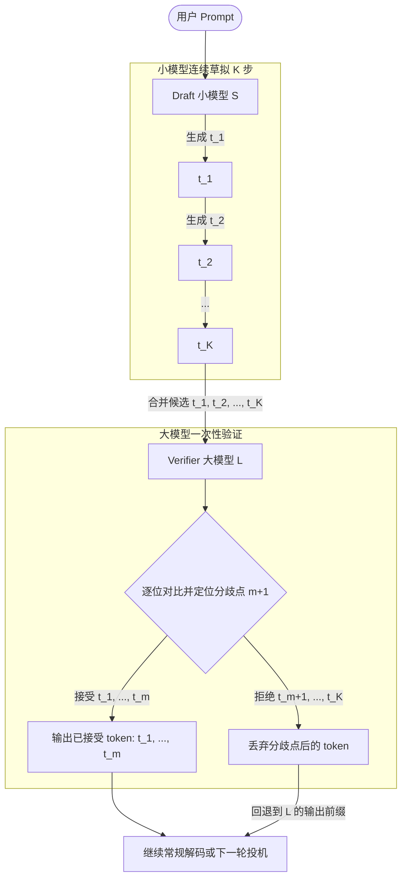
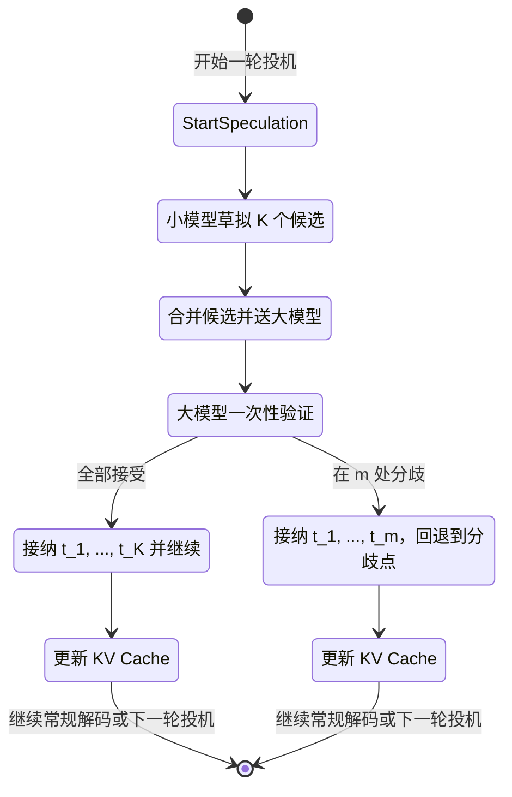
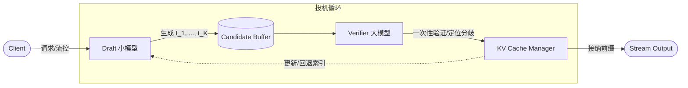

# 图解投机解码

本文系统梳理了 `Speculative Decoding`（投机解码 / 投机推理）的核心思想、算法家族、系统实现与工程调优要点，并配以可视化图解与可复用的评测方法，力求在保证严谨性的同时保持通俗易懂。相关数据与配置项均来源于公开学术论文与业界主流推理引擎（如 vLLM 等）的工程实践。

---

## 术语与符号一览

在深入探讨投机解码的技术细节之前，我们首先统一定义本文涉及的核心术语与数学符号。这些概念构成了理解后续草拟、验证与性能模型推导的基础。

| 术语     | 含义                  | 符号/公式                                                         | 说明                              |
| -------- | --------------------- | ----------------------------------------------------------------- | --------------------------------- |
| prefill  | 处理提示前缀的阶段    | —                                                                 | 负责上下文编码，为 decode 提供 KV |
| decode   | 逐步生成阶段          | —                                                                 | 串行生成 token，受因果依赖约束    |
| TTFT     | 首个输出出现的时刻    | —                                                                 | Time To First Token               |
| TPOT     | 单位输出 token 的耗时 | $\frac{T_{\text{end}} - T_{\text{first}}}{N_{\text{tokens}} - 1}$ | 稳态期效率指标                    |
| $K$      | 每轮草拟步长          | —                                                                 | 一次由小模型提出的候选数量        |
| $E[A]$   | 被接纳前缀的期望长度  | —                                                                 | 接受至分歧的期望长度              |
| $\alpha$ | 接受率                | $\frac{E[A]}{K}$                                                  | 取值 0–1，越高越好                |
| $\rho$   | 小/大模型单步耗时比   | $\frac{t_{\text{small}}}{t_{\text{large}}}$                       | 通常 $\rho \ll 1$                 |

---

## 1. 核心机制与流程图解

投机解码（Speculative Decoding）旨在打破大模型自回归生成的延迟瓶颈。本章将从投机动机出发，详细图解其“草拟-验证”的核心机制，并梳理推理引擎中的投机状态机流转。

### 1.1 投机动机与瓶颈

在长输出或流式场景中，decode 阶段通常占据端到端时间的 70%–90%。传统的自回归生成面临以下瓶颈：

- **低并行度**：单步序列长度为 1 的前向计算难以充分发挥张量并行的算力优势。
- **串行依赖**：即便引入 `KV Cache` 降低了历史 token 的重复计算，逐 token 的因果依赖仍严格限制了生成吞吐。

投机解码的核心动机是：以更快、成本更低的小模型先行草拟 `K` 个候选，再由大模型一次性验证并批量接纳。以 Qwen2-72B（大）和 Qwen2-0.5B（小）且 `K=3` 为例：

- 约用 **1.5×** 的单步时间
- 期望产出约 **3×** 的有效 token

从而显著降低了 `TPOT` 与单字成本。

### 1.2 草拟与验证机制

投机解码的核心逻辑分为两个阶段。通过引入严格的分布校验与分歧点回退机制，大模型能够确保投机过程在不损失最终输出质量（即保证与单独运行大模型具有相同数学期望的生成分布）的前提下，实现批量验证。草拟-验证的具体接纳规则如下：

- 小模型连续产出候选序列 $t_1, t_2, \dots, t_K$。
- 大模型以这些 token 作为“候选输入”，一次性计算对应位置的条件分布。
- 逐位比较候选与大模型最优（或采样）分布是否一致，直至遇到第一个分歧点 $t_{m+1}$。
- 接受并输出已验证的 $t_1, t_2, \dots, t_m$，丢弃其余部分，并回退到大模型的分布继续生成下一个 token。

> [!NOTE]
> **采样参数的影响**：若采用确定性设置（如低温、贪心解码），接受率 `α` 通常更高；温度与 `top_p` 的增大会增强随机性，降低候选与大模型分布的一致性，从而拉低 `α` 与整体收益。

示意图（大小模型协同的草拟-验证流程）：



图 1：草拟-验证流程示意

### 1.3 状态机与工程关键路径

在实际的推理引擎中，投机解码的执行可以抽象为一个复杂的状态机。理解这一状态机的流转对于系统开发与工程调优至关重要。

其核心的工程关键路径包含以下阶段：首先，小模型连续草拟 `K` 步；接着，引擎合并候选并送入大模型进行一次性验证，定位分歧点；最后，基于接纳的前缀更新 `KV Cache` 与输出缓冲。在此过程中，引擎还需在批内进行碎片整理以提升吞吐。特别是在多并发场景下，必须保证回退与早停对缓存指针的一致性修正，并将流式输出与下一轮投机解耦，以避免队头阻塞问题。



图 2：一次投机轮次状态机

---

## 2. 方法谱系与系统实现要点

从“如何提出候选”与“如何更高效验证”两条主线梳理方法家族：一类使用独立草拟模型（降低提出开销，依赖分布接近提高 `α`）；另一类在大模型内部引入结构（如多头一次多 token）减少往返与跨模型同步。不同方法在实现复杂度、可维护性、可移植性与收益稳定性之间存在显著权衡。

### 2.1 主流方法家族

工业界与学术界围绕“草拟候选”与“验证校验”两个核心阶段衍生出了多种不同的投机架构。为了更清晰地对比不同投机范式在效率、模型侵入性与实现难度上的差异，我们将常见的方法归纳如下：

- **N-gram Prompt Lookup（工业实现）**：基于提示前缀与候选的局部匹配来进行快速提议与验证，依赖 `prompt_lookup_min/max` 控制匹配长度窗口。该方法实现简单、易于在推理引擎中落地，适合作为投机功能的基础选项（如在 vLLM 中可通过 `method=ngram` 启用）。
- **Draft Model / Assisted Generation（经典范式）** [1]：以小模型作为 draft，大模型作为 verifier。小模型选型可采用同架构缩小版、蒸馏模型或剪枝/量化变体。**权衡要点**：小模型越弱，接受率下降；小模型越强，接受率提升但草拟成本增加。
- **多头辅助与一次多 token（如 Medusa）** [2]：在大模型上附加多预测头以一次性产生多个候选序列，显著减少往返步骤与跨模型通信成本，但增加了模型结构的工程复杂度。
- **Look-ahead / 非自回归风格变体（如 EAGLE）** [3]：面向更长步长的前瞻生成与高效回退策略，强调在保证质量的前提下扩大一次验证可接纳的 token 数。
- **再草拟与重写（如 ReDrafter）**：通过候选重写、分层校验与更细粒度的接纳规则来提升有效步长与生成质量，适合对文本连贯性与风格一致性要求更高的应用场景。

### 2.2 引擎与缓存实现要点

在推理引擎（如 vLLM 等）中落地投机解码，其核心难点在于对内存与系统流控的精细化管理。

从推理引擎视角分解实现：首先，必须在接纳与回退时同步更新 `KV Cache` 索引，以避免跨请求的数据污染；其次，在批间进行页式碎片整理，能够有效提升缓存命中率与显存带宽效率；此外，需要将投机循环与流式输出通道解耦，确保验证早停不会破坏下一轮的草拟过程；最后，在张量并行或流水线并行的分布式环境下，还需协调跨层依赖，保证回退边界的快速生效。vLLM 等引擎已通过专用参数支持并调优了该特性 [4]。



图 3：系统数据流与 `KV Cache` 更新路径

### 2.3 投机配置与参数说明

将投机解码集成到生产级推理服务端（如 vLLM 等）需要关注特定的启动配置与请求参数。以下示例展示了如何在服务端激活投机特性，并在客户端请求中调优以最大化性能收益。

示例配置（以 OpenAI 风格服务端与 vLLM 投机参数为例）：

```bash
# 启动服务端（示意）
python -m vllm.entrypoints.openai.api_server --speculative-model <draft_model_name> --num-speculative-tokens 3
```

```jsonc
// 客户端请求中的关键生成参数（示意）
// 说明：结合投机超参调优温度与 top_p，以平衡多样性与接受率
{
  "model": "your_base_model",
  "messages": [{ "role": "user", "content": "示例问题" }],
  "max_tokens": 128,
  "top_k": -1,
  "top_p": 0.1,
  "temperature": 0.0,
  "stream": false,
}
```

投机相关核心超参要点：

- `--speculative-model`：指定用于草拟的候选模型名称（如小参数量的蒸馏模型）
- `--num-speculative-tokens (int)`：每次草拟的 token 数（即步长 $K \ge 1$）。建议从 1 或 2 起步，结合接受率与延迟收益再递增
- `--speculative-draft-tensor-parallel-size`：当大模型采用多卡张量并行时，可单独指定草拟模型的并行度
- `--use-v2-block-manager`：对于某些高级的投机方式，可能需要开启 v2 版本的内存块管理器以更好地支持复杂的注意力分配

---

## 3. 性能模型与工程评测

本章将从理论的性能加速模型出发，推导投机解码的收益边界；随后提供可复用的评测框架，并在最后对比投机解码与其他主流推理加速技术的选型差异。

### 3.1 性能模型与加速条件

为了量化投机解码的收益，我们以大模型单次 decode 的耗时为基准（归一化为 1），可推导如下近似模型：

- **单轮投机耗时**：约为 $1 + \rho K$
- **单轮期望产出**： $E[A] = \alpha K$ 个有效 token
- **单位 token 相对耗时**：约为 $\frac{1 + \rho K}{\alpha K}$

**加速条件**：只有当 $\alpha K > 1 + \rho K$ 时，投机解码才能带来实际的加速收益。如果收益未达预期，可采取以下调整：

1. **减小步长 $K$**：降低无用的回退开销。
2. **提升小模型能力**：增强大小模型分布的一致性以提高接受率 $\alpha$。

> [!NOTE]
> **采样策略与多样性**：温度（Temperature）与 `top_p` 增大会显著降低 $\alpha$。确定性解码（低温、贪心）更利于投机加速，但在实际应用中需与输出多样性需求进行权衡。

为直观展示投机步长 $K$ 与接受率 $\alpha$ 对性能的影响，我们设定单步耗时比 $\rho = 0.2$，计算并对比了在不同接受率下的单位 Token 相对耗时（越低越好）：

| 草拟步长 $K$ | 相对耗时 ($\alpha = 0.6$) | 相对耗时 ($\alpha = 0.4$) | 结论分析                       |
| :----------: | :-----------------------: | :-----------------------: | :----------------------------- |
|    **1**     |           2.00            |           3.00            | 步长过短，验证收益无法覆盖开销 |
|    **2**     |           1.33            |           2.00            | -                              |
|    **3**     |           1.11            |           1.67            | -                              |
|    **4**     |           1.00            |           1.50            | 临界点或收益拐点附近           |
|    **5**     |         **0.92**          |           1.40            | 在高接受率下，较大步长带来加速 |

表 1：不同接受率下的单位 Token 相对耗时推演（基于 $\rho=0.2$ 近似估算）

### 3.2 评测框架与调优路径

为了验证投机解码在特定业务场景下的真实收益，并找到最佳的配置参数，我们需要构建一套系统化的评估方法。在实际落地中，建议基于以下维度建立标准化的评测与调优框架：

- **核心观测指标**：
  - 延迟与吞吐：`TTFT`、`TPOT`、整体吞吐量。
  - 投机效率：接受率 $\alpha$、拒绝回退比例。
  - 生成质量：困惑度（Perplexity）或人工偏好盲测。
- **调优实验变量**：固定请求数据分布，分别扫描草拟步长 $K$、小模型规模与采样温度，绘制 $\alpha(K)$ 与 $\text{TPOT}(K)$ 的双轴曲线，选取“质量阈值内的最优 $K$ 区间”。
- **工程监控侧重点**：记录各阶段（Draft/Verify）计时、`KV Cache` 命中率与碎片率，并重点监控尾延迟（P95/P99），以排查收益失常的系统瓶颈。
- **投机指标作为质量探针**：除性能评估外，$\alpha$ 与 $E[A]$ 的统计分布还能反向指示底层 KV Cache 状态的健康度——一个原本高接受率的请求若突变为极低接受长度（$<1.0$），往往意味着目标模型读取到了被污染的上下文；若接受率飙升到 $>0.96$ 伴随输出复读，则提示 Attention 模式坍缩。故 $\alpha$ 可作为低成本、无侵入的在线质量监控信号 [5]。

### 3.3 技术对比与选型建议

在评估是否引入投机解码以及选择具体方案时，架构师通常需要将其与其他主流的推理加速技术进行横向对比，以权衡性能、成本与系统复杂度：

- **MTP (多 token 预测)**：借助多头一次产出多 token，减少往返，但需修改大模型结构。
- **Contrastive Decoding (对比解码)**：强化校验分布，提升生成质量，但引入了额外计算开销。
- **并行解码/分枝搜索**：更偏向于输出多样性与广度探索。

**选型结论**：投机解码在“**改动小、可与现有引擎快速无缝集成**”上具有显著优势。在追求极致性能的场景下，甚至可将其与多头结构或对比校验组合使用，以兼顾效率与质量。

| 推理加速技术      | 实现成本 | 收益稳定性 | 质量影响 (负向) | 可移植性 |
| :---------------- | :------- | :--------- | :-------------- | :------- |
| **投机解码**      | 低       | 高         | 低              | 高       |
| **MTP 多头**      | 高       | 中         | 中              | 低       |
| **对比解码**      | 中       | 中         | 高              | 中       |
| **并行/分枝搜索** | 低       | 低         | 中              | 低       |

> [!NOTE]
> 以上评估为经验性结论，具体表现依赖于实际的模型结构、引擎实现与业务数据分布。

表 2：不同推理加速技术的方法家族对比

---

## 4. 局限性与场景化落地

在了解了投机解码的收益模型后，本章将探讨其在实际生产环境中可能遇到的局限性与风险，并针对不同业务场景给出具体的落地配置建议。

### 4.1 局限性与风险

投机解码并非银弹，在某些特定条件下，其收益可能会大打折扣甚至引发稳定性问题：

- **分布偏移（OOD）与长上下文**：当请求内容属于领域外知识或上下文极长时，小模型的预测能力会显著下降，导致接受率 $\alpha$ 暴跌，引入大量无效的验证和回退开销。
- **高温度与强多样性**：高 `temperature` 会放大候选与大模型分布的分歧，导致回退频繁震荡，严重拖慢推理速度。
- **多租户与尾延迟（Tail Latency）**：在在线高并发场景下，个别因接受率极低而反复重试的重负载请求，可能会放大队头阻塞效应，从而恶化系统整体的 P95/P99 尾延迟。
- **底层竞态会伪装为“性能回落”**：在 PD 分离架构与异步流水线（如 HiCache）下，KV Cache 槽位复用、延迟到达的 RDMA 写入或 Read-before-ready 缺陷，均可能造成接受率雪崩与输出质量退化。SGLang 团队在生产环境中的排查实践表明，投机接受率可作为此类隐形竞态的早期预警信号 [5]。

**缓解策略**：

1. **动态调节**：根据实时接受率动态调节步长 $K$。
2. **智能降级**：对于高温度或特殊路由特征的请求，自动降级为常规解码。
3. **尾延迟兜底**：为 P99 设定保守的算力上限，并提供快速熔断与回滚路径。

### 4.2 场景化落地建议

不同业务场景对延迟、吞吐和输出一致性的要求各不相同。为了最大化投机解码的价值，针对不同的业务场景，建议采取差异化的投机参数配置与运维策略：

- **在线对话（稳定优先）**：
  - 建议 `K=1` 起步。
  - 采用低温、低 `top_p` 策略以保证接受率。
- **批量文案生成（吞吐优先）**：
  - 在生成质量达标的前提下，可将 `K` 提升到 `2–3`，以最大化压榨大模型计算窗口。
- **代码补全（精确一致优先）**：
  - 代码对前缀的精确一致性极其敏感，建议在极低温度与极小 `top_p` 条件下开启，以获得最佳加速比。
- **软硬件运维保障**：
  - 结合跨请求的 `KV Cache` 复用（如 Prefix Caching）与容器层面的可观测性指标，建立“参数-指标”联动的自动化变更与回滚流程。

---

## 5. 参考资料

[1] C. Chen et al., "Accelerating Large Language Model Decoding with Speculative Sampling," _arXiv preprint arXiv:2302.01318_, 2023. [Online]. Available: https://arxiv.org/abs/2302.01318
[2] T. Cai et al., "Medusa: Simple LLM Inference Acceleration Framework with Multiple Decoding Heads," _arXiv preprint arXiv:2401.10774_, 2024. [Online]. Available: https://arxiv.org/abs/2401.10774
[3] Y. Li et al., "EAGLE: Speculative Sampling Requires Rethinking Feature Uncertainty," _arXiv preprint arXiv:2401.15077_, 2024. [Online]. Available: https://arxiv.org/abs/2401.15077
[4] vLLM Team, "Speculative Decoding in vLLM," _vLLM Documentation_. [Online]. Available: https://docs.vllm.ai/en/latest/features/speculative_decoding/
[5] Z.ai Team, "Scaling Pain：超大规模 Coding Agent 推理实践," _z.ai Blog_, 2025. [Online]. Available: https://z.ai/blog/scaling-pain （翻译版见本仓 `SGLang Scaling Pain 超大规模推理调优案例` ⚠️ (原文链接)）
