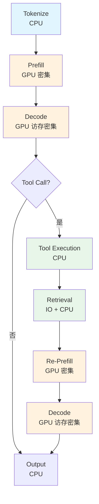
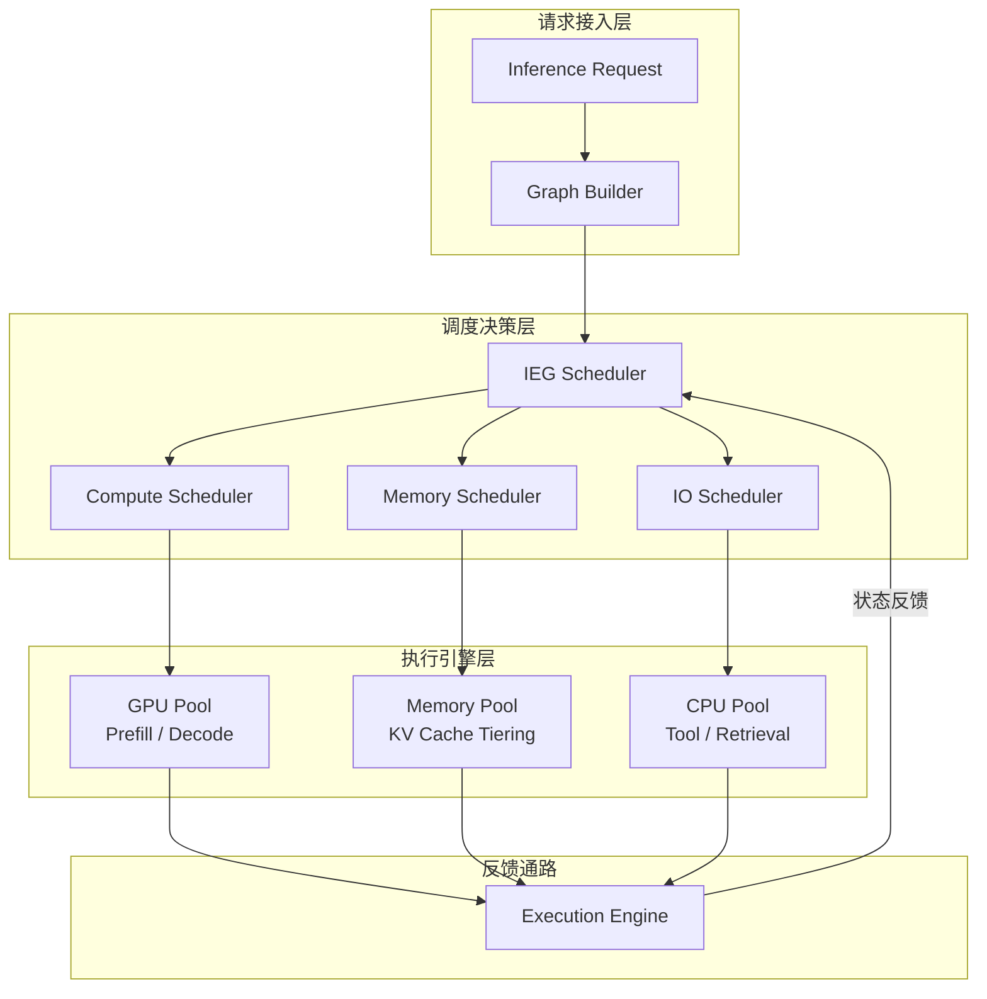
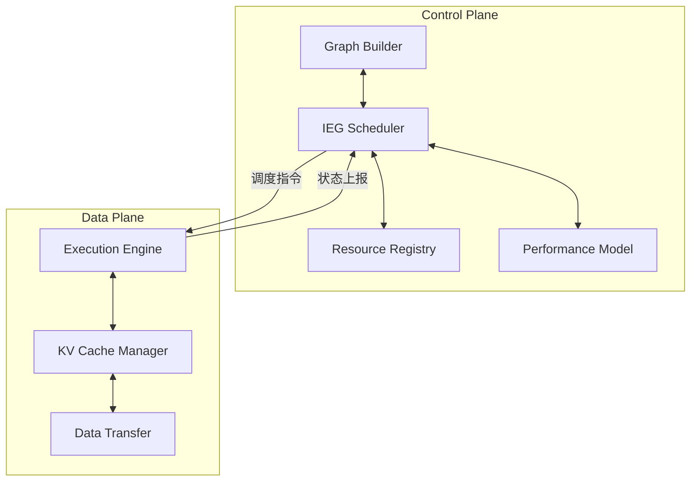
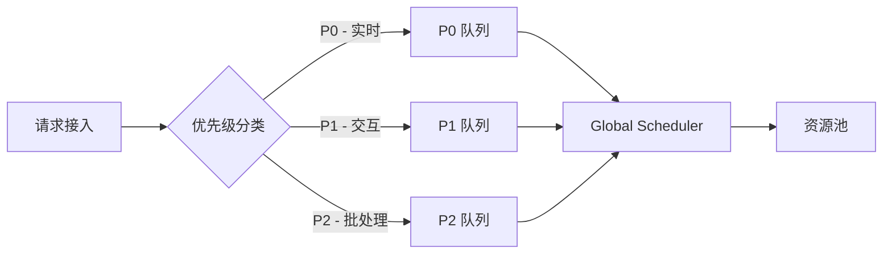
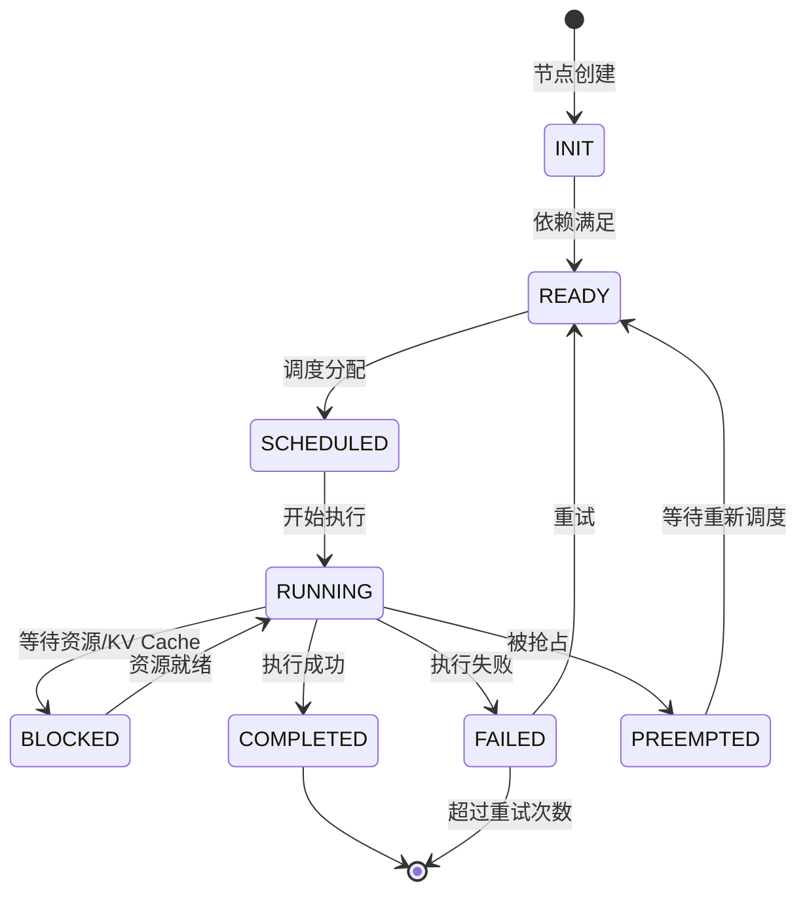
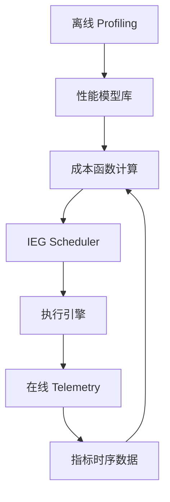
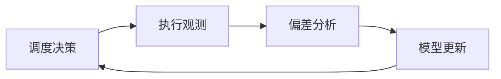

# 面向推理执行图的异构调度系统架构设计

在大模型推理从简单的单次前向计算演变为包含 Prefill、Decode、Tool Calling、Retrieval 等多阶段协作的复杂流程后，传统以 Pod/GPU 为粒度的资源调度方式已无法有效匹配推理工作负载的异构性。本文提出一种以**推理执行图**（Inference Execution Graph, IEG）为核心调度对象的异构调度系统架构，将调度粒度从“资源分配”提升到“推理执行语义”，实现跨设备、跨阶段、跨模型的精细化调度。

## 目录

- [面向推理执行图的异构调度系统架构设计](#面向推理执行图的异构调度系统架构设计)
  - [目录](#目录)
  - [1. 问题分析与设计目标](#1-问题分析与设计目标)
    - [1.1 调度层次澄清](#11-调度层次澄清)
    - [1.2 问题本质](#12-问题本质)
    - [1.3 核心设计目标](#13-核心设计目标)
  - [2. 核心抽象：推理执行图（IEG）](#2-核心抽象推理执行图ieg)
    - [2.1 形式化定义](#21-形式化定义)
    - [2.2 典型执行图示例](#22-典型执行图示例)
    - [2.3 执行节点类型](#23-执行节点类型)
    - [2.4 与现有计算图的关系](#24-与现有计算图的关系)
    - [2.5 执行语义模型（Execution Semantics Model）](#25-执行语义模型execution-semantics-model)
    - [2.6 Inference OS 类比](#26-inference-os-类比)
    - [2.7 与现有系统的对比](#27-与现有系统的对比)
  - [3. 调度对象升级：从资源到执行语义](#3-调度对象升级从资源到执行语义)
    - [3.1 调度范式对比](#31-调度范式对比)
    - [3.2 节点调度描述（Node Spec）](#32-节点调度描述node-spec)
    - [3.3 资源能力描述（Resource Spec）](#33-资源能力描述resource-spec)
  - [4. 系统整体架构](#4-系统整体架构)
    - [4.1 架构总览](#41-架构总览)
    - [4.2 核心数据流](#42-核心数据流)
    - [4.3 控制面与数据面分离](#43-控制面与数据面分离)
  - [5. 核心调度机制](#5-核心调度机制)
    - [5.1 阶段感知调度](#51-阶段感知调度)
    - [5.2 图级调度](#52-图级调度)
    - [5.3 动态运行时调度](#53-动态运行时调度)
    - [5.4 多请求调度模型（Multi-Tenant Scheduling）](#54-多请求调度模型multi-tenant-scheduling)
  - [6. 关键子系统设计](#6-关键子系统设计)
    - [6.1 IEG 构建器（Graph Builder）](#61-ieg-构建器graph-builder)
    - [6.2 异构调度器（Heterogeneous Scheduler）](#62-异构调度器heterogeneous-scheduler)
    - [6.3 KV Cache 管理器（Memory Scheduler）](#63-kv-cache-管理器memory-scheduler)
    - [6.4 执行引擎（Execution Engine）](#64-执行引擎execution-engine)
    - [6.5 数据路径优化（Data Locality）](#65-数据路径优化data-locality)
    - [6.6 性能建模与反馈闭环（Performance Modeling \& Feedback Loop）](#66-性能建模与反馈闭环performance-modeling--feedback-loop)
      - [6.6.1 三层性能建模架构](#661-三层性能建模架构)
      - [6.6.2 第一层：离线 Profiling](#662-第一层离线-profiling)
      - [6.6.3 第二层：在线 Telemetry](#663-第二层在线-telemetry)
      - [6.6.4 第三层：自适应成本模型](#664-第三层自适应成本模型)
      - [6.6.5 闭环反馈机制](#665-闭环反馈机制)
  - [7. 关键调度策略](#7-关键调度策略)
    - [7.1 节点级 Best-Fit 与图级联合优化](#71-节点级-best-fit-与图级联合优化)
    - [7.2 KV Cache 亲和调度](#72-kv-cache-亲和调度)
    - [7.3 Prefill/Decode 解耦调度](#73-prefilldecode-解耦调度)
    - [7.4 SLA 驱动调度](#74-sla-驱动调度)
    - [7.5 跨厂商调度](#75-跨厂商调度)
  - [8. 容灾与迁移](#8-容灾与迁移)
    - [8.1 故障粒度变化](#81-故障粒度变化)
    - [8.2 分级容灾策略](#82-分级容灾策略)
    - [8.3 IEG 特有的恢复能力](#83-ieg-特有的恢复能力)
  - [9. 关键价值总结](#9-关键价值总结)
    - [9.1 资源利用率提升](#91-资源利用率提升)
    - [9.2 端到端性能优化](#92-端到端性能优化)
    - [9.3 成本结构优化](#93-成本结构优化)
    - [9.4 架构演进能力](#94-架构演进能力)
  - [10. 可行性分析：现实系统对标](#10-可行性分析现实系统对标)
    - [10.1 核心设计点与现实系统映射](#101-核心设计点与现实系统映射)
    - [10.2 关键系统详细分析](#102-关键系统详细分析)
    - [10.3 未被完全验证的设计点](#103-未被完全验证的设计点)
    - [10.4 可行性结论](#104-可行性结论)
  - [11. 参考文献](#11-参考文献)

---

## 1. 问题分析与设计目标

本节从传统调度系统的局限性出发，分析推理场景下的核心痛点，进而明确异构调度系统的设计目标。

### 1.1 调度层次澄清

在讨论 LLM 推理系统的调度问题时，需要首先区分两种不同层次的调度：

| 调度层次         | 调度对象          | 时间尺度  | 决策频率      | 典型系统              |
| ---------------- | ----------------- | --------- | ------------- | --------------------- |
| **工作负载调度** | 服务实例/Pod/容器 | 分钟~小时 | 部署/扩缩容时 | Kubernetes, Ray Serve |
| **请求调度**     | 推理请求/执行阶段 | 毫秒~秒   | 每请求        | vLLM, 本文 IEG 系统   |

**工作负载调度（Workload Scheduling）**：决定在哪些节点上部署多少个推理服务实例，如何分配 GPU 资源给不同的服务。这是基础设施层面的调度，由 Kubernetes 等编排系统负责，决策周期较长（分钟级），关注的是服务的可用性和资源的宏观分配。

**请求调度（Request Scheduling）**：决定每个到达的推理请求如何在已部署的资源上执行，包括路由到哪个实例、各执行阶段如何分配资源。这是运行时层面的调度，决策周期极短（毫秒级），关注的是单个请求的延迟和吞吐。

**本文聚焦于请求调度层**，具体而言：

- **调度单元**：不是整个请求，而是请求分解后的**执行节点**（Execution Node）
- **调度目标**：为每个执行节点（Prefill、Decode、Tool Call 等）匹配最优的硬件资源
- **前提假设**：工作负载调度已由 Kubernetes 等系统完成，IEG 调度器在已部署的资源池上进行请求级调度

```text
┌─────────────────────────────────────────────────────────────┐
│                    工作负载调度层                             │
│  Kubernetes / Ray Serve / 云平台调度器                        │
│  决策：部署多少实例、分配哪些 GPU、服务如何扩缩容                   │
└─────────────────────────────────────────────────────────────┘
                              ↓ 提供资源池
┌─────────────────────────────────────────────────────────────┐
│                    请求调度层（本文重点）                       │
│  IEG Scheduler                                              │
│  决策：请求如何分解、各节点调度到哪个设备、KV Cache 如何管理         │
└─────────────────────────────────────────────────────────────┘
```

两层调度协同工作：工作负载调度确保有足够的资源可用，请求调度确保每个请求高效执行。本文不涉及工作负载调度的设计（如服务弹性伸缩策略），而是假设资源池已就绪，专注于请求到达后的执行调度优化。

### 1.2 问题本质

传统的 Kubernetes 调度系统以 Pod 和 GPU 为调度对象，其决策依据主要是资源是否满足（显存容量、GPU 卡数）。这种调度范式在推理系统中存在以下根本性不足：

- **阶段无感知**：无法区分 Prefill（计算密集）与 Decode（访存密集）等阶段的差异化资源需求，导致 GPU 在 Decode 阶段大量算力空闲。
- **异构计算盲区**：无法感知 KV Cache 管理、Tool Calling、Retrieval 等非 GPU 密集型计算环节，这些环节被迫占用昂贵的 GPU 资源。
- **全局优化缺失**：以单个 Pod 为调度粒度，无法进行跨阶段、跨请求的全局资源编排。

上述局限带来了三个直接后果：

1. **GPU 利用率低**：Decode 阶段的 GPU 算力利用率通常不足 30%，大量计算能力被浪费[1]。
2. **资源分配不合理**：CPU 密集型的 Tool Calling 和 Retrieval 任务被绑定在 GPU 节点上，既浪费 GPU 资源又无法充分利用 CPU 资源池。
3. **端到端延迟不可控**：缺乏阶段级别的 SLA 管理，无法对 TTFT（首 Token 延迟）和 ITL（Token 间延迟）进行精细化控制。

### 1.3 核心设计目标

基于上述问题分析，本文的核心目标是构建一个以推理执行图（IEG）为核心调度对象的异构调度系统，实现三个维度的范式升级：

| 维度     | 传统方式 | IEG 方式 | 核心变化                             |
| -------- | -------- | -------- | ------------------------------------ |
| 调度驱动 | 资源驱动 | 语义驱动 | 调度依据从资源可用性转向推理语义需求 |
| 调度粒度 | 单点调度 | 图级调度 | 调度对象从单个 Pod 扩展到完整执行图  |
| 调度策略 | 静态分配 | 动态调度 | 从部署时静态绑定转向运行时动态决策   |

---

## 2. 核心抽象：推理执行图（IEG）

推理执行图（Inference Execution Graph, IEG）是本架构的核心抽象。它将一次完整的推理请求建模为一个有向无环图（DAG），图中的节点表示执行阶段，边表示数据依赖或控制依赖关系。IEG 为调度器提供了推理语义层面的全局视图，使调度决策能够基于执行阶段的资源特征而非简单的资源容量。

### 2.1 形式化定义

一个推理执行图可以形式化地表示为 $\text{IEG} = (V, E, \sigma, \delta)$，其中：

- $V$：执行节点（Execution Node）集合，每个节点 $v_i \in V$ 表示一个可调度的计算阶段。
- $E$：有向边集合，$e_{ij} = (v_i, v_j) \in E$ 表示节点 $v_i$ 到 $v_j$ 的依赖关系，包括数据依赖（Data Dependency）和控制依赖（Control Dependency）。
- $\sigma: V \rightarrow \mathcal{S}$：节点规格映射函数，将每个节点映射到其资源需求规格（Node Spec）。
- $\delta: E \rightarrow \mathbb{R}^+$：边权函数，表示节点间的数据传输量（如 KV Cache 大小）。

与传统的静态计算图不同，IEG 支持运行时动态扩展：当 Decode 阶段产生 Tool Call 时，调度器会实时向图中追加新的执行子图。

### 2.2 典型执行图示例

以下是一个典型的 Agent/LLM 推理请求对应的执行图。该图展示了从 Tokenize 到最终 Decode 的完整流程，其中 Tool Call 触发了 Retrieval 子图的动态生成：



从图中可以看出，一次完整的推理请求涉及 GPU 密集型（Prefill/Decode）、CPU 密集型（Tool Execution）、IO 密集型（Retrieval）等多种异构计算模式，这正是传统统一调度方式难以高效处理的根本原因。

### 2.3 执行节点类型

IEG 中的执行节点按资源特征分为五种类型，每种类型的调度策略和资源需求截然不同：

| 类型         | 示例                   | 资源特征             | 调度优先级 | 典型延迟要求    |
| ------------ | ---------------------- | -------------------- | ---------- | --------------- |
| Compute Node | Prefill / Decode       | GPU 密集，高 FLOPS   | 高         | Prefill < 200ms |
| Memory Node  | KV Cache 管理          | 显存 / 内存 / NVMe   | 高         | 迁移 < 10ms     |
| IO Node      | Retrieval / RAG        | IO + CPU，带宽敏感   | 中         | < 100ms         |
| Tool Node    | Python 执行 / API 调用 | CPU，可能涉及网络 IO | 中         | 依赖外部服务    |
| Control Node | Routing / Agent 决策   | 轻量 CPU             | 低         | < 1ms           |

### 2.4 与现有计算图的关系

IEG 与现有系统中的计算图概念有本质区别：

| 特征         | TensorFlow 计算图            | Ray DAG              | IEG                       |
| ------------ | ---------------------------- | -------------------- | ------------------------- |
| 抽象层次     | 算子级（Op-level）           | 任务级（Task-level） | 推理阶段级（Stage-level） |
| 动态性       | 静态图（编译期确定）         | 动态任务提交         | 运行时动态扩展            |
| 调度语义     | 设备放置（device placement） | 资源需求匹配         | 推理语义感知              |
| 异构支持     | GPU/CPU 二元                 | 通用资源标签         | 多层存储 + 异构计算 + IO  |
| 数据依赖建模 | Tensor 级                    | Object Reference     | KV Cache + 中间结果       |

IEG 的独特价值在于它工作在推理语义层面，能够感知 Prefill/Decode 的计算特征差异、KV Cache 的存储层次需求，以及 Tool Calling 的动态生成特性，这些是通用计算图框架无法表达的。

### 2.5 执行语义模型（Execution Semantics Model）

为了将调度决策从经验规则提升为可验证的约束优化问题，我们引入执行语义模型，建立从节点语义到调度约束的形式化映射。

**资源需求向量**：对于任意执行节点 $v \in V$，定义其资源需求向量：

$$\sigma(v) \rightarrow (C_v, M_v, B_v, IO_v)$$

其中：

- $C_v$：计算需求（FLOPS），表示节点所需的浮点计算量
- $M_v$：容量需求（Bytes），表示节点所需的显存/内存容量
- $B_v$：带宽需求（Bytes/s），表示节点对内存带宽的需求
- $IO_v$：IO 需求（Bytes/s），表示节点对存储/网络 IO 的需求

**瓶颈函数**：对于设备 $d$ 具有能力向量 $(Cap_C^d, Cap_M^d, Cap_B^d, Cap_{IO}^d)$，定义瓶颈函数：

$$\text{bottleneck}(v, d) = \arg\max \left\{ \frac{C_v}{Cap_C^d}, \frac{M_v}{Cap_M^d}, \frac{B_v}{Cap_B^d}, \frac{IO_v}{Cap_{IO}^d} \right\}$$

瓶颈函数识别出执行节点在特定设备上的性能瓶颈维度，决定了该节点的实际执行时间：

$$T(v, d) = \max \left\{ \frac{C_v}{Cap_C^d}, \frac{M_v}{Cap_M^d}, \frac{B_v}{Cap_B^d}, \frac{IO_v}{Cap_{IO}^d} \right\}$$

**调度约束推导**：基于瓶颈分析，调度约束可形式化表达为：

$$\text{device}(v) = \arg\min_{d \in D} T(v, d) \quad \text{subject to } M_v \leq Cap_M^d$$

**典型节点的语义建模示例**：

| 节点类型  | 资源需求特征                    | 瓶颈维度 | 调度约束推导                |
| --------- | ------------------------------- | -------- | --------------------------- |
| Prefill   | $C_v \gg B_v$, $M_v$ 中等       | 计算瓶颈 | 选择 $Cap_C^d$ 最大的设备   |
| Decode    | $B_v \gg C_v$, $M_v$ 随序列增长 | 带宽瓶颈 | 选择 $Cap_B^d$ 最大的设备   |
| Tool Call | $IO_v$ 主导，$C_v$ 较低         | IO 瓶颈  | 选择 CPU 资源池，就近数据源 |
| Retrieval | $IO_v$ 主导，$M_v$ 用于缓存     | IO 瓶颈  | 选择高 IO 带宽节点          |

以 Prefill 为例，其计算需求可精确建模为：

$$C_{\text{prefill}} = 2 \times n_{\text{params}} \times n_{\text{seq}} \times n_{\text{batch}}$$

其中 $n_{\text{params}}$ 为模型参数量，$n_{\text{seq}}$ 为序列长度，$n_{\text{batch}}$ 为批大小。对于 70B 模型处理 4096 Token 的请求，$C_{\text{prefill}} \approx 5.7 \times 10^{14}$ FLOPS，在 A100 GPU（312 TFLOPS fp16）上需要约 1.8 秒的纯计算时间。此时 $C_v / Cap_C \gg B_v / Cap_B$，确认 Prefill 为计算瓶颈型任务。

执行语义模型的核心价值在于：

1. **可验证性**：调度策略可通过瓶颈分析进行理论验证
2. **可扩展性**：新模型或新硬件只需提供资源需求/能力向量即可纳入调度
3. **可解释性**：调度决策可追溯到具体的瓶颈维度

### 2.6 Inference OS 类比

为了更直观地理解 IEG 调度系统的架构定位，我们引入与操作系统的类比：

| 操作系统概念     | IEG 调度系统对应  | 说明                        |
| ---------------- | ----------------- | --------------------------- |
| Process          | Inference Request | 一次完整的推理请求          |
| Thread           | Execution Node    | IEG 中的执行节点            |
| Kernel Scheduler | IEG Scheduler     | 负责节点到设备的调度        |
| Virtual Memory   | KV Cache Manager  | 多层存储的统一管理          |
| IPC              | 节点间数据传输    | KV Cache 迁移、中间结果传递 |
| Context Switch   | 请求切换          | Decode 阶段的请求交错执行   |

这种类比揭示了 IEG 调度系统的本质：它是一个面向推理工作负载的专用操作系统内核（Inference OS），将异构硬件资源抽象为统一的执行环境，为上层推理请求提供高效、透明的资源管理服务。

### 2.7 与现有系统的对比

为突出 IEG 调度系统的独特价值，我们将其与现有主流系统进行对比：

| 维度                | Kubernetes    | Ray        | vLLM       | DistServe/Mooncake | **IEG 调度**                 |
| ------------------- | ------------- | ---------- | ---------- | ------------------ | ---------------------------- |
| **调度粒度**        | Pod/Container | Task/Actor | Request    | Prefill/Decode     | 执行节点（Stage-level）      |
| **调度语义**        | 资源容量      | 任务依赖   | 请求负载   | 阶段特征           | **推理语义**                 |
| **异构支持**        | 多资源类型    | 通用资源   | GPU 为主   | GPU 分离           | **多层存储 + 异构计算 + IO** |
| **动态性**          | 静态部署      | 动态任务   | 较弱       | 较弱               | **运行时动态扩展**           |
| **KV Cache 感知**   | 无            | 无         | 有（单机） | 有（跨机）         | **多层分级 + 亲和调度**      |
| **Tool/Agent 支持** | 无            | 通用       | 无         | 无                 | **原生支持**                 |
| **跨厂商调度**      | 有（资源级）  | 有（通用） | 无         | 无                 | **能力抽象 + 执行路径绑定**  |

**与 Kubernetes 的区别**：Kubernetes 以 Pod 为调度单元，关注资源容量的满足，无法感知推理阶段的差异性。IEG 将调度粒度提升到执行节点级，每个节点的调度决策基于其计算特征（计算密集/访存密集/IO 密集）。

**与 Ray 的区别**：Ray 提供通用的 DAG 任务调度，但缺乏对 LLM 推理特有结构（KV Cache、自回归 Decode、Tool Call 动态扩展）的语义理解。IEG 通过专用的节点类型和语义模型，能够进行更精细的资源匹配。

**与 vLLM 的区别**：vLLM 专注于单机/单集群的高效推理，缺乏跨集群调度、异构硬件支持和 Agent/Tool 集成。IEG 定位为上层调度系统，可统一编排多个 vLLM 实例及其他资源。

**与 DistServe/Mooncake 的区别**：这些系统实现了 Prefill/Decode 分离的局部优化，但仅限于特定阶段的分离。IEG 将这种思想扩展到完整的执行图，支持任意阶段的异构调度，并原生支持 Agent 场景。

**IEG 的核心价值主张**：

> IEG = 语义级调度 + 跨阶段优化 + 跨资源统一编排

这种统一设计使得 IEG 调度系统能够应对从简单推理到复杂 Agent 工作流的全谱场景，而现有系统通常只能解决其中部分问题。

---

## 3. 调度对象升级：从资源到执行语义

本节阐述 IEG 如何将调度对象从传统的资源（GPU/Pod）提升到具有语义信息的执行节点，并定义节点与资源的规格化描述体系。

### 3.1 调度范式对比

传统调度和 IEG 调度在决策流程上存在根本差异：

**传统资源调度**：

```text
推理请求 → 估算 GPU 需求 → 查找可用 GPU → 绑定 Pod → 执行全部阶段
```

**IEG 语义调度**：

```text
推理请求 → 构建 IEG → 分析各节点资源特征 → 分别匹配最优资源 → 按图调度执行
```

核心区别在于：传统方式将整个推理请求视为不可分割的黑盒，而 IEG 将其解构为具有不同资源需求的执行阶段，为每个阶段独立匹配最合适的硬件资源。

### 3.2 节点调度描述（Node Spec）

每个 IEG 节点需携带标准化的调度描述信息，供调度器进行资源匹配决策：

```yaml
# Prefill 节点的调度描述示例
node:
  id: "prefill-001"
  type: prefill
  # 计算需求
  compute:
    flops: 120T # 所需浮点计算能力
    precision: fp16 # 精度要求
  # 内存需求
  memory:
    vram: 40GB # 显存需求
    kv_cache_size: 8GB # 预期 KV Cache 大小
  # SLA 约束
  latency_sla: 200ms # 最大允许延迟
  # 并行策略
  parallelism:
    strategy: tensor_parallel
    degree: 4 # 张量并行度
  # 数据亲和性
  affinity:
    kv_cache_location: "gpu-node-03" # KV Cache 所在节点
```

### 3.3 资源能力描述（Resource Spec）

集群中的每个计算资源同样需要标准化的能力描述，与 Node Spec 进行匹配：

```yaml
# A100 GPU 资源描述示例
device:
  id: "gpu-node-03"
  type: GPU
  vendor: NVIDIA
  model: A100-80GB
  # 计算能力
  compute:
    fp16_flops: 312T
    int8_flops: 624T
    precision_support: [fp16, bf16, int8, fp8]
  # 内存能力
  memory:
    vram: 80GB
    bandwidth: 2TB/s # 显存带宽
  # 互联能力
  interconnect:
    type: NVLink
    bandwidth: 600GB/s # 节点间互联带宽
  # 当前负载
  utilization:
    compute: 45%
    memory: 62%
```

---

## 4. 系统整体架构

本节展示异构调度系统的整体架构设计。系统采用分层架构，上层为请求接入与图构建层，中层为调度决策层，下层为执行引擎层。

### 4.1 架构总览



各层职责说明：

- **请求接入层**：接收推理请求，结合 Prompt 内容、Agent 配置和 Tool 定义构建 IEG。
- **调度决策层**：IEG Scheduler 作为全局协调器，将执行图中的节点分发给 Compute Scheduler（管理 GPU 资源）、Memory Scheduler（管理多层存储）和 IO Scheduler（管理 CPU 与 IO 资源）进行具体的资源匹配。
- **执行引擎层**：负责实际执行各节点任务，并通过反馈通路将执行状态（完成、失败、延迟指标等）回传给调度器，支持动态决策。

### 4.2 核心数据流

一个典型的推理请求在系统中的数据流如下：

1. **请求解析**：Graph Builder 接收推理请求，解析 Prompt 长度、模型配置、Agent 工具链定义。
2. **图构建**：根据解析结果生成初始 IEG，标注各节点的 Node Spec。
3. **全局调度**：IEG Scheduler 对图进行拓扑排序，按依赖关系逐层或并行调度节点。
4. **资源匹配**：各子调度器根据 Node Spec 与 Resource Spec 的匹配结果，选择最优资源。
5. **执行与反馈**：Execution Engine 执行节点，实时反馈状态；若产生动态子图（如 Tool Call），通知 Graph Builder 扩展 IEG。
6. **结果聚合**：最终 Decode 节点完成后，将生成结果返回给请求方。

### 4.3 控制面与数据面分离

借鉴云原生架构的最佳实践，IEG 调度系统采用控制面/数据面分离设计，提升系统的可扩展性和可维护性。

| 平面       | 组件              | 职责                | 特点               |
| ---------- | ----------------- | ------------------- | ------------------ |
| **控制面** | Graph Builder     | IEG 构建与动态扩展  | 无状态、可水平扩展 |
|            | IEG Scheduler     | 调度决策与全局优化  | 强一致性要求       |
|            | Resource Registry | 设备能力注册与发现  | 最终一致性         |
| **数据面** | Execution Engine  | 节点实际执行        | 高并发、低延迟     |
|            | KV Cache Manager  | KV Cache 存储与迁移 | 高带宽、就近访问   |
|            | Data Transfer     | 节点间数据传输      | RDMA/NVLink 优化   |

**分离架构图**：



**分离价值**：

1. **独立扩展**：控制面和数据面可独立扩缩容，调度器可集中部署，执行引擎分布式部署
2. **故障隔离**：控制面故障不影响正在执行的节点，数据面故障不影响调度决策
3. **优化解耦**：控制面可优化决策算法，数据面可优化执行效率，互不干扰
4. **多集群支持**：单一控制面可管理多个数据面集群（如多机房）

---

## 5. 核心调度机制

本节详细阐述 IEG 调度系统的三种核心调度机制：阶段感知调度、图级调度和动态运行时调度。这三种机制相互协作，共同实现对异构推理工作负载的精细化管理。

### 5.1 阶段感知调度

阶段感知调度（Stage-aware Scheduling）的核心思想是：推理流程中不同阶段的计算特征差异巨大，应将其调度到最匹配的硬件资源上，而非统一分配到同一类型的设备。

各阶段的资源特征与最优调度策略如下：

| 执行阶段  | 计算特征 | 瓶颈资源   | 最优硬件资源             | 调度策略                        |
| --------- | -------- | ---------- | ------------------------ | ------------------------------- |
| Prefill   | 计算密集 | FLOPS      | 高端 GPU（A100/H100）    | 分配到算力最强的可用 GPU        |
| Decode    | 访存密集 | 内存带宽   | 高带宽 GPU 或多张小 GPU  | 优先分配到 KV Cache 所在设备    |
| KV Cache  | 存储密集 | 容量与带宽 | 分层存储（GPU→CPU→NVMe） | 按热度分层，热数据留在 GPU 显存 |
| Tool Call | CPU 密集 | CPU 核数   | CPU 资源池               | 分配到空闲 CPU 节点             |
| Retrieval | IO 密集  | 磁盘/网络  | CPU + 向量检索引擎       | 就近调度到数据源                |

以 Prefill 和 Decode 为例：Prefill 阶段需要对完整输入序列进行并行计算，其计算量为 $O(n \times d^2)$（$n$ 为序列长度，$d$ 为模型维度），属于计算密集型任务，适合部署在具有高 FLOPS 的 GPU 上。而 Decode 阶段每步仅生成一个 Token，计算量较小但需要频繁读取 KV Cache，属于访存密集型任务，其性能瓶颈是显存带宽而非算力[2]。

### 5.2 图级调度

图级调度（Graph Scheduling）将调度视角从单个节点提升到完整的执行图，通过全局优化减少跨节点的数据传输开销。

调度流程如下：

1. **构建 IEG**：Graph Builder 根据推理请求生成执行图，标注节点间的数据依赖量（边权 $\delta$）。
2. **拓扑排序**：对 IEG 进行拓扑排序，确定节点的执行顺序和可并行度。
3. **全局优化**：在满足各节点 SLA 约束的前提下，最小化全局目标函数（见 6.2 节的成本函数定义）。
4. **分类调度**：按节点类型将调度请求分发给对应的子调度器。
5. **执行与反馈**：动态收集执行状态，为后续节点的调度提供实时依据。

图级调度相比节点级独立调度的核心优势在于：它能够将 Prefill 和后续 Decode 节点调度到同一设备或同一机架内的设备上，避免 KV Cache 的跨节点迁移（迁移延迟通常在数十毫秒量级，对实时推理影响显著）。

### 5.3 动态运行时调度

与传统批处理任务的静态 DAG 不同，LLM 推理的执行图具有运行时动态性：

- **Decode 的循环特性**：Decode 是一个 token-by-token 的循环过程，每步的执行时间和 KV Cache 增量需要实时追踪。
- **Tool Call 的动态生成**：当模型输出包含工具调用指令时，需要在运行时动态向 IEG 中追加 Tool Execution 和 Retrieval 子图。
- **Agent 的多轮决策**：Agent 场景中，推理结果可能触发新一轮的 Prefill-Decode 循环。

为支持上述动态性，调度系统必须具备以下能力：

- **动态 DAG 扩展**：Execution Engine 在检测到 Tool Call 或 Agent 决策时，通知 Graph Builder 实时扩展 IEG，新节点立即进入调度队列。
- **在线重调度**：当执行状态偏离预期（如某节点延迟超出 SLA）时，调度器可以对尚未执行的节点进行重新调度。
- **中途迁移**：在极端情况下（如设备故障或严重过载），支持将进行中的 Decode 任务连同其 KV Cache 迁移到其他设备。

**DAG 复杂度控制**：为避免动态扩展导致 IEG 无限增长，系统必须对每个请求的执行图施加约束：

```yaml
dag_constraints:
  # 结构约束
  max_depth: 10 # 最大图深度（从 Prefill 到最终 Output 的最长路径）
  max_nodes: 50 # 最大节点数
  max_tool_calls: 5 # 单次请求最大 Tool Call 次数
  max_agent_rounds: 3 # Agent 最大轮次数

  # 资源约束
  max_token_budget: 32768 # 单请求最大 Token 消耗
  max_kv_cache_size: 20GB # 单请求最大 KV Cache 占用
  max_compute_time: 60s # 单请求最大计算时间

  # 终止策略
  termination_policy:
    timeout: 120s # 请求总超时
    budget_exhaustion: abort # 资源耗尽时的处理策略
    graceful_stop: true # 是否允许优雅终止（完成当前节点）
```

当请求触及约束上限时，调度器按以下优先级处理：

1. 完成当前正在执行的节点
2. 取消待调度的后续节点
3. 返回已生成的部分结果及终止原因

### 5.4 多请求调度模型（Multi-Tenant Scheduling）

前述调度机制均针对单个 IEG 的优化。但在生产环境中，多个请求并发竞争资源，单 IEG 最优不等于全局最优。因此需要引入多请求调度模型。

**全局优化目标**：给定并发请求集合 $R = \{r_1, r_2, ..., r_n\}$，全局调度目标为：

$$\max \sum_{i=1}^{n} U(r_i) \quad \text{subject to: Fairness, Priority, Quota constraints}$$

其中 $U(r_i)$ 为请求 $r_i$ 的效用函数，可定义为：

$$
U(r_i) = \begin{cases}
w_i \cdot \mathbb{1}[\text{latency}_i \leq \text{SLA}_i] & \text{(延迟型 SLA)} \\
w_i \cdot \text{throughput}_i & \text{(吞吐型 SLA)}
\end{cases}
$$

**约束条件**：

1. **资源容量约束**：$\sum_{r \in R_{active}} M_r^d \leq Cap_M^d, \forall d \in D$
2. **公平性约束**：同优先级请求的资源分配差异不超过阈值
3. **配额约束**：租户/用户的资源使用不超过其配额
4. **优先级约束**：高优先级请求优先获得资源

**请求队列模型**：



| 优先级 | 请求类型     | SLA 要求                 | 调度策略                 |
| ------ | ------------ | ------------------------ | ------------------------ |
| P0     | 实时对话     | TTFT < 200ms, ITL < 20ms | 立即调度，可抢占低优先级 |
| P1     | 交互式 Agent | E2E < 5s                 | 次高优先，有限抢占       |
| P2     | 批处理/离线  | 吞吐优先                 | 低优先级，可被抢占       |

**资源共享策略**：

- **GPU Time-Slicing**：在 Decode 阶段，多个请求可共享同一 GPU，通过时间片轮转执行，提升整体吞吐
- **Continuous Batching**：动态将多个请求的 Decode 合并为一个 Batch 执行，充分利用 GPU 并行性
- **请求抢占（Preemption）**：当高优先级请求到达时，可暂停低优先级请求的 Decode，将其 KV Cache 临时迁移到 CPU 内存

**抢占机制设计**：

```yaml
preemption_config:
  enabled: true
  min_priority_gap: 1 # 触发抢占的最小优先级差距
  preemption_overhead: 50ms # 抢占开销估算（KV Cache 迁移）
  resume_policy: immediate # 被抢占请求的恢复策略
  max_preempt_per_request: 3 # 单请求最大被抢占次数
```

多请求调度模型将系统从“单机推理”升级为“生产级平台调度”，能够在资源受限的情况下最大化整体效用。

---

## 6. 关键子系统设计

本节深入介绍构成异构调度系统的五个关键子系统，包括其职责、接口设计和核心算法。

### 6.1 IEG 构建器（Graph Builder）

Graph Builder 是系统的入口，负责将推理请求转化为结构化的 IEG。

**输入**：

- Prompt 文本及其元数据（长度、语言等）
- 模型配置（模型名称、精度、并行策略）
- Agent 配置（工具链定义、最大迭代轮次）

**输出**：

- 初始 IEG 实例，包含完整的节点集合、边集合和各节点的 Node Spec

**核心逻辑**：

1. 根据 Prompt 长度估算 Prefill 节点的计算量和 KV Cache 大小。
2. 根据模型配置确定 Decode 节点的并行策略。
3. 根据 Agent 工具链定义预构建可能的 Tool Call 子图模板（实际是否执行取决于运行时 Decode 输出）。
4. 计算边权 $\delta$（主要是 KV Cache 在节点间的传输量）。

### 6.2 异构调度器（Heterogeneous Scheduler）

异构调度器是系统的决策核心，负责将 IEG 中的节点匹配到最优的硬件资源。

**资源匹配**：调度器维护一个全局的资源注册表（Resource Registry），其中每个设备以 Resource Spec 格式注册其能力。节点调度时，调度器根据 Node Spec 中的需求在注册表中查找满足约束的候选设备集合。

**形式化优化问题**：IEG 调度本质上是一个约束优化问题。给定执行图 $G = (V, E)$ 和设备集合 $D$，调度目标是找到最优的放置方案 $P: V \rightarrow D$：

$$\min_{P} \sum_{v \in V} C(v, P(v)) + \sum_{(u,v) \in E} D(u, v, P(u), P(v))$$

其中 $C(v, d)$ 为节点 $v$ 在设备 $d$ 上的执行成本，$D(u, v, d_u, d_v)$ 为边 $(u, v)$ 对应的数据迁移开销。

**约束条件**：

1. **资源约束**：$\forall d \in D: \sum_{v: P(v)=d} M_v \leq Cap_M^d$（设备内存不超限）
2. **SLA 约束**：$\forall v \in V: T(v, P(v)) \leq SLA_v$（各节点满足延迟要求）
3. **拓扑约束**：确保执行顺序符合 DAG 依赖关系
4. **亲和性约束**：节点可指定强制/偶好亲和性要求

**成本函数（Cost Model）**：对于每个候选放置方案 $p$，调度器通过成本函数 $C(p)$ 进行评估：

$$C(p) = \alpha \cdot L(p) + \beta \cdot T(p) + \gamma \cdot M(p) + \lambda \cdot D(p)$$

其中：

- $L(p)$：预估执行延迟，基于节点计算量与设备算力的比值
- $T(p)$：吞吐量损失，考虑设备当前负载对吞吐的影响
- $M(p)$：资源成本，反映设备的单位时间使用成本
- $D(p)$：数据迁移开销，基于边权 $\delta$ 和设备间互联带宽计算
- $\alpha, \beta, \gamma, \lambda$：权重系数，根据请求的 SLA 类型动态调整

**成本函数分项计算方法**：

| 分项   | 计算方法                                                                  | 数据来源                  |
| ------ | ------------------------------------------------------------------------- | ------------------------- |
| $L(p)$ | $T(v, d) = \max\{C_v/Cap_C^d, B_v/Cap_B^d\}$                              | 离线 Profiling + 语义模型 |
| $T(p)$ | $T(p) = L(p) \times (1 + \text{queue\_depth}(d) \times \text{avg\_wait})$ | 在线队列监控              |
| $M(p)$ | 设备单位时间成本 $\times$ 预估执行时间                                    | 设备成本配置              |
| $D(p)$ | $\delta(e) / \text{bandwidth}(d_u, d_v)$                                  | 拓扑感知 + 带宽矩阵       |

对于延迟敏感的 Chat 请求，$\alpha$ 权重最高；对于批处理请求，$\beta$ 权重最高；对于成本敏感的场景，$\gamma$ 权重最高。

### 6.3 KV Cache 管理器（Memory Scheduler）

KV Cache 是 LLM 推理中最关键的中间状态，其管理质量直接决定系统的整体性能。Memory Scheduler 负责 KV Cache 的分层存储与迁移调度。

**分层存储架构**：

| 存储层 | 介质     | 容量    | 访问延迟 | 用途                        |
| ------ | -------- | ------- | -------- | --------------------------- |
| L0     | GPU 显存 | 40-80GB | < 1μs    | 当前活跃 Decode 的 KV Cache |
| L1     | CPU 主存 | 256GB+  | ~ 10μs   | 暂停请求的 KV Cache         |
| L2     | NVMe SSD | TB 级   | ~ 100μs  | 长期缓存的 KV Cache         |

**核心调度策略**：

- **热度感知迁移**：根据请求的活跃度（距离上次 Decode 的时间间隔）自动在层级间迁移 KV Cache。活跃请求的 KV Cache 保留在 L0，暂停的降级到 L1，长时间不活跃的进一步降级到 L2。
- **Prefill/Decode 解耦支持**：当 Prefill 和 Decode 被调度到不同设备时，Memory Scheduler 负责在 Prefill 完成后将 KV Cache 迁移到 Decode 设备，或建立远程内存访问通道（如基于 RDMA 的远程显存读取）[3]。
- **预取机制**：基于 IEG 的图结构，在 Prefill 执行过程中提前为后续 Decode 节点预留显存空间。

### 6.4 执行引擎（Execution Engine）

执行引擎负责按照调度决策实际执行 IEG 中的各个节点，并管理节点间的依赖关系。

**核心职责**：

- **节点执行**：将调度决策转化为实际的计算任务，调用对应的推理框架（如 vLLM、TensorRT-LLM）或工具执行器。
- **依赖管理**：维护 IEG 的运行时状态，确保节点按拓扑顺序执行。当一个节点的所有前驱节点完成后，自动触发该节点的调度请求。
- **状态上报**：实时收集每个节点的执行指标（实际延迟、资源占用率、输出 Token 数等），反馈给 IEG Scheduler 用于动态调度决策。
- **动态图扩展**：当 Decode 节点检测到 Tool Call 输出时，通知 Graph Builder 生成新的子图，并将新节点注入执行队列。

**执行状态机（Execution State Machine）**：为确保执行引擎的严谨性，每个执行节点维护明确的状态机：



**状态定义**：

| 状态      | 含义                     | 触发条件                |
| --------- | ------------------------ | ----------------------- |
| INIT      | 节点已创建，等待依赖满足 | IEG 构建或动态扩展      |
| READY     | 依赖已满足，等待调度     | 所有前驱节点 COMPLETED  |
| SCHEDULED | 已分配设备，等待执行     | 调度器分配资源          |
| RUNNING   | 正在执行中               | 设备开始处理            |
| BLOCKED   | 执行被阻塞，等待资源     | KV Cache 迁移/Tool 等待 |
| COMPLETED | 执行成功完成             | 输出已生成              |
| FAILED    | 执行失败                 | OOM/超时/异常           |
| PREEMPTED | 被高优先级请求抢占       | 抢占机制触发            |

**状态转换规则**：

```yaml
state_transitions:
  INIT:
    to_READY: “all_predecessors_completed”
  READY:
    to_SCHEDULED: "scheduler_assigned_device"
  SCHEDULED:
    to_RUNNING: "device_ready_to_execute"
  RUNNING:
    to_BLOCKED: "waiting_for_resource"
    to_COMPLETED: "execution_finished_success"
    to_FAILED: "execution_error"
    to_PREEMPTED: "preemption_triggered"
  BLOCKED:
    to_RUNNING: "resource_available"
    timeout: 30s # 阻塞超时转 FAILED
  PREEMPTED:
    to_READY: "preemption_complete_kv_saved"
  FAILED:
    to_READY: "retry_count < max_retries"
    to_TERMINAL: "retry_count >= max_retries"
```

状态机设计确保了执行引擎在各种异常情况下的行为可预测性和可恢复性。

### 6.5 数据路径优化（Data Locality）

在 Prefill/Decode 解耦的架构下，KV Cache 的跨设备迁移成为关键性能瓶颈。以一个 70B 模型处理 4096 Token 输入为例，其 KV Cache 大小约为：

$$\text{KV Size} = 2 \times n_{\text{layers}} \times n_{\text{heads}} \times d_{\text{head}} \times \text{seq\_len} \times \text{dtype\_size}$$

对于 Llama-2 70B（80 层、64 头、128 维、fp16），处理 4096 Token 的 KV Cache 约为 $2 \times 80 \times 64 \times 128 \times 4096 \times 2 \approx 10.7\,\text{GB}$。在 100Gbps 网络下，传输此数据需要约 860ms，这对实时推理是不可接受的。

**优化策略**：

- **KV Cache 亲和性绑定（KV Affinity）**：调度器优先将 Decode 节点调度到 Prefill 产生 KV Cache 的同一设备或同一 NVLink 域内的设备，将迁移延迟从数百毫秒降低到微秒级。
- **就近调度**：在多机房部署场景下，确保同一请求的所有节点调度到同一机房内，避免跨机房数据传输。
- **KV Cache 压缩传输**：当跨设备传输不可避免时，对 KV Cache 进行量化压缩（如从 fp16 量化到 int8），将传输数据量减半。

**动态数据流建模**：除静态估算外，系统还需支持动态数据流特性：

- **Token 级 KV 增长**：Decode 过程中 KV Cache 逐 Token 增长，需动态追踪显存占用
- **流式传输**：当 Prefill/Decode 分离时，支持 KV Cache 的流式传输，边计算边传输
- **部分 KV 复用**：在 Agent 多轮对话场景，复用历史轮次的 KV Cache，仅追加增量

**KV Cache 分块与流水线**：

```yaml
kv_transfer_config:
  chunk_size: 256MB # 分块大小
  pipeline_depth: 4 # 流水线深度
  overlap_compute: true # 计算与传输重叠
  compression: int8 # 传输时压缩
```

通过分块传输和计算-传输重叠，可将 KV Cache 迁移的有效延迟降低 60-70%。

### 6.6 性能建模与反馈闭环（Performance Modeling & Feedback Loop）

成本函数的准确性直接决定调度质量。为避免成本函数成为“静态公式”，系统必须建立完整的性能建模与反馈闭环机制。

#### 6.6.1 三层性能建模架构



#### 6.6.2 第一层：离线 Profiling

离线阶段通过系统化 Benchmark 建立性能基线：

```yaml
profiling_matrix:
  dimensions:
    - model: [Llama-2-7B, Llama-2-70B, Qwen-72B, ...]
    - device: [A100-40GB, A100-80GB, H100, L40S, ...]
    - precision: [fp16, bf16, int8, fp8]
    - batch_size: [1, 2, 4, 8, 16, 32, 64]
    - seq_length: [512, 1024, 2048, 4096, 8192]

  metrics:
    prefill:
      - latency_p50, latency_p99
      - throughput_tokens_per_sec
      - memory_peak
    decode:
      - time_per_token_p50, time_per_token_p99
      - memory_per_token
```

Profiling 结果存储为多维查找表，供成本函数计算 $L(p)$ 时查询。

#### 6.6.3 第二层：在线 Telemetry

运行时持续采集关键指标，用于校准离线模型并支持动态决策：

| 指标类别 | 具体指标                  | 采集频率 | 用途               |
| -------- | ------------------------- | -------- | ------------------ |
| 延迟指标 | TTFT, ITL, E2E Latency    | 每请求   | SLA 监控、成本校准 |
| 资源指标 | GPU 利用率、显存占用      | 100ms    | 负载均衡           |
| 队列指标 | 队列深度、等待时间        | 100ms    | $T(p)$ 计算        |
| 缓存指标 | KV Cache 命中率、分层分布 | 1s       | 内存调度优化       |
| 错误指标 | OOM 频率、超时率          | 每事件   | 容灾策略调整       |

#### 6.6.4 第三层：自适应成本模型

基于在线数据动态调整成本函数参数：

$$\alpha, \beta, \gamma, \lambda = f(\text{SLA\_type}, \text{runtime\_metrics}, \text{historical\_performance})$$

**调整策略**：

| 策略              | 触发条件                 | 操作                       |
| ----------------- | ------------------------ | -------------------------- |
| 离线模型校准      | 实际延迟与预估偏差 > 20% | 触发模型重新 Profiling     |
| $\alpha$ 权重提升 | SLA 达标率下降           | 提升延迟权重，优先保障 SLA |
| $\gamma$ 权重提升 | 成本超支                 | 提升成本权重，优先降低开销 |
| 设备优先级降低    | 某设备队列深度持续超阈值 | 降低该设备调度优先级       |

#### 6.6.5 闭环反馈机制



这种闭环机制确保调度系统能够持续适应工作负载变化和硬件状态波动，从“静态调度”演进为“自适应调度”。

---

## 7. 关键调度策略

本节汇总 IEG 调度系统中的关键调度策略，这些策略作用于不同的场景和优化目标。

### 7.1 节点级 Best-Fit 与图级联合优化

单纯对每个节点独立执行 Best-Fit 匹配可能导致全局次优。例如，将 Prefill 节点调度到算力最强但远离数据源的 GPU，虽然 Prefill 延迟最低，但后续 KV Cache 的跨节点迁移会显著增加端到端延迟。

因此，调度器采用两阶段优化策略：

1. **节点级 Best-Fit**：为每个节点生成 Top-K 候选放置方案。
2. **图级联合优化**：在候选方案的组合空间中，搜索使全局成本函数 $\sum_{v \in V} C(p_v) + \sum_{e \in E} D(e)$ 最小的放置方案。其中 $D(e)$ 表示边 $e$ 对应的实际数据迁移开销。

对于大规模 IEG，精确求解是 NP-hard 问题，实际中采用贪心启发式或局部搜索算法在有限时间内求得近似最优解。

### 7.2 KV Cache 亲和调度

KV Cache 亲和调度是 IEG 调度系统中最关键的策略之一，其核心原则为：

> Decode 节点优先调度到已持有对应 KV Cache 的设备上。

当同一设备上的 KV Cache 不可用时（如显存不足），按以下优先级退化：

1. 同一 NVLink 域内的其他 GPU（迁移延迟 ~ 微秒级）
2. 同一节点内通过 PCIe 连接的 GPU（迁移延迟 ~ 毫秒级）
3. 同一机架内通过 RDMA 连接的节点（迁移延迟 ~ 数毫秒）
4. 跨机架迁移（迁移延迟 ~ 数十毫秒，应尽量避免）

### 7.3 Prefill/Decode 解耦调度

Prefill/Decode 解耦（也称 Disaggregated Serving）是近年来 LLM 推理领域的重要优化方向[4]。其核心思想是将 Prefill 和 Decode 分别部署到不同的 GPU 资源池上：

- **Prefill 资源池**：配置高算力 GPU（如 H100），专注于处理计算密集的 Prefill 阶段。
- **Decode 资源池**：配置高带宽但算力相对较低的 GPU（甚至多张消费级 GPU），专注于处理访存密集的 Decode 阶段。

在 IEG 框架下，Prefill/Decode 解耦是自然支持的——它们本身就是执行图中的不同节点，调度器只需在资源匹配时将它们分配到不同的资源池。Memory Scheduler 负责处理两者之间的 KV Cache 传输。

### 7.4 SLA 驱动调度

不同类型的推理请求具有不同的 SLA 要求，调度器通过动态调整成本函数的权重系数来适配：

| 请求类型   | SLA 特征                 | 成本函数权重调整        | 调度策略                    |
| ---------- | ------------------------ | ----------------------- | --------------------------- |
| 实时对话   | TTFT < 200ms, ITL < 20ms | $\alpha$ 权重最高       | 延迟优先，分配最优 GPU      |
| 批量处理   | 吞吐量 > 1000 tokens/s   | $\beta$ 权重最高        | 吞吐优先，最大化 Batch Size |
| Agent 任务 | 端到端 < 5s              | $\alpha$, $\gamma$ 均衡 | 成本与延迟平衡              |
| 离线分析   | 无严格时限               | $\gamma$ 权重最高       | 成本优先，使用低优先级资源  |

### 7.5 跨厂商调度

在异构集群中，可能同时部署来自不同厂商的加速器（如 NVIDIA GPU、AMD GPU、华为昇腾 NPU 等）。跨厂商调度的前提是建立统一的能力抽象层和执行路径绑定机制。

**模型变体定义（Model Variant）**：同一模型在不同硬件上可能需要不同的执行后端，定义模型变体为：

$$\text{model\_variant} = (\text{model}, \text{precision}, \text{backend})$$

其中：

- `model`：基础模型标识（如 Llama-2-70B）
- `precision`：计算精度（fp16, bf16, int8, fp8）
- `backend`：执行后端（CUDA, TensorRT, ROCm, CANN, ONNX）

**执行路径绑定模型**：

```yaml
execution_path_registry:
  - model: Llama-2-70B
    variants:
      - precision: fp16
        backend: TensorRT
        compatible_devices: [A100, H100]
        artifact_path: /models/llama-70b-fp16-trt/
      - precision: bf16
        backend: CUDA
        compatible_devices: [A100, H100, L40S]
        artifact_path: /models/llama-70b-bf16-cuda/
      - precision: int8
        backend: CANN
        compatible_devices: [Ascend910B]
        artifact_path: /models/llama-70b-int8-cann/
```

**调度流程**：

```text
Node (model, precision_requirement)
  ↓
查询兼容 model_variant
  ↓
获取 compatible_devices 集合
  ↓
结合 Resource Spec 进行成本评估
  ↓
选择最优设备和执行路径
```

**能力抽象**：通过 Resource Spec 的标准化描述，将不同厂商设备的能力映射到统一的维度空间（FLOPS、内存带宽、精度支持等），屏蔽底层硬件差异。

**性能画像（Performance Profile）**：为每种设备类型和每种节点类型的组合维护基准性能数据（通过离线 Benchmark 获取），作为成本函数中延迟和吞吐量预估的依据。

**降级策略（Fallback）**：当首选设备不可用时，系统按以下优先级寻找替代方案：

1. 同厂商同系列设备（如 A100 → H100）
2. 同厂商不同系列设备（如 A100 → L40S）
3. 跨厂商同精度设备（如 NVIDIA A100 → AMD MI300X）
4. 精度降级（如 fp16 → int8）

```yaml
fallback_policy:
  strategy: ordered_preference
  preferences:
    - same_vendor_same_series
    - same_vendor_different_series
    - cross_vendor_same_precision
    - precision_degradation
  max_latency_increase: 50% # 允许的最大延迟增加
```

**Artifact Registry**：系统维护一个多后端模型产物注册表，支持：

- 模型版本管理
- 多后端编译产物存储
- 热加载与缓存
- 分布式部署

**调度决策**：在资源匹配阶段，调度器不区分设备厂商，而是基于能力抽象、执行路径兼容性和性能画像选择成本函数最优的设备。

---

## 8. 容灾与迁移

本节讨论 IEG 调度模型带来的容灾能力变化。由于 IEG 将推理请求分解为多个独立的执行节点，故障的影响范围和恢复策略都发生了本质变化。

### 8.1 故障粒度变化

| 维度     | 传统调度                 | IEG 调度                        |
| -------- | ------------------------ | ------------------------------- |
| 故障粒度 | Pod 级——整个推理请求失败 | Node 级——仅受影响的执行节点失败 |
| 影响范围 | 请求全部丢失，需从头重试 | 未受影响的节点结果可保留复用    |
| 恢复策略 | 重新提交请求             | 仅重新调度失败节点              |
| KV Cache | 完全丢失                 | 可从其他层级恢复                |

### 8.2 分级容灾策略

系统采用五级容灾策略，按恢复成本从低到高逐级升级：

| 等级 | 策略           | 触发条件                | 恢复时间 | 数据保留            |
| ---- | -------------- | ----------------------- | -------- | ------------------- |
| L0   | 原节点重试     | 瞬时错误（如 OOM 重试） | < 100ms  | 完全保留            |
| L1   | 同设备替换     | 节点执行超时            | < 500ms  | 完全保留            |
| L2   | 同机架迁移     | 设备故障                | < 2s     | KV Cache 迁移       |
| L3   | 跨机架迁移     | 机架级故障              | < 5s     | KV Cache 重建       |
| L4   | 跨机房故障转移 | 机房级故障              | < 30s    | 从 Prefill 重新执行 |

### 8.3 IEG 特有的恢复能力

IEG 模型赋予系统三种传统调度不具备的恢复能力：

- **部分图重执行（Partial Re-execution）**：当执行图中某个节点失败时，仅需重新执行该节点及其下游依赖节点，上游已完成节点的结果（包括 KV Cache）可以直接复用，显著缩短恢复时间。
- **KV Cache 跨层级恢复**：即使 GPU 显存中的 KV Cache 因设备故障丢失，仍可从 CPU 主存（L1）或 NVMe（L2）中恢复，避免从 Prefill 阶段完全重新计算。
- **中间结果缓存**：Tool Call 和 Retrieval 节点的执行结果可以独立缓存，在重执行场景下直接复用，避免重复调用外部服务。

---

## 9. 关键价值总结

本节从四个维度总结 IEG 异构调度系统相较于传统方案的核心价值。

### 9.1 资源利用率提升

在传统调度方式下，GPU 被绑定到整个推理请求的全生命周期，导致在 Decode 阶段（访存密集）和 Tool Calling 阶段（CPU 密集）出现大量算力浪费。IEG 调度将资源分配精细化到执行阶段级别，使 GPU 能够在完成 Prefill 后立即释放给其他请求的 Prefill 任务，GPU 计算利用率预期可从 30% 提升到 70% 以上。

### 9.2 端到端性能优化

通过 Prefill/Decode 分离调度和 KV Cache 亲和性优化，系统可以实现：

- Prefill 阶段调度到高算力 GPU，降低 TTFT。
- Decode 阶段调度到高带宽设备，降低 ITL。
- KV Cache 就近访问，消除跨设备迁移延迟。

### 9.3 成本结构优化

IEG 的异构调度能力使系统可以将不同类型的任务匹配到成本最合适的资源上：

- Tool Calling 和 Retrieval 任务使用廉价的 CPU 资源池，不占用昂贵的 GPU。
- Decode 阶段可以使用多张低成本 GPU 替代高端 GPU，在满足带宽需求的同时降低硬件成本。
- 通过 SLA 驱动调度，低优先级任务可以使用空闲资源或竞价实例，进一步优化成本。

### 9.4 架构演进能力

IEG 的图模型具备良好的可扩展性，能够自然支持推理系统的未来演进方向：

- **Agent 支持**：Agent 的多轮决策和工具调用在 IEG 中表示为动态扩展的子图，无需修改调度架构。
- **多模型支持**：多模型 Pipeline（如 RAG 中的 Embedding 模型 + LLM）可建模为包含多种 Compute Node 的 IEG。
- **跨厂商支持**：通过统一的能力抽象层，新厂商设备只需注册 Resource Spec 即可纳入调度范围。

---

## 10. 可行性分析：现实系统对标

本节将 IEG 调度系统的各项设计与已有的生产级系统进行对标，评估其工程可行性。

### 10.1 核心设计点与现实系统映射

| IEG 设计点              | 已验证系统                     | 成熟度 | 备注                                    |
| ----------------------- | ------------------------------ | ------ | --------------------------------------- |
| Prefill/Decode 解耦调度 | DistServe, Mooncake, Splitwise | ★★★★★  | OSDI 2024 发表，已生产部署              |
| KV Cache 分层存储       | Mooncake, MemServe, FlowKV     | ★★★★☆  | VRAM→DRAM→SSD 分层已实现                |
| KV Cache 亲和调度       | SGLang RadixAttention, vLLM    | ★★★★★  | Prefix Caching 已是标配                 |
| DAG/图级调度            | SGLang, Helium                 | ★★★☆☆  | SGLang 已量产，Helium 为研究原型        |
| Agent/Tool Call 支持    | SGLang, LangGraph              | ★★★★☆  | 前端语言已成熟，调度层正在演进          |
| 跨设备 KV Cache 传输    | KVDirect, FlowKV, DistServe    | ★★★★☆  | RDMA 优化已实现，延迟可降至 ms 级       |
| 请求抢占与恢复          | vLLM, Sarathi                  | ★★★★☆  | Continuous Batching + Preemption 已成熟 |
| 工作负载为 DAG 建模     | Helium                         | ★★★☆☆  | 2025 年研究论文，概念验证阶段           |

### 10.2 关键系统详细分析

**DistServe (OSDI 2024)**：

DistServe 是 Prefill/Decode 解耦最具影响力的工作，核心设计与 IEG 的阶段感知调度高度一致：

- 将 Prefill 和 Decode 部署到独立的 GPU 池
- Prefill 池使用高算力 GPU，Decode 池使用高带宽 GPU
- 通过 KV Cache 传输连接两个阶段
- 实验显示 goodput 提升 1.8-4.5x

这证明 IEG 的“Prefill/Decode 节点分离调度”是**已验证的有效模式**。

**Mooncake (Moonshot AI)**：

Mooncake 是实际生产环境中的 KVCache-centric 架构，与 IEG 的 Memory Scheduler 设计直接对应：

- Mooncake Store：跨 VRAM/DRAM/SSD 的分布式 KV Cache 池
- 分层存储 + LRU 淘汰策略
- Prefill/Decode 集群分离，借助空闲 CPU 内存和 SSD
- 在 Kimi 生产环境已部署

这证明 IEG 的“L0/L1/L2 分层 KV Cache 管理”是**已量产的成熟模式**。

**SGLang + RadixAttention**：

SGLang 实现了多项 IEG 核心能力：

- RadixAttention：基于基数树的自动 KV Cache 复用
- 结构化生成语言：支持 `fork`/`gen`/`select` 等控制流
- 跨请求 Prefix 共享：SLA 提升 5x throughput
- 支持 Agent/ReAct/Tree-of-Thought 等复杂工作负载

这证明 IEG 的“KV Cache 亲和调度”和“Agent/Tool 支持”是**已成熟的前端能力**。

**Helium (2025 研究论文)**：

Helium 是与 IEG 理念最接近的系统，从数据库视角重新思考 LLM 服务：

- 将 Agentic LLM 工作负载建模为“查询计划”（Query Plan）
- LLM 调用作为“一等公民操作符”
- Workflow-aware 调度，跨 LLM 调用的全局优化

这证明 IEG 的“图级调度”和“DAG 执行模型”已有**研究验证**。

### 10.3 未被完全验证的设计点

以下 IEG 设计点在现有系统中尚未有完整实现，属于创新点：

| 设计点                                 | 现状                                  | 风险评估           |
| -------------------------------------- | ------------------------------------- | ------------------ |
| 执行语义模型（瓶颈函数、一致调度约束） | 理论框架，无工程实现                  | 中（需实测校准）   |
| 全局成本函数的自适应调参               | 各系统都使用启发式成本模型            | 中（需积累数据）   |
| 跨厂商设备的统一能力抽象               | Kubernetes 有多资源支持，但缺推理语义 | 低（工程问题）     |
| Tool/Retrieval 与 LLM 的统一调度       | SGLang/LangGraph 前端支持，调度层弱   | 中低（需接口对齐） |

### 10.4 可行性结论

IEG 的核心设计点在现实系统中的验证情况：

```text
已生产部署      已研究验证      创新设计
     ↓                ↓              ↓
┌──────────────┬──────────────┬──────────────┐
│ P/D 解耦        │ DAG 调度      │ 执行语义模型  │
│ KV 分层存储    │ Helium       │ 自适应成本函数│
│ Prefix Cache  │ Query Plan   │ 跨厂商统一抽象│
│ RDMA KV 传输  │              │              │
└──────────────┴──────────────┴──────────────┘
       70%             20%             10%
```

**结论**：IEG 调度系统的约 **70%** 设计已被生产系统验证，**20%** 已有研究原型，仅 **10%** 属于创新设计。这表明 IEG 是一个**工程可行的架构**，其核心价值在于将分散的优化技术统一到一个一致的抽象框架下。

---

## 11. 参考文献

[1] Y. Yu et al., "Orca: A Distributed Serving System for Transformer-Based Generative Models," in _Proc. OSDI_, 2022.

[2] A. Agrawal et al., "Sarathi: Efficient LLM Inference by Piggybacking Decodes with Chunked Prefills," _arXiv preprint_, 2023. [Online]. Available: https://arxiv.org/abs/2308.16369

[3] L. Zhong et al., "DistServe: Disaggregating Prefill and Decoding for Goodput-optimized Large Language Model Serving," in _Proc. OSDI_, 2024.

[4] DeepSeek AI, "DeepSeek-V3 Technical Report," _arXiv preprint_, 2024. [Online]. Available: https://arxiv.org/abs/2412.19437
