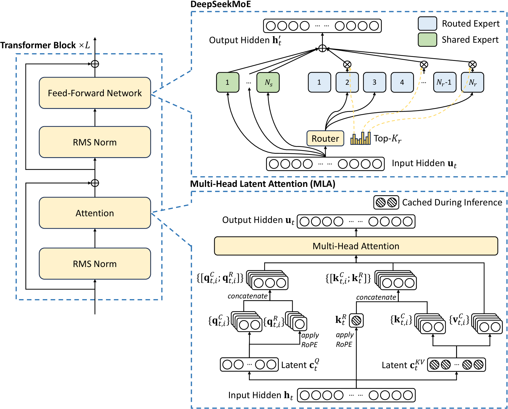

# 从 MLA 到 CSA + HCA：DeepSeek 注意力架构的进化之路

> 结合 vLLM 推理引擎源码，深度解析 DeepSeek V2 → V3 → V3.2 → V4 注意力机制的技术演进。

---

## 第一章：注意力机制的显存困局

大模型推理的核心矛盾不是参数多少，而是自回归生成时 KV Cache 对**显存带宽**的极端压力。每生成一个 token，模型需要重新访问所有历史 token 的 Key 和 Value 向量——这就是 KV Cache 的本质：**用空间换时间**。

### 1.1 KV Cache 的数学本质与工程代价

在标准的 Multi-Head Attention（MHA）中，每个 token 在每一层都需要缓存两个向量：Key 和 Value。单请求下 KV Cache 的显存占用公式为：

$$
\text{Memory}_{KV} = 2 \times L \times N_{kv} \times d_{head} \times S \times b_{kv}
$$

其中 $L$ 为层数，$N_{kv}$ 为 KV Head 数，$d_{head}$ 为每头维度，$S$ 为序列长度，$b_{kv}$ 为精度字节数（BF16=2）。

以 Llama-2-70B 为例（80 层、MHA 配置下 64 个 KV 头、每头 128 维、BF16 精度）：

- **单 token KV Cache** = 2 × 80 × 64 × 128 × 2B = **2.5 MB**
- **128K 上下文** = 2.5MB × 131072 = **320 GB**

即使 Llama-2-70B 实际使用了 GQA-8（仅 8 个 KV 头），128K 上下文的 KV Cache 仍达约 **40 GB**——与模型权重本身（FP16 下约 140 GB）在同一量级。KV Cache 不仅占据大量显存空间，更重要的是 —— 在 Decode 阶段，每生成一个 token 都需要从 HBM 中读取**全部** KV Cache，形成极大的显存带宽压力。

### 1.2 传统方案的"砍头"困境：MQA 与 GQA

针对 MHA 的 KV Cache 冗余问题，学术界和工业界先后提出了 MQA 和 GQA 两种 KV 头共享方案：

<p align="center">

<br>
<em>MHA、GQA 与 MQA 的 KV 头共享策略对比（来源：<a href="https://arxiv.org/abs/2305.13245">GQA 论文</a> Figure 1）</em>
</p>

| 方案  | 策略                         | KV Cache 占比 | 代价         |
| ----- | ---------------------------- | ------------- | ------------ |
| MHA   | 完整 KV 头                   | 100%          | 基准         |
| GQA-8 | 8 个 Query 头共享 1 个 KV 头 | 12.5%         | 质量有损     |
| MQA   | 所有 Query 头共享 1 个 KV 头 | 1.6%          | 质量损失明显 |

它们的本质都是在 **"砍 KV 头"** —— 通过减少 K/V 的冗余复制来省显存，但每砍一刀，模型的多头表达能力就损失一分。这是一种线性的权衡，无法做到"既要又要"。

### 1.3 瓶颈定位：V2/V3 时代，算力过剩而带宽不足

在 8K-128K 的中等上下文区间内，Decode 阶段呈现出典型的 **memory-bound** 特征：

- 每次 Decode 只生成 1 个 token（batch size 通常也有限）
- 计算量很小（一次矩阵-向量乘法），但需要读取的 KV Cache 数据量巨大
- GPU 的计算单元在"等数据从 HBM 搬过来"

**真正的瓶颈不是"算不完"，而是"搬不动"。** 这就是 MLA 诞生的背景——它要解决的核心问题是：如何在不损失表达能力的前提下，大幅减少需要从 HBM 读取的 KV 数据量。

---

## 第二章：MLA —— 低秩压缩的优雅解法

MLA（Multi-head Latent Attention，多头潜在注意力）是 DeepSeek V2 引入的核心创新。它的核心直觉是：**既然瓶颈在"搬运 KV 数据的带宽"，那就不要存完整的 K 和 V，而是存一个低维的"潜在表示"，推理时直接在压缩空间做点积运算。**

<p align="center">

<br>
<em>MLA 的 KV 联合压缩架构（来源：<a href="https://arxiv.org/abs/2405.04434">DeepSeek-V2 论文</a> Figure 3）</em>
</p>

### 2.1 压缩与还原：低秩分解的数学框架

MLA 将传统的 KV 计算拆分为**压缩**（下投影）和**还原**（上投影）两步：

```python
# 压缩：将高维隐状态投影到低维潜在空间
c_t = x_t @ W_DKV    # [hidden_size] -> [kv_lora_rank]  即 H -> Lkv

# 还原：从潜在空间恢复 K 和 V（训练时使用）
k_nope = c_t @ W_UK  # [kv_lora_rank] -> [num_heads, nope_dim]
v      = c_t @ W_UV  # [kv_lora_rank] -> [num_heads, v_dim]
```

DeepSeek V2/V3 的具体参数：

| 参数                   | 值  | 说明                     |
| ---------------------- | --- | ------------------------ |
| `kv_lora_rank` (Lkv)   | 512 | 压缩后的潜在维度         |
| `num_heads` (N)        | 128 | 注意力头数               |
| `qk_nope_head_dim` (P) | 128 | 每头 K 维度（不含 RoPE） |
| `qk_rope_head_dim` (R) | 64  | RoPE 维度                |
| `v_head_dim` (V)       | 128 | 每头 V 维度              |

原始 KV 维度为 `128 × 128 = 16384`，压缩到 512 维，**压缩率达到 96.9%**。而 KV Cache 实际存储为 `kv_lora_rank + qk_rope_head_dim = 512 + 64 = 576` 维，相对于 MHA 的压缩比约为 **93.3%**。

### 2.2 "矩阵吸收" —— 推理时永远不需要还原

MLA 最精妙的设计在于：**推理的 Decode 阶段根本不需要把 K 和 V 还原回高维空间。**

原理是将上采样矩阵 $W_{UK}$ "吸收"进 Query 的投影矩阵中：

```python
# 原始计算路径（训练/Prefill，compute-friendly）：
q_nope = q_c @ W_UQ                    # [Sq, N, P]
k_nope = kv_c @ W_UK                   # [Skv, N, P]
attn = (q_nope @ k_nope.T) / sqrt(d)   # 标准 MHA 点积

# 吸收后的等价计算（Decode，data-movement-friendly）：
ql_nope = einsum("snh, lnh -> snl", q, W_UK)  # 把 W_UK 吸收进 Q
attn = (ql_nope @ kv_c.T) / sqrt(d)            # 直接对压缩向量做点积！
```

这意味着 Decode 时：

- **不需要**从缓存中读取高维的 K 和 V;
- **只需要**读取 576 维的压缩向量 `[kv_c, k_pe]`;
- 注意力计算变成了**等价于 MQA 的数据搬运量**，但保留了 **MHA 的表达能力**.

这就是 MLA 的核心价值：**数据搬运量接近 MQA（极少），但模型质量持平甚至略优于 MHA。**

### 2.3 RoPE 解耦：位置编码的独立处理

旋转位置编码（RoPE）是位置相关的 —— 不同位置的同一个 token，经过 RoPE 后的 K 向量是不同的。这意味着 RoPE 部分**无法被压缩**到位置无关的潜在空间中。

MLA 的解法是将 K 拆分为两部分：

```python
K = [K_content, K_position]
# K_content: 通过 kv_c 压缩，位置无关
# K_position: 独立计算、独立缓存，仅 64 维
```

最终 KV Cache 存储的就是 `[kv_c (512维), k_pe (64维)]`，合计 576 维/token —— 这就是 vLLM 中 `MLAAttentionSpec` 定义的 KV Cache 格式。

### 2.4 vLLM 中的 MLA 实现全景

vLLM 对 MLA 的实现是工业级的，覆盖了从模型定义到 GPU Kernel 的完整链路。

**核心抽象层次：**

```text
deepseek_v2.py (模型定义)
  └─ MultiHeadLatentAttentionWrapper (MLA 外层：投影+RoPE+O_proj)
       └─ MLAAttention (注意力核心：分发到不同后端)
            ├─ FlashAttn MLA Backend (Prefill + Decode)
            ├─ FlashMLA Backend (Decode，NVIDIA)
            ├─ FlashInfer MLA Backend (Prefill + Decode)
            ├─ CUTLASS MLA Backend (Decode，SM100)
            ├─ Triton MLA Backend (Prefill + Decode)
            └─ ROCm AIter Backend (Prefill + Decode，AMD)
```

**`MultiHeadLatentAttentionWrapper.forward()` 的关键流程**（mla.py）：

```python
def forward(self, positions, hidden_states):
    # 1. 压缩投影：h_t -> [q_c, kv_lora]
    qkv_lora = self.fused_qkv_a_proj(hidden_states)
    q_c, kv_lora = qkv_lora.split([q_lora_rank, kv_lora_rank + rope_dim])

    # 2. Q 路径：LayerNorm -> 上投影 -> 拆分 nope/rope
    q_c = self.q_a_layernorm(q_c)
    q = self.q_b_proj(q_c).view(-1, num_heads, qk_head_dim)

    # 3. KV 路径：拆分 content/position -> LayerNorm
    kv_c, k_pe = kv_lora.split([kv_lora_rank, rope_dim])
    kv_c_normed = self.kv_a_layernorm(kv_c)

    # 4. 应用 RoPE（仅对 Q 的 rope 部分和 k_pe）
    q[..., nope_dim:], k_pe = self.rotary_emb(positions, q[..., nope_dim:], k_pe)

    # 5. 核心注意力计算
    attn_out = self.mla_attn(q, kv_c_normed, k_pe, output_shape=...)

    # 6. 输出投影
    return self.o_proj(attn_out)
```

**双路径设计**（mla_attention.py）：

vLLM 的 MLA 实现区分了两种计算模式：

1. **Compute-friendly（Prefill）**：先把 kv_c 还原为完整的 K 和 V，然后做标准 MHA —— 因为 Prefill 的 Sq/Skv 比接近 1，计算密度高，适合 MHA。

2. **Data-movement-friendly（Decode）**：把 W_UK 吸收进 Q，直接对压缩向量做 MQA —— 因为 Decode 是逐 token 生成，数据搬运是瓶颈。

这种双路径设计是 MLA 工程实现的关键创新，让同一个模型在 Prefill 和 Decode 两个阶段都能达到最优性能。

**后端实现矩阵：**

| 后端           | 平台              | 阶段             | 特点              |
| -------------- | ----------------- | ---------------- | ----------------- |
| FlashAttn MLA  | NVIDIA            | Prefill + Decode | 通用基线          |
| FlashMLA       | NVIDIA            | Decode           | 专用高性能 Kernel |
| FlashInfer MLA | NVIDIA            | Prefill + Decode | TRT-LLM 内核      |
| CUTLASS MLA    | SM100 (Blackwell) | Decode           | 新架构优化        |
| Triton MLA     | NVIDIA            | Prefill + Decode | 可移植            |
| ROCm AIter     | AMD               | Prefill + Decode | AMD 适配          |

---

## 第三章：当上下文到达百万 —— MLA 的隐形天花板

MLA 是对"存储瓶颈"的极致优化，将 KV Cache 的显存占用和读取带宽都降低了 93%+。但它有一个根本性的局限：**注意力机制的计算复杂度本质未变**。

### 3.1 从 8K 到 1M：计算量增长 15000 倍

注意力的计算复杂度是 $O(n^2)$——每个 token 都要和所有其他 token 做点积。当上下文长度从 8K 扩展到 1M：

```text
计算量增长 = (1,000,000 / 8,000)² ≈ 15,625 倍
```

MLA 压缩了每次点积操作的数据量（从 128 维降到等效的低维），但参与运算的 **token 对数**没有任何减少。100 万个 token 两两配对，依然是 $10^{12}$ 量级的点积运算。

### 3.2 MLA 的能力边界分析

MLA 的本质是**把每个 token 变"瘦"**——减小单个 token 的 KV 表示体积。但它**没有减少 token 的"数量"**。

用一个类比：

- MLA 相当于把仓库里每个包裹从 10kg 压缩到 0.7kg——搬运效率大幅提升;
- 但如果仓库里有 100 万个包裹，快递员依然要跑 100 万趟.

在 8K-128K 的中等长度区间，GPU 的计算能力（FLOPS）是充裕的，瓶颈在带宽 —— MLA 完美适配。但超过某个临界点后，即使带宽问题解决了，**纯粹的计算量**也会成为不可逾越的墙。

### 3.3 DeepSeek 的演进逻辑：每代只解决一个核心瓶颈

回顾 DeepSeek 的技术路线，可以看到一条清晰的"瓶颈驱动"逻辑：

| 版本 | 核心瓶颈     | 解决方案           | 结果            |
| ---- | ------------ | ------------------ | --------------- |
| V1   | 验证基础能力 | 标准稠密模型       | 能力基线        |
| V2   | 显存带宽     | MoE + **MLA**      | 推理成本降 90%+ |
| V3   | 训练规模化   | 极致 MoE (671B)    | 训练效率突破    |
| V3.2 | 长上下文尝试 | MLA + **DSA/NSA**  | 过渡方案        |
| V4   | 计算复杂度   | **CSA + HCA** 混合 | 原生 1M token   |

当 V4 的目标变成**原生支持 1M token 上下文**，且预训练数据量达到 33T tokens 时，$O(n^2)$ 就是那堵算力墙。MLA 对此无能为力——它只解决了"存"，没解决"算"。

---

## 第四章：V3.2 的过渡尝试——NSA 稀疏索引器

在 V4 全面重设计之前，V3.2 率先尝试了在 MLA 框架内引入稀疏性的方案：Neural Sparse Attention（NSA，也称 DSA）。

### 4.1 核心思路：不是每个 token 都值得关注

NSA 的逻辑很直觉：在处理长序列时，给定一个 Query token，绝大多数历史 token 的注意力权重接近于零——只有极少数 token 是真正"被关注"的。那为什么要对所有 token 都做完整的注意力计算？

NSA 的做法是：**先快速"扫描"，找出最相关的 top-k 个 token，只对它们做精确注意力。**

### 4.2 vLLM 中的稀疏索引器实现

vLLM 中 NSA 的实现围绕 `SparseAttnIndexer` 和 `DeepseekV32IndexerBackend` 展开。

**核心工作流程：**

```python
# 1. 维护独立的 FP8 量化 K Cache 用于快速打分
#    （比完整 KV Cache 更小，读取更快）

# 2. 对 Query 做投影，计算与所有 K 的相关性
q_fp8 = project_and_quantize(hidden_states)
scores = q_fp8 @ k_cache_fp8.T  # 快速粗略打分

# 3. TopK 选择（DeepSeek-V3.2 默认 topk=2048）
topk_indices = fast_topk(scores, k=2048)

# 4. 只对选中的 2048 个 token 做完整 MLA 注意力
output = mla_attention(q, kv_cache[topk_indices])
```

**`Indexer` 类的关键设计**（deepseek_v2.py 中）：

- 使用 FP8 量化存储索引用的 K Cache，减少 4 倍存储
- 独立的投影层将 Q latent 向量映射到索引器的 query 空间
- 对 K Cache 应用 LayerNorm，提高打分稳定性
- DeepSeek-V3.2 默认 `topk_tokens=2048`

**`DeepseekV32IndexerBackend`**（indexer.py）：

```python
class DeepseekV32IndexerBackend(AttentionBackend):
    @staticmethod
    def get_name() -> str:
        return "DEEPSEEK_V32_INDEXER"

    @staticmethod
    def get_supported_kernel_block_sizes():
        return [1 if current_platform.is_rocm() else 64]
```

索引器使用 block_size=64 的分页管理，支持 Prefill 分块处理以控制显存峰值。

**稀疏 MLA 后端：**

在索引器选出 top-k 后，后续的注意力计算交给专用的稀疏 MLA 后端：

- `FlashMLASparseBackend`（NVIDIA）
- `FlashInferMLASparseBackend`（with TRT-LLM kernels）
- `ROCMAiterMLASparseBackend`（AMD）

### 4.3 NSA 的局限：仍是 MLA 框架内的补丁

NSA 确实减少了"参与注意力计算的 token 数量"（从 N 降到 2048），但有两个根本性问题：

1. **索引器本身仍需扫描全部 KV Cache**：`q @ k_cache.T` 本身就是 $O(N)$ 的操作。虽然比完整注意力的 $O(N \times d)$ 轻量（因为用了 FP8 且维度更小），但对百万 token 场景，这个开销仍然可观。

2. **框架约束**：NSA 仍然建立在 MLA 的 KV Cache 格式之上，压缩后的 576 维潜在向量依然要全量存储。只是在"读取哪些"上做了优化，并未触及"存了多少"。

这就是为什么 NSA 是一个**过渡方案** —— 它证明了稀疏性的价值，但不够彻底。V4 需要更根本的变革。

---

## 第五章：V4 的全新解法 —— CSA + HCA 混合架构

V4 不再在 MLA 框架内打补丁，而是从头设计了注意力机制。核心理念包含三个层面：

1. **物理压缩 token 数量**：不仅把 token 变"瘦"（MLA 的思路），更要把 token 变"少"
2. **共享 K=V 向量**：K 和 V 使用同一个向量，直接减半 KV Cache 存储
3. **逆 RoPE 保持正确性**：对注意力输出施加逆旋转，恢复平移不变性

### 5.1 CSA（Compressed Sparse Attention）：精确检索型注意力

CSA 的设计哲学是"温和压缩 + 稀疏选择"，兼顾信息保留和计算效率。

<p align="center">

<br>
<em>c4a 注意力机制动画演示：压缩、稀疏选择与滑动窗口的协作（来源：<a href="https://vllm.ai/blog/deepseek-v4">vLLM 博客</a>）</em>
</p>

**三步工作流程：**

**第一步：压缩（等效 4x）**：

每个压缩 token 是 **8 个未压缩 token 的加权和，步长为 4**（即相邻压缩 token 之间有 4 个 token 的重叠）。具体来说，第 $j$ 个压缩 token 覆盖原始位置 $[4j-4, 4j+3]$，RoPE 锚点为位置 $4j$。这不是简单的非重叠分组——重叠窗口确保了压缩边界处不会丢失跨边界信息。

```text
原始序列:  [t0, t1, t2, t3, t4, t5, t6, t7, t8, t9, t10, t11, ...]
压缩 token c0: weighted_sum(t[-4]~t[3])  → 锚点位置 0
压缩 token c1: weighted_sum(t[0]~t[7])   → 锚点位置 4  (与 c0 重叠 4 token)
压缩 token c2: weighted_sum(t[4]~t[11])  → 锚点位置 8  (与 c1 重叠 4 token)
```

由于步长为 4，1M token → 压缩后约 250K 条目（等效 4x 压缩）。

**第二步：筛选（Top-k = 512 闪电索引器）**：

用"闪电索引器"（Lightning Indexer）快速定位最相关的压缩块：

- 用 FP4 精度存储压缩后的索引器 KV（比 FP16 小 4 倍）
- 用 ReLU-scored dot product 计算相关性（比 softmax 快）
- 只保留 **top-512** 个最相关的压缩 token（V3.2 的 DSA 使用 top-2048）

**第三步：局部注意力（滑动窗口 = 128）**：

保留一个固定大小为 128 的滑动窗口（Sliding Window Attention, SWA），让最近的 token 保持完整的逐 token 注意力。这确保了查询 token 在到达压缩边界之前就能关注到局部信息（解决因果性约束——位置 $i$ 的 token 只能关注第 $j$ 个压缩 token 的条件是 $i \ge 4j+3$）。

**CSA 的效果估算：**

- 等效 4x 压缩：1M → 250K 压缩 token
- Top-512 稀疏：250K → 512 个相关压缩 token
- 加上 128 个滑动窗口 token = 每个查询关注约 640 个 token
- 相比原始全注意力的 1M token：约 1500x 计算节省

**CSA 的意外收获——天然去噪：**

在百万 token 上下文中，成千上万无关 token 的微小注意力分数累加会形成巨大的"注意力噪声"，导致模型幻觉。CSA 的 top-k 硬截断充当了天然去噪器——只保留强信号，彻底切断噪声源。

### 5.2 HCA（Heavily Compressed Attention）：全局语义型注意力

HCA 采用了更激进的压缩策略，但放弃了稀疏选择，转而保持"几乎全量"的注意力。

**设计逻辑：**

- **压缩比 128x**：每个压缩 token 是 128 个未压缩 token 的加权和，步长为 128（无重叠）。第 $j$ 个压缩 token 覆盖位置 $[128j, 128j+127]$，锚点为 $128j$;
- **Top-k = 8192（等效全注意力）**：1M token 压缩后仅约 8K 条目，直接设 top-k=8192 即可覆盖全部压缩 token，实现上仍可视为稀疏注意力框架;
- **信息损失更大**：但足以捕捉全局语义模式和长程主题结构.

HCA 的计算量：$O(n \times n/128) = O(n^2/128)$，相比原始 $O(n^2)$ 降低了 128 倍。由于 top-k=8192 能覆盖全部压缩 token，HCA 实质上是对全局信息的稠密注意力，不会遗漏任何全局语义。

### 5.3 CSA vs HCA：互补的设计哲学

| 特性     | CSA / c4a（压缩稀疏注意力）       | HCA / c128a（重压缩注意力）        |
| -------- | --------------------------------- | ---------------------------------- |
| 压缩方式 | 8 token 加权和，步长 4（等效 4x） | 128 token 加权和，步长 128（128x） |
| 选择策略 | 稀疏（top-512）                   | 全注意力（top-8192 覆盖全部）      |
| 信息保留 | 精确检索能力                      | 全局语义捕捉                       |
| 计算节省 | ~1500x（压缩 + 稀疏）             | ~128x（仅压缩）                    |
| 适用场景 | 精确查找、长距离依赖              | 全局理解、主题摘要                 |
| 代价     | 需要索引器、可能漏信息            | 信息损失更多                       |

### 5.4 混合策略与层级分配

V4 共 61 层注意力，具体分配为 **30 个 c4a 层 + 31 个 c128a 层**：

- **c128a 层（31 层）**：提供全局语义覆盖，每层通过 128x 压缩 + top-8192 实现对全序列的稠密注意力;
- **c4a 层（30 层）**：提供精确检索能力，每层通过 4x 压缩 + top-512 稀疏选择定位关键信息;
- **所有层均带有 128-token 滑动窗口**：确保局部信息始终可达.

这种设计的逻辑是清晰的：

- **c128a 层建立"全局地图"**：理解整篇文档的主题结构;
- **c4a 层做"精准定位"**：在全局理解的基础上检索具体事实.

这类似人类的阅读策略：**先速览全文（c128a），再精读关键段落（c4a）**。在百万 token 的数据海洋中，先有方向感，再做精确检索。

### 5.5 vLLM 中的 V4 实现架构

V4 在 vLLM 中的实现引入了全新的组件体系，与 V2/V3 的 MLA 框架有本质区别。

**关键设计创新——共享 K=V + 逆 RoPE：**

V4 的一个核心突破是 **K 和 V 共享同一个向量**（即 K=V），这直接将 KV Cache 内存减半（2x 节省）。但共享会引入问题：对 K 施加 RoPE 后，注意力输出会携带绝对位置信息，破坏平移不变性。解决方案是在注意力输出端应用**逆 RoPE**（inverse RoPE）：

$$R(-i) \cdot a_i = \sum_p w_p \cdot R(j_p - i) \cdot k_{j_p}$$

逆 RoPE 后，输出只包含相对位置 $R(j_p - i)$，恢复了平移不变性。这在 vLLM 中体现为融合算子 `fused_inv_rope_fp8_quant`。

**三种层类型**（sparse_swa.py）：

```python
_LAYER_TYPE_SWAONLY = "swaonly"   # 纯滑动窗口（compress_ratio=1）
_LAYER_TYPE_C4A = "c4a"          # CSA 层（compress_ratio=4）
_LAYER_TYPE_C128A = "c128a"      # HCA 层（compress_ratio=128）
```

模型共 61 层：30 个 c4a 层 + 31 个 c128a 层。每种层类型有独立的 FlashMLA tile-scheduler 计划，同类型的所有层在同一步内共享调度元数据。

**`DeepseekV4MultiHeadLatentAttentionWrapper`** 的核心结构：

```python
class DeepseekV4MultiHeadLatentAttentionWrapper(PluggableLayer):
    def __init__(self, ...):
        # 核心注意力层
        self.mla_attn = DeepseekV4MLAAttention(...)

        # 压缩器（仅 compress_ratio > 1 的层）
        self.compressor = DeepseekCompressor(
            compress_ratio=self.compress_ratio,  # 4 或 128
            hidden_size=self.hidden_size,
            head_dim=self.head_dim,
        ) if self.compress_ratio > 1 else None

        # 滑动窗口 KV Cache（所有层都有）
        self.swa_cache_layer = DeepseekV4SWACache(
            head_dim=self.head_dim,
            window_size=self.window_size,
            dtype=torch.uint8,  # FP8 存储
        )
```

**`DeepseekCompressor`** 的工作流程（deepseek_compressor.py）：

```python
class DeepseekCompressor(nn.Module):
    def forward(self, x, positions, rotary_emb):
        # 1. 投影：获取 KV 和 Gate Score
        kv_score = cublas_gemm_bf16_bf16_fp32(x, self.fused_wkv_wgate.weight)
        kv, score = kv_score.split([coff * head_dim, coff * head_dim])

        # 2. 加入位置编码（APE），存入状态缓存
        _save_partial_states_kernel(kv, score, self.ape, positions, state_cache, ...)

        # 3. 每累积 compress_ratio 个 token，触发融合 Kernel：
        #    压缩 → RMSNorm → RoPE → FP8 量化 → KV Cache 写入
        self._fused_kernel(state_cache, kv_cache, cos_sin_cache, ...)
```

压缩器维护一个 `CompressorStateCache`，为每个序列缓存最近 `compress_ratio` 个 token 的中间状态。当积累够 4 个（CSA）或 128 个（HCA）token 后，触发融合 Kernel 一次性完成压缩→归一化→RoPE→量化→写入的全流程。

**`DeepseekV4SWACache`** 的 KV Cache 格式：

```python
# FP8 格式：584B/token
# = 448B (NoPE, FP8) + 128B (RoPE, BF16) + 8B (FP8 scale)
head_bytes = (
    nope_head_dim          # 448 fp8 NoPE
    + rope_head_dim * 2    # 64 bf16 RoPE (128 bytes)
    + nope_head_dim // 64  # 7B scale factors
    + 1                    # 1B padding
)  # = 584 bytes total
```

**三路并行执行**（`attention_impl` 方法中）：

V4 的注意力层在执行时通过 CUDA 多流实现三个操作的并行重叠：

```python
def attention_impl(self, hidden_states, qr, kv, positions, out):
    if self.indexer is not None:
        # 有索引器的层：索引器在默认流，KV插入+压缩在辅助流
        maybe_execute_in_parallel(
            lambda: indexer(hidden_states, qr, positions, ...),    # 默认流
            lambda: (kv_insert(q, kv, positions, ...) +           # 辅助流
                     compressor(hidden_states, positions, ...)),
            event_0, event_1, aux_stream
        )
    elif self.compressor is not None:
        # 仅有压缩器：压缩在默认流，KV插入在辅助流
        maybe_execute_in_parallel(
            lambda: compressor(hidden_states, positions, ...),     # 默认流
            lambda: kv_insert(q, kv, positions, ...),             # 辅助流
            event_0, event_1, aux_stream
        )
```

---

## 第六章：工程细节——量化与融合算子的极致优化

V4 的效率提升不仅来自宏观的架构设计，更来自对每一个微观计算环节的极致工程优化。

### 6.1 FP8/FP4 量化在注意力中的创新应用

V4 在注意力流程中全链路使用低精度量化，不同环节使用不同精度：

| 环节               | 精度              | 理由                     |
| ------------------ | ----------------- | ------------------------ |
| SWA KV Cache       | FP8 (E4M3)        | 逐 token 注意力需要精度  |
| 闪电索引器 K Cache | FP4 / MXFP4       | 只做相对排序，容错率极高 |
| CSA 压缩后 KV      | FP8 + UE8M0 scale | 压缩已损失信息，FP8 足够 |
| O 投影             | FP8 einsum        | 高维投影可容忍精度损失   |
| MoE 专家权重       | MXFP4             | 稀疏激活降低精度需求     |
| RoPE 位置编码      | BF16              | 位置信息需要保持精度     |

**关键洞察**：CSA 的闪电索引器不需要"重建"数据，它只是在计算各个压缩块的**相对关联度排序**。排序操作的容错率极高——即使分数有量化误差，只要相对大小关系正确，top-k 的结果就是对的。这就让 FP4 这样的极低精度在注意力机制中成为可能。

### 6.2 Fused Kernel 设计：减少内存往返

V4 引入了大量融合算子，将多步操作合并为单次 Kernel 启动：

**`fused_deepseek_v4_qnorm_rope_kv_insert`**（477 行 CUDA）：

```text
Q 侧: per-head RMSNorm（无权重） + GPT-J RoPE
KV 侧: GPT-J RoPE + UE8M0 FP8 量化 + 分页 Cache 写入
─── 单次 Kernel 完成 ───
```

**`fused_compress_quant_cache`**（584 行 Triton）：

```text
读取状态缓存 → softmax-gated 压缩 → RMSNorm → RoPE → FP8 量化 → KV Cache 写入
─── 单次 Kernel 完成 ───
```

**`topk_softplus_sqrt`**（714 行 CUDA）：

```text
MoE 路由的 softplus 激活 + sqrt + TopK 选择
─── 单次 Kernel 完成 ───
```

这些融合算子的设计原则是：**任何中间结果如果可以留在寄存器/共享内存中而非写回 HBM，就应该被融合**。在百万 token 场景下，减少 HBM 往返次数带来的收益是巨大的。

### 6.3 压缩槽位映射：分页系统的适配

V4 的压缩机制需要与 vLLM 的分页 KV Cache 管理系统适配。`compressor_utils.py` 中的 `_compressed_slot_mapping_kernel` 负责将压缩后的 token 正确映射到物理页面：

```python
# 核心逻辑：只有每 compress_ratio 个 token 的最后一个才触发写入
is_valid = (pos + 1) % COMPRESS_RATIO == 0
pos_after_compress = pos // COMPRESS_RATIO
block_ids = pos_after_compress // block_size
slot_ids = block_numbers * block_size + pos_after_compress % block_size
```

这意味着 CSA 层（compress_ratio=4）每 4 个 token 才产生一个 KV Cache 条目，HCA 层（compress_ratio=128）每 128 个 token 才产生一个。物理存储开销急剧下降。

### 6.4 O 投影的创新：逆 RoPE + FP8 Einsum + 分组低秩

V4 采用 K=V 共享（同一个向量既作 Key 又作 Value），带来 2x 内存节省。但 RoPE 作用于 K 后，注意力输出会携带绝对位置 $R(j_p)$，破坏平移不变性。解决方案是在输出端施加 $R(-i)$（逆 RoPE），使输出只含相对位置 $R(j_p - i)$。

V4 的输出投影采用了三级流水线设计：

```python
# 1. 逆 RoPE + FP8 量化（融合 Kernel）
o_fp8, o_scale = fused_inv_rope_fp8_quant(
    o, positions, cos_sin_cache,
    n_groups=n_local_groups,         # 分组
    heads_per_group=heads_per_group,
    nope_dim=nope_head_dim,
    rope_dim=rope_head_dim,
)

# 2. FP8 Einsum：o_proj 的第一级（降维）
#    "bhr,hdr->bhd" : [batch, heads, head_dim] × [heads, dim, rank] -> [batch, heads, rank]
fp8_einsum("bhr,hdr->bhd", (o_fp8, o_scale), (wo_a_fp8, wo_a_scale), z)

# 3. 第二级线性投影（恢复到 hidden_size）
output = self.wo_b(z.flatten(1))
```

这里 `wo_a` 是分组低秩投影（`o_lora_rank`），`wo_b` 是恢复投影——与 MLA 的压缩→还原思路异曲同工，但应用在了输出端。

---

## 第七章：V4 的 KV Cache 量化对比

根据 vLLM 官方博客的精确计算：**在 1M token、BF16 KV Cache 下，V4 的 KV Cache 仅需 9.62 GiB，相比 V3.2 风格 61 层堆栈的 83.9 GiB 节省了约 88.5%。**

以下是详细推导（来自 vLLM 博客附录）：

**V3.2 的 KV Cache（61 层，BF16）：**

```text
每层每 token:
  MLA 缓存: (512 + 64) × 2 = 1152 bytes
  索引器缓存: 128 × 2 = 256 bytes
  合计: 1408 bytes/token/layer

1M token (1,048,576):
  每层: 1,048,576 × 1408 ≈ 1.375 GiB
  61 层总计: ≈ 83.9 GiB
```

**V4 的 KV Cache（30 c4a + 31 c128a 层，BF16，共享 K=V）：**

```text
每个共享 KV 缓存条目: 512 × 2 = 1024 bytes（K=V 共享，无需分别存储）
每个 c4a 索引器条目: 128 × 2 = 256 bytes

c4a 层（30 层）:
  共享 KV: (128 + 1,048,576/4) × 1024 bytes（128 为 SWA）
  索引器: (1,048,576/4) × 256 bytes
  每层合计: ≈ 320.1 MiB

c128a 层（31 层）:
  共享 KV: (128 + 1,048,576/128) × 1024 ≈ 8.1 MiB 每层

总计: 30 × 320.1 MiB + 31 × 8.1 MiB ≈ 9.62 GiB
```

**压缩来源分解：**

| 节省因素                        | 贡献                              |
| ------------------------------- | --------------------------------- |
| 共享 K=V（无需分别存储 K 和 V） | 2x                                |
| c4a 压缩（步长 4）              | 4x（在 30 层）                    |
| c128a 压缩（步长 128）          | 128x（在 31 层）                  |
| **综合效果**                    | **83.9 → 9.62 GiB（~8.7x 节省）** |

实践中，vLLM 还对索引器缓存使用 FP4、对注意力缓存使用 FP8，可将实际 KV Cache 大小进一步缩减约一半。

---

## 第八章：技术权衡与未来展望

### 8.1 MLA vs CSA+HCA：不是替代，是互补

回顾两种方案的本质：

| 维度       | MLA                  | CSA+HCA           |
| ---------- | -------------------- | ----------------- |
| 核心策略   | 把 token 变"瘦"      | 把 token 变"少"   |
| 解决的瓶颈 | 内存带宽             | 计算复杂度        |
| 适用区间   | 8K-128K              | 128K-1M+          |
| 信息损失   | 理论无损（低秩近似） | 有损（压缩+截断） |
| 实现复杂度 | 中等                 | 高                |

两者并非不可调和。未来的最优方案可能是：**先用 MLA 压缩每个 token 的表示（减小体积），再用 CSA/HCA 减少参与计算的 token 数量（减少数量）**——双管齐下。

事实上，V4 的 SWA Cache 中每个 token 仍然只存储 584B（含 FP8 量化），这本身就包含了"压缩单 token 体积"的思想。MLA 的精神并未完全消失，只是换了一种形式存在。

### 8.2 V4 的复杂度代价

V4 是一个在时间压力下的"工程优先"方案。它堆叠了大量新技术：

- CSA + HCA 混合注意力
- mHC（Manifold-Constrained Hyper-Connections）替代残差连接
- Engram 记忆机制
- Muon 优化器
- 三种不同类型的层（swaonly/c4a/c128a）各自独立的元数据管理
- 多 CUDA Stream 并行执行

DeepSeek 自己在技术报告中坦诚：

> "为了追求极致的长上下文效率，DeepSeek V4 采用了大胆的架构设计。为了最小化风险，我们保留了许多已验证的组件和技巧，这使得架构相对复杂。在未来的迭代中，我们将进行更全面的研究，将架构精简到最核心的设计。"

### 8.3 V5 的可能方向

基于当前的技术趋势和 DeepSeek 的演进逻辑，可以推测几个可能方向：

**方向一：统一 CSA 和 HCA**：

当前两种机制需要交替使用，增加了工程复杂度。未来可能找到一种自适应压缩机制——根据 Query 和上下文的关系动态决定压缩粒度。

**方向二：MLA 回归**：

CSA/HCA 把 token 数量变少，MLA 把单体 token 变瘦。两者组合可能是终极方案。

**方向三：更激进的量化**：

从 FP16 → FP8 → FP4 的趋势来看，FP2 甚至 1-bit 可能是下一步。微软的 BitNet 研究已经证明了极低精度的可行性。

**方向四：SSM 混合**：

Qwen 的 SSM + Attention 混合路线（类似 Mamba-2 + Attention 交替层）证明了可行性。线性复杂度的 SSM 可能替代 HCA 的"全局语义捕捉"角色。

### 8.4 核心启示

技术选型没有绝对的优劣，只有是否匹配**当下最紧迫的瓶颈**。

- 当瓶颈是带宽时，MLA 是最优解
- 当瓶颈是计算量时，CSA+HCA 是更优解
- 当两者都是瓶颈时，它们的组合才是终极答案

能够在正确的时间果断放弃自己曾经引以为傲的核心技术，本身就是一种顶级的进化能力。因为它意味着你极其清醒地知道——过去做对了什么，而现在又需要什么。

---

## 附录：vLLM 中 DeepSeek 注意力实现速查表

### A.1 模型版本与注意力机制映射

| 模型版本 | 注意力机制  | 核心文件                                                                                                                                                                                                                                                                                                                                                                       | KV Cache 格式         | 适用场景 |
| -------- | ----------- | ------------------------------------------------------------------------------------------------------------------------------------------------------------------------------------------------------------------------------------------------------------------------------------------------------------------------------------------------------------------------------ | --------------------- | -------- |
| V2/V3    | MLA         | `mla_attention.py`, `mla.py`                                                                                                                                                       | 576B (BF16)           | 8K-128K  |
| V3.2     | MLA + NSA   | `sparse_attn_indexer.py`, `indexer.py`                                                                                                                                         | 576B + FP8 索引 K     | 128K+    |
| V4       | CSA+HCA+SWA | `deepseek_v4_attention.py`, `deepseek_compressor.py`, `sparse_swa.py` | FP8 SWA (584B) + 压缩 | 1M       |

### A.2 关键源码文件索引

**MLA 相关：**

- 核心抽象：`vllm/model_executor/layers/attention/mla_attention.py` (2723 行)
- 外层封装：`vllm/model_executor/layers/mla.py` (177 行)
- 模型集成：`vllm/model_executor/models/deepseek_v2.py` (1609 行)
- 后端实现：`vllm/v1/attention/backends/mla/` (10 个后端文件)
- CUDA Kernel：`csrc/attention/mla/` (CUTLASS SM100)
- CPU 实现：`csrc/cpu/mla_decode.cpp`

**NSA/稀疏相关：**

- 索引器层：`vllm/model_executor/layers/sparse_attn_indexer.py`
- 后端管理：`vllm/v1/attention/backends/mla/indexer.py`
- 稀疏后端：`vllm/v1/attention/backends/mla/flashmla_sparse.py`
- TopK Kernel：`csrc/topk.cu`

**V4 相关：**

- 注意力层：`vllm/model_executor/layers/deepseek_v4_attention.py` (1076 行)
- 压缩器：`vllm/model_executor/layers/deepseek_compressor.py`
- SWA Cache：`vllm/v1/attention/backends/mla/sparse_swa.py`
- 压缩工具：`vllm/v1/attention/backends/mla/compressor_utils.py`
- 融合算子：`csrc/fused_deepseek_v4_qnorm_rope_kv_insert_kernel.cu` (477 行)
- V4 Ops：`vllm/v1/attention/ops/deepseek_v4_ops/` (5 个 Triton 文件)
- 模型定义：`vllm/model_executor/models/deepseek_v4.py` (1437 行)

### A.3 DeepSeek V3 的 MLA 关键参数

```python
# 来源：vLLM mla_attention.py 注释和 benchmark configs
num_q_heads = 128        # Query 头数
num_kv_heads = 1         # MLA 等效为单 KV 头
kv_lora_rank = 512       # KV 潜在空间维度 (Lkv)
qk_nope_head_dim = 128   # Q/K 不含 RoPE 的维度 (P)
qk_rope_head_dim = 64    # Q/K RoPE 维度 (R)
v_head_dim = 128         # V 头维度
q_lora_rank = 1536       # Q 潜在空间维度 (Lq)
head_dim = 576           # 总 head_dim = Lkv + R = 512 + 64
```

### A.4 DeepSeek V4 的 CSA/HCA 关键参数

```python
# 来源：vLLM sparse_swa.py 和 deepseek_v4_attention.py
compress_ratios = [1, 4, 128]    # 三种层类型
num_layers = 61                   # 30 c4a + 31 c128a
head_dim = 512                    # V4 的 head dimension (K=V 共享)
nope_head_dim = 448               # 不含 RoPE
rope_head_dim = 64                # RoPE 维度
window_size = 128                 # SWA 滑动窗口大小

# 稀疏注意力 top-k:
c4a_top_k = 512                   # CSA 层的 top-k（V3.2 DSA 为 2048）
c128a_top_k = 8192                # HCA 层的 top-k（覆盖 1M/128=8K 全部条目）

# 关键创新: K=V 共享 + 逆 RoPE
shared_kv = True                  # K 和 V 使用同一向量（2x 内存节省）
inverse_rope_on_output = True     # 注意力输出应用 R(-i) 恢复平移不变性

# SWA Cache 格式 (FP8, 584B/token):
swa_bytes_per_token = 448 + 128 + 8  # NoPE(FP8) + RoPE(BF16) + scale

# CSA 层 (compress_ratio=4):
c4a_block_size = 4                # 状态缓存页大小
c4a_sliding_window = 8            # coff * compress_ratio (重叠窗口 8 token)

# HCA 层 (compress_ratio=128):
c128a_block_size = 8              # 状态缓存页大小
c128a_sliding_window = 128        # coff * compress_ratio
```

---

## 参考

1. DeepSeek-V2 技术报告：<https://arxiv.org/abs/2405.04434>
2. vLLM 项目源码：< (2026年5月8日)
3. DeepSeek-V4 技术报告（2026年4月）：<https://huggingface.co/deepseek-ai/DeepSeek-V4-Pro/blob/main/DeepSeek_V4.pdf>
4. FlashMLA 开源实现：<
5. vLLM DeepSeek V4 官方博客：<https://vllm.ai/blog/deepseek-v4>
