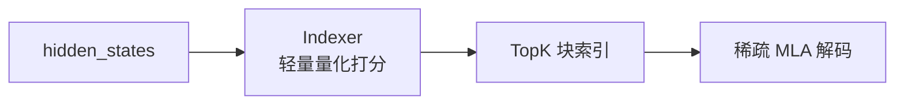

# vLLM 注意力机制演进与支持全景：从 MHA 到 MLA 及其稀疏变体的架构解析

本文系统梳理了 **MHA（Multi-Head Attention）**、**MLA（Multi-head Latent Attention）** 与 **NSA（Native Sparse Attention）** 这三种核心注意力机制的理论演进，并从工程实现视角，深度剖析了 vLLM 推理框架在底层机制适配、硬件算子映射、跨平台兼容性以及 KV Cache 卸载（Offloading）等复杂调度场景下的支持现状与技术边界 [1-4]。本文沿用社区术语 NSA 指代 DeepSeek-V3.2 / GLM-5 中的稀疏 MLA 实现，而非独立的注意力机制类。

## 目录

- [1. 分析范围与结论摘要](#1-分析范围与结论摘要)
- [2. 标准注意力（MHA / MQA / GQA）](#2-标准注意力mha--mqa--gqa)
- [3. MLA：多头潜在注意力](#3-mla多头潜在注意力)
- [4. NSA：原生稀疏注意力](#4-nsa原生稀疏注意力)
- [5. MHA、MLA、NSA 对比](#5-mhamlansa-对比)
- [6. vLLM 支持情况总结](#6-vllm-支持情况总结)
- [参考文献](#参考文献)

---

## 1. 分析范围与结论摘要

为确保系统架构选型与部署评估的准确性，这里对标准注意力、MLA 及 NSA 的代码分析边界进行了界定，并提炼了 vLLM 在平台兼容性及 KV Cache 卸载场景下的核心结论。

### 1.1 分析范围

为确保结论的准确性与工程落地价值，本文的分析对象严格锁定在当前 vLLM 代码库，聚焦核心的注意力算子实现、硬件后端调度策略以及模型配置的适配逻辑。

- **代码范围**：`vllm/` 与 `docs/` 目录下的注意力实现、后端注册、平台选择与模型配置判定逻辑 [1-4]。
- **机制范围**：标准注意力（MHA / MQA / GQA）、DeepSeek 风格 MLA、DeepSeek-V3.2 / GLM-5 稀疏 MLA（通常对应 NSA 语义）[1, 2, 5]。
- **版本口径**：以当前仓库文件内容为准，不使用外部二手资料作为主证据。

### 1.2 关键结论

经过代码层面的交叉验证，vLLM 展现了对多种注意力机制的差异化支持。以下结论汇总了 vLLM 在机制覆盖度、硬件平台兼容性以及复杂场景（如 KV Cache Offloading 与混合架构）下的实际支持边界：

1. **机制支持全面性**：vLLM 对标准注意力（MHA / MQA / GQA）提供完整主线支持，具备自动后端选择能力；对 MLA 提供专用实现与独立后端族；通过 Sparse MLA 后端与 Indexer 机制承载 NSA（如 DeepSeek-V3.2、GLM-5）的稀疏语义 [1, 2, 3, 5]。
2. **平台支持差异**：各类注意力机制在不同平台上的成熟度不一。CUDA 平台对所有注意力机制支持最佳；ROCm 支持标准注意力与部分 MLA 变体；CPU 平台仅支持标准注意力 [3]。
3. **KV Cache Offloading 兼容性**：
   - **单模型场景**：标准注意力（MHA / MQA / GQA）与 MLA 的主 KV（潜变量）均完美兼容底层的 `OffloadingConnector` 机制。
   - **特殊隔离场景**：NSA（Sparse MLA）引入的专用 `DeepseekV32IndexerCache` 与主 KV 池隔离，目前暂不支持自动卸载 [10, 11]。
   - **混合架构模型 (Hybrid Architecture) 冲突**：在启用 Hybrid KV Cache Manager (HMA) 的复杂混合模型中，现有的 `OffloadingConnector` 和 `LMCacheConnectorV1` 因缺乏 `SupportsHMA` 接口支持，均无法与 HMA 协同工作 [13]。
     > [!WARNING]
     > 对于 Qwen3.5-Next、MiniMax-Text-01、Jamba 等混合注意力架构模型，当前任何形式的 KV Cache Offloading 均不可用，与注意力机制类型无关。

---

## 2. 标准注意力（MHA / MQA / GQA）

标准注意力（包括 MHA、MQA 与 GQA）是当前多数 LLM 的基础结构。vLLM 通过高度抽象的统一算子层，将这三种机制的 KV 缓存规格与底层后端调度进行了整合。

### 2.1 核心原理与 KV 存储

MHA 为每个 token 显式缓存独立的 K 与 V 向量。在全量上下文参与计算的场景下，其单层 KV 存储的理论显存开销可由以下公式近似表示：

$$
\text{Memory}_{KV} \approx 2 \times N_{\text{kv\_heads}} \times D_{\text{head}} \times \text{sizeof}(\texttt{dtype})
$$

当 `num_kv_heads = num_attention_heads` 时为标准 MHA；当 `num_kv_heads = 1` 时为 MQA；其余情况通常为 GQA。vLLM 在模型架构转换逻辑中显式采用这一定义 [6]。

### 2.2 vLLM 中的 MHA / MQA / GQA 实现

vLLM 借助 `Attention` 类的统一抽象，依据 `num_heads` 和 `num_kv_heads` 的比例关系隐式区分 MHA、MQA 与 GQA，并在初始化阶段统一完成后端（如 FlashAttention 等）的选择与对应 KV 缓存规格（如全量或滑窗）的绑定。

以下是关键代码：

- `vllm/model_executor/layers/attention/attention.py::Attention.__init__`

```python
        # 如果未明确指定注意力后端，则调用 get_attn_backend 获取最合适的后端
        if attn_backend is None:
            self.attn_backend = get_attn_backend(
                head_size,
                dtype,
                kv_cache_dtype,
                use_mla=False,  # 明确标示该路径用于标准 MHA/MQA/GQA，不走 MLA
                has_sink=self.has_sink,
                use_mm_prefix=self.use_mm_prefix,
                use_per_head_quant_scales=use_per_head_quant_scales,
                attn_type=attn_type,
            )
```

- `vllm/model_executor/layers/attention/attention.py::Attention.get_kv_cache_spec`

```python
        # 对于启用滑动窗口的情况，返回 SlidingWindowSpec 规格
        if self.sliding_window is not None:
            assert not vllm_config.model_config.use_mla, (
                "MLA is not supported for slidingwindow"
            )
            return SlidingWindowSpec(
                block_size=block_size,
                num_kv_heads=self.num_kv_heads,
                head_size=self.head_size,
                dtype=self.kv_cache_torch_dtype,
                sliding_window=self.sliding_window,
            )
        # 默认返回全量注意力对应的 FullAttentionSpec 规格
        else:
            return FullAttentionSpec(
                block_size=block_size,
                num_kv_heads=self.num_kv_heads,
                head_size=self.head_size,
                head_size_v=self.head_size_v,
                dtype=self.kv_cache_torch_dtype,
            )
```

关键点分析：

1. `Attention` 层统一承载 MHA / MQA / GQA，并通过 `num_heads` 与 `num_kv_heads` 的关系区分三种模式 [2]。
2. 标准注意力路径固定 `use_mla=False`，由 `get_attn_backend` 进入标准后端选择逻辑 [2, 3]。
3. KV 规格根据是否启用滑窗在 `SlidingWindowSpec` 与 `FullAttentionSpec` 间切换，不进入 MLA 的 `MLAAttentionSpec` [2]。

---

## 3. MLA：多头潜在注意力

MLA（Multi-head Latent Attention）通过低秩投影大幅压缩了 KV Cache 的显存占用。vLLM 为此构建了专用的架构识别机制与注意力后端链路，以发挥其存储优势。

### 3.1 原理与压缩收益

与传统 MHA 显式存储键值对不同，MLA 通过缓存低秩的潜变量（Latent Vector）与解耦的旋转位置编码（RoPE）分量来重建注意力，从而显著降低显存开销。其典型存储近似公式为：

$$
\text{Memory}_{KV} \approx (R_{\text{kv\_lora}} + D_{\text{qk\_rope}}) \times \text{sizeof}(\texttt{dtype})
$$

以 DeepSeek-V3 常见参数 `kv_lora_rank = 512`、`qk_rope_head_dim = 64`、`bf16` 为例，估算约为 `1,152` 字节 / token / 层。该量级显著小于同等头维设置下的标准 MHA [7]。

### 3.2 vLLM 的 MLA 判定逻辑

vLLM 的 `ModelArchConfigConvertor` 会在模型加载阶段提取 `model_type` 与 `kv_lora_rank` 属性，结合 `use_mla` 配置显式决定是否为 DeepSeek 或 GLM 等模型激活专属的 MLA 注意力层实现。

以下是关键代码：

- `vllm/transformers_utils/model_arch_config_convertor.py::ModelArchConfigConvertorBase.is_deepseek_mla`

```python
    def is_deepseek_mla(self) -> bool:
        # 基于 HF 模型配置进行判断
        if not hasattr(self.hf_text_config, "model_type"):
            return False
        # 匹配所有属于 DeepSeek MLA 家族的 model_type
        elif self.hf_text_config.model_type in (
            "AXK1",
            "deepseek_v2",
            "deepseek_v3",
            "deepseek_v32",
            "deepseek_mtp",
            # ...
        ):
            # 判断其是否配置了 kv_lora_rank (即是否真的启用了低秩压缩)
            return self.hf_text_config.kv_lora_rank is not None
```

- `vllm/model_executor/models/deepseek_v2.py::DeepseekV2DecoderLayer.__init__`

```python
        # 当 qk_nope_head_dim 和 qk_rope_head_dim 均为 0 时，说明没有压缩（即未启用低秩投影，KV 缓存仍按显式 K/V 存储），回退到 MHA
        use_mha = config.model_type == "deepseek" or all(
            dim == 0 for dim in (qk_nope_head_dim, qk_rope_head_dim)
        )

        self.use_mha = use_mha

        # 根据配置决定使用哪个 Attention 实现类
        if use_mha:
            attn_cls = DeepseekAttention
        elif model_config.use_mla:
            # 切换为 MLA 注意力类 (DeepseekV2MLAAttention)
```

关键点分析：

1. `ModelArchConfigConvertor` 根据 `model_type` 与 `kv_lora_rank` 等架构特征统一判定是否属于 DeepSeek MLA 家族。GLM 系列中的 GLM-5 (`glm_moe_dsa`) 也因此被判定并纳入 MLA 处理路径 [6]。
2. `ModelConfig.use_mla` 属性会在上述判定基础上生效，并受 `VLLM_MLA_DISABLE` 环境变量控制 [8]。
3. 对应模型（如 Deepseek V2/V3、GLM-5）的 `DecoderLayer` 会基于 `use_mha` 或 `model_config.use_mla` 决定使用标准注意力还是特定的 MLA 注意力类 [5]。

### 3.3 vLLM 的 MLA 执行与后端

执行阶段，`MLAAttention` 会向后端注册表注入 `use_mla=True` 标志以匹配专属加速算子（如 `FLASHMLA`），并强制返回 `num_kv_heads=1` 的 `MLAAttentionSpec` 以体现单潜变量的物理存储特征。

以下是关键代码：

- `vllm/model_executor/layers/attention/mla_attention.py::MLAAttention.__init__`

```python
        dtype = torch.get_default_dtype()
        # 强制传入 use_mla=True，使得注册表优先匹配 MLA 专用后端
        self.attn_backend = get_attn_backend(
            self.head_size,
            dtype,
            kv_cache_dtype,
            use_mla=True,
            use_sparse=use_sparse,  # 支持将稀疏标志向下透传
            num_heads=self.num_heads,
        )
```

- `vllm/model_executor/layers/attention/mla_attention.py::MLAAttention.get_kv_cache_spec`

```python
    def get_kv_cache_spec(self, vllm_config: VllmConfig) -> KVCacheSpec:
        kv_cache_dtype = kv_cache_dtype_str_to_dtype(
            self.kv_cache_dtype, vllm_config.model_config
        )
        # 固定返回 MLAAttentionSpec，并将 num_kv_heads 固定为 1 以对应潜变量压缩
        return MLAAttentionSpec(
            block_size=vllm_config.cache_config.block_size,
            num_kv_heads=1,
            head_size=self.head_size,
            dtype=kv_cache_dtype,
            cache_dtype_str=vllm_config.cache_config.cache_dtype,
        )
```

关键点分析：

1. `MLAAttention` 在构造时调用 `get_attn_backend` 时固定传入 `use_mla=True`，并可接收 `use_sparse` 标志以支持稀疏变体 [2]。
2. KV 规格强绑定为 `MLAAttentionSpec`，内部固定 `num_kv_heads = 1` 来表达单一潜变量的物理存储 [2]。
3. 各平台的自动优先级队列在判定 `use_mla=True` 后，会进入专属的 MLA 后端选择（例如 CUDA 的 `FLASH_ATTN_MLA`、`FLASHMLA` 等） [3, 4]。

---

## 4. NSA：原生稀疏注意力

NSA（Native Sparse Attention）旨在通过块级稀疏性进一步降低超长上下文的计算复杂度。目前 vLLM 将其作为支持稀疏特性的 MLA 变体（Sparse MLA）进行融合实现。

### 4.1 NSA 的工程语义

在 DeepSeek-V3.2 与 GLM-5 等模型的实际落地中，NSA 的核心工程挑战在于如何将轻量级的块索引打分（Indexer）与底层的 MLA 解码高效结合。其典型计算流如下：



因此，NSA 本质上是“稀疏化的 MLA 体系”，并依赖额外的 Indexer 与稀疏 block table 表达 [3, 5, 9]。

### 4.2 vLLM 中的 Sparse MLA 判定与后端

vLLM 将 NSA 建模为附带稀疏特性的 MLA。在初始化时，系统通过识别 `index_topk` 配置分配全局稀疏索引缓冲区，实例化负责块选择的 `Indexer` 模块，并最终调用带有 `use_sparse=True` 标志的注意力后端（如 `FLASHMLA_SPARSE`）。

以下是关键代码：

- `vllm/model_executor/models/deepseek_v2.py::DeepseekV2Model.__init__`

```python
        # 检测模型配置是否包含 index_topk (DeepSeek V3.2 引入的稀疏机制特征)
        self.is_v32 = hasattr(config, "index_topk")
        if self.is_v32:
            topk_tokens = config.index_topk
            # 预分配用于存储 TopK 索引的全局 Buffer
            topk_indices_buffer = torch.empty(
                vllm_config.scheduler_config.max_num_batched_tokens,
                topk_tokens,
                dtype=torch.int32,
                device=self.device,
            )
        else:
            topk_indices_buffer = None
```

- `vllm/model_executor/models/deepseek_v2.py::DeepseekV2MLAAttention.__init__`

```python
        if self.is_v32:
            self.indexer_rope_emb = get_rope(
                # ...
            )
            # 实例化独立的 Indexer 模块负责打分与块选择
            self.indexer = Indexer(
                # ...
            )
        else:
            self.indexer_rope_emb = None
            self.indexer = None
```

关键点分析：

1. **模型识别与缓冲区分配**：vLLM 通过检测 `config.index_topk`（如 DeepSeek-V3.2、GLM-5 的配置）来判定是否启用稀疏模式，并预先分配全局的 `topk_indices_buffer` [5]。
2. **Indexer 实例化**：在 `DeepseekV2MLAAttention` 层初始化时，如果处于 `is_v32` 模式，会实例化独立的 `Indexer` 模块及对应的 RoPE [5]。
3. **稀疏后端流转**：底层会调用 `get_attn_backend(..., use_mla=True, use_sparse=True)` 获取对应的稀疏后端（如 `FLASHMLA_SPARSE`、`FLASHINFER_MLA_SPARSE`） [2, 3, 9]。
4. **Indexer 专用 Cache**：`Indexer` 会维护一个独立的 `DeepseekV32IndexerCache`，底层基于 `DeepseekV32IndexerBackend` 来实现粗粒度的块选择计算 [10]。

---

## 5. MHA、MLA、NSA 对比

理论架构特征与 vLLM 底层算子映射决定了不同注意力机制的适用场景。MHA、MLA 与 NSA 在上下文压缩策略、计算复杂度以及对应硬件加速后端上存在着显著的核心差异。

### 5.1 架构与复杂度对比

理论层面上，三者的核心差异体现在 KV 缓存的物理表示（显式键值对、潜变量或附带索引）以及解码时的上下文参与度（全量计算与 TopK 稀疏块计算），进而决定了它们在不同上下文长度下的复杂度表现。

| 维度              | MHA / MQA / GQA             | MLA                         | NSA（Sparse MLA）                                                              |
| ----------------- | --------------------------- | --------------------------- | ------------------------------------------------------------------------------ |
| KV 存储           | 显式 K / V                  | 低秩潜变量 + 位置分量       | MLA KV + 索引缓存                                                              |
| decode 计算       | 全量上下文参与              | 全量上下文参与              | TopK 块参与                                                                    |
| Decode 计算量特征 | 与全序列长度 $n$ 成线性关系 | 与全序列长度 $n$ 成线性关系 | 主要由块选择开销（与 $n$ 呈亚线性关系）与 TopK 块精确计算（与 $k$ 成线性）组成 |
| 典型适用区间      | 中短上下文                  | 中长上下文                  | 超长上下文                                                                     |

_注：NSA 实际包含一次全序列的轻量 Indexer 打分，但其计算量显著低于全量注意力。_

### 5.2 vLLM 中的后端映射

工程落地上，vLLM 根据注意力机制的密集、稀疏特性及特定架构需求，将这三种机制分别路由至标准 FlashAttention 族、MLA 专用族及支持块稀疏的算子族。

| 机制语义         | vLLM 后端枚举示例                                                                     | 代码证据  |
| ---------------- | ------------------------------------------------------------------------------------- | --------- |
| 标准注意力       | `FLASH_ATTN`、`FLASHINFER`、`TRITON_ATTN`、`FLEX_ATTENTION`                           | [3, 4]    |
| MLA（密集）      | `FLASH_ATTN_MLA`、`FLASHMLA`、`FLASHINFER_MLA`、`TRITON_MLA`                          | [3, 4]    |
| NSA 对应（稀疏） | `FLASHMLA_SPARSE`、`FLASHINFER_MLA_SPARSE`、`ROCM_AITER_MLA_SPARSE`、`XPU_MLA_SPARSE` | [3, 4, 9] |

---

## 6. vLLM 支持情况总结

针对实际生产部署的需求，基于当前源码的注意力后端支持矩阵、自动降级策略，以及各类机制与 KV Cache Offloading 设施的兼容性表现，构成了完整的硬件适配全景。

### 6.1 平台支持矩阵

当前 vLLM 的注意力支持在不同硬件平台上表现出显著的成熟度差异：CUDA 平台实现了对三类机制的全覆盖，ROCm 提供了对 MHA 及部分 MLA 的支持，而 CPU 平台目前仅限于标准注意力计算。

| 平台 | MHA / MQA / GQA           | MLA                                    | 稀疏 MLA（NSA 语义）                                 |
| ---- | ------------------------- | -------------------------------------- | ---------------------------------------------------- |
| CUDA | 支持，自动优先级选择      | 支持，独立优先级队列                   | 支持，含 `FLASHMLA_SPARSE` / `FLASHINFER_MLA_SPARSE` |
| ROCm | 支持，AITER / Triton 路径 | 支持，`ROCM_AITER_MLA` 或 `TRITON_MLA` | 支持，`ROCM_AITER_MLA_SPARSE`                        |
| CPU  | 支持 `CPU_ATTN`           | 不支持                                 | 不支持                                               |

上述结论来自平台选择函数与 CPU 限制逻辑 [3]。

### 6.2 自动选择与手动指定

vLLM 提供了基于平台特性的自动降级队列，能在未指定时寻找首个兼容后端；同时允许用户通过 `--attention-backend` 显式指定，此时若遇模型特征（如稀疏性）不匹配将直接抛出异常。

- 未手动指定后端时，vLLM 按平台优先级依次校验兼容性，选第一个合法后端 [3, 4]。
- 手动指定后端时，如配置不兼容会直接报错并返回原因 [4]。
- 稀疏 MLA 仅在模型与硬件同时满足条件时可用，例如 `index_topk` 字段与设备能力限制 [9]。

### 6.3 KV Cache Offloading 与 HMA 兼容性

vLLM 通过 `KVTransferConfig` 提供了面向 CPU 或远程节点（如 LMCache）的 KV Cache Offloading 能力，同时引入了 Hybrid KV Cache Manager (HMA) 以优化复杂混合模型的内存分配。在当前架构下，注意力机制与 Offloading 设施的兼容性结论如下：

1. **MHA / MQA / GQA**：
   - **结论：完全支持**。标准注意力结构完美适配 vLLM 原生的 Offloading 设计。当配置了 `--kv-offloading-size` 时，底层通过 `OffloadingConnector` 能够正常将预留给 CPU 的空间用于异步卸载 GPU 上的 Block [11]。

2. **MLA (DeepSeek V2 / V3 等)**：
   - **结论：完全支持**。从规格上看，MLA 的 `MLAAttentionSpec` 将潜变量声明为 `num_kv_heads=1`，对底部分页内存管理器（Paged KV Cache）是完全透明兼容的。与标准注意力一样，开启配置后可正常实现潜变量的 CPU 卸载 [11, 12]。

3. **NSA / Sparse MLA (DeepSeek V3.2 / GLM-5)**：
   - **结论：部分支持（仅主 KV 支持，Indexer Cache 暂不支持）**。稀疏 MLA 模型的主 KV（即低秩潜变量）走 `MLAAttentionSpec`，支持基础的 Block 卸载流程。但 NSA 引入了专用的 `DeepseekV32IndexerCache` 用于保存 FP8 格式的粗粒度索引。目前卸载机制主要作用于主 KV 池，Indexer 专用的 Cache 缓冲与主池隔离，尚未被纳入现有的自动卸载链路中 [10, 11]。

4. **混合架构模型 (Hybrid Architecture) 的特殊冲突**：
   - **结论：当前不支持**。如果模型是混合注意力架构（例如 Qwen3.5、Qwen3-Next、MiniMax-Text-01、Kimi-Linear 以及 Jamba 等，交替使用了标准的 Attention 层与 Mamba、线性注意力或其他非标准层），vLLM 会强制启用 Hybrid KV Cache Manager (HMA) 进行精细化内存调度。现有的 `OffloadingConnector` 和 `LMCacheConnectorV1` 因缺乏 `SupportsHMA` 接口支持，均无法与 HMA 协同工作。因此，任何触发了 HMA 的模型，无论其内部使用何种注意力机制，当前均无法开启 KV Cache Offloading [13]。

5. **MoE 模型补充说明**：
   - **完全支持卸载，不受 MoE 路由影响**：KV Cache 的存储与卸载逻辑与注意力层紧密绑定，而 MoE (混合专家) 机制主要作用于 FFN（前馈神经网络）层。因此，MoE 模型的 KV Cache Offloading 能力**仅取决于**其使用的注意力机制类型（如 MHA 或 MLA），不受其 MoE 架构的影响。

### 6.4 典型部署示例

针对上述不同的注意力架构，这里提供了一组可直接用于生产环境的 `vllm serve` 启动命令，展示了如何触发自动推断或显式指定特定后端族。

```bash
# 说明：标准注意力模型，使用自动后端选择
vllm serve meta-llama/Llama-3.1-8B-Instruct

# 说明：手动指定标准注意力后端
vllm serve Qwen/Qwen3-8B --attention-backend FLASH_ATTN

# 说明：MLA 模型（如 DeepSeek-V3）使用 MLA 后端族
vllm serve deepseek-ai/DeepSeek-V3 --trust-remote-code

# 说明：NSA / 稀疏 MLA 模型（如 DeepSeek-V3.2、GLM-5）路径可显式指定稀疏后端
# 若硬件/驱动不支持 FLASHMLA_SPARSE，可省略 --attention-backend 以启用自动选择
vllm serve THUDM/glm-5-9b --trust-remote-code --attention-backend FLASHMLA_SPARSE
```

---

## 参考文献

1. vLLM Project. _Attention Backends_. 
2. vLLM Project. _标准注意力与 MLA 层实现_. 
3. vLLM Project. _后端枚举与平台选择_. 
4. vLLM Project. _自动选择与手动校验机制_. 
5. vLLM Project. _DeepSeek 模型路径与 Indexer 集成_. 
6. vLLM Project. _MLA 架构识别_. 
7. A. Liu et al., "DeepSeek-V2: A Strong, Economical, and Efficient Mixture-of-Experts Language Model," arXiv preprint arXiv:2405.04434, 2024.
8. vLLM Project. _ModelConfig.use_mla 配置逻辑_. 
9. vLLM Project. _稀疏 MLA 后端约束_. 
10. vLLM Project. _DeepSeek-V3.2 Indexer 后端_. 
11. vLLM Project. _KV Cache Offloading 配置与流转_. 
12. vLLM Project. _统一 KV Cache 规格校验_. 
13. KuntaiDu. _\[Core\]\[Hybrid allocator + kv connector 1/n\] Enable hybrid allocator + KV cache connector_. 
