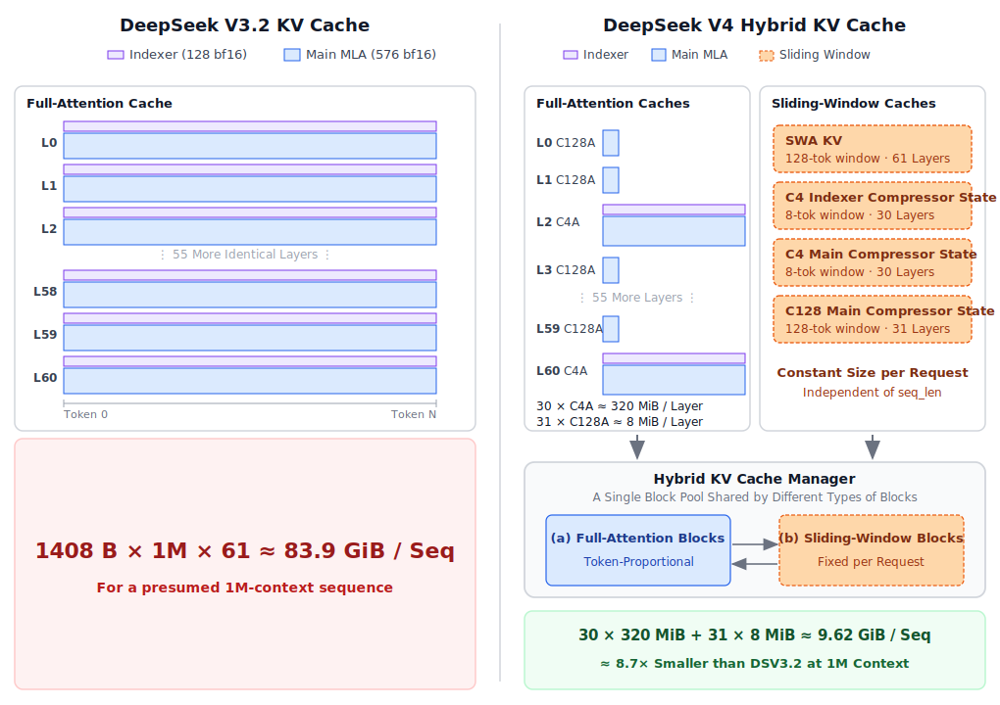

# vLLM 中的 DeepSeek V4：高效长上下文注意力

> 原文：<https://vllm.ai/blog/deepseek-v4>

我们很高兴地宣布，vLLM 现已支持 DeepSeek V4 系列模型（[`deepseek-ai/DeepSeek-V4-Pro`](https://huggingface.co/deepseek-ai/DeepSeek-V4-Pro) 和 [`deepseek-ai/DeepSeek-V4-Flash`](https://huggingface.co/deepseek-ai/DeepSeek-V4-Flash)）。

这些模型采用了一种高效的长上下文注意力机制，专为处理多达**一百万 token** 的任务而设计。虽然新的注意力设计初看可能较为复杂，但一旦系统地审视，其底层原理其实非常直观。

本文分为三个部分：

- 在 vLLM 上部署 DeepSeek V4 的快速入门指南
- 从第一性原理解释 DeepSeek V4 的新架构设计
- 我们在 vLLM 上实现该模型的方法概述及优化挑战：混合 KV 缓存、算子融合与分离式服务

这是我们模型支持的初始版本，进一步的优化正在进行中。我们希望后续的技术解释能帮助开源社区理解注意力机制本身以及我们当前实现决策背后的原理。

## 在 vLLM 上运行 DeepSeek V4

DeepSeek V4 包含两个模型，一个拥有 1.6T 参数的 `DeepSeek-V4-Pro`，以及一个拥有 285B 参数的 `DeepSeek-V4-Flash`。两个模型均支持多达 100 万 token 的上下文，且 vLLM 对新注意力机制的实现正是为此上下文长度而设计。

### DeepSeek-V4-Pro

这里我们重点介绍针对简单测试和原型设计的单节点部署方案，包含 FP4 索引器和 MTP 等多种可选优化。以下命令可在 8xB200 或 8xB300 上运行。

```bash
docker run --gpus all \
  --ipc=host -p 8000:8000 \
  -v ~/.cache/huggingface:/root/.cache/huggingface \
  vllm/vllm-openai:deepseekv4-cu130 deepseek-ai/DeepSeek-V4-Pro \
  --trust-remote-code \
  --kv-cache-dtype fp8 \
  --block-size 256 \
  --enable-expert-parallel \
  --data-parallel-size 8 \
  --compilation-config '{"cudagraph_mode":"FULL_AND_PIECEWISE", "custom_ops":["all"]}' \
  --attention_config.use_fp4_indexer_cache=True \
  --tokenizer-mode deepseek_v4 \
  --tool-call-parser deepseek_v4 \
  --enable-auto-tool-choice \
  --reasoning-parser deepseek_v4
```

更多部署策略，包括分离式服务及更多 GPU 架构支持，请参考 [recipes](https://recipes.vllm.ai/deepseek-ai/DeepSeek-V4-Pro)。

### DeepSeek-V4-Flash

这里我们重点介绍针对简单测试和原型设计的单节点部署方案，包含 FP4 索引器和 MTP 等多种可选优化。以下命令可在 4xB200 或 4xB300 上运行。

```bash
docker run --gpus all \
  --ipc=host -p 8000:8000 \
  -v ~/.cache/huggingface:/root/.cache/huggingface \
  vllm/vllm-openai:deepseekv4-cu130 deepseek-ai/DeepSeek-V4-Flash \
  --trust-remote-code \
  --kv-cache-dtype fp8 \
  --block-size 256 \
  --enable-expert-parallel \
  --data-parallel-size 4 \
  --compilation-config '{"cudagraph_mode":"FULL_AND_PIECEWISE", "custom_ops":["all"]}' \
  --attention_config.use_fp4_indexer_cache=True \
  --tokenizer-mode deepseek_v4 \
  --tool-call-parser deepseek_v4 \
  --enable-auto-tool-choice \
  --reasoning-parser deepseek_v4
```

更多部署策略，包括分离式服务及更多 GPU 架构支持，请参考 [recipes](https://recipes.vllm.ai/deepseek-ai/DeepSeek-V4-Flash)。

## DeepSeek V4 注意力机制解析

长上下文推理面临两大主要挑战：

- **KV 缓存内存增长**：KV 缓存随上下文长度线性增长。虽然 DeepSeek 风格的模型采用 [多头潜在注意力（MLA）](https://arxiv.org/abs/2405.04434)，其内存效率远高于标准的多头注意力（MHA）或多查询注意力（MQA），但在 GPU 显存有限的情况下，扩展到一百万 token 仍然困难。
- **注意力计算成本**：在长上下文上计算注意力开销巨大。即使采用 [DeepSeek 稀疏注意力（DSA）](http://arxiv.org/abs/2512.02556) 等现有技术，计算仍然是显著的瓶颈。

为解决这些挑战，DeepSeek 团队设计了一种新的注意力机制，旨在同时压缩 KV 缓存并减少注意力计算时间。

1. 共享键和值向量（2 倍内存节省）。为保证正确性，我们对注意力输出应用**逆 RoPE** 操作。
2. 跨多个 token 压缩 KV 缓存（4 倍至 128 倍内存节省）。在 DeepSeek V4 中，有两种实现方式：
   - **`c4a`**：将 KV 缓存压缩约 1/4。一个压缩 token 是 **8 个未压缩 token** 的加权和，**步长为 4**。
   - **`c128a`**：将 KV 缓存压缩约 1/128。一个压缩 token 是 **128 个未压缩 token** 的加权和，**步长为 128**。
3. DeepSeek 稀疏注意力（受限的注意力计算成本）。即使使用 `c4a` 注意力压缩 KV 缓存后，一百万 token 的序列仍会有 25 万个压缩 token。为了加速注意力计算，我们可以使用 [DeepSeek 稀疏注意力（DSA）](http://arxiv.org/abs/2512.02556) 只关注 top-$k$ 个压缩 token。
4. 保留局部性：短滑动窗口。DeepSeek V4 使用大小为 128 的滑动窗口来处理局部信息，在未压缩的 token 上操作，使得查询 token 在到达压缩边界之前就能关注到局部信息。

为了更好地说明这种新的注意力机制，下面是一个 `c4a` 注意力处理 13 个 token 的动画。基于上述细节，`c128a` 的情况也应容易理解。启动[交互式版本](https://vllm.ai/blog-assets/interactive_pages/c4a.html) 可以悬停在 token 上查看连接关系。

<p align="center">

<br>
<em>c4a 注意力动画</em>
</p>

这种高效的注意力设计带来了显著的 KV 缓存节省。使用 `bf16` KV 缓存时，DeepSeek V4 在 1M 上下文下每个序列仅需 9.62 GiB 的 KV 缓存。这比 61 层 DeepSeek V3.2 风格堆栈估计的 83.9 GiB 小了约 88.5%。在实践中，我们对索引器缓存使用 `fp4`，对注意力缓存使用 `fp8`，与 `bf16` 估计相比，将 KV 缓存大小进一步缩减了约一半！

<p align="center">

<br>
<em>DeepSeek V3.2 与 DeepSeek V4 的每层 KV 状态对比</em>
</p>

有关算术计算和数学解释的更多细节，请参阅附录。

## vLLM 对 DeepSeek V4 的实现

尽管结构上有节省，但该注意力机制仍然具有内在的复杂性，而在 vLLM 中高效地实现这些节省是一个涉及若干实现挑战的系统问题：

- 与 DeepSeek V3.2 模型类似，注意力算子在 prefill 阶段使用 bfloat16 KV 缓存，在 decode 阶段部分使用逐 token 的 fp8。
- 模型混合使用了 `c4a` 和 `c128a` 注意力，部分注意力层仅使用滑动窗口处理局部信息而不进行压缩。这些异构的注意力类型使 KV 缓存管理变得更加复杂。
- 当对多个序列进行批处理时，它们相对于 KV 缓存压缩边界可能处于不同的状态。
- 模型附带原生 fp4 MoE 权重，这需要 vLLM 进行特殊处理。

除了注意力机制本身，还有其他一些更新，包括架构变更如 [流形约束超连接](http://arxiv.org/abs/2512.24880)，以及 MoE 模块的一些变化。本文不涵盖这些内容，因为它们是更简单的模型变更，更容易适配。

vLLM 从两个方面应对这些挑战：内存管理和算子效率。

### 保持 KV 缓存内存紧凑

vLLM 的 KV 缓存内存分配器必须将多种 KV 状态紧密打包在 GPU 内存中，同时仍要与前缀缓存、prefill/decode 分离、CUDA 图以及 vLLM 服务路径的其余部分协同工作。三项设计选择使这变得可管理。

#### (1) 单一逻辑块大小

不同层以不同比率压缩（`c4a` 为 1/4，`c128a` 为 1/128，SWA 为 1/1）。一个直观的设计是将每层的块大小设置为某个*压缩后*条目数的整数。但这样每层都会有自己的页面布局，分配器必须分别处理它们。

相反，我们对所有压缩层固定逻辑块为 **256 个原生 token 位置**。那么 `c4a` 块物理上存储 `256 / 4 = 64` 个压缩条目，`c128a` 块存储 `256 / 128 = 2` 个。分配一个块总是意味着为请求上下文预留接下来的 256 个原生位置，无论该块属于哪一层。槽位映射、调度器统计和前缀命中检测都可以使用相同的单位，而无需根据 `compress_ratio` 分支。

#### (2) 压缩器状态作为滑动窗口

每个压缩器层还为每个请求维护一个小的滚动残差：C4 的 8 个 token（重叠）部分状态，以及 C128 的 128 个 token 部分状态。一个自然的初步设计是将该残差保留在每个请求的侧缓冲区中。这在孤立情况下可行，但一旦需要与服务堆栈的其余部分交互就会变得棘手。

如果使用侧缓冲区，前缀缓存需要在每个可缓存的边界处对滚动状态进行快照，将其与前缀哈希一起作为键，并在命中时恢复它。分离式 prefill 需要第二条传输路径，将残差从 prefill worker 传输到 decode worker，与 KV 块一起传输。每个需求单独来看都可管理，但合在一起它们会在各功能之间创建另一条需要维护的状态管理路径。

vLLM 通过将压缩器状态视为滑动窗口 KV 来避免这个问题。运行时不变量是相同的：每个请求固定大小，随解码进行而推进，窗口外的状态要么被丢弃，要么通过缓存处理。因此我们将压缩器状态注册在滑动窗口 KV 缓存规范下，`sliding_window = coff * compress_ratio`（C4 为 8，C128 为 128），并将其放入混合 KV 缓存管理器下的 SWA 风格块中。

这使得若干服务功能可以复用相同的抽象：

- **前缀缓存**复用正常的块语义。缓存命中落在 KV 缓存块边界上（即上述的 256 位置单位），且该边界处的压缩器状态已经是正确的交接点。
- **分离式 prefill**将压缩器状态视为 SWA 状态。只传输窗口内的块，这保留了传输大小节省，而无需引入单独的残差特定传输路径。
- **CUDA 图**和 **MTP** 遵循与 SWA 相同的集成模式，同时保留压缩器状态特定的元数据和实现细节。

#### (3) 统一页面大小

上述两个选择仍然不够。C4 索引器块、`c128a` KV 块和 `c4a` 压缩器状态块的*页面大小*仍然不同（每块的字节数不同）。如果每种缓存类型都有自己的块池，我们就会陷入试图消除的跨池碎片化问题。

幸运的是，每种缓存类型的页面大小是乘积 `block_size * compress_ratio * per_entry_size`，而三个因子都在我们的控制之下。如果我们仔细选择它们，不同的缓存类型可以坍缩为少量*页面大小桶*，每个桶可以由单个共享块池支持。

在我们的实现中，整个五路缓存栈只适配 **三** 种页面大小。每个池在加载时确定大小一次，分配变成桶查找。没有运行时重新分区，没有按类型统计，缓存类型之间也没有碎片化。

- _最大桶_：`c4a` 主 KV、SWA KV、`c4a` 压缩器状态、`c128a` 压缩器状态。
- _中间桶_：C4 索引器 KV、C4 索引器压缩器状态。
- _最小桶_：`c128a` 主 KV。

<!-- <details>
<summary>具体桶分配</summary>

对于具有标准 C4 和 C128 混合的 61 层 DeepSeek V4，内存划分为三种每块大小：1,728 B、8,640 B 和 37,440 B。每个都是 FlashMLA 的 576 B 对齐的倍数。缓存类型聚类为： -->

<!-- </details> -->

### 保持 GPU 满载

内存布局只是运行时故事的一半；另一半是保持 GPU 计算饱和。

vLLM 集成了 FlashMLA 和 FlashInfer，提供优化的注意力和 MoE 算子。但该模型需要许多小的、主要是内存受限的算子。我们需要避免额外的启动和 HBM 往返，否则会拖慢整个 decode 路径。

<p align="center">

<br>
<em>`c4a` decode 路径：算子图与算子融合（彩色轮廓）及多流分区（默认流 = 蓝色带，索引器流 = 琥珀色带）。</em>
</p>

#### (1) 算子融合

我们部署了三种融合来减少内存往返。在下图中，它们以围绕算子组的彩色轮廓显示。

- **压缩器 + RMSNorm + RoPE + 缓存插入。** 压缩后，压缩后的 K 立即经过 RMSNorm、RoPE，并插入到后续注意力的 KV 缓存中，无论是用于主注意力还是索引器。因为这些阶段几乎都是逐元素的，我们将它们融合为一个算子。我们为索引器 K 缓存和主注意力 K 缓存保留单独的算子，以便并行策略仍可为每个头维度调优。总体来看，相比未融合的基线有 ~1.4-3 倍的加速。
- **逆 RoPE + fp8 量化。** 主注意力之后，输出经过逆 RoPE 然后进入 `o_lora` 投影的 fp8 批处理矩阵乘法。融合两者避免了连续的 HBM 往返并提高了算术强度，相比未融合版本有 ~2-3 倍的加速。
- **融合 Q norm + KV RoPE + K 插入。** 主注意力之前，我们需要为压缩路径和滑动窗口路径都进行 KV 缓存插入。压缩路径已被第一种融合覆盖，所以剩下的是对查询和未压缩 SWA 键的逐元素操作。我们将这些操作水平融合到一个使用静态 `warpID` 调度的单一算子中：每个 warp 独立处理 Q 头或 K 头，因此不需要跨 warp 通信。这比朴素的未融合算子有 10-20 倍的加速。

我们还复用了 DeepSeek V3.2 工作中的融合，包括 Q RoPE + 量化 + 权重乘法，以及在注意力开始时 QK 投影之后 QK norm 的水平融合。

#### (2) 多流

主注意力之前的操作高度可并行化。它们分为三个部分：索引器计算、主注意力 KV 压缩和滑动窗口 token 插入。初始投影之后这些分支几乎独立，因此我们在 CUDA 流上重叠它们。同一张图可以从另一个角度解读：蓝色带标记默认流，琥珀色带标记索引器流。

- 对于没有索引器的 `c128a` 层，我们并行运行主 KV 压缩和 SWA token 插入。
- 对于 `c4a` 层，我们在自己的流上并行运行完整的索引器管道与主 KV 压缩和 SWA token 插入（后两者彼此之间仍串行）。

通过这些重叠，我们在低批次大小下观察到 5-6% 的端到端延迟降低，这是一个有用的信号，表明 decode 路径在 GPU 利用率不足方面花费的时间更少。

除此之外，我们使用 CUDA 图来削减 decode 路径上的启动开销，就像我们对其他每个模型所做的那样。

完整实现请参阅 。

## 计划中的工作

我们正积极致力于以下优化，以进一步提升 DeepSeek V4 在 vLLM 上的性能：

- DeepGEMM MegaMoE 算子
- 分页 prefill 算子

当前实现主要面向 NVIDIA GPU，包括 Hopper 和 Blackwell 架构。这些加速器的部署方案可以在[我们的 recipe 网站](https://recipes.vllm.ai/deepseek-ai/DeepSeek-V4-Pro)找到。借助 vLLM 的可扩展插件系统，硬件供应商可以直接添加模型支持。例如，vllm-ascend 和 vllm-mlu 都独立支持 DeepSeek V4。

## 致谢

我们要感谢 DeepSeek 团队开源 DeepSeek V4，以及 DeepSeek 领导层对 vLLM 的信任和支持！模型支持得益于 [Inferact Inc.](https://inferact.ai/) 的贡献，该公司致力于将 vLLM 打造为世界级的 AI 推理引擎，通过让推理更便宜、更快来加速 AI 进步。

## 附录：DeepSeek V4 注意力机制的数学原理

### 为什么键和值共享时需要逆 RoPE

给定位置 $i$ 处的查询 token，应用 [RoPE](http://arxiv.org/abs/2104.09864) 后的查询表示为 $<q_i, i> = R(i)q_i$，其中 $R(i)$ 是旋转矩阵，旋转角度由位置 $i$ 参数化。旋转矩阵的一些基本性质：

- $R(i)R(j) = R(i+j)$
- $R(i)^{-1} = R(i)^T = R(-i)$
- $R(i)$ 是正交矩阵，即 $R(i)R(i)^T = I$

给定位置 $j_1, j_2, j_p, ..., j_n$ 处的键 token，应用 RoPE 后的键表示为 $<k_{j_1}, j_1> = R(j_1)k_{j_1}$，$<k_{j_2}, j_2> = R(j_2)k_{j_2}$，...，$<k_{j_p}, j_p> = R(j_p)k_{j_p}$，...，$<k_{j_n}, j_n> = R(j_n)k_{j_n}$。

对于位置 $j_1, j_2, j_p, ..., j_n$ 处的值向量，通常我们不对其应用 RoPE。值表示就是 $<v_{j_1}, j_1> = v_{j_1}$，$<v_{j_2}, j_2> = v_{j_2}$，...，$<v_{j_p}, j_p> = v_{j_p}$，...，$<v_{j_n}, j_n> = v_{j_n}$。

那么注意力输出为（为简化省略一些细节，如缩放因子）：

$$
a_i = \sum_{p=1}^n \frac{\exp(<q_i, i>^T <k_{j_p}, j_p>)}{\sum_{r=1}^n \exp(<q_i, i>^T <k_{j_r}, j_r>)} <v_{j_p}, j_p> = \sum_{p=1}^n \frac{\exp(q_i^T R(j_p - i)k_{j_p})}{\sum_{r=1}^n \exp(q_i^T R(j_r - i)k_{j_r})} v_{j_p}
$$

注意力输出的一个良好性质是它是平移不变的。任何依赖于位置的因子，即 $R(j_p - i)$ 和 $R(j_r - i)$，只依赖于查询和键之间的相对位置。这意味着如果我们将查询和键平移相同的量，注意力输出是相同的。

如果我们共享键和值向量，注意力输出将是：

$$
a_i = \sum_{p=1}^n \frac{\exp(<q_i, i>^T <k_{j_p}, j_p>)}{\sum_{r=1}^n \exp(<q_i, i>^T <k_{j_r}, j_r>)} <k_{j_p}, j_p> = \sum_{p=1}^n \frac{\exp(q_i^T R(j_p - i)k_{j_p})}{\sum_{r=1}^n \exp(q_i^T R(j_r - i)k_{j_r})} R(j_p) k_{j_p}
$$

现在输出通过旋转矩阵 $R(j_p)$ 直接携带绝对位置信息。这不是我们想要的。修复方法很简单：对注意力输出应用逆 RoPE 操作：

$$
R(-i) a_i = R(-i) \sum_{p=1}^n \frac{\exp(<q_i, i>^T <k_{j_p}, j_p>)}{\sum_{r=1}^n \exp(<q_i, i>^T <k_{j_r}, j_r>)} <k_{j_p}, j_p> = \sum_{p=1}^n \frac{\exp(q_i^T R(j_p - i)k_{j_p})}{\sum_{r=1}^n \exp(q_i^T R(j_r - i)k_{j_r})} R(j_p - i) k_{j_p}
$$

这样，输出只通过旋转矩阵 $R(j_p - i)$ 携带相对位置信息，并且再次变得平移不变。

类似讨论也可以在 https://kexue.fm/archives/10862 找到。

### 实现细节：精确位置范围和因果性条件

处理压缩 KV 缓存时必须小心。对于每个压缩索引 $j$，我们首先组合一组固定的局部原始 token，然后使用压缩 token 的锚定位置应用一次 RoPE，然后将该压缩 token 存入 KV 缓存。

对于 `c4a`，第 $j$ 个压缩 token 是位置范围 $[4j - 4, 4j + 3]$ 内 token 的加权和，其中 $j$ 从 0 开始，负索引视为值为 0 的 token。当我们对其应用 RoPE 时，压缩 token 的位置是 $4j$。

对于 `c128a`，第 $j$ 个压缩 token 是位置范围 $[128j, 128j + 127]$ 内 token 的加权和，其中 $j$ 从 0 开始。当我们对其应用 RoPE 时，压缩 token 的位置是 $128j$。

对于因果性，我们需要确保位置 $i$ 处的查询 token 只关注位置范围 $[0, i]$ 内 token 产生的信息。这意味着对于位置 $i$ 处的查询和 KV 缓存中的第 $j$ 个压缩 token，我们需要确保 $ i \ge 4j + 3 $（对于 `c4a`）或 $ i \ge 128j + 127 $（对于 `c128a`）。

### 实现细节：c4a 和 c128a 中 k 的精确值

对于 DeepSeek V4 中的 `c4a` 注意力，$k$ 的默认值是 512；对于 `c128a` 注意力，$k$ 的默认值是 8192。（作为对比，在 DeepSeek V3.2 中，$k$ 的默认值是 2048）。

`c128a` 注意力有更大的压缩比。在 100 万 token 的上下文下，它最多有 8k 个压缩 token。8k token 对于注意力计算来说不算大问题，因此我们可以直接对 `c128a` 压缩 token 使用全注意力。在实现上，我们仍然可以将 `c128a` 注意力视为一个 top-$k$ 值为 8192 的稀疏注意力问题。

### 实现细节：为什么需要短滑动窗口

使用 `c128a` 时，位置 $100$ 处的查询 token 无法关注 KV 缓存中的任何压缩 token，因为第一个压缩 token 包含位置 $0$ 到 $127$ 的信息，但查询 token 由于因果性无法关注位置 $100$ 之后的信息。借助短滑动窗口，查询 token 可以关注位置范围 $[0, 100]$ 内的未压缩 token，因此它仍然可以访问局部信息。

### 8.7 倍节省估算背后的算术

对于 1M 上下文的序列：

使用 bf16 KV 缓存的 DeepSeek V3.2：

- 每层每 token 的 MLA 缓存：$(512 + 64) \times 2 = 1152$ 字节。
- 每层每 token 的索引器缓存：$128 \times 2 = 256$ 字节。
- 每层每 token 的总缓存状态：$1152 + 256 = 1408$ 字节。
- 在 1,048,576 个 token 下：$1{,}048{,}576 \times 1408 \approx 1.375$ GiB 每层。
- 跨越 61 层：约 $83.9$ GiB。

使用 bf16 KV 缓存的 61 层 DeepSeek V4：

- 每个共享 KV 缓存条目存储 $512 \times 2 = 1024$ 字节。
- 每个 `c4a` 索引器缓存条目存储 $128 \times 2 = 256$ 字节。
- `c4a` 层：共享 KV 缓存 $(128 + 1{,}048{,}576 / 4) \times 1024$ 字节加上索引器缓存 $(1{,}048{,}576 / 4) \times 256$ 字节，总共约 $320.1$ MiB。
- `c128a` 层：$(128 + 1{,}048{,}576 / 128) \times 1024 \approx 8.1$ MiB。
- 跨越 30 个 `c4a` 层和 31 个 `c128a` 层的总和：约 $9.62$ GiB。
