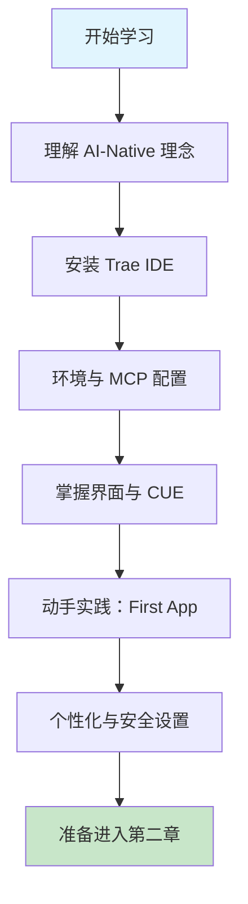

# 第一章 Trae 简介与环境配置

## 1. 学习目标

完成本节学习后，大家将能够：

- 理解 Trae 的核心理念（AI-Native）和独有的 SOLO 模式
- 成功安装和配置 Trae 开发环境（包括 MCP 和运行时环境）
- 熟悉 Trae 的界面布局、CUE 上下文引擎及基本操作
- 完成个性化配置（包括模型、隐私模式和快捷键）
- **动手实践**：通过 SOLO 模式从零构建第一个 Web 应用

### 1.1 学习路径图



### 1.2 预期学习成果

完成本章后，开发环境将具备：

- ✅ 最新版 Trae IDE（支持 SOLO 模式）
- ✅ 正确配置的 Node.js 和 Python 环境（用于 MCP）
- ✅ 熟悉 Builder 与 Chat 的协作流程
- ✅ 掌握 `/plan` 和 `/spec` 等高效指令
- ✅ **已完成并运行的第一个 Trae 项目**

## 2. Trae 的核心理念与特性

本节将深入剖析 Trae 的设计哲学，解释其为何被称为“AI Native” IDE，并重点介绍其核心的 SOLO 模式和智能体机制。

### 2.1 什么是 Trae？

Trae 是字节跳动推出的一款 **AI Native（AI 原生）** 集成开发环境。与传统 IDE 仅仅将 AI 作为辅助插件不同，Trae 从设计之初就将 AI 作为核心驱动力。

它不仅能进行代码补全和生成，更具备**自主代理（Autonomous Agent）**能力。通过独创的 **SOLO 模式**，Trae 能够像一位真实的人类工程师一样，理解复杂需求、拆解任务、自主规划、编写代码、执行命令并修正错误，实现从“辅助驾驶”到“自动驾驶”的跨越。

### 2.2 核心理念详解

#### 2.2.1 AI-Native 架构

Trae 的交互逻辑围绕 AI 展开。代码编辑器、终端、文件浏览器与 AI 助手深度融合。AI 能够感知整个项目的上下文（Context），不仅仅是当前打开的文件。

- **感知层**：AI 实时监控文件变更、终端输出和 Git 状态。
- **决策层**：Agent 根据感知信息决定下一步行动（如搜索代码、运行测试）。
- **执行层**：AI 直接操作编辑器和终端，而非仅仅给出建议文本。

#### 2.2.2 适应性 AI (Adaptive AI)

Trae 能够学习开发者的编码风格、项目规范和团队最佳实践，随着使用时间的推移，它会变得越来越懂你，提供更精准的建议。

#### 2.2.3 极致自动化 (Autonomous)

通过 Agent 机制，Trae 致力于减少开发者的重复劳动。从环境搭建到代码重构，AI 可以独立完成一连串复杂操作，开发者只需扮演“Reviewer（审查者）”的角色。

### 2.3 核心功能特性

#### 2.3.1 SOLO 模式：AI 全自动开发

这是 Trae 最具革命性的功能。进入 SOLO 模式后：

- **自主规划**：AI 会分析需求，生成详细的执行计划。
- **多任务并行**：支持同时处理多个不冲突的任务。
- **工具调用**：AI 可自主使用终端、文件操作、浏览器等工具。
- **自我修正**：遇到报错时，AI 会自动分析日志并尝试修复。
- **关键指令**：
  - `/plan`：让 AI 先生成任务规划，确认后再执行。
  - `/spec`：生成详细的技术规格说明书。

#### 2.3.2 强大的模型生态

Trae 内置了全球顶尖的 AI 模型，并支持灵活切换：

- **Claude 3.5 Sonnet**：在编码能力上表现卓越，逻辑推理强。
- **GPT-4o**：综合能力强，响应速度快。
- **DeepSeek V3**：国产高性能模型，性价比极高。
- **GLM-4.7 / MiniMax**：更多国产优质模型支持。
- **自定义模型**：支持通过 OpenAI 兼容格式接入任意模型（如 Ollama 本地模型）。

#### 2.3.3 CUE (Context Understanding Engine)

上下文理解引擎是 Trae 的“大脑”。它能自动分析项目结构，智能抓取相关文件作为上下文，无需用户频繁手动 `#` 引用文件。

- **自动上下文**：根据当前任务自动加载相关代码。
- **代码引用**：精准跳转和引用代码片段。
- **增量更新**：实时感知代码变更。

#### 2.3.4 Skills (技能) 系统

Skills 允许用户为 Trae 扩展新的能力。

- **项目级 Skills**：仅在当前项目生效的特定规则或工具。
- **全局 Skills**：跨项目通用的能力。
- **自定义 Skills**：用户可以编写 Prompt 或脚本，教会 Trae 新的技能（如特定的代码审查规范、API 对接方式等）。

#### 2.3.5 安全的沙箱运行机制

为了防止 AI 执行危险命令（如误删文件），Trae 引入了沙箱机制：

- **沙箱运行（默认）**：命令在受限环境中执行，保障系统安全。
- **手动确认**：高风险命令需用户点击确认。
- **自动运行**：用户信任的命令可自动执行。

## 3. 安装和配置 Trae 开发环境

本节将指导大家完成 Trae 的安装，并配置必要的运行时环境，以便充分发挥其 AI 和 MCP 能力。

### 3.1 系统要求

> 📋 **数据来源**：Trae 官方文档 (2025年最新)

- **macOS**：macOS 12 (Monterey) 及以上版本。
- **Windows**：Windows 10 (1809+) 或 Windows 11。
- **Linux**：Ubuntu 18.04+, Debian 10+, Fedora 32+ 等主流发行版。
- **硬件**：建议 16GB+ 内存（AI 模型和 IDE 运行需要），SSD 硬盘。

### 3.2 下载与安装

#### 3.2.1 获取安装包

请根据所在的地理位置选择合适的版本：

- **国际版**：访问 [trae.ai](https://trae.ai)
- **国内版**：访问 [trae.com.cn](https://www.trae.com.cn) (针对国内网络优化，内置模型略有不同)

#### 3.2.2 安装步骤

- **macOS**：下载 `.dmg` 文件 -> 拖入 Applications -> 首次运行可能需要授权。
- **Windows**：下载 `.exe` 文件 -> 运行安装向导 -> 建议勾选 "Add to PATH"。
- **Linux**：支持 `.deb`, `.rpm` 或 AppImage。

### 3.3 关键环境配置

#### 3.3.1 账号与同步

启动 Trae 后，建议立即登录账号。这不仅能同步设置（Settings Sync），更是使用云端 AI 模型的前提。

#### 3.3.2 MCP 环境（推荐）

为了发挥 Trae 的最大潜力（如使用 GitHub、PostgreSQL 等工具），需要配置 MCP 运行时：

1. **Node.js**：

   ```bash
   node -v # 需 v18+
   # 推荐使用 nvm 安装管理
   ```

2. **Python & uv**：
   MCP 的 Python SDK 推荐使用 `uv` 进行管理：

   ```bash
   # macOS/Linux
   curl -LsSf https://astral.sh/uv/install.sh | sh
   # Windows
   powershell -c "irm https://astral.sh/uv/install.ps1 | iex"
   ```

## 4. 界面概览与操作

本节将介绍 Trae 的用户界面布局，重点讲解 AI 侧边栏、CUE 引擎的交互方式以及新增的 Markdown 预览功能。

### 4.1 界面布局

Trae 的界面在保持经典 IDE（类 VS Code）习惯的同时，进行了 AI 化的改造：

- **右侧 AI 侧边栏 (Chat/Builder)**：这是核心交互区。
  - **Chat**：用于快速问答、代码解释。
  - **Builder**：用于复杂任务开发，即 SOLO 模式的入口。
- **底部终端 (Terminal)**：集成了 AI 命令生成与执行。
- **左侧资源管理器**：新增了 **Changes** 视图，专门用于审查 AI 产生的代码变更。

### 4.2 常用快捷键

| 功能               | macOS             | Windows            | 说明                         |
| :----------------- | :---------------- | :----------------- | :--------------------------- |
| **唤起 AI Chat**   | `Cmd + L`         | `Ctrl + L`         | 最常用的快捷键               |
| **唤起 Builder**   | `Cmd + Shift + L` | `Ctrl + Shift + L` | 切换到 Builder 模式          |
| **快速指令 (CUE)** | `Cmd + I`         | `Ctrl + I`         | 在编辑器内直接让 AI 修改代码 |
| **接受建议**       | `Tab`             | `Tab`              | 接受 Ghost Text 补全         |
| **部分接受**       | `Cmd + ->`        | `Ctrl + ->`        | 逐词接受建议                 |

### 4.3 Markdown 实时预览

Trae 3.3+ 版本支持 Markdown 文件的即时预览与编辑。

- 打开 `.md` 文件时，可选择 "Editor Only", "Preview Only" 或 "Split View"。
- 在预览模式下，双击即可直接编辑内容。

## 5. 动手实践：我的第一个 AI 应用

理论学习后，让我们通过构建一个简单的 **"番茄钟 (Pomodoro Timer)"** 网页应用，来亲身体验 Trae 的 SOLO 模式。

### 5.1 准备工作

1. 打开 Trae。
2. 点击 `File` -> `New Window` 打开一个新窗口。
3. 点击 `Open Folder`，创建一个空文件夹命名为 `pomodoro-timer` 并打开。

### 5.2 启动 Builder (SOLO 模式)

1. 按 `Cmd + Shift + L` (macOS) 或 `Ctrl + Shift + L` (Windows) 唤起右侧 Builder 面板。
2. 在输入框中，我们使用 `/plan` 指令来让 AI 先规划。输入以下提示词：

   ```text
   /plan 我想做一个简单的番茄钟网页应用。
   需求：
   1. 使用 HTML/CSS/JavaScript，无需复杂框架。
   2. 界面美观现代，有一个大大的倒计时显示。
   3. 支持开始、暂停、重置功能。
   4. 默认时间为 25 分钟。
   ```

### 5.3 观察 AI 的规划与执行

1. **生成计划**：Builder 会首先回复一个详细的开发计划（Plan），列出文件结构（index.html, style.css, script.js）和步骤。
2. **确认执行**：点击 `Approve` 或 `Run` 确认执行计划。
3. **自动编码**：
   - 你会看到 Builder 开始自动创建文件。
   - 它会写入 HTML 结构、CSS 样式和 JS 逻辑。
   - 如果过程中遇到语法错误或依赖问题，它会自动在终端运行命令进行修复。

### 5.4 预览与迭代

1. **运行预览**：
   - Builder 完成后，通常会提供一个预览链接，或者你可以手动在 index.html 上右键选择 `Open with Live Server` (如果安装了插件) 或直接在浏览器打开。
   - Trae 也支持内置预览，点击右上角的预览图标即可。

2. **多轮迭代**：
   - 试用一下番茄钟。如果觉得字体太小，可以在 Builder 中继续输入：
     > "把倒计时数字的字体调大一点，并且在倒计时结束时弹出一个浏览器通知。"
   - 观察 Builder 如何精准定位到 CSS 和 JS 文件进行修改。

### 5.5 体验总结

在这个过程中，大家并没有手动编写一行代码，而是扮演了 **产品经理（提出需求）** 和 **测试工程师（验收结果）** 的角色。这就是 AI-Native 开发的魅力。

---

## 6. 个性化与进阶配置

为了让 Trae 更符合个人的使用习惯，本节将介绍隐私模式、模型切换策略以及 Skills 技能的配置方法。

### 6.1 隐私模式 (Privacy Mode)

对于企业用户或对代码安全敏感的开发者，可在设置中开启隐私模式。

- **开启方式**：Settings -> Privacy Mode。
- **效果**：代码片段不会被用于模型训练，仅用于当前会话的上下文推理。

### 6.2 模型选择策略

在 Chat 输入框右下角可切换模型：

- **日常编码**：推荐 **Claude 3.5 Sonnet**（平衡速度与质量）。
- **复杂架构设计**：推荐 **GPT-4o**。
- **中文文档/注释**：推荐 **DeepSeek V3** 或 **Doubao**。

### 6.3 配置 Skills

在 AI 侧边栏的 "Skills" 标签页中：

- 查看已启用的技能。
- 点击 "+" 添加自定义技能（如 "Vue3 最佳实践"）。
- 技能本质上是一组 Prompt 和规则的集合，指导 AI 按特定规范工作。

---

## 7. 常见问题 (FAQ)

### 7.1 SOLO 模式卡住了怎么办？

- 检查网络连接。
- 使用 "Stop" 按钮终止当前任务。
- 尝试将大任务拆解为小任务，使用 `/plan` 先规划。

### 7.2 终端命令执行失败？

- 检查是否被沙箱拦截。
- 确认系统是否安装了必要的 CLI 工具（如 git, npm, python）。

### 7.3 如何连接私有 LLM 服务？

- 在设置中选择 "OpenAI Compatible"。
- 填写 Base URL (如 `http://localhost:11434/v1`) 和 API Key。

---

## 8. 小结

本章介绍了 Trae 作为 AI-Native IDE 的核心优势，特别是 **SOLO 模式** 和 **Agent 机制**。通过亲手构建番茄钟应用，大家应该已经感受到了“自然语言编程”的高效。在下一章，我们将深入探索更复杂的项目开发技巧。
